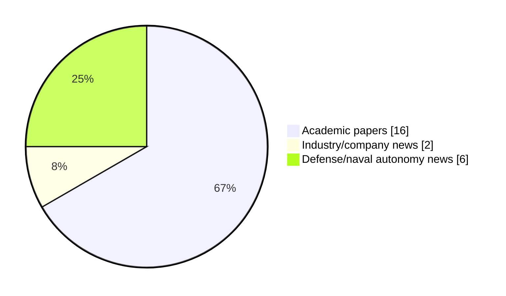

# Maritime Autonomy Watch — 2026-05-09

## Executive Summary

- Total selected items: 24
- Academic papers: 16
- Industry/company news: 2
- Defense/naval autonomy news: 6
- Failed/inaccessible sources: 0

## Top Signals Today

- Repeated signal around underwater across selected items.
- Repeated signal around control across selected items.
- Repeated signal around autonomous across selected items.

## Freshness and Coverage

- Newest selected item date: 2026-12-01
- Oldest selected item date: 2026-03-31
- Active/enabled sources: 5
- Sources with access problems: 2

### Category Snapshot

| Category | Selected items |
|---|---:|
| Academic papers | 16 |
| Industry/company news | 2 |
| Defense/naval autonomy news | 6 |

## Contents

- [Top Signals Today](#top-signals-today)
- [Freshness and Coverage](#freshness-and-coverage)
- [Academic Papers](#academic-papers)
- [Industry and Company News](#industry-and-company-news)
- [Defense and Naval Autonomy News](#defense-and-naval-autonomy-news)
- [Source Status Summary](#source-status-summary)

## Academic Papers

_Selected items: 16_

### [BIND-USBL: Bounding IMU Navigation Drift using USBL in Heterogeneous ASV-AUV Teams](http://arxiv.org/abs/2604.11861v1)

- Source: arXiv
- Date: 2026-04-13
- Relevance score: 10
- Authors: Pranav Kedia, Rajini Makam, Heiko Hamann, Suresh Sundaram

**Abstract**

Accurate and continuous localization of Autonomous Underwater Vehicles (AUVs) in GPS-denied environments is a persistent challenge in marine robotics. In the absence of external position fixes, AUVs rely on inertial dead-reckoning, which accumulates unbounded drift due to sensor bias and noise. This paper presents BIND-USBL, a cooperative localization framework in which a fleet of Autonomous Surface Vessels (ASVs) equipped with Ultra-Short Baseline (USBL) acoustic positioning systems provides intermittent fixes to bound AUV dead-reckoning error. The key insight is that long-duration navigation failure is driven not by the accuracy of individual USBL measurements, but by the temporal sparsity and geometric availability of those fixes.

**Why it matters**

Relevant to underwater autonomy, surface-vessel operations, multi-vehicle coordination; the work may inform maritime autonomy research, testing priorities, or system design.

---

### [An Asynchronous Two-Speed Kalman Filter for Real-Time UUV Cooperative Navigation Under Acoustic Delays](http://arxiv.org/abs/2604.02878v1)

- Source: arXiv
- Date: 2026-04-03
- Relevance score: 10
- Authors: Shuyue Li, Miguel López-Benítez, Eng Gee Lim, Fei Ma, Qian Dong, Mengze Cao, Limin Yu, Xiaohui Qin

**Abstract**

In GNSS-denied underwater environments, individual unmanned underwater vehicles (UUVs) suffer from unbounded dead-reckoning drift, making collaborative navigation crucial for accurate state estimation. However, the severe communication delay inherent in underwater acoustic channels poses serious challenges to real-time state estimation. Traditional filters, such as Extended Kalman Filters (EKF) or Unscented Kalman Filters (UKF), usually block the main control loop while waiting for delayed data, or completely discard Out-of-Sequence Measurements (OOSM), resulting in serious drift. To address this, we propose an Asynchronous Two-Speed Kalman Filter (TSKF) enhanced by a novel projection mechanism, which we term Variational History Distillation (VHD).

**Why it matters**

Relevant to underwater autonomy, multi-vehicle coordination, planning and control; the work may inform maritime autonomy research, testing priorities, or system design.

---

### [Research on Trajectory Tracking Control of USV Based on Disturbance Observation Compensation](https://doi.org/10.3390/jmse14080757)

- Source: OpenAlex
- Date: 2026-04-21
- Relevance score: 10
- Authors: J Zhang, Hongjie Ling, Wandi Song, Anqi Lu, Changgui Shu, Junyi Huang
- DOI: 10.3390/jmse14080757

**Abstract**

To address trajectory-tracking degradation of unmanned surface vehicles (USVs) in constrained waters caused by model uncertainty, strong environmental disturbances, and actuator limitations, this paper proposes a robust disturbance-observer-based optimization model predictive control method. First, a nonlinear tracking error model is established for a 3-DOF USV by incorporating environmental loads, parametric perturbations, and unmodeled dynamics into the kinematic and dynamic equations. Based on this model, a prediction model suitable for model predictive control is derived through linearization and discretization. Then, to estimate complex unknown disturbances online, a robust disturbance observer integrating a radial basis function neural network (RBFNN) with an adaptive sliding-mode mechanism is developed, enabling real-time approximation and compensation of lumped disturbances in the surge and yaw channels.

**Why it matters**

Relevant to surface-vessel operations, planning and control; the work may inform maritime autonomy research, testing priorities, or system design.

---

### [HDAO: A Hierarchical Curiosity-Driven Reinforcement Learning Approach for AUV Dynamic Obstacle Avoidance](https://doi.org/10.3390/jmse14080720)

- Source: OpenAlex
- Date: 2026-04-14
- Relevance score: 10
- Authors: 杜华争, Qian Liu, Xu Liu, Na Xia
- DOI: 10.3390/jmse14080720

**Abstract**

Autonomous obstacle avoidance is a critical capability for Autonomous Underwater Vehicles (AUVs) to operate safely in dynamic and uncertain marine environments. Traditional AUV control methods rely on precise physical modeling and preset rules, yet they struggle to adapt to multiple sources of uncertainty, such as random initial states, dynamic obstacles, and varying currents. In recent years, deep reinforcement learning has provided a new avenue for data-driven adaptive policy learning. However, it remains insufficient for handling long-horizon tasks with sparse rewards. While hierarchical reinforcement learning can mitigate reward sparsity through temporal abstraction, it often faces challenges including exploration–exploitation imbalance, slow global convergence, and insufficient safety guarantees.

**Why it matters**

Relevant to underwater autonomy, navigation safety, planning and control; the work may inform maritime autonomy research, testing priorities, or system design.

---

### [An Integrated Controller System For Unmanned Surface Vehicles (USV)](https://doi.org/10.33093/ijoras.2026.8.1.2)

- Source: OpenAlex
- Date: 2026-03-31
- Relevance score: 10
- Authors: Nazreen Rusli, Zulkifli Zainal Abidin, Muhammad Aiman Norazuddin, Taufik Yunahar
- DOI: 10.33093/ijoras.2026.8.1.2

**Abstract**

Unmanned Surface Vehicles (USVs) are extensive used in several industries, such as environmental monitoring, offshore resource exploration, and maritime security. The benefits of USV for risk minimization and prolonged operational endurance cause an increase in demand. USVs are essential for administering marine security laws since they can remotely monitor traffic. Their ability to navigate well and avoid collisions improves the efficiency and safety of marine traffic. The incorporation of cutting-edge sensors and battery-powered vehicles enhances the dependability and operating capacities while minimizing environmental impact. Unlike traditional fuel-powered vessels, battery-operated USVs produce no direct water pollutants, contributing to cleaner oceans and more sustainable maritime operations.

**Why it matters**

Relevant to surface-vessel operations, navigation safety, infrastructure monitoring; the work may inform maritime autonomy research, testing priorities, or system design.

---

### [AI-Aided Advancements in Autonomous Underwater Vehicle Navigation](http://arxiv.org/abs/2605.04672v1)

- Source: arXiv
- Date: 2026-05-06
- Relevance score: 9.25
- Authors: Guy Damari, Zeev Yampolsky, Nadav Cohen, Arup Kumar Sahoo, Jeryes Danial, Felipe O. Silva, Itzik Klein

**Abstract**

Autonomous underwater vehicles (AUVs) have become indispensable for deep-sea exploration, spanning critical scientific research and commercial applications. The rapid attenuation of electromagnetic waves renders satellite radio signals unavailable, while the dynamic unpredictability of the marine environment presents formidable navigation challenges. This chapter explores recent advancements in AI-aided AUV positioning, specifically focusing on advanced sensor fusion architectures that integrate inertial navigation systems with Doppler velocity logs and cameras. Beyond traditional model-based filtering, we examine the transformative emergence of AI-driven learning approaches in enhancing inertial dead-reckoning tasks and adaptive fusion algorithms. By addressing these recent milestones, this chapter provides a comprehensive roadmap for achieving the high-precision navigation essential for autonomous underwater missions.

**Why it matters**

Relevant to underwater autonomy; the work may inform maritime autonomy research, testing priorities, or system design.

---

### [Instantaneous Planning, Control and Safety for Navigation in Unknown Underwater Spaces](http://arxiv.org/abs/2604.05310v2)

- Source: arXiv
- Date: 2026-04-07
- Relevance score: 9.25
- Authors: Veejay Karthik, Udit Ekansh, Tejal Bedmutha, Shivam Vishwakarma, Rohan Deshpande, Leena Vachhani

**Abstract**

Navigating autonomous underwater vehicles (AUVs) in unknown environments is significantly challenging due to poor visibility, weak signal transmission, and dynamic water currents. These factors pose challenges in accurate global localization, reliable communication, and obstacle avoidance. Local sensing provides critical real time environmental data to enable online decision making. However, the inherent noise in underwater sensor measurements introduces uncertainty, complicating planning and control. To address these challenges, we propose an integrated planning and control framework that leverages real time sensor data to dynamically induce closed loop AUV trajectories, ensuring robust obstacle avoidance and enhanced maneuverability in tight spaces.

**Why it matters**

Relevant to underwater autonomy, navigation safety; the work may inform maritime autonomy research, testing priorities, or system design.

---

### [A Survey on Sensor-based Planning and Control for Unmanned Underwater Vehicles](http://arxiv.org/abs/2604.05003v1)

- Source: arXiv
- Date: 2026-04-06
- Relevance score: 9.25
- Authors: Shivam Vishwakarma, Tejal Bedmutha, Dharmendra Kumar Patel, Vijay Bhaskar Semwal, Leena Vachhani

**Abstract**

This survey examines recent sensor-based planning and control methods for Unmanned Underwater Vehicles (UUVs). In complex, uncertain underwater environments, UUVs require advanced planning and control strategies for effective navigation. These vehicles face significant challenges including drifting and noisy sensor measurements, absence of Global Navigation Satellite System (GNSS) signals, and low-bandwidth, high-latency underwater acoustic communications. The focus is on reactive local planning layers that adapt to real-time sensor inputs such as SONAR and Inertial Measurement Units (IMU) to improve localization accuracy and autonomy in dynamic ocean conditions, enabling dynamic obstacle avoidance and on-the-fly re-planning. The survey categorizes the existing literature into decoupled and coupled architectures for sensor-based planning and control.

**Why it matters**

Relevant to underwater autonomy, navigation safety; the work may inform maritime autonomy research, testing priorities, or system design.

---

### [Underwater Drones: Advances in AUVs, ROVs, and Soft Robotics for Ocean Exploration](https://doi.org/10.36838/v8i5.23)

- Source: OpenAlex
- Date: 2026-03-31
- Relevance score: 8.5
- Authors: Aryaman Jain
- DOI: 10.36838/v8i5.23

**Abstract**

The research paper examines the transformative role of the underwater drone. Including Autonomous Underwater Vehicles (AUVs) and Remotely Operated Vehicles (ROVs), in advancing ocean exploration. It examines the technological components driving these innovations, including propulsion systems, power sources, navigation tools, and underwater communication. A special focus is placed on the rise of soft robotics, highlighting their bio-inspired flexibility, low acoustic signature, and minimal ecological impact. The paper discusses how material selection, ranging from titanium to silicone elastomers, enables drones to withstand extreme underwater environments. Applications span marine biology, environmental monitoring, archaeology, and resource exploration, with examples from leading institutions like WHOI and Ocean Infinity.

**Why it matters**

Relevant to underwater autonomy, multi-vehicle coordination, infrastructure monitoring; the work may inform maritime autonomy research, testing priorities, or system design.

---

### [DINO-Explorer: Active Underwater Discovery via Ego-Motion Compensated Semantic Predictive Coding](http://arxiv.org/abs/2604.12933v1)

- Source: arXiv
- Date: 2026-04-14
- Relevance score: 7.75
- Authors: Yuhan Jin, Nayari Marie Lessa, Mariela De Lucas Alvarez, Melvin Laux, Lucas Amparo Barbosa, Frank Kirchner, Rebecca Adam

**Abstract**

Marine ecosystem degradation necessitates continuous, scientifically selective underwater monitoring. However, most autonomous underwater vehicles (AUVs) operate as passive data loggers, capturing exhaustive video for offline review and frequently missing transient events of high scientific value. Transitioning to active perception requires a causal, online signal that highlights significant phenomena while suppressing maneuver-induced visual changes. We propose DINO-Explorer, a novelty-aware perception framework driven by a continuous semantic surprise signal. Operating within the latent space of a frozen DINOv3 foundation model, it leverages a lightweight, action-conditioned recurrent predictor to anticipate short-horizon semantic evolution. An efference-copy-inspired module utilizes globally pooled optical flow to discount self-induced visual changes without suppressing genuine environmental novelty.

**Why it matters**

Relevant to underwater autonomy, infrastructure monitoring; the work may inform maritime autonomy research, testing priorities, or system design.

---

### [Agents for Agents: An Interrogator-Based Secure Framework for Autonomous Internet of Underwater Things](http://arxiv.org/abs/2604.04262v1)

- Source: arXiv
- Date: 2026-04-05
- Relevance score: 7.75
- Authors: Ali Akarma, Toqeer Ali Syed, Abdul Khadar Jilani, Salman Jan, Hammad Muneer, Muazzam A. Khan, Changli Yu

**Abstract**

Autonomous underwater vehicles (AUVs) and sensor nodes increasingly support decentralized sensing and coordination in the Internet of Underwater Things (IoUT), yet most deployments rely on static trust once authentication is established, leaving long-duration missions vulnerable to compromised or behaviorally deviating agents. In this paper, an interrogator based structure is presented that incorporates the idea of behavioral trust monitoring into underwater multi-agent operation without interfering with autonomy. Privileged interrogator module is a passive communication metadata analyzer that uses a lightweight transformer model to calculate dynamic trust scores, which are used to authorize the forwarding of mission critical data. Suspicious agents cause proportional monitoring and conditional restrictions, which allow fast containment and maintain network continuity.

**Why it matters**

Relevant to underwater autonomy, infrastructure monitoring; the work may inform maritime autonomy research, testing priorities, or system design.

---

### [AIVV: Neuro-Symbolic LLM Agent-Integrated Verification and Validation for Trustworthy Autonomous Systems](http://arxiv.org/abs/2604.02478v1)

- Source: arXiv
- Date: 2026-04-02
- Relevance score: 7.75
- Authors: Jiyong Kwon, Ujin Jeon, Sooji Lee, Guang Lin

**Abstract**

Deep learning models excel at detecting anomaly patterns in normal data. However, they do not provide a direct solution for anomaly classification and scalability across diverse control systems, frequently failing to distinguish genuine faults from nuisance faults caused by noise or the control system's large transient response. Consequently, because algorithmic fault validation remains unscalable, full Verification and Validation (V\&V) operations are still managed by Human-in-the-Loop (HITL) analysis, resulting in an unsustainable manual workload. To automate this essential oversight, we propose Agent-Integrated Verification and Validation (AIVV), a hybrid framework that deploys Large Language Models (LLMs) as a deliberative outer loop. Because rigorous system verification strictly depends on accurate validation, AIVV escalates mathematically flagged anomalies to a role-specialized LLM council.

**Why it matters**

Relevant to underwater autonomy; the work may inform maritime autonomy research, testing priorities, or system design.

---

### [A hybrid APF-DQN framework with transformer-based current prediction for USV path planning in dynamic ocean environments](https://api.elsevier.com/content/abstract/scopus_id/105028800210)

- Source: Elsevier Scopus
- Date: 2026-12-01
- Relevance score: 7.25
- DOI: 10.1038/s41598-025-33525-2

**Abstract**

No summary available.

**Why it matters**

Relevant to surface-vessel operations, planning and control; the work may inform maritime autonomy research, testing priorities, or system design.

---

### [A Lightweight Toggleable Adhesion Prototype for Multirotor UAV Landing on Tilting Platforms](https://openalex.org/W7158422861)

- Source: OpenAlex
- Date: 2026-04-24
- Relevance score: 6.75
- Authors: Teighin Nordholt, Melissa Greeff

**Abstract**

Autonomous multirotor landings on uncrewed surface vessels (USVs) are critical for persistent maritime operations but remain challenging due to wave-induced tilt, wind disturbances, and limited landing area. Many existing approaches exhibit small pose tolerance for reliable landing. This paper presents a lightweight toggleable adhesion mechanism to improve landing reliability. The system uses a motor-driven corkscrew that engages hook-and-loop material on the landing surface, enabling active adhesion during landing and controlled release during takeoff. We evaluate a prototype using a modified Crazyflie 2.0 and a custom tilting platform at fixed angles representative of extreme wave conditions. Using only a simple vertical PID controller, the proposed approach increases landing success from an average of 40% (baseline) to 80% across platform tilts up to 43 degrees using appropriately selected actuation settings.

**Why it matters**

Relevant to surface-vessel operations; the work may inform maritime autonomy research, testing priorities, or system design.

---

### [Formation tracking control of multiple USVs using ADRC with prescribed performance](https://api.elsevier.com/content/abstract/scopus_id/105035333345)

- Source: Elsevier Scopus
- Date: 2026-12-01
- Relevance score: 5.25
- DOI: 10.1038/s41598-026-37252-0

**Abstract**

No summary available.

**Why it matters**

Relevant to surface-vessel operations, multi-vehicle coordination; the work may inform maritime autonomy research, testing priorities, or system design.

---

### [Multi-Step Gaussian Process Propagation for Adaptive Path Planning](http://arxiv.org/abs/2604.19148v1)

- Source: arXiv
- Date: 2026-04-21
- Relevance score: 5
- Authors: Alex Beaudin, Bjørn Andreas Kristiansen, Kristoffer Gryte, Corrado Chiatante, Morten Omholt Alver, Murat Arcak, Tor Arne Johansen

**Abstract**

Efficient and robust path planning hinges on combining all accessible information sources. In particular, the task of path planning for robotic environmental exploration and monitoring depends highly on the current belief of the world. To capture the uncertainty in the belief, we present a Gaussian process based path planning method that adapts to multi-modal environmental sensing data and incorporates state and input constraints. To solve the path planning problem, we optimize over future waypoints in a receding horizon fashion, and our cost is thus a function of the Gaussian process posterior over all these waypoints. We demonstrate this method, dubbed OLAhGP, on an autonomous surface vessel using oceanic algal bloom data from both a high-fidelity model and in-situ sensing data in a monitoring scenario. Our simulated and experimental results demonstrate significant improvement over existing methods.

**Why it matters**

Relevant to surface-vessel operations, multi-vehicle coordination, planning and control; the work may inform maritime autonomy research, testing priorities, or system design.

---

## Industry and Company News

_Selected items: 2_

### [Exail to deliver second Drix O-16 USV to OMS Group](https://massworld.news/exail-to-deliver-second-drix-o-16-usv-to-oms-group-2/)

- Source: massworld.news
- Date: 2026-04-16
- Relevance score: 6.75

**Summary**

OMS Group, marine cable laying services provider, and Exail, France-based developer of maritime systems, announced the acquisition of a second Exail DriX O-16 Uncrewed Surface Vessel (USV), accelerating OMS Group’s.

**Why it matters**

Signals momentum in surface-vessel operations; useful for tracking product direction, partnerships, and deployment opportunities.

---

### [Exail to Supply DriX O-16 Uncrewed Surface Vessel to Support Global Subsea Cable Installation](https://www.maritimeindustries.org/news/exail-supply-drix-o-16-uncrewed-surface-vessel-support-global-subsea-cable-installation)

- Source: maritimeindustries.org
- Date: 2026-04-09
- Relevance score: 6

**Summary**

Exail and OMS Group have announced the acquisition of a second Exail DriX O-16 Uncrewed Surface Vessel (USV) to support the growing demand for subsea cable infrastructure worldwide

**Why it matters**

Signals momentum in surface-vessel operations; useful for tracking product direction, partnerships, and deployment opportunities.

---

## Defense and Naval Autonomy News

_Selected items: 6_

### [MARTAC T38 USV Executes 192-Hour Autonomous Mission 400 NM Offshore](https://www.navalnews.com/naval-news/2026/05/martac-t38-usv-executes-192-hour-autonomous-mission-400-nm-offshore/)

- Source: navalnews.com
- Date: 2026-05-07
- Relevance score: 9.5

**Summary**

Maritime Tactical Systems, Inc. (MARTAC) announced that its T38 Devil Ray unmanned surface vessel (USV) has completed a record-setting 8-day, completely autonomous mission off the coast of California, demonstrating a level of endurance, reliability and operational control not previously achieved in its class. MARTAC press release The USV, owned and operated by Naval Air Warfare.

**Why it matters**

Signals movement in surface-vessel operations, naval adoption; useful for tracking operational concepts, procurement direction, and fleet integration.

---

### [Fishermen Find Ukrainian-Made Naval Drone in Greek Island Cave](https://www.marinelink.com/news/fishermen-find-ukrainianmade-naval-drone-538983)

- Source: marinelink.com
- Date: 2026-05-08
- Relevance score: 8

**Summary**

Greek authorities are investigating a drone boat found by fishermen in a cave on the Ionian island of Lefkada, police and coast guard sources said on Friday. It was not clear how the Ukrainian-made unmanned surface vehicle (USV) reached Greek waters.

**Why it matters**

Signals movement in surface-vessel operations, naval adoption; useful for tracking operational concepts, procurement direction, and fleet integration.

---

### [STM Unveils TENGİZ XLUUV at SAHA EXPO 2026](https://www.navalnews.com/naval-news/2026/05/stm-unveils-tengiz-xluuv-at-saha-expo-2026/)

- Source: navalnews.com
- Date: 2026-05-07
- Relevance score: 7

**Summary**

STM has officially debuted TENGİZ, the largest member of its Autonomous Unmanned Underwater Family, at SAHA-2026. Positioned as an Extra Large Unmanned Underwater Vehicle (XLUUV), TENGİZ is set to become a force multiplier in maritime defense with its flexible mission profile, heavy torpedo launch capability, smart loitering munition integration, and advanced autonomous features. STM press.

**Why it matters**

Signals movement in underwater autonomy, naval adoption; useful for tracking operational concepts, procurement direction, and fleet integration.

---

### [Mystery USV Possibly Linked to Ukraine Found by Greek Fishermen](https://www.navalnews.com/naval-news/2026/05/mystery-usv-possibly-linked-to-ukraine-found-by-greek-fishermen/)

- Source: navalnews.com
- Date: 2026-05-08
- Relevance score: 6.75

**Summary**

Greek fishermen discovered a suspected Ukrainian unmanned surface vessel (USV) hidden inside a sea cave off Lefkada island. The vessel was recovered by the Hellenic Coast Guard amid reports it may have carried explosives. Authorities are investigating its origin and possible links to recent maritime attacks in the Mediterranean. Greek fishermen operating in the Ionian.

**Why it matters**

Signals movement in surface-vessel operations; useful for tracking operational concepts, procurement direction, and fleet integration.

---

### [Kraken Technology Group Awarded £12.3 Million Royal Navy Contract for Uncrewed Surface Vessels](https://massworld.news/kraken-technology-group-awarded-12-3-million-royal-navy-contract-for-uncrewed-surface-vessels/)

- Source: massworld.news
- Date: 2026-04-08
- Relevance score: 6

**Summary**

The UK Ministry of Defence (MOD) has awarded Fareham‑based maritime technology company Kraken Technology Group a £12.3 million contract to support the rapid development of uncrewed surface vessels (USVs) as.

**Why it matters**

Signals movement in surface-vessel operations, naval adoption; useful for tracking operational concepts, procurement direction, and fleet integration.

---

### [STORMRUNNER AUSV Selected for Naval Defense & Drone Interdiction](https://www.oceansciencetechnology.com/news/stormrunner-ausv-selected-for-naval-defense-drone-interdiction/)

- Source: oceansciencetechnology.com
- Date: 2026-04-30
- Relevance score: 5

**Summary**

Leonardo DRS has selected the Sea Machines STORMRUNNER class Autonomous Unmanned Surface Vessel (AUSV) to demonstrate a new maritime mission.

**Why it matters**

Signals movement in surface-vessel operations, naval adoption; useful for tracking operational concepts, procurement direction, and fleet integration.

---

## Inaccessible or Failed Sources

- None

## Source Status Summary

| Source | Status | Notes |
|---|---|---|
| arXiv | enabled | API source, 15 items fetched |
| OpenAlex | enabled | API source, 15 items fetched |
| RSS feeds | enabled | 107 RSS items fetched |
| SMI MASG News | enabled | HTML source, 10 items fetched |
| IEEE Xplore | disabled | Missing IEEE_XPLORE_API_KEY |
| Elsevier Scopus | enabled | API source, 15 items fetched |
| NewsAPI | disabled | Missing NEWS_API_KEY |

## Metadata

- Generated at: 2026-05-09T13:51:29.849796+02:00
- Date: 2026-05-09
- Repository: ferhannb/MarineRobotics
- Relevance threshold: 4.0
- Deduplication method: DOI, canonical URL, source ID, and normalized title
