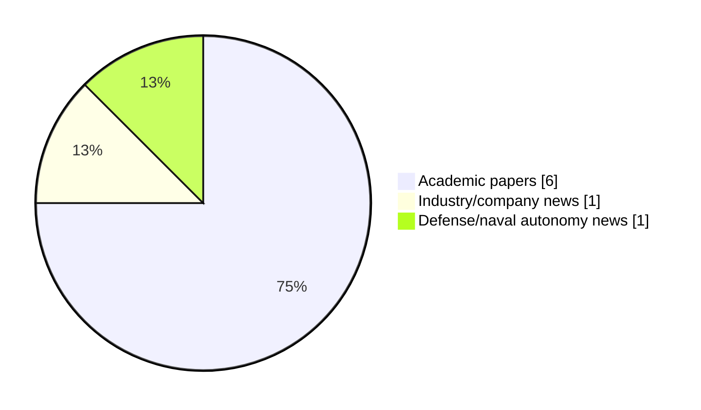

# Maritime Autonomy Watch — 2026-05-09

## Executive Summary

- Total selected items: 8
- Academic papers: 6
- Industry/company news: 1
- Defense/naval autonomy news: 1
- Failed/inaccessible sources: 0

## Top Signals Today

- Repeated signal around autonomous across selected items.
- Repeated signal around learning across selected items.
- Repeated signal around underwater across selected items.

## Freshness and Coverage

- Newest selected item date: 2026-12-01
- Oldest selected item date: 2026-04-23
- Active/enabled sources: 5
- Sources with access problems: 2

### Category Snapshot

| Category | Selected items |
|---|---:|
| Academic papers | 6 |
| Industry/company news | 1 |
| Defense/naval autonomy news | 1 |

## Contents

- [Top Signals Today](#top-signals-today)
- [Freshness and Coverage](#freshness-and-coverage)
- [Academic Papers](#academic-papers)
- [Industry and Company News](#industry-and-company-news)
- [Defense and Naval Autonomy News](#defense-and-naval-autonomy-news)
- [Source Status Summary](#source-status-summary)

## Academic Papers

_Selected items: 6_

### [Ubiquitous sensing of marine activities via the cooperation of autonomous underwater vehicles](https://api.elsevier.com/content/abstract/scopus_id/105028115165)

- Source: Elsevier Scopus
- Date: 2026-12-01
- Relevance score: 4.25
- DOI: 10.1038/s41598-025-29532-y

**Abstract**

No summary available.

**Why it matters**

Relevant to underwater autonomy; the work may inform maritime autonomy research, testing priorities, or system design.

---

### [Digital twin-driven swarm of autonomous underwater vehicles for marine exploration](https://api.elsevier.com/content/abstract/scopus_id/105028310846)

- Source: Elsevier Scopus
- Date: 2026-12-01
- Relevance score: 4.25
- DOI: 10.1038/s44172-025-00571-7

**Abstract**

No summary available.

**Why it matters**

Relevant to underwater autonomy, multi-vehicle coordination; the work may inform maritime autonomy research, testing priorities, or system design.

---

### [Delay-Robust Deep Reinforcement Learning for Ranging-Free Channel Access under Mobility in Underwater Acoustic Networks](http://arxiv.org/abs/2605.06536v1)

- Source: arXiv
- Date: 2026-05-07
- Relevance score: 3.5
- Authors: Huaisheng Ye, Xiaowen Ye, Liqun Fu

**Abstract**

Long propagation delays in underwater acoustic networks (UWANs) cause spatio-temporal uncertainty, constraining channel utilization in medium access control (MAC) protocols. Node mobility within autonomous underwater vehicle scenarios exacerbates these challenges by introducing dynamic propagation delays and varying spatial topologies. We present MobiU-MAC, a deep reinforcement learning (DRL)-based MAC protocol for mobile node access in UWANs that maximizes throughput via autonomous learning. MobiU-MAC incorporates CHILL-STER, a novel DRL algorithm optimized for UWANs that is both ranging-free and delay-robust. CHILL-STER employs a credit horizon-limited $λ$-return (CHILL-Return) mechanism to achieve stable learning under asynchronous delayed rewards, while the companion spatio-temporal experience replay (STER) mechanism addresses topological changes arising from node mobility.

**Why it matters**

Relevant to underwater autonomy; the work may inform maritime autonomy research, testing priorities, or system design.

---

### [Sim-to-Real Transfer and Robustness Evaluation of Reinforcement Learning Control with Integrated Perception on an ASV for Floating Waste Capture](http://arxiv.org/abs/2605.02529v1)

- Source: arXiv
- Date: 2026-05-04
- Relevance score: 3.5
- Authors: Luis F. W. Batista, Stéphanie Aravecchia, Cédric Pradalier

**Abstract**

Autonomous surface vessels for floating-waste removal operate under varying hydrodynamics, external disturbances, and challenging water-surface perception. We present a field-validated system that combines camera-based polarimetric perception with a lightweight DRL-based controller for floating-waste detection and capture. Camera detections are converted into water-surface target points and tracked by a controller trained entirely in simulation and deployed directly on a retrofitted ASV platform. Our main contribution is a sim-to-real testing methodology that combines a two-stage simulation protocol with a perception abstraction module designed to mimic real camera behavior, enabling reproducible field trials and explicit evaluation of the sim-to-real gap. We apply this framework in matched simulation and field experiments across 14 disturbance regimes to expose failure modes and evaluate robustness.

**Why it matters**

Relevant to surface-vessel operations; the work may inform maritime autonomy research, testing priorities, or system design.

---

### [Task-specific Subnetwork Discovery in Reinforcement Learning for Autonomous Underwater Navigation](http://arxiv.org/abs/2604.21640v1)

- Source: arXiv
- Date: 2026-04-23
- Relevance score: 3.5
- Authors: Yi-Ling Liu, Melvin Laux, Mariela De Lucas Alvarez, Frank Kirchner, Rebecca Adam

**Abstract**

Autonomous underwater vehicles are required to perform multiple tasks adaptively and in an explainable manner under dynamic, uncertain conditions and limited sensing, challenges that classical controllers struggle to address. This demands robust, generalizable, and inherently interpretable control policies for reliable long-term monitoring. Reinforcement learning, particularly multi-task RL, overcomes these limitations by leveraging shared representations to enable efficient adaptation across tasks and environments. However, while such policies show promising results in simulation and controlled experiments, they yet remain opaque and offer limited insight into the agent's internal decision-making, creating gaps in transparency, trust, and safety that hinder real-world deployment. The internal policy structure and task-specific specialization remain poorly understood.

**Why it matters**

Relevant to underwater autonomy, infrastructure monitoring; the work may inform maritime autonomy research, testing priorities, or system design.

---

### [Legal Implications of Autonomous Warships under UNCLOS: Navigating Definitional Gaps in International Maritime Law](https://doi.org/10.58829/lp.12.2.2025.289)

- Source: OpenAlex
- Date: 2026-04-24
- Relevance score: 3.5
- Authors: Afiat Yudhistira, Davina Oktivana
- DOI: 10.58829/lp.12.2.2025.289

**Abstract**

Rapid technological advancements have outpaced legal frameworks in regulating autonomous warships, as United Nations Convention on the Law of the Sea (UNCLOS) human-centered definition fails to accommodate crewless or semi-autonomous vessels in modern naval operations. This study examines the legal implications of this definitional gap and explores how international law might evolve to address the governance of autonomous warships. Key issues include sovereignty, accountability, and compliance with existing maritime and wartime legal norms, such as whether a fully autonomous vessel can qualify as a warship under UNCLOS and what responsibilities states bear for their actions in conflict scenarios.

**Why it matters**

Relevant to naval adoption; the work may inform maritime autonomy research, testing priorities, or system design.

---

## Industry and Company News

_Selected items: 1_

### [MetOcean Telematics Forges Partnerships for Autonomous Maritime Missions](https://www.oceansciencetechnology.com/news/metocean-telematics-partners-with-zerousv-others-for-autonomous-maritime-missions/)

- Source: oceansciencetechnology.com
- Date: 2026-05-05
- Relevance score: 3.5

**Summary**

ZeroUSV is advancing long-endurance autonomous ocean operations through a strategic collaboration with MetOcean Telematics, Thales, and Iridium to integrate resilient.

**Why it matters**

This item may signal product, market, or deployment momentum in maritime autonomy.

---

## Defense and Naval Autonomy News

_Selected items: 1_

### [Fishermen Find Ukrainian-Made Naval Drone in Greek Island Cave](https://www.marinelink.com/news/fishermen-find-ukrainianmade-naval-drone-538983)

- Source: marinelink.com
- Date: 2026-05-08
- Relevance score: 8

**Summary**

Greek authorities are investigating a drone boat found by fishermen in a cave on the Ionian island of Lefkada, police and coast guard sources said on Friday. It was not clear how the Ukrainian-made unmanned surface vehicle (USV) reached Greek waters.

**Why it matters**

Signals movement in surface-vessel operations, naval adoption; useful for tracking operational concepts, procurement direction, and fleet integration.

---

## Inaccessible or Failed Sources

- None

## Source Status Summary

| Source | Status | Notes |
|---|---|---|
| arXiv | enabled | API source, 15 items fetched |
| OpenAlex | enabled | API source, 15 items fetched |
| RSS feeds | enabled | 107 RSS items fetched |
| SMI MASG News | enabled | HTML source, 10 items fetched |
| IEEE Xplore | disabled | Missing IEEE_XPLORE_API_KEY |
| Elsevier Scopus | enabled | API source, 15 items fetched |
| NewsAPI | disabled | Missing NEWS_API_KEY |

## Metadata

- Generated at: 2026-05-09T14:26:50.475953+02:00
- Date: 2026-05-09
- Repository: ferhannb/MarineRobotics
- Relevance threshold: 4.0
- Deduplication method: DOI, canonical URL, source ID, normalized title, similar recent titles, category caps, and novelty score
