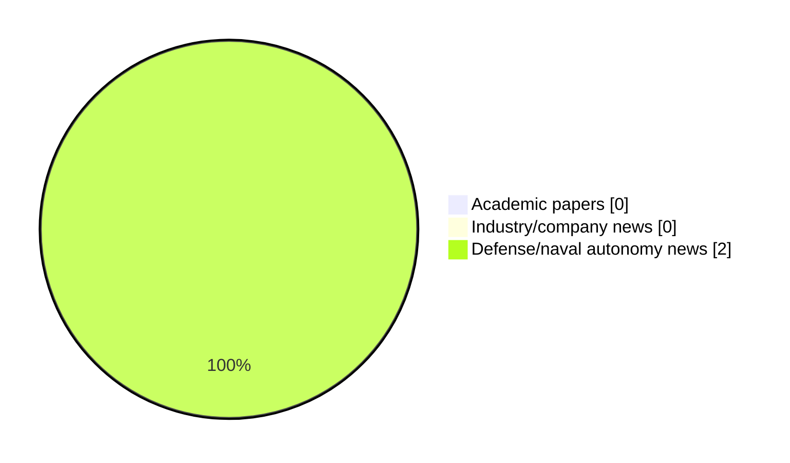

# Maritime Autonomy Watch — 2026-05-12

## Executive Summary

- Total selected items: 2
- Academic papers: 0
- Industry/company news: 0
- Defense/naval autonomy news: 2
- Failed/inaccessible sources: 1

## Contents

- [Analyst Brief](#analyst-brief)
- [Must Read](#must-read)
- [Top Signals Today](#top-signals-today)
- [Topic Signals](#topic-signals)
- [Freshness and Coverage](#freshness-and-coverage)
- [Quality Notes](#quality-notes)
- [Watchlist](#watchlist)
- [Academic Papers](#academic-papers)
- [Industry and Company News](#industry-and-company-news)
- [Defense and Naval Autonomy News](#defense-and-naval-autonomy-news)
- [Source Status Summary](#source-status-summary)

## Analyst Brief

Today's report selected 2 non-duplicate item(s), led by defense adoption, USV operations, perception. The strongest item is [DANAE project: A fleet of Armed USV for the French Navy by 2027](https://www.navalnews.com/naval-news/2026/05/danae-project-a-fleet-of-armed-usv-for-the-french-navy-by-2027/) from navalnews.com.
Coverage is weighted toward academic research (0), with 0 industry and 2 defense signal(s).

## Must Read

- [DANAE project: A fleet of Armed USV for the French Navy by 2027](https://www.navalnews.com/naval-news/2026/05/danae-project-a-fleet-of-armed-usv-for-the-french-navy-by-2027/) — Defense signal: USV operations
- [Kraken Robotics & SEFINE SISAM Partner On Autonomous Subsea Warfare Solutions](https://www.oceansciencetechnology.com/news/kraken-robotics-sefine-sisam-partner-on-autonomous-subsea-warfare-solutions/) — Defense signal: perception

## Top Signals Today

- defense adoption: 2 selected item(s).
- USV operations: 1 selected item(s).
- perception: 1 selected item(s).
- critical infrastructure: 1 selected item(s).

## Topic Signals

- defense adoption: 2
- USV operations: 1
- perception: 1
- critical infrastructure: 1

## Freshness and Coverage

- Newest selected item date: 2026-05-11
- Oldest selected item date: 2026-05-11
- Active/enabled sources: 4
- Sources with access problems: 3
- Quality flags: 0

## Quality Notes

- No quality flags on selected items.

## Watchlist

- No watchlist items today.

### Category Snapshot

| Category | Selected items |
|---|---:|
| Academic papers | 0 |
| Industry/company news | 0 |
| Defense/naval autonomy news | 2 |

## Academic Papers

_Selected items: 0_

No selected items.

## Industry and Company News

_Selected items: 0_

No selected items.

## Defense and Naval Autonomy News

_Selected items: 2_

### [DANAE project: A fleet of Armed USV for the French Navy by 2027](https://www.navalnews.com/naval-news/2026/05/danae-project-a-fleet-of-armed-usv-for-the-french-navy-by-2027/)

- Source: navalnews.com
- Date: 2026-05-11
- Relevance score: 7.5
- Signal: Defense signal: USV operations
- Topic tags: USV operations, defense adoption

**Summary**

The DANAE (for Drone Autonome Naval avec de l’Armement Embarqué or Autonomous Naval Drone with Onboard Armament) project aims to rapidly equip the French Navy with armed Unmanned Surface Vessels (USV). In a first stage, the Marine Nationale expects these drone boats to conduct naval bases protection missions with non-lethal effectors. In a second and.

**Why it matters**

Signals movement in surface-vessel operations, naval adoption; useful for tracking operational concepts, procurement direction, and fleet integration.

---

### [Kraken Robotics & SEFINE SISAM Partner On Autonomous Subsea Warfare Solutions](https://www.oceansciencetechnology.com/news/kraken-robotics-sefine-sisam-partner-on-autonomous-subsea-warfare-solutions/)

- Source: oceansciencetechnology.com
- Date: 2026-05-11
- Relevance score: 5
- Signal: Defense signal: perception
- Topic tags: perception, critical infrastructure, defense adoption

**Summary**

Kraken Robotics Inc. has signed a Memorandum of Understanding with SEFINE SISAM to advance the integration of high-resolution sonar technology into unmanned maritime platforms. Signed during the SAHA exposition in Türkiye, the agreement between the Canadian subsea intelligence company and the Strategic Unmanned Systems Research Center (SISAM) focuses on technical collaboration for defense applications.

**Why it matters**

Signals movement in naval adoption; useful for tracking operational concepts, procurement direction, and fleet integration.

---

## Inaccessible or Failed Sources

- arXiv: HTTP 429 for https://export.arxiv.org/api/query?search_query=all%3A%22maritime+autonomy%22+OR+all%3A%22marine+robotics%22+OR+all%3A%22autonomous+vessel%22+OR+all%3A%22autonomous+mission%22+OR+all%3A%22autonomous+surface+vessel%22+OR+all%3A%22autonomous+underwater+vehicle%22+OR+all%3A%22unmanned+surface+vehicle%22+OR+all%3A%22unmanned+underwater+vehicle%22&start=0&max_results=15&sortBy=submittedDate&sortOrder=descending

## Source Status Summary

| Source | Status | Notes |
|---|---|---|
| arXiv | failed | HTTP 429 for https://export.arxiv.org/api/query?search_query=all%3A%22maritime+autonomy%22+OR+all%3A%22marine+robotics%22+OR+all%3A%22autonomous+vessel%22+OR+all%3A%22autonomous+mission%22+OR+all%3A%22autonomous+surface+vessel%22+OR+all%3A%22autonomous+underwater+vehicle%22+OR+all%3A%22unmanned+surface+vehicle%22+OR+all%3A%22unmanned+underwater+vehicle%22&start=0&max_results=15&sortBy=submittedDate&sortOrder=descending |
| OpenAlex | enabled | API source, 15 items fetched |
| RSS feeds | enabled | 107 RSS items fetched |
| SMI MASG News | enabled | HTML source, 10 items fetched |
| IEEE Xplore | disabled | Missing IEEE_XPLORE_API_KEY |
| Elsevier Scopus | enabled | API source, 15 items fetched |
| NewsAPI | disabled | Missing NEWS_API_KEY |

## Metadata

- Generated at: 2026-05-12T10:35:55.592510+02:00
- Date: 2026-05-12
- Repository: ferhannb/MarineRobotics
- Relevance threshold: 4.0
- Deduplication method: DOI, canonical URL, source ID, normalized title, similar recent titles, category caps, and novelty score
