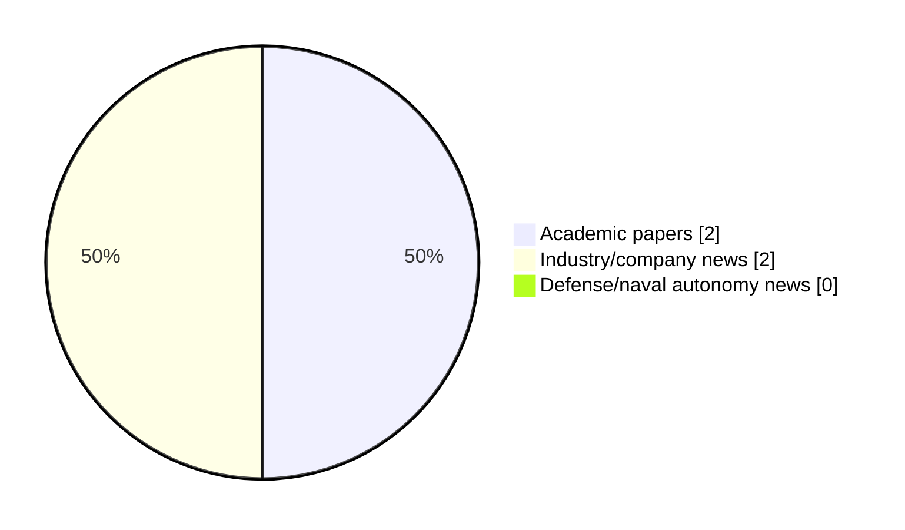

# Maritime Autonomy Watch — 2026-05-13

## Executive Summary

- Total selected items: 4
- Academic papers: 2
- Industry/company news: 2
- Defense/naval autonomy news: 0
- Failed/inaccessible sources: 0

## Contents

- [Analyst Brief](#analyst-brief)
- [Must Read](#must-read)
- [Top Signals Today](#top-signals-today)
- [Topic Signals](#topic-signals)
- [Freshness and Coverage](#freshness-and-coverage)
- [Quality Notes](#quality-notes)
- [Watchlist](#watchlist)
- [Academic Papers](#academic-papers)
- [Industry and Company News](#industry-and-company-news)
- [Defense and Naval Autonomy News](#defense-and-naval-autonomy-news)
- [Source Status Summary](#source-status-summary)

## Analyst Brief

Today's report selected 4 non-duplicate item(s), led by AUV navigation, USV operations, underwater communications. The strongest item is [Above and Below: Heterogeneous Multi-robot SLAM Across Surface and Underwater Domains](http://arxiv.org/abs/2605.09811v1) from arXiv.
Coverage is weighted toward academic research (2), with 2 industry and 0 defense signal(s).

## Must Read

- [Above and Below: Heterogeneous Multi-robot SLAM Across Surface and Underwater Domains](http://arxiv.org/abs/2605.09811v1) — Research signal: AUV navigation
- [Poseidon’s Forge Announces Sale of DarkWake AUV](https://oceannews.com/news/science-technology/poseidons-forge-announces-sale-of-darkwake-auv/) — Industry signal: AUV navigation
- [Halo Separation-guided Underwater Multi-scale Image Restoration](http://arxiv.org/abs/2605.10374v1) — Research signal: AUV navigation
- [Strategic Partnership Formed to Scale UK Autonomous Vessel Production](https://www.oceansciencetechnology.com/news/strategic-partnership-formed-to-scale-uk-autonomous-vessel-production/) — Industry signal: USV operations

## Top Signals Today

- AUV navigation: 3 selected item(s).
- USV operations: 2 selected item(s).
- underwater communications: 1 selected item(s).
- swarm autonomy: 1 selected item(s).
- perception: 1 selected item(s).

## Topic Signals

- AUV navigation: 3
- USV operations: 2
- underwater communications: 1
- swarm autonomy: 1
- perception: 1
- regulation/legal: 1

## Freshness and Coverage

- Newest selected item date: 2026-05-13
- Oldest selected item date: 2026-05-10
- Active/enabled sources: 5
- Sources with access problems: 2
- Quality flags: 0

## Quality Notes

- No quality flags on selected items.

## Watchlist

- No watchlist items today.

### Category Snapshot

| Category | Selected items |
|---|---:|
| Academic papers | 2 |
| Industry/company news | 2 |
| Defense/naval autonomy news | 0 |

## Academic Papers

_Selected items: 2_

### [Above and Below: Heterogeneous Multi-robot SLAM Across Surface and Underwater Domains](http://arxiv.org/abs/2605.09811v1)

- Source: arXiv
- Date: 2026-05-10
- Relevance score: 10
- Authors: John McConnell, Armon Shariati, Paul Szenher, Yaxuan Li
- Signal: Research signal: AUV navigation
- Topic tags: AUV navigation, USV operations, underwater communications

**Abstract**

Multi-robot simultaneous localization and mapping (SLAM) is a fundamental task in multi-robot operations. Robots must have a common understanding of their location and that of their team members to complete coordinated actions. However, multi-robot SLAM between Uncrewed Surface Vessels (USVs) and Autonomous Underwater Vehicles (AUVs) has primarily been achieved through acoustic pinging between robots to retrieve range measurements; a measurement technique requires that robots to be in similar locations simultaneously, have an uninterrupted path for signal propagation, and may necessitate synchronized clocks. This is especially challenging in complex, cluttered maritime environments, where structures may impede signals. However, these same structures may be observable above and below the water's surface, presenting an opportunity for inter-robot SLAM loop closure between USV and AUV data streams.

**Why it matters**

Relevant to underwater autonomy, surface-vessel operations; the work may inform maritime autonomy research, testing priorities, or system design.

---

### [Halo Separation-guided Underwater Multi-scale Image Restoration](http://arxiv.org/abs/2605.10374v1)

- Source: arXiv
- Date: 2026-05-11
- Relevance score: 7
- Authors: Jiaxin Yang, Honglin Liu, Yongli Wang, Shuyi Cao, Chengcheng Jiang, Jiale Wang
- Signal: Research signal: AUV navigation
- Topic tags: AUV navigation, swarm autonomy, perception, regulation/legal

**Abstract**

Underwater images captured by Autonomous Underwater Vehicles (AUVs) are inevitably affected by artificial light sources, which often produce halos in the foreground of the camera and seriously interfere with the quality of the image. The existing underwater image enhancement methods fail to fully consider this key problem, and the robustness of processing images under artificial light scenes is poor. In practical applications, since underwater image enhancement itself is a very challenging task, the influence of artificial light sources will lead to serious degradation of image performance and affect subsequent vision tasks. In order to effectively deal with this problem, this paper designs a single halo image correction method based on an iterative structure.

**Why it matters**

Relevant to underwater autonomy, multi-vehicle coordination; the work may inform maritime autonomy research, testing priorities, or system design.

---

## Industry and Company News

_Selected items: 2_

### [Poseidon’s Forge Announces Sale of DarkWake AUV](https://oceannews.com/news/science-technology/poseidons-forge-announces-sale-of-darkwake-auv/)

- Source: oceannews.com
- Date: 2026-05-12
- Relevance score: 7.75
- Signal: Industry signal: AUV navigation
- Topic tags: AUV navigation

**Summary**

Poseidon’s Forge announced the successful sale of its flagship DarkWake autonomous underwater vehicle (AUV) to advanced technology company, Booz Allen Hamilton, marking a significant step forward in enabling rapid, mission-tailored underwater capabilities. The procurement was executed through Booz Allen, which is supporting the Director Submarine Program, PMS 394—Advanced Undersea Systems Program Office.

**Why it matters**

Signals momentum in underwater autonomy; useful for tracking product direction, partnerships, and deployment opportunities.

---

### [Strategic Partnership Formed to Scale UK Autonomous Vessel Production](https://www.oceansciencetechnology.com/news/strategic-partnership-formed-to-scale-uk-autonomous-vessel-production/)

- Source: oceansciencetechnology.com
- Date: 2026-05-13
- Relevance score: 5.5
- Signal: Industry signal: USV operations
- Topic tags: USV operations

**Summary**

ZeroUSV has made a strategic investment in the multidisciplinary shipyard Manor Marine to accelerate the production of its high-tech, British-built.

**Why it matters**

This item may signal product, market, or deployment momentum in maritime autonomy.

---

## Defense and Naval Autonomy News

_Selected items: 0_

No selected items.

## Inaccessible or Failed Sources

- None

## Source Status Summary

| Source | Status | Notes |
|---|---|---|
| arXiv | enabled | API source, 15 items fetched |
| OpenAlex | enabled | API source, 15 items fetched |
| RSS feeds | enabled | 107 RSS items fetched |
| SMI MASG News | enabled | HTML source, 10 items fetched |
| IEEE Xplore | disabled | Missing IEEE_XPLORE_API_KEY |
| Elsevier Scopus | enabled | API source, 15 items fetched |
| NewsAPI | disabled | Missing NEWS_API_KEY |

## Metadata

- Generated at: 2026-05-13T10:41:08.298114+02:00
- Date: 2026-05-13
- Repository: ferhannb/MarineRobotics
- Relevance threshold: 4.0
- Deduplication method: DOI, canonical URL, source ID, normalized title, similar recent titles, category caps, and novelty score
