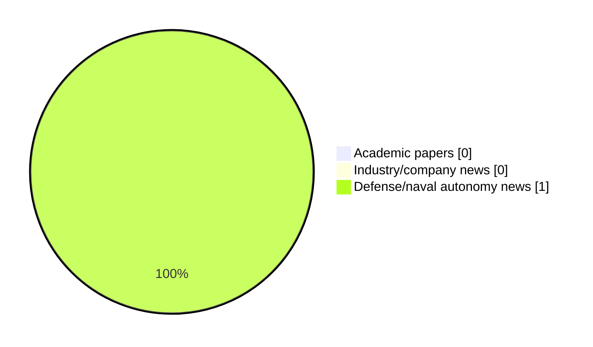

# Maritime Autonomy Watch — 2026-05-14

## Executive Summary

- Total selected items: 1
- Academic papers: 0
- Industry/company news: 0
- Defense/naval autonomy news: 1
- Failed/inaccessible sources: 1

## Contents

- [Analyst Brief](#analyst-brief)
- [Must Read](#must-read)
- [Top Signals Today](#top-signals-today)
- [Topic Signals](#topic-signals)
- [Freshness and Coverage](#freshness-and-coverage)
- [Quality Notes](#quality-notes)
- [Watchlist](#watchlist)
- [Academic Papers](#academic-papers)
- [Industry and Company News](#industry-and-company-news)
- [Defense and Naval Autonomy News](#defense-and-naval-autonomy-news)
- [Source Status Summary](#source-status-summary)

## Analyst Brief

Today's report selected 1 non-duplicate item(s), led by AUV navigation, perception. The strongest item is [Klein Marine Systems Announces MANTIS UUV with Integrated Sonar Array](https://www.navalnews.com/naval-news/2026/05/klein-marine-systems-announces-mantis-uuv-with-integrated-sonar-array/) from navalnews.com.
Coverage is weighted toward academic research (0), with 0 industry and 1 defense signal(s).

## Must Read

- [Klein Marine Systems Announces MANTIS UUV with Integrated Sonar Array](https://www.navalnews.com/naval-news/2026/05/klein-marine-systems-announces-mantis-uuv-with-integrated-sonar-array/) — Defense signal: AUV navigation

## Top Signals Today

- AUV navigation: 1 selected item(s).
- perception: 1 selected item(s).

## Topic Signals

- AUV navigation: 1
- perception: 1

## Freshness and Coverage

- Newest selected item date: 2026-05-13
- Oldest selected item date: 2026-05-13
- Active/enabled sources: 4
- Sources with access problems: 3
- Quality flags: 0

## Quality Notes

- No quality flags on selected items.

## Watchlist

- No watchlist items today.

### Category Snapshot

| Category | Selected items |
|---|---:|
| Academic papers | 0 |
| Industry/company news | 0 |
| Defense/naval autonomy news | 1 |

## Academic Papers

_Selected items: 0_

No selected items.

## Industry and Company News

_Selected items: 0_

No selected items.

## Defense and Naval Autonomy News

_Selected items: 1_

### [Klein Marine Systems Announces MANTIS UUV with Integrated Sonar Array](https://www.navalnews.com/naval-news/2026/05/klein-marine-systems-announces-mantis-uuv-with-integrated-sonar-array/)

- Source: navalnews.com
- Date: 2026-05-13
- Relevance score: 7.75
- Signal: Defense signal: AUV navigation
- Topic tags: AUV navigation, perception

**Summary**

Klein Marine Systems has announced the MANTIS UUV, a side scan sonar system designed for autonomous underwater vehicle platforms. The system incorporates the company’s SmartArray Technology, which integrates electronics directly into the transducer array to reduce the overall footprint for space-constrained UUV installations. According to Klein’s announcement, the MANTIS UUV is intended to provide “consistent,.

**Why it matters**

Signals movement in underwater autonomy; useful for tracking operational concepts, procurement direction, and fleet integration.

---

## Inaccessible or Failed Sources

- arXiv: HTTP 429 for https://export.arxiv.org/api/query?search_query=all%3A%22maritime+autonomy%22+OR+all%3A%22marine+robotics%22+OR+all%3A%22autonomous+vessel%22+OR+all%3A%22autonomous+mission%22+OR+all%3A%22autonomous+surface+vessel%22+OR+all%3A%22autonomous+underwater+vehicle%22+OR+all%3A%22unmanned+surface+vehicle%22+OR+all%3A%22unmanned+underwater+vehicle%22&start=0&max_results=15&sortBy=submittedDate&sortOrder=descending

## Source Status Summary

| Source | Status | Notes |
|---|---|---|
| arXiv | failed | HTTP 429 for https://export.arxiv.org/api/query?search_query=all%3A%22maritime+autonomy%22+OR+all%3A%22marine+robotics%22+OR+all%3A%22autonomous+vessel%22+OR+all%3A%22autonomous+mission%22+OR+all%3A%22autonomous+surface+vessel%22+OR+all%3A%22autonomous+underwater+vehicle%22+OR+all%3A%22unmanned+surface+vehicle%22+OR+all%3A%22unmanned+underwater+vehicle%22&start=0&max_results=15&sortBy=submittedDate&sortOrder=descending |
| OpenAlex | enabled | API source, 15 items fetched |
| RSS feeds | enabled | 107 RSS items fetched |
| SMI MASG News | enabled | HTML source, 10 items fetched |
| IEEE Xplore | disabled | Missing IEEE_XPLORE_API_KEY |
| Elsevier Scopus | enabled | API source, 15 items fetched |
| NewsAPI | disabled | Missing NEWS_API_KEY |

## Metadata

- Generated at: 2026-05-14T10:34:17.647677+02:00
- Date: 2026-05-14
- Repository: ferhannb/MarineRobotics
- Relevance threshold: 4.0
- Deduplication method: DOI, canonical URL, source ID, normalized title, similar recent titles, category caps, and novelty score
