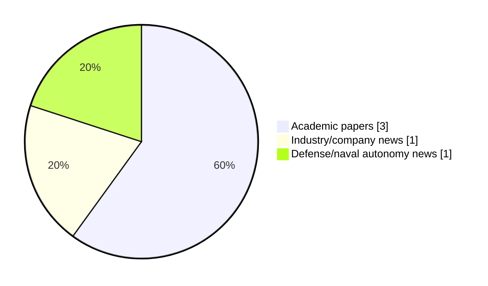

# Maritime Autonomy Watch — 2026-05-15

## Executive Summary

- Total selected items: 5
- Academic papers: 3
- Industry/company news: 1
- Defense/naval autonomy news: 1
- Failed/inaccessible sources: 0

## Contents

- [Analyst Brief](#analyst-brief)
- [Must Read](#must-read)
- [Top Signals Today](#top-signals-today)
- [Topic Signals](#topic-signals)
- [Freshness and Coverage](#freshness-and-coverage)
- [Quality Notes](#quality-notes)
- [Watchlist](#watchlist)
- [Academic Papers](#academic-papers)
- [Industry and Company News](#industry-and-company-news)
- [Defense and Naval Autonomy News](#defense-and-naval-autonomy-news)
- [Source Status Summary](#source-status-summary)

## Analyst Brief

Today's report selected 5 non-duplicate item(s), led by AUV navigation, perception, swarm autonomy. The strongest item is [An Attention-Enhanced Network with Joint Dehazing and Retinex-Based Enhancement for Underwater Images](http://arxiv.org/abs/2605.14677v1) from arXiv.
Coverage is weighted toward academic research (3), with 1 industry and 1 defense signal(s).
Quality caveat: low-score-unique=1.

## Must Read

- [An Attention-Enhanced Network with Joint Dehazing and Retinex-Based Enhancement for Underwater Images](http://arxiv.org/abs/2605.14677v1) — Research signal: AUV navigation
- [Air-Sea Surface Modeling and Operating Link Range Evaluation for AUV-to-UAV Optical Wireless Communication Links](http://arxiv.org/abs/2605.13661v1) — Research signal: AUV navigation
- [Chance Maritime Awarded NOAA Contract to Provide Chance LR30 USVs](https://oceannews.com/news/science-technology/chance-maritime-awarded-noaa-contract-to-provide-chance-lr30-usvs/) — Defense signal: USV operations
- [Multi-Depth Uniform Coverage Path Planning for Unmanned Surface Vehicle Surveying](http://arxiv.org/abs/2605.13123v1) — Research signal: USV operations
- [Autonomous Underwater Robot Discovers Hidden Coral Reef Hotspots](https://oceannews.com/news/science-technology/autonomous-underwater-robot-discovers-hidden-coral-reef-hotspots/) — Industry signal: AUV navigation

## Top Signals Today

- AUV navigation: 3 selected item(s).
- perception: 3 selected item(s).
- swarm autonomy: 2 selected item(s).
- USV operations: 2 selected item(s).
- critical infrastructure: 1 selected item(s).

## Topic Signals

- AUV navigation: 3
- perception: 3
- swarm autonomy: 2
- USV operations: 2
- critical infrastructure: 1
- planning/control: 1

## Freshness and Coverage

- Newest selected item date: 2026-05-14
- Oldest selected item date: 2026-05-13
- Active/enabled sources: 5
- Sources with access problems: 2
- Quality flags: 1

## Quality Notes

- low-score-unique: 1

## Watchlist

- [Autonomous Underwater Robot Discovers Hidden Coral Reef Hotspots](https://oceannews.com/news/science-technology/autonomous-underwater-robot-discovers-hidden-coral-reef-hotspots/) — low-score-unique

### Category Snapshot

| Category | Selected items |
|---|---:|
| Academic papers | 3 |
| Industry/company news | 1 |
| Defense/naval autonomy news | 1 |

## Academic Papers

_Selected items: 3_

### [An Attention-Enhanced Network with Joint Dehazing and Retinex-Based Enhancement for Underwater Images](http://arxiv.org/abs/2605.14677v1)

- Source: arXiv
- Date: 2026-05-14
- Relevance score: 7.75
- Authors: Sahana Ray, Bibhabasu Debnath, Sanjay Ghosh
- Signal: Research signal: AUV navigation
- Topic tags: AUV navigation, swarm autonomy, perception, critical infrastructure

**Abstract**

Underwater images suffer from severe wavelength-dependent light absorption and scattering, and turbidity due to suspended particles, degrading visual quality for applications in autonomous underwater vehicles (AUVs), marine biology, archaeology, and offshore infrastructure inspection. Classical IFM inadequately capture nonlinear underwater light behavior, while purely data-driven methods lack physical interpretability. This paper proposes a three-stage network named ADR, that extends the underwater image formation model with additional terms to perform underwater dehazing, followed by Retinex-based enhancement and attention-enabled U-Net++ refinement. Experiments on UIEB and UFO-120 benchmark datasets demonstrate competitive performance with state-of-the-art methods.

**Why it matters**

Relevant to underwater autonomy, multi-vehicle coordination, infrastructure monitoring; the work may inform maritime autonomy research, testing priorities, or system design.

---

### [Air-Sea Surface Modeling and Operating Link Range Evaluation for AUV-to-UAV Optical Wireless Communication Links](http://arxiv.org/abs/2605.13661v1)

- Source: arXiv
- Date: 2026-05-13
- Relevance score: 7.75
- Authors: Ikenna Chinazaekpere Ijeh, Mohammad Ali Khalighi, Wasiu O. Popoola
- Signal: Research signal: AUV navigation
- Topic tags: AUV navigation

**Abstract**

Air-sea surface interactions play a critical role in underwater-to-air optical wireless communication (OWC) links, particularly in vertical autonomous underwater vehicle (AUV) to unmanned aerial vehicle (UAV) scenarios, where the stochastic nature of the sea surface introduces optical distortions that impair link reliability. This work investigates the impact of air-sea surface roughness on AUV-to-UAV OWC systems using two experimentally validated models: the classical Cox-Munk and the Elfouhaily-Chapron-Katsaros-Vandemark (ECKV). A tractable analytical representation of the ECKV model is derived and validated against measured sea-state data. Using both analytical and Monte Carlo approaches, the link ergodic capacity is evaluated with particular emphasis on operating range, pointing errors, receiver field-of-view, and solar noise level, providing practical system design insights.

**Why it matters**

Relevant to underwater autonomy; the work may inform maritime autonomy research, testing priorities, or system design.

---

### [Multi-Depth Uniform Coverage Path Planning for Unmanned Surface Vehicle Surveying](http://arxiv.org/abs/2605.13123v1)

- Source: arXiv
- Date: 2026-05-13
- Relevance score: 5
- Authors: Maider Larrazabal, Tong Yang, Izaro Goienetxea, Jaime Valls Miro
- Signal: Research signal: USV operations
- Topic tags: USV operations, swarm autonomy, perception, planning/control

**Abstract**

This paper introduces a novel automatic coverage path planning algorithm for bathymetry surveying with unmanned surface vehicles. The detection range of the mapping sensor employed - a multibeam echo sounder - is heavily influenced by local seafloor depths. Hence, a path designed to uniformly cover the sea surface does not guarantee uniform coverage of the seafloor. Yet this is currently the typical process for bathymetric surveys, with the simplistic boustrophedon scheme along manually selected waypoints at constant depths being the most widespread planner used. The proposed scheme incorporates coarse prior depth information to pre-process the target region and adaptively guide path generation and sensing range configuration.

**Why it matters**

Relevant to surface-vessel operations, multi-vehicle coordination, planning and control; the work may inform maritime autonomy research, testing priorities, or system design.

---

## Industry and Company News

_Selected items: 1_

### [Autonomous Underwater Robot Discovers Hidden Coral Reef Hotspots](https://oceannews.com/news/science-technology/autonomous-underwater-robot-discovers-hidden-coral-reef-hotspots/)

- Source: oceannews.com
- Date: 2026-05-14
- Relevance score: 3
- Signal: Industry signal: AUV navigation
- Topic tags: AUV navigation, perception
- Quality flags: low-score-unique

**Summary**

Researchers have developed an autonomous system for seeking out and mapping hotspots of biodiversity on coral reefs with unprecedented precision, offering a powerful new tool for studying and protecting some of the ocean’s most valuable ecosystems. The work, published in Science Robotics, demonstrates how combining audio and visual data in a single autonomous system can reveal where marine life concentrates and why.

**Why it matters**

Signals momentum in underwater autonomy; useful for tracking product direction, partnerships, and deployment opportunities.

---

## Defense and Naval Autonomy News

_Selected items: 1_

### [Chance Maritime Awarded NOAA Contract to Provide Chance LR30 USVs](https://oceannews.com/news/science-technology/chance-maritime-awarded-noaa-contract-to-provide-chance-lr30-usvs/)

- Source: oceannews.com
- Date: 2026-05-14
- Relevance score: 6
- Signal: Defense signal: USV operations
- Topic tags: USV operations

**Summary**

Chance Maritime Technologies has been awarded a $21.6 million contract by NOAA to provide Chance LR30 uncrewed surface vessels in support of the agency’s new charting and mapping vessels. Chance Maritime will deliver up to eight Chance LR30 platforms, equipping NOAA with a fleet of long-endurance USVs purpose-built for hydrographic and fisheries surveys.

**Why it matters**

Signals movement in surface-vessel operations; useful for tracking operational concepts, procurement direction, and fleet integration.

---

## Inaccessible or Failed Sources

- None

## Source Status Summary

| Source | Status | Notes |
|---|---|---|
| arXiv | enabled | API source, 15 items fetched |
| OpenAlex | enabled | API source, 15 items fetched |
| RSS feeds | enabled | 107 RSS items fetched |
| SMI MASG News | enabled | HTML source, 10 items fetched |
| IEEE Xplore | disabled | Missing IEEE_XPLORE_API_KEY |
| Elsevier Scopus | enabled | API source, 15 items fetched |
| NewsAPI | disabled | Missing NEWS_API_KEY |

## Metadata

- Generated at: 2026-05-15T10:45:45.703860+02:00
- Date: 2026-05-15
- Repository: ferhannb/MarineRobotics
- Relevance threshold: 4.0
- Deduplication method: DOI, canonical URL, source ID, normalized title, similar recent titles, category caps, and novelty score
