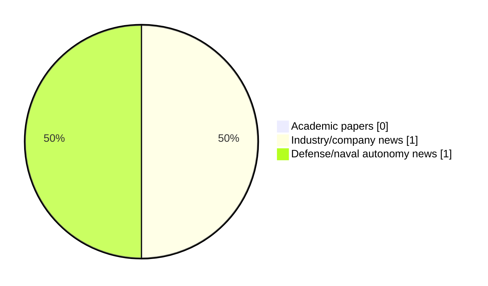

# Maritime Autonomy Watch — 2026-05-16

## Executive Summary

- Total selected items: 2
- Academic papers: 0
- Industry/company news: 1
- Defense/naval autonomy news: 1
- Failed/inaccessible sources: 1

## Contents

- [Analyst Brief](#analyst-brief)
- [Must Read](#must-read)
- [Top Signals Today](#top-signals-today)
- [Topic Signals](#topic-signals)
- [Freshness and Coverage](#freshness-and-coverage)
- [Quality Notes](#quality-notes)
- [Watchlist](#watchlist)
- [Academic Papers](#academic-papers)
- [Industry and Company News](#industry-and-company-news)
- [Defense and Naval Autonomy News](#defense-and-naval-autonomy-news)
- [Source Status Summary](#source-status-summary)

## Analyst Brief

Today's report selected 2 non-duplicate item(s), led by USV operations, defense adoption, AUV navigation. The strongest item is [HII, MetalCraft Marine Deliver ROMULUS-25 USV Prototypes for U.S. Marine Corps](https://www.navalnews.com/naval-news/2026/05/hii-metalcraft-marine-deliver-romulus-25-usv-prototypes-for-u-s-marine-corps/) from navalnews.com.
Coverage is weighted toward academic research (0), with 1 industry and 1 defense signal(s).

## Must Read

- [HII, MetalCraft Marine Deliver ROMULUS-25 USV Prototypes for U.S. Marine Corps](https://www.navalnews.com/naval-news/2026/05/hii-metalcraft-marine-deliver-romulus-25-usv-prototypes-for-u-s-marine-corps/) — Defense signal: USV operations
- [Thales and BAE Systems Collaborate to Provide a New Advanced Intelligence Surveillance and Reconnaissance Mast](https://oceannews.com/news/defense/thales-and-bae-systems-collaborate-to-provide-a-new-advanced-intelligence-surveillance-and-reconnaissance-mast/) — Industry signal: AUV navigation

## Top Signals Today

- USV operations: 2 selected item(s).
- defense adoption: 1 selected item(s).
- AUV navigation: 1 selected item(s).

## Topic Signals

- USV operations: 2
- defense adoption: 1
- AUV navigation: 1

## Freshness and Coverage

- Newest selected item date: 2026-05-15
- Oldest selected item date: 2026-05-15
- Active/enabled sources: 4
- Sources with access problems: 3
- Quality flags: 0

## Quality Notes

- No quality flags on selected items.

## Watchlist

- No watchlist items today.

### Category Snapshot

| Category | Selected items |
|---|---:|
| Academic papers | 0 |
| Industry/company news | 1 |
| Defense/naval autonomy news | 1 |

## Academic Papers

_Selected items: 0_

No selected items.

## Industry and Company News

_Selected items: 1_

### [Thales and BAE Systems Collaborate to Provide a New Advanced Intelligence Surveillance and Reconnaissance Mast](https://oceannews.com/news/defense/thales-and-bae-systems-collaborate-to-provide-a-new-advanced-intelligence-surveillance-and-reconnaissance-mast/)

- Source: oceannews.com
- Date: 2026-05-15
- Relevance score: 10
- Signal: Industry signal: AUV navigation
- Topic tags: AUV navigation, USV operations

**Summary**

The proliferation of autonomous platforms—from uncrewed surface vessels (USVs) to extra-large uncrewed underwater vehicles (XLUUVs) and autonomous underwater vehicles (XLAUVs)—is reshaping how hybrid navies operate in contested waters where crewed platforms face increased risk. But these platforms are only as effective as their sensors, and delivering the situational awareness that operators need remains one of the most pressing challenges.

**Why it matters**

Signals momentum in underwater autonomy, surface-vessel operations; useful for tracking product direction, partnerships, and deployment opportunities.

---

## Defense and Naval Autonomy News

_Selected items: 1_

### [HII, MetalCraft Marine Deliver ROMULUS-25 USV Prototypes for U.S. Marine Corps](https://www.navalnews.com/naval-news/2026/05/hii-metalcraft-marine-deliver-romulus-25-usv-prototypes-for-u-s-marine-corps/)

- Source: navalnews.com
- Date: 2026-05-15
- Relevance score: 10
- Signal: Defense signal: USV operations
- Topic tags: USV operations, defense adoption

**Summary**

HII, in partnership with MetalCraft Marine, has delivered and sea tested two ROMULUS-25 unmanned surface vessels (USV) awarded in a Defense Innovation Unit (DIU) contract for smaller form factor autonomous boat prototypes for the U.S. Marine Corps. HII press release The two ROMULUS-25 autonomous USVs were delivered in December 2025 and supported successful testing and.

**Why it matters**

Signals movement in surface-vessel operations, naval adoption; useful for tracking operational concepts, procurement direction, and fleet integration.

---

## Inaccessible or Failed Sources

- Elsevier Scopus: HTTP 503 for https://api.elsevier.com/content/search/scopus?query=TITLE-ABS-KEY%28%22maritime+autonomy%22%29+OR+TITLE-ABS-KEY%28%22marine+robotics%22%29+OR+TITLE-ABS-KEY%28%22autonomous+vessel%22%29+OR+TITLE-ABS-KEY%28%22autonomous+mission%22%29+OR+TITLE-ABS-KEY%28%22autonomous+surface+vessel%22%29+OR+TITLE-ABS-KEY%28%22autonomous+underwater+vehicle%22%29+OR+TITLE-ABS-KEY%28%22unmanned+surface+vehicle%22%29+OR+TITLE-ABS-KEY%28%22unmanned+underwater+vehicle%22%29+OR+TITLE-ABS-KEY%28%22unmanned+naval%22%29+OR+TITLE-ABS-KEY%28%22unmanned+systems%22%29+OR+TITLE-ABS-KEY%28%22naval+autonomy%22%29+OR+TITLE-ABS-KEY%28%22USV%22%29+OR+TITLE-ABS-KEY%28%22USV+autonomy%22%29+OR+TITLE-ABS-KEY%28%22AUV%22%29+OR+TITLE-ABS-KEY%28%22AUV+navigation%22%29+OR+TITLE-ABS-KEY%28%22UUV%22%29+OR+TITLE-ABS-KEY%28%22robotic+perception+marine%22%29+OR+TITLE-ABS-KEY%28%22underwater+robotics%22%29&count=15&sort=-coverDate

## Source Status Summary

| Source | Status | Notes |
|---|---|---|
| arXiv | enabled | API source, 15 items fetched |
| OpenAlex | enabled | API source, 15 items fetched |
| RSS feeds | enabled | 107 RSS items fetched |
| SMI MASG News | enabled | HTML source, 10 items fetched |
| IEEE Xplore | disabled | Missing IEEE_XPLORE_API_KEY |
| Elsevier Scopus | failed | HTTP 503 for https://api.elsevier.com/content/search/scopus?query=TITLE-ABS-KEY%28%22maritime+autonomy%22%29+OR+TITLE-ABS-KEY%28%22marine+robotics%22%29+OR+TITLE-ABS-KEY%28%22autonomous+vessel%22%29+OR+TITLE-ABS-KEY%28%22autonomous+mission%22%29+OR+TITLE-ABS-KEY%28%22autonomous+surface+vessel%22%29+OR+TITLE-ABS-KEY%28%22autonomous+underwater+vehicle%22%29+OR+TITLE-ABS-KEY%28%22unmanned+surface+vehicle%22%29+OR+TITLE-ABS-KEY%28%22unmanned+underwater+vehicle%22%29+OR+TITLE-ABS-KEY%28%22unmanned+naval%22%29+OR+TITLE-ABS-KEY%28%22unmanned+systems%22%29+OR+TITLE-ABS-KEY%28%22naval+autonomy%22%29+OR+TITLE-ABS-KEY%28%22USV%22%29+OR+TITLE-ABS-KEY%28%22USV+autonomy%22%29+OR+TITLE-ABS-KEY%28%22AUV%22%29+OR+TITLE-ABS-KEY%28%22AUV+navigation%22%29+OR+TITLE-ABS-KEY%28%22UUV%22%29+OR+TITLE-ABS-KEY%28%22robotic+perception+marine%22%29+OR+TITLE-ABS-KEY%28%22underwater+robotics%22%29&count=15&sort=-coverDate |
| NewsAPI | disabled | Missing NEWS_API_KEY |

## Metadata

- Generated at: 2026-05-16T10:00:06.264104+02:00
- Date: 2026-05-16
- Repository: ferhannb/MarineRobotics
- Relevance threshold: 4.0
- Deduplication method: DOI, canonical URL, source ID, normalized title, similar recent titles, category caps, and novelty score
