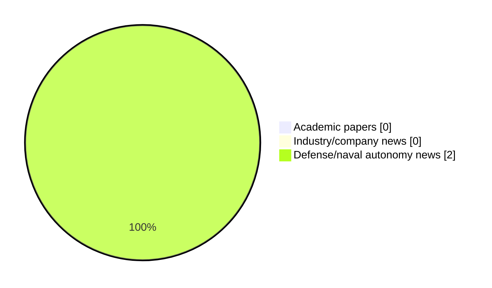

# Maritime Autonomy Watch — 2026-05-17

## Executive Summary

- Total selected items: 2
- Academic papers: 0
- Industry/company news: 0
- Defense/naval autonomy news: 2
- Failed/inaccessible sources: 1

## Contents

- [Analyst Brief](#analyst-brief)
- [Must Read](#must-read)
- [Top Signals Today](#top-signals-today)
- [Topic Signals](#topic-signals)
- [Freshness and Coverage](#freshness-and-coverage)
- [Quality Notes](#quality-notes)
- [Watchlist](#watchlist)
- [Academic Papers](#academic-papers)
- [Industry and Company News](#industry-and-company-news)
- [Defense and Naval Autonomy News](#defense-and-naval-autonomy-news)
- [Source Status Summary](#source-status-summary)

## Analyst Brief

Today's report selected 2 non-duplicate item(s), led by USV operations, defense adoption. The strongest item is [Shield AI expands Hivemind maritime autonomy in Taiwan with Thunder Tiger partnership](https://www.navalnews.com/naval-news/2026/05/shield-ai-expands-hivemind-maritime-autonomy-in-taiwan-with-thunder-tiger-partnership/) from navalnews.com.
Coverage is weighted toward academic research (0), with 0 industry and 2 defense signal(s).

## Must Read

- [Shield AI expands Hivemind maritime autonomy in Taiwan with Thunder Tiger partnership](https://www.navalnews.com/naval-news/2026/05/shield-ai-expands-hivemind-maritime-autonomy-in-taiwan-with-thunder-tiger-partnership/) — Defense signal: USV operations
- [BlackSea Technologies Demonstrates GARC USV Capabilities in Norway](https://www.navalnews.com/naval-news/2026/05/blacksea-technologies-demonstrates-garc-usv-capabilities-in-norway/) — Defense signal: USV operations

## Top Signals Today

- USV operations: 2 selected item(s).
- defense adoption: 1 selected item(s).

## Topic Signals

- USV operations: 2
- defense adoption: 1

## Freshness and Coverage

- Newest selected item date: 2026-05-16
- Oldest selected item date: 2026-05-16
- Active/enabled sources: 4
- Sources with access problems: 3
- Quality flags: 0

## Quality Notes

- No quality flags on selected items.

## Watchlist

- No watchlist items today.

### Category Snapshot

| Category | Selected items |
|---|---:|
| Academic papers | 0 |
| Industry/company news | 0 |
| Defense/naval autonomy news | 2 |

## Academic Papers

_Selected items: 0_

No selected items.

## Industry and Company News

_Selected items: 0_

No selected items.

## Defense and Naval Autonomy News

_Selected items: 2_

### [Shield AI expands Hivemind maritime autonomy in Taiwan with Thunder Tiger partnership](https://www.navalnews.com/naval-news/2026/05/shield-ai-expands-hivemind-maritime-autonomy-in-taiwan-with-thunder-tiger-partnership/)

- Source: navalnews.com
- Date: 2026-05-16
- Relevance score: 10
- Signal: Defense signal: USV operations
- Topic tags: USV operations

**Summary**

Shield AI and Thunder Tiger Corp. announced a memorandum of understanding to integrate Shield AI’s Hivemind autonomy software across Thunder Tiger’s unmanned systems portfolio, beginning with unmanned surface vessels (USV). As a first milestone, Hivemind will serve as the AI pilot on a Thunder Tiger USV, with a live demonstration planned for this summer. This.

**Why it matters**

Signals movement in surface-vessel operations; useful for tracking operational concepts, procurement direction, and fleet integration.

---

### [BlackSea Technologies Demonstrates GARC USV Capabilities in Norway](https://www.navalnews.com/naval-news/2026/05/blacksea-technologies-demonstrates-garc-usv-capabilities-in-norway/)

- Source: navalnews.com
- Date: 2026-05-16
- Relevance score: 6.75
- Signal: Defense signal: USV operations
- Topic tags: USV operations, defense adoption

**Summary**

BlackSea Technologies recently participated in Arctic Sentry 2026, a NATO enhanced vigilance activity in the High North, demonstrating its Global Autonomous Reconnaissance Craft (GARC) in Ramsund, Norway, alongside partners from U.S. 6th Fleet, U.S. Unmanned Surface Vessel Squadron 3 (USVRON-3) and the Royal Norwegian Navy. BlackSea Technologies press release The exercise gave BlackSea’s GARC unmanned.

**Why it matters**

Signals movement in surface-vessel operations, naval adoption; useful for tracking operational concepts, procurement direction, and fleet integration.

---

## Inaccessible or Failed Sources

- arXiv: The read operation timed out

## Source Status Summary

| Source | Status | Notes |
|---|---|---|
| arXiv | failed | The read operation timed out |
| OpenAlex | enabled | API source, 15 items fetched |
| RSS feeds | enabled | 107 RSS items fetched |
| SMI MASG News | enabled | HTML source, 10 items fetched |
| IEEE Xplore | disabled | Missing IEEE_XPLORE_API_KEY |
| Elsevier Scopus | enabled | API source, 15 items fetched |
| NewsAPI | disabled | Missing NEWS_API_KEY |

## Metadata

- Generated at: 2026-05-17T10:17:56.133311+02:00
- Date: 2026-05-17
- Repository: ferhannb/MarineRobotics
- Relevance threshold: 4.0
- Deduplication method: DOI, canonical URL, source ID, normalized title, similar recent titles, category caps, and novelty score
