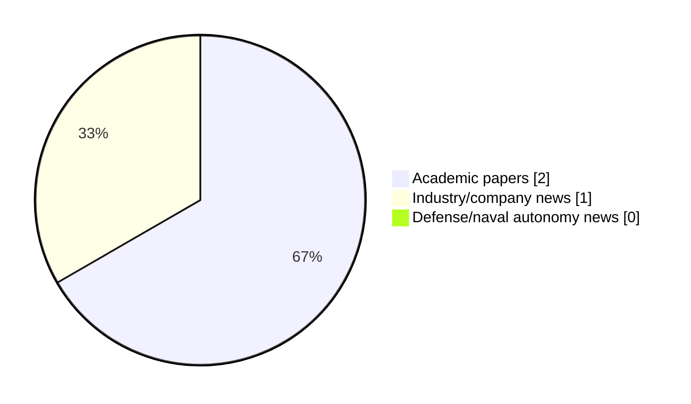

# Maritime Autonomy Watch — 2026-05-19

## Executive Summary

- Total selected items: 3
- Academic papers: 2
- Industry/company news: 1
- Defense/naval autonomy news: 0
- Failed/inaccessible sources: 0

## Contents

- [Analyst Brief](#analyst-brief)
- [Must Read](#must-read)
- [Top Signals Today](#top-signals-today)
- [Topic Signals](#topic-signals)
- [Freshness and Coverage](#freshness-and-coverage)
- [Quality Notes](#quality-notes)
- [Watchlist](#watchlist)
- [Academic Papers](#academic-papers)
- [Industry and Company News](#industry-and-company-news)
- [Defense and Naval Autonomy News](#defense-and-naval-autonomy-news)
- [Source Status Summary](#source-status-summary)

## Analyst Brief

Today's report selected 3 non-duplicate item(s), led by AUV navigation, swarm autonomy, underwater communications. The strongest item is [Task-Semantic Graph-Driven Distributed Agent Networking for Underwater Target Tracking](http://arxiv.org/abs/2605.15528v1) from arXiv.
Coverage is weighted toward academic research (2), with 1 industry and 0 defense signal(s).
Quality caveat: low-score-unique=1.

## Must Read

- [Task-Semantic Graph-Driven Distributed Agent Networking for Underwater Target Tracking](http://arxiv.org/abs/2605.15528v1) — Research signal: AUV navigation
- [Saronic and LR Enter Strategic Partnership to Advance the Safe and Scalable Deployment of Maritime Autonomy](https://oceannews.com/news/milestones/saronic-and-lr-enter-strategic-partnership-to-advance-the-safe-and-scalable-deployment-of-maritime-autonomy/) — Industry signal: general autonomy
- [AoI-MDP: An AoI Optimized Markov Decision Process (Student Abstract)](http://arxiv.org/abs/2605.16777v1) — Research signal: AUV navigation

## Top Signals Today

- AUV navigation: 2 selected item(s).
- swarm autonomy: 2 selected item(s).
- underwater communications: 1 selected item(s).
- planning/control: 1 selected item(s).
- general autonomy: 1 selected item(s).

## Topic Signals

- AUV navigation: 2
- swarm autonomy: 2
- underwater communications: 1
- planning/control: 1
- general autonomy: 1

## Freshness and Coverage

- Newest selected item date: 2026-05-18
- Oldest selected item date: 2026-05-15
- Active/enabled sources: 5
- Sources with access problems: 2
- Quality flags: 1

## Quality Notes

- low-score-unique: 1

## Watchlist

- [AoI-MDP: An AoI Optimized Markov Decision Process (Student Abstract)](http://arxiv.org/abs/2605.16777v1) — low-score-unique

### Category Snapshot

| Category | Selected items |
|---|---:|
| Academic papers | 2 |
| Industry/company news | 1 |
| Defense/naval autonomy news | 0 |

## Academic Papers

_Selected items: 2_

### [Task-Semantic Graph-Driven Distributed Agent Networking for Underwater Target Tracking](http://arxiv.org/abs/2605.15528v1)

- Source: arXiv
- Date: 2026-05-15
- Relevance score: 7
- Authors: Shengchao Zhu, Guangjie Han, Chuan Lin, Yu He
- Signal: Research signal: AUV navigation
- Topic tags: AUV navigation, underwater communications, swarm autonomy, planning/control

**Abstract**

Autonomous underwater vehicle (AUV) swarms are emerging as intelligent underwater networks, where each node must sense, communicate, process local data, and make decisions under severe acoustic constraints. Persistent underwater target tracking is a typical task with moving targets, changing communication topology, intermittent acoustic links, and limited observation for each AUV. Multi-agent reinforcement learning (MARL) is a natural candidate for distributed tracking, yet existing studies still lack a unified open-source platform for evaluating different MARL algorithms under six-degree-of-freedom AUV dynamics. In addition, policies trained with raw geometric states and low-level force actions often struggle to represent task phases, observation reliability, link quality, and local cooperation roles.

**Why it matters**

Relevant to underwater autonomy, multi-vehicle coordination; the work may inform maritime autonomy research, testing priorities, or system design.

---

### [AoI-MDP: An AoI Optimized Markov Decision Process (Student Abstract)](http://arxiv.org/abs/2605.16777v1)

- Source: arXiv
- Date: 2026-05-16
- Relevance score: 3.5
- Authors: Yimian Ding, Jingzehua Xu, Yiyuan Yang, Guanwen Xie, Xinqi Wang, Shuai Zhang
- Signal: Research signal: AUV navigation
- Topic tags: AUV navigation, swarm autonomy
- Quality flags: low-score-unique

**Abstract**

Ocean exploration places high demands on autonomous underwater vehicles, especially when there's observation delay. We propose age of information optimized Markov decision process (AoI-MDP) to enhance underwater tasks by modeling observation delay as signal delay and including it in the state space. AoI-MDP also introduces wait time in the action space and integrates AoI with reward functions, optimizing information freshness and decision-making using reinforcement learning. Simulations show AoI-MDP outperforms the standard MDP, demonstrating superior performance, feasibility, and generalization in underwater tasks. To accelerate relevant research, we have made the codes available as open-source at https://github.com/Xiboxtg/AoI-MDP.

**Why it matters**

Relevant to underwater autonomy, multi-vehicle coordination; the work may inform maritime autonomy research, testing priorities, or system design.

---

## Industry and Company News

_Selected items: 1_

### [Saronic and LR Enter Strategic Partnership to Advance the Safe and Scalable Deployment of Maritime Autonomy](https://oceannews.com/news/milestones/saronic-and-lr-enter-strategic-partnership-to-advance-the-safe-and-scalable-deployment-of-maritime-autonomy/)

- Source: oceannews.com
- Date: 2026-05-18
- Relevance score: 5
- Signal: Industry signal: general autonomy
- Topic tags: general autonomy

**Summary**

Saronic announced a strategic partnership with Lloyd’s Register (LR), a leading provider of classification and compliance services for the marine and offshore industries. This collaboration brings together Saronic’s expertise in proven autonomous maritime systems and LR’s authority in maritime standards and certifications to advance the safe, scaled deployment of maritime autonomy in the United Kingdom, Europe, and Australia.

**Why it matters**

This item may signal product, market, or deployment momentum in maritime autonomy.

---

## Defense and Naval Autonomy News

_Selected items: 0_

No selected items.

## Inaccessible or Failed Sources

- None

## Source Status Summary

| Source | Status | Notes |
|---|---|---|
| arXiv | enabled | API source, 15 items fetched |
| OpenAlex | enabled | API source, 15 items fetched |
| RSS feeds | enabled | 107 RSS items fetched |
| SMI MASG News | enabled | HTML source, 10 items fetched |
| IEEE Xplore | disabled | Missing IEEE_XPLORE_API_KEY |
| Elsevier Scopus | enabled | API source, 15 items fetched |
| NewsAPI | disabled | Missing NEWS_API_KEY |

## Metadata

- Generated at: 2026-05-19T11:38:06.411289+02:00
- Date: 2026-05-19
- Repository: ferhannb/MarineRobotics
- Relevance threshold: 4.0
- Deduplication method: DOI, canonical URL, source ID, normalized title, similar recent titles, category caps, and novelty score
