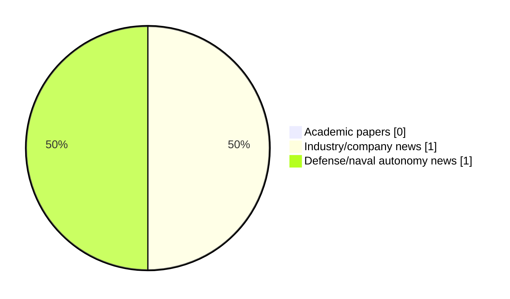

# Maritime Autonomy Watch — 2026-05-22

## Executive Summary

- Total selected items: 2
- Academic papers: 0
- Industry/company news: 1
- Defense/naval autonomy news: 1
- Failed/inaccessible sources: 0

## Contents

- [Analyst Brief](#analyst-brief)
- [Must Read](#must-read)
- [Top Signals Today](#top-signals-today)
- [Topic Signals](#topic-signals)
- [Freshness and Coverage](#freshness-and-coverage)
- [Quality Notes](#quality-notes)
- [Watchlist](#watchlist)
- [Academic Papers](#academic-papers)
- [Industry and Company News](#industry-and-company-news)
- [Defense and Naval Autonomy News](#defense-and-naval-autonomy-news)
- [Source Status Summary](#source-status-summary)

## Analyst Brief

Today's report selected 2 non-duplicate item(s), led by USV operations. The strongest item is [Saildrone Deploys Autonomous USV Fleet for Coast Guard Border Security](https://www.oceansciencetechnology.com/news/saildrone-deploys-autonomous-usv-fleet-for-coast-guard-border-security/) from oceansciencetechnology.com.
Coverage is weighted toward academic research (0), with 1 industry and 1 defense signal(s).

## Must Read

- [Saildrone Deploys Autonomous USV Fleet for Coast Guard Border Security](https://www.oceansciencetechnology.com/news/saildrone-deploys-autonomous-usv-fleet-for-coast-guard-border-security/) — Defense signal: USV operations
- [Saildrone Launches 2026 Hurricane Mission to Support NOAA Rapid Intensification Research](https://oceannews.com/news/science-technology/saildrone-launches-2026-hurricane-mission-to-support-noaa-rapid-intensification-research/) — Industry signal: USV operations

## Top Signals Today

- USV operations: 2 selected item(s).

## Topic Signals

- USV operations: 2

## Freshness and Coverage

- Newest selected item date: 2026-05-21
- Oldest selected item date: 2026-05-19
- Active/enabled sources: 5
- Sources with access problems: 2
- Quality flags: 0

## Quality Notes

- No quality flags on selected items.

## Watchlist

- No watchlist items today.

### Category Snapshot

| Category | Selected items |
|---|---:|
| Academic papers | 0 |
| Industry/company news | 1 |
| Defense/naval autonomy news | 1 |

## Academic Papers

_Selected items: 0_

No selected items.

## Industry and Company News

_Selected items: 1_

### [Saildrone Launches 2026 Hurricane Mission to Support NOAA Rapid Intensification Research](https://oceannews.com/news/science-technology/saildrone-launches-2026-hurricane-mission-to-support-noaa-rapid-intensification-research/)

- Source: oceannews.com
- Date: 2026-05-21
- Relevance score: 7.25
- Signal: Industry signal: USV operations
- Topic tags: USV operations

**Summary**

Saildrone has announced it will deploy 10 Saildrone Explorer unmanned surface vehicles (USVs) during the 2026 hurricane season to support the National Oceanic and Atmospheric Administration (NOAA) in its mission to forecast hurricanes, protect lives and property, and safeguard national and economic security.

**Why it matters**

Signals momentum in surface-vessel operations; useful for tracking product direction, partnerships, and deployment opportunities.

---

## Defense and Naval Autonomy News

_Selected items: 1_

### [Saildrone Deploys Autonomous USV Fleet for Coast Guard Border Security](https://www.oceansciencetechnology.com/news/saildrone-deploys-autonomous-usv-fleet-for-coast-guard-border-security/)

- Source: oceansciencetechnology.com
- Date: 2026-05-19
- Relevance score: 10
- Signal: Defense signal: USV operations
- Topic tags: USV operations

**Summary**

Saildrone is deploying a fleet of 16 Unmanned Surface Vehicles (USVs) across the Great Lakes and Northeast coast to enhance.

**Why it matters**

Signals movement in surface-vessel operations; useful for tracking operational concepts, procurement direction, and fleet integration.

---

## Inaccessible or Failed Sources

- None

## Source Status Summary

| Source | Status | Notes |
|---|---|---|
| arXiv | enabled | API source, 15 items fetched |
| OpenAlex | enabled | API source, 15 items fetched |
| RSS feeds | enabled | 107 RSS items fetched |
| SMI MASG News | enabled | HTML source, 10 items fetched |
| IEEE Xplore | disabled | Missing IEEE_XPLORE_API_KEY |
| Elsevier Scopus | enabled | API source, 15 items fetched |
| NewsAPI | disabled | Missing NEWS_API_KEY |

## Metadata

- Generated at: 2026-05-22T10:57:20.017581+02:00
- Date: 2026-05-22
- Repository: ferhannb/MarineRobotics
- Relevance threshold: 4.0
- Deduplication method: DOI, canonical URL, source ID, normalized title, similar recent titles, category caps, and novelty score
