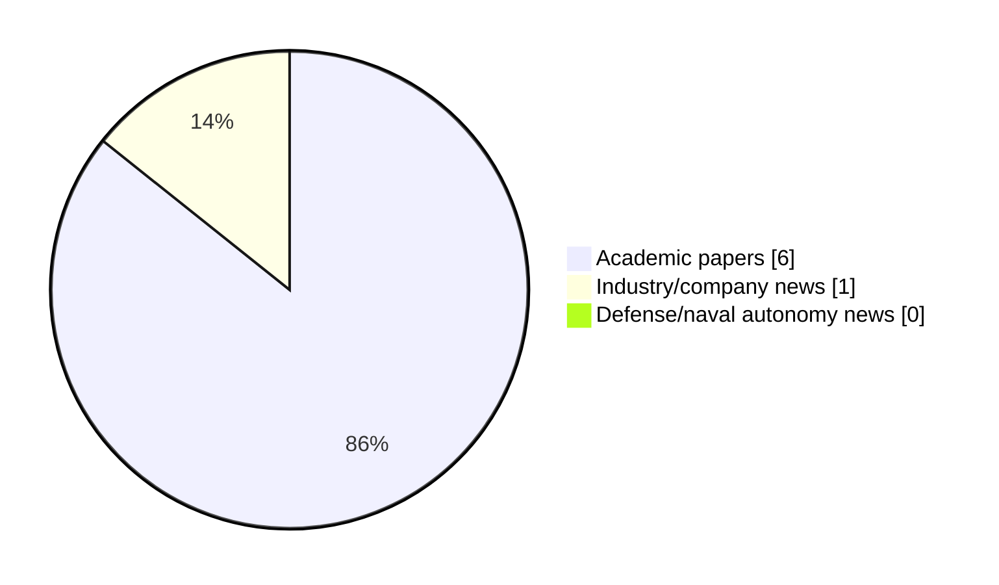

# Maritime Autonomy Watch — 2026-05-23

## Executive Summary

- Total selected items: 7
- Academic papers: 6
- Industry/company news: 1
- Defense/naval autonomy news: 0
- Failed/inaccessible sources: 0

## Contents

- [Analyst Brief](#analyst-brief)
- [Must Read](#must-read)
- [Top Signals Today](#top-signals-today)
- [Topic Signals](#topic-signals)
- [Freshness and Coverage](#freshness-and-coverage)
- [Quality Notes](#quality-notes)
- [Watchlist](#watchlist)
- [Academic Papers](#academic-papers)
- [Industry and Company News](#industry-and-company-news)
- [Defense and Naval Autonomy News](#defense-and-naval-autonomy-news)
- [Source Status Summary](#source-status-summary)

## Analyst Brief

Today's report selected 7 non-duplicate item(s), led by perception, planning/control, AUV navigation. The strongest item is [LASSA Architecture-Based Autonomous Fault-Tolerant Control of Unmanned Underwater Vehicles](http://arxiv.org/abs/2605.09494v1) from arXiv.
Coverage is weighted toward academic research (6), with 1 industry and 0 defense signal(s).
Quality caveat: low-score-unique=1.

## Must Read

- [LASSA Architecture-Based Autonomous Fault-Tolerant Control of Unmanned Underwater Vehicles](http://arxiv.org/abs/2605.09494v1) — Research signal: perception
- [HDAO: A Hierarchical Curiosity-Driven Reinforcement Learning Approach for AUV Dynamic Obstacle Avoidance](https://doi.org/10.3390/jmse14080720) — Research signal: AUV navigation
- [Moniagenttinen vahvistusoppiminen autonomisten miehittämättömien pinta-alusten kohteen etsintä- ja torjuntatehtävissä](https://openalex.org/W7161919734) — Research signal: USV operations
- [AI-Aided Advancements in Autonomous Underwater Vehicle Navigation](http://arxiv.org/abs/2605.04672v1) — Research signal: AUV navigation
- [A Lightweight Toggleable Adhesion Prototype for Multirotor UAV Landing on Tilting Platforms](https://openalex.org/W7158422861) — Research signal: USV operations

## Top Signals Today

- perception: 5 selected item(s).
- planning/control: 5 selected item(s).
- AUV navigation: 3 selected item(s).
- USV operations: 3 selected item(s).
- swarm autonomy: 2 selected item(s).

## Topic Signals

- perception: 5
- planning/control: 5
- AUV navigation: 3
- USV operations: 3
- swarm autonomy: 2
- defense adoption: 1

## Freshness and Coverage

- Newest selected item date: 2026-05-22
- Oldest selected item date: 2026-04-14
- Active/enabled sources: 5
- Sources with access problems: 2
- Quality flags: 1

## Quality Notes

- low-score-unique: 1

## Watchlist

- [Autonomous Robotic System Maps Threatened Coral Reef Hotspots](https://www.oceansciencetechnology.com/news/autonomous-robotic-system-maps-threatened-coral-reef-hotspots/) — low-score-unique

### Category Snapshot

| Category | Selected items |
|---|---:|
| Academic papers | 6 |
| Industry/company news | 1 |
| Defense/naval autonomy news | 0 |

## Academic Papers

_Selected items: 6_

### [LASSA Architecture-Based Autonomous Fault-Tolerant Control of Unmanned Underwater Vehicles](http://arxiv.org/abs/2605.09494v1)

- Source: arXiv
- Date: 2026-05-10
- Relevance score: 10
- Authors: Hong Chen, Zixiang Tang, Yuanbao Chen, Yu Liu
- Signal: Research signal: perception
- Topic tags: perception, planning/control

**Abstract**

Unmanned underwater vehicles (UUVs) operate persistently in communication-constrained environments, thus requiring high-level autonomous fault-tolerant control under faulty operating conditions. Existing approaches rely heavily on predefined hard-coded rules and struggle to achieve effective fault-tolerant control against unforeseen faults. Although large language models (LLMs) possess powerful cognitive and reasoning capabilities, their inherent hallucinations remain a major obstacle to their application in UUV control systems. This paper proposes an intelligent control method based on the LASSA (LLM-based Agent with Solver, Sensor and Actuator) architecture.

**Why it matters**

Relevant to underwater autonomy, planning and control; the work may inform maritime autonomy research, testing priorities, or system design.

---

### [HDAO: A Hierarchical Curiosity-Driven Reinforcement Learning Approach for AUV Dynamic Obstacle Avoidance](https://doi.org/10.3390/jmse14080720)

- Source: OpenAlex
- Date: 2026-04-14
- Relevance score: 10
- Authors: 杜华争, Qian Liu, Xu Liu, Na Xia
- DOI: 10.3390/jmse14080720
- Signal: Research signal: AUV navigation
- Topic tags: AUV navigation, perception, planning/control

**Abstract**

Autonomous obstacle avoidance is a critical capability for Autonomous Underwater Vehicles (AUVs) to operate safely in dynamic and uncertain marine environments. Traditional AUV control methods rely on precise physical modeling and preset rules, yet they struggle to adapt to multiple sources of uncertainty, such as random initial states, dynamic obstacles, and varying currents. In recent years, deep reinforcement learning has provided a new avenue for data-driven adaptive policy learning. However, it remains insufficient for handling long-horizon tasks with sparse rewards. While hierarchical reinforcement learning can mitigate reward sparsity through temporal abstraction, it often faces challenges including exploration–exploitation imbalance, slow global convergence, and insufficient safety guarantees.

**Why it matters**

Relevant to underwater autonomy, navigation safety, planning and control; the work may inform maritime autonomy research, testing priorities, or system design.

---

### [Moniagenttinen vahvistusoppiminen autonomisten miehittämättömien pinta-alusten kohteen etsintä- ja torjuntatehtävissä](https://openalex.org/W7161919734)

- Source: OpenAlex
- Date: 2026-04-23
- Relevance score: 9.5
- Authors: Niki Leskinen
- Signal: Research signal: USV operations
- Topic tags: USV operations, swarm autonomy, planning/control, defense adoption

**Abstract**

Unmanned surface vehicles (USVs) have become prominent in naval warfare during the Russo-Ukrainian war. USVs can be operated remotely or with different levels of autonomy, either individually or as part of a swarm. A swarm can be described as a decentralized group that acts in coordination. Advances in machine learning (ML) and more powerful onboard computing for ML inference enable greater autonomy and more advanced swarming behavior for USVs. One approach for enabling autonomous swarming behavior is multi-agent reinforcement learning (MARL). MARL is a sub-area of ML in which multiple agents learn through trial and error to choose actions that maximize rewards provided by the environment. It has been widely applied in robotics and has been explored for the control of USVs.

**Why it matters**

Relevant to surface-vessel operations, multi-vehicle coordination, naval adoption; the work may inform maritime autonomy research, testing priorities, or system design.

---

### [AI-Aided Advancements in Autonomous Underwater Vehicle Navigation](http://arxiv.org/abs/2605.04672v1)

- Source: arXiv
- Date: 2026-05-06
- Relevance score: 9.25
- Authors: Guy Damari, Zeev Yampolsky, Nadav Cohen, Arup Kumar Sahoo, Jeryes Danial, Felipe O. Silva, Itzik Klein
- Signal: Research signal: AUV navigation
- Topic tags: AUV navigation, perception

**Abstract**

Autonomous underwater vehicles (AUVs) have become indispensable for deep-sea exploration, spanning critical scientific research and commercial applications. The rapid attenuation of electromagnetic waves renders satellite radio signals unavailable, while the dynamic unpredictability of the marine environment presents formidable navigation challenges. This chapter explores recent advancements in AI-aided AUV positioning, specifically focusing on advanced sensor fusion architectures that integrate inertial navigation systems with Doppler velocity logs and cameras. Beyond traditional model-based filtering, we examine the transformative emergence of AI-driven learning approaches in enhancing inertial dead-reckoning tasks and adaptive fusion algorithms. By addressing these recent milestones, this chapter provides a comprehensive roadmap for achieving the high-precision navigation essential for autonomous underwater missions.

**Why it matters**

Relevant to underwater autonomy; the work may inform maritime autonomy research, testing priorities, or system design.

---

### [A Lightweight Toggleable Adhesion Prototype for Multirotor UAV Landing on Tilting Platforms](https://openalex.org/W7158422861)

- Source: OpenAlex
- Date: 2026-04-24
- Relevance score: 6.75
- Authors: Teighin Nordholt, Melissa Greeff
- Signal: Research signal: USV operations
- Topic tags: USV operations, planning/control

**Abstract**

Autonomous multirotor landings on uncrewed surface vessels (USVs) are critical for persistent maritime operations but remain challenging due to wave-induced tilt, wind disturbances, and limited landing area. Many existing approaches exhibit small pose tolerance for reliable landing. This paper presents a lightweight toggleable adhesion mechanism to improve landing reliability. The system uses a motor-driven corkscrew that engages hook-and-loop material on the landing surface, enabling active adhesion during landing and controlled release during takeoff. We evaluate a prototype using a modified Crazyflie 2.0 and a custom tilting platform at fixed angles representative of extreme wave conditions. Using only a simple vertical PID controller, the proposed approach increases landing success from an average of 40% (baseline) to 80% across platform tilts up to 43 degrees using appropriately selected actuation settings.

**Why it matters**

Relevant to surface-vessel operations; the work may inform maritime autonomy research, testing priorities, or system design.

---

### [Multi-Step Gaussian Process Propagation for Adaptive Path Planning](http://arxiv.org/abs/2604.19148v1)

- Source: arXiv
- Date: 2026-04-21
- Relevance score: 5
- Authors: Alex Beaudin, Bjørn Andreas Kristiansen, Kristoffer Gryte, Corrado Chiatante, Morten Omholt Alver, Murat Arcak, Tor Arne Johansen
- Signal: Research signal: USV operations
- Topic tags: USV operations, swarm autonomy, perception, planning/control

**Abstract**

Efficient and robust path planning hinges on combining all accessible information sources. In particular, the task of path planning for robotic environmental exploration and monitoring depends highly on the current belief of the world. To capture the uncertainty in the belief, we present a Gaussian process based path planning method that adapts to multi-modal environmental sensing data and incorporates state and input constraints. To solve the path planning problem, we optimize over future waypoints in a receding horizon fashion, and our cost is thus a function of the Gaussian process posterior over all these waypoints. We demonstrate this method, dubbed OLAhGP, on an autonomous surface vessel using oceanic algal bloom data from both a high-fidelity model and in-situ sensing data in a monitoring scenario. Our simulated and experimental results demonstrate significant improvement over existing methods.

**Why it matters**

Relevant to surface-vessel operations, multi-vehicle coordination, planning and control; the work may inform maritime autonomy research, testing priorities, or system design.

---

## Industry and Company News

_Selected items: 1_

### [Autonomous Robotic System Maps Threatened Coral Reef Hotspots](https://www.oceansciencetechnology.com/news/autonomous-robotic-system-maps-threatened-coral-reef-hotspots/)

- Source: oceansciencetechnology.com
- Date: 2026-05-22
- Relevance score: 3
- Signal: Industry signal: AUV navigation
- Topic tags: AUV navigation, perception
- Quality flags: low-score-unique

**Summary**

Researchers at the Woods Hole Oceanographic Institution (WHOI) have developed an autonomous underwater robotic system that combines real-time audio and visual data to identify and map coral reef biodiversity hotspots with unprecedented precision. Equipped with cameras, hydrophones, and onboard AI-powered computing, the robot can autonomously detect areas of intense marine activity, track sentinel species, and navigate toward biological sound sources.

**Why it matters**

Signals momentum in underwater autonomy; useful for tracking product direction, partnerships, and deployment opportunities.

---

## Defense and Naval Autonomy News

_Selected items: 0_

No selected items.

## Inaccessible or Failed Sources

- None

## Source Status Summary

| Source | Status | Notes |
|---|---|---|
| arXiv | enabled | API source, 15 items fetched |
| OpenAlex | enabled | API source, 15 items fetched |
| RSS feeds | enabled | 107 RSS items fetched |
| SMI MASG News | enabled | HTML source, 10 items fetched |
| IEEE Xplore | disabled | Missing IEEE_XPLORE_API_KEY |
| Elsevier Scopus | enabled | API source, 15 items fetched |
| NewsAPI | disabled | Missing NEWS_API_KEY |

## Metadata

- Generated at: 2026-05-23T10:14:23.455532+02:00
- Date: 2026-05-23
- Repository: ferhannb/MarineRobotics
- Relevance threshold: 4.0
- Deduplication method: DOI, canonical URL, source ID, normalized title, similar recent titles, category caps, and novelty score
