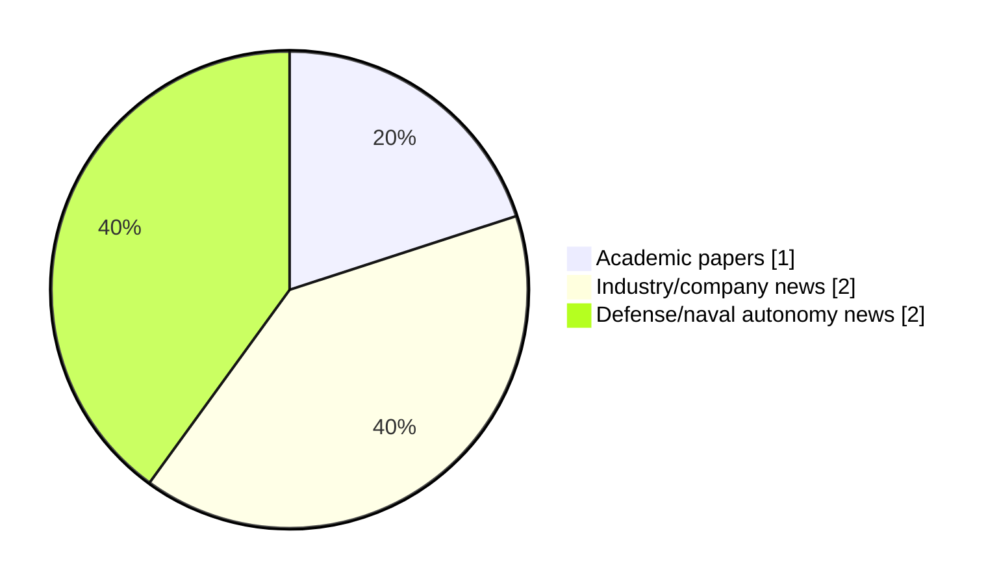

# Maritime Autonomy Watch — 2026-05-27

## Executive Summary

- Total selected items: 5
- Academic papers: 1
- Industry/company news: 2
- Defense/naval autonomy news: 2
- Failed/inaccessible sources: 0

## Contents

- [Analyst Brief](#analyst-brief)
- [Must Read](#must-read)
- [Top Signals Today](#top-signals-today)
- [Topic Signals](#topic-signals)
- [Freshness and Coverage](#freshness-and-coverage)
- [Quality Notes](#quality-notes)
- [Watchlist](#watchlist)
- [Academic Papers](#academic-papers)
- [Industry and Company News](#industry-and-company-news)
- [Defense and Naval Autonomy News](#defense-and-naval-autonomy-news)
- [Source Status Summary](#source-status-summary)

## Analyst Brief

Today's report selected 5 non-duplicate item(s), led by USV operations, swarm autonomy, defense adoption. The strongest item is [Trust, Geometry, and Rules: A Credibility-Aware Reinforcement Learning Framework for Safe USV Navigation under Uncertainty](http://arxiv.org/abs/2605.26974v1) from arXiv.
Coverage is weighted toward academic research (1), with 2 industry and 2 defense signal(s).
Quality caveat: low-score-unique=1.

## Must Read

- [Trust, Geometry, and Rules: A Credibility-Aware Reinforcement Learning Framework for Safe USV Navigation under Uncertainty](http://arxiv.org/abs/2605.26974v1) — Research signal: USV operations
- [Cellula Robotics and Integer Technologies Partner to Advance Adaptive Mission Assurance for Long-Range Multi-Vehicle Undersea Operations](https://oceannews.com/news/milestones/cellula-robotics-and-integer-technologies-partner-to-advance-adaptive-mission-assurance-for-long-range-multi-vehicle-undersea-operations/) — Industry signal: swarm autonomy
- [Hyperion Systems to Build the First 3D Printed Uncrewed Surface Vessel in the Southern Hemisphere](https://oceannews.com/news/science-technology/hyperion-systems-to-build-the-first-3d-printed-uncrewed-surface-vessel-in-the-southern-hemisphere/) — Industry signal: USV operations
- [L3Harris Delivering Clandestine Submarine-Launched AUVs to the U.S. Navy](https://www.navalnews.com/event-news/sea-air-space-2026/2026/05/l3harris-delivering-clandestine-submarine-launched-auvs-to-the-u-s-navy/) — Defense signal: AUV navigation
- [ZeroUSV Showcases Autonomous Maritime Capabilities to Defense Officials](https://www.oceansciencetechnology.com/news/zerousv-showcases-autonomous-maritime-capabilities-to-defense-officials/) — Defense signal: USV operations

## Top Signals Today

- USV operations: 3 selected item(s).
- swarm autonomy: 2 selected item(s).
- defense adoption: 2 selected item(s).
- perception: 1 selected item(s).
- planning/control: 1 selected item(s).

## Topic Signals

- USV operations: 3
- swarm autonomy: 2
- defense adoption: 2
- perception: 1
- planning/control: 1
- AUV navigation: 1

## Freshness and Coverage

- Newest selected item date: 2026-05-27
- Oldest selected item date: 2026-05-26
- Active/enabled sources: 5
- Sources with access problems: 2
- Quality flags: 1

## Quality Notes

- low-score-unique: 1

## Watchlist

- [ZeroUSV Showcases Autonomous Maritime Capabilities to Defense Officials](https://www.oceansciencetechnology.com/news/zerousv-showcases-autonomous-maritime-capabilities-to-defense-officials/) — low-score-unique

### Category Snapshot

| Category | Selected items |
|---|---:|
| Academic papers | 1 |
| Industry/company news | 2 |
| Defense/naval autonomy news | 2 |

## Academic Papers

_Selected items: 1_

### [Trust, Geometry, and Rules: A Credibility-Aware Reinforcement Learning Framework for Safe USV Navigation under Uncertainty](http://arxiv.org/abs/2605.26974v1)

- Source: arXiv
- Date: 2026-05-26
- Relevance score: 10
- Authors: Yuhang Zhang, Shuqi Chai, Yukang Zhang, Liusha Yang, Mingchuan Zhang, Wei Wang, Qingjiang Shi, Quanbo Ge
- Signal: Research signal: USV operations
- Topic tags: USV operations, swarm autonomy, perception

**Abstract**

Autonomous navigation of Unmanned Surface Vehicles (USVs) that is safe and compliant with the International Regulations for Preventing Collisions at Sea (COLREGs) remains a formidable challenge in dynamic maritime environments, particularly when perception systems exhibit miscalibrated uncertainty. Existing Reinforcement Learning (RL)-based methods often falter because state-estimation errors induce unreliable belief states that mislead the value function, while discrete traffic rules introduce discontinuity in the learning objective. To address these challenges, we propose a framework integrating credibility-aware learning, geometric safety shielding, and continuous rule-aware embedding.

**Why it matters**

Relevant to surface-vessel operations, multi-vehicle coordination, navigation safety; the work may inform maritime autonomy research, testing priorities, or system design.

---

## Industry and Company News

_Selected items: 2_

### [Cellula Robotics and Integer Technologies Partner to Advance Adaptive Mission Assurance for Long-Range Multi-Vehicle Undersea Operations](https://oceannews.com/news/milestones/cellula-robotics-and-integer-technologies-partner-to-advance-adaptive-mission-assurance-for-long-range-multi-vehicle-undersea-operations/)

- Source: oceannews.com
- Date: 2026-05-26
- Relevance score: 9.25
- Signal: Industry signal: swarm autonomy
- Topic tags: swarm autonomy, planning/control

**Summary**

Cellula Robotics, a global leader in long-range, long-duration autonomous undersea vehicles, has announced the signing of a memorandum of understanding (MOU) with Integer Technologies, a leading provider of mission assurance and reliability software for maritime operations. The agreement establishes a cooperative framework to layer Integer’s DIGIT COMMAND operator software with Cellula’s mission control software for its advanced unmanned underwater vehicle (UUV) platforms, enhancing mission reliability for...

**Why it matters**

Signals momentum in underwater autonomy; useful for tracking product direction, partnerships, and deployment opportunities.

---

### [Hyperion Systems to Build the First 3D Printed Uncrewed Surface Vessel in the Southern Hemisphere](https://oceannews.com/news/science-technology/hyperion-systems-to-build-the-first-3d-printed-uncrewed-surface-vessel-in-the-southern-hemisphere/)

- Source: oceannews.com
- Date: 2026-05-26
- Relevance score: 6.75
- Signal: Industry signal: USV operations
- Topic tags: USV operations

**Summary**

Hyperion Systems has unveiled the southern hemisphere’s first 3D printed uncrewed surface vessel (USV), marking a major milestone for advanced manufacturing and autonomous maritime capability in Western Australia (WA).

**Why it matters**

Signals momentum in surface-vessel operations; useful for tracking product direction, partnerships, and deployment opportunities.

---

## Defense and Naval Autonomy News

_Selected items: 2_

### [L3Harris Delivering Clandestine Submarine-Launched AUVs to the U.S. Navy](https://www.navalnews.com/event-news/sea-air-space-2026/2026/05/l3harris-delivering-clandestine-submarine-launched-auvs-to-the-u-s-navy/)

- Source: navalnews.com
- Date: 2026-05-27
- Relevance score: 6.5
- Signal: Defense signal: AUV navigation
- Topic tags: AUV navigation, defense adoption

**Summary**

NATIONAL HARBOR, MD — L3Harris is pushing forward with production of its Iver4 900 autonomous undersea vehicle (AUV) under a previously unknown Defense Innovation Unit effort that is looking to deliver a torpedo tube launch and recovery (TTL&R) autonomous drone to the U.S. Navy’s attack submarine fleet. The AUV will be delivered across multiple classes.

**Why it matters**

Signals movement in underwater autonomy, naval adoption; useful for tracking operational concepts, procurement direction, and fleet integration.

---

### [ZeroUSV Showcases Autonomous Maritime Capabilities to Defense Officials](https://www.oceansciencetechnology.com/news/zerousv-showcases-autonomous-maritime-capabilities-to-defense-officials/)

- Source: oceansciencetechnology.com
- Date: 2026-05-27
- Relevance score: 3.5
- Signal: Defense signal: USV operations
- Topic tags: USV operations, defense adoption
- Quality flags: low-score-unique

**Summary**

ZeroUSV recently hosted representatives from the Royal Navy, MOD, and NSO (National Shipbuilding Office) for a VIP tour showcasing the.

**Why it matters**

Signals movement in naval adoption; useful for tracking operational concepts, procurement direction, and fleet integration.

---

## Inaccessible or Failed Sources

- None

## Source Status Summary

| Source | Status | Notes |
|---|---|---|
| arXiv | enabled | API source, 15 items fetched |
| OpenAlex | enabled | API source, 15 items fetched |
| RSS feeds | enabled | 107 RSS items fetched |
| SMI MASG News | enabled | HTML source, 10 items fetched |
| IEEE Xplore | disabled | Missing IEEE_XPLORE_API_KEY |
| Elsevier Scopus | enabled | API source, 15 items fetched |
| NewsAPI | disabled | Missing NEWS_API_KEY |

## Metadata

- Generated at: 2026-05-27T11:40:30.349957+02:00
- Date: 2026-05-27
- Repository: ferhannb/MarineRobotics
- Relevance threshold: 4.0
- Deduplication method: DOI, canonical URL, source ID, normalized title, similar recent titles, category caps, and novelty score
