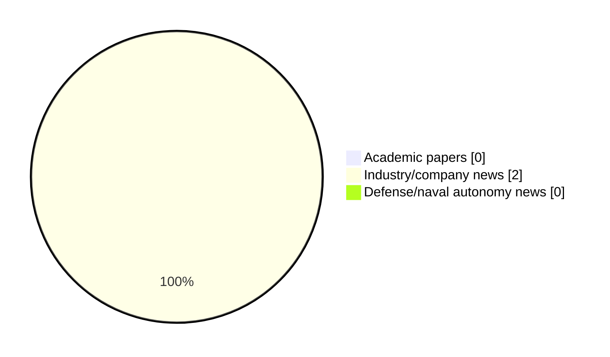

# Maritime Autonomy Watch — 2026-05-29

## Executive Summary

- Total selected items: 2
- Academic papers: 0
- Industry/company news: 2
- Defense/naval autonomy news: 0
- Failed/inaccessible sources: 1

## Contents

- [Analyst Brief](#analyst-brief)
- [Must Read](#must-read)
- [Top Signals Today](#top-signals-today)
- [Topic Signals](#topic-signals)
- [Freshness and Coverage](#freshness-and-coverage)
- [Quality Notes](#quality-notes)
- [Watchlist](#watchlist)
- [Academic Papers](#academic-papers)
- [Industry and Company News](#industry-and-company-news)
- [Defense and Naval Autonomy News](#defense-and-naval-autonomy-news)
- [Source Status Summary](#source-status-summary)

## Analyst Brief

Today's report selected 2 non-duplicate item(s), led by USV operations, critical infrastructure, perception. The strongest item is [Production Commences for Upgraded Autonomous Surface Vessel](https://www.oceansciencetechnology.com/news/production-commences-for-upgraded-autonomous-surface-vessel/) from oceansciencetechnology.com.
Coverage is weighted toward academic research (0), with 2 industry and 0 defense signal(s).

## Must Read

- [Production Commences for Upgraded Autonomous Surface Vessel](https://www.oceansciencetechnology.com/news/production-commences-for-upgraded-autonomous-surface-vessel/) — Industry signal: USV operations
- [Tocaro Blue & Furuno Collaborate to Advance Maritime Radar Perception](https://www.oceansciencetechnology.com/news/tocaro-blue-furuno-collaborate-to-advance-maritime-radar-perception/) — Industry signal: USV operations

## Top Signals Today

- USV operations: 2 selected item(s).
- critical infrastructure: 1 selected item(s).
- perception: 1 selected item(s).

## Topic Signals

- USV operations: 2
- critical infrastructure: 1
- perception: 1

## Freshness and Coverage

- Newest selected item date: 2026-05-29
- Oldest selected item date: 2026-05-28
- Active/enabled sources: 4
- Sources with access problems: 3
- Quality flags: 0

## Quality Notes

- No quality flags on selected items.

## Watchlist

- No watchlist items today.

### Category Snapshot

| Category | Selected items |
|---|---:|
| Academic papers | 0 |
| Industry/company news | 2 |
| Defense/naval autonomy news | 0 |

## Academic Papers

_Selected items: 0_

No selected items.

## Industry and Company News

_Selected items: 2_

### [Production Commences for Upgraded Autonomous Surface Vessel](https://www.oceansciencetechnology.com/news/production-commences-for-upgraded-autonomous-surface-vessel/)

- Source: oceansciencetechnology.com
- Date: 2026-05-28
- Relevance score: 9.5
- Signal: Industry signal: USV operations
- Topic tags: USV operations, critical infrastructure

**Summary**

Maritime technology developer SubSea Craft has transitioned its upgraded MARS Unmanned Surface Vessel (USV) into the production phase following a.

**Why it matters**

Signals momentum in surface-vessel operations; useful for tracking product direction, partnerships, and deployment opportunities.

---

### [Tocaro Blue & Furuno Collaborate to Advance Maritime Radar Perception](https://www.oceansciencetechnology.com/news/tocaro-blue-furuno-collaborate-to-advance-maritime-radar-perception/)

- Source: oceansciencetechnology.com
- Date: 2026-05-29
- Relevance score: 6.75
- Signal: Industry signal: USV operations
- Topic tags: USV operations, perception

**Summary**

Tocaro Blue has formed a collaboration with Furuno USA to advance radar perception capabilities for Unmanned Surface Vessels (USVs) and.

**Why it matters**

Signals momentum in surface-vessel operations; useful for tracking product direction, partnerships, and deployment opportunities.

---

## Defense and Naval Autonomy News

_Selected items: 0_

No selected items.

## Inaccessible or Failed Sources

- arXiv: HTTP 429 for https://export.arxiv.org/api/query?search_query=all%3A%22maritime+autonomy%22+OR+all%3A%22marine+robotics%22+OR+all%3A%22autonomous+vessel%22+OR+all%3A%22autonomous+mission%22+OR+all%3A%22autonomous+surface+vessel%22+OR+all%3A%22autonomous+underwater+vehicle%22+OR+all%3A%22unmanned+surface+vehicle%22+OR+all%3A%22unmanned+underwater+vehicle%22&start=0&max_results=15&sortBy=submittedDate&sortOrder=descending

## Source Status Summary

| Source | Status | Notes |
|---|---|---|
| arXiv | failed | HTTP 429 for https://export.arxiv.org/api/query?search_query=all%3A%22maritime+autonomy%22+OR+all%3A%22marine+robotics%22+OR+all%3A%22autonomous+vessel%22+OR+all%3A%22autonomous+mission%22+OR+all%3A%22autonomous+surface+vessel%22+OR+all%3A%22autonomous+underwater+vehicle%22+OR+all%3A%22unmanned+surface+vehicle%22+OR+all%3A%22unmanned+underwater+vehicle%22&start=0&max_results=15&sortBy=submittedDate&sortOrder=descending |
| OpenAlex | enabled | API source, 15 items fetched |
| RSS feeds | enabled | 107 RSS items fetched |
| SMI MASG News | enabled | HTML source, 10 items fetched |
| IEEE Xplore | disabled | Missing IEEE_XPLORE_API_KEY |
| Elsevier Scopus | enabled | API source, 15 items fetched |
| NewsAPI | disabled | Missing NEWS_API_KEY |

## Metadata

- Generated at: 2026-05-29T11:48:26.652495+02:00
- Date: 2026-05-29
- Repository: ferhannb/MarineRobotics
- Relevance threshold: 4.0
- Deduplication method: DOI, canonical URL, source ID, normalized title, similar recent titles, category caps, and novelty score
