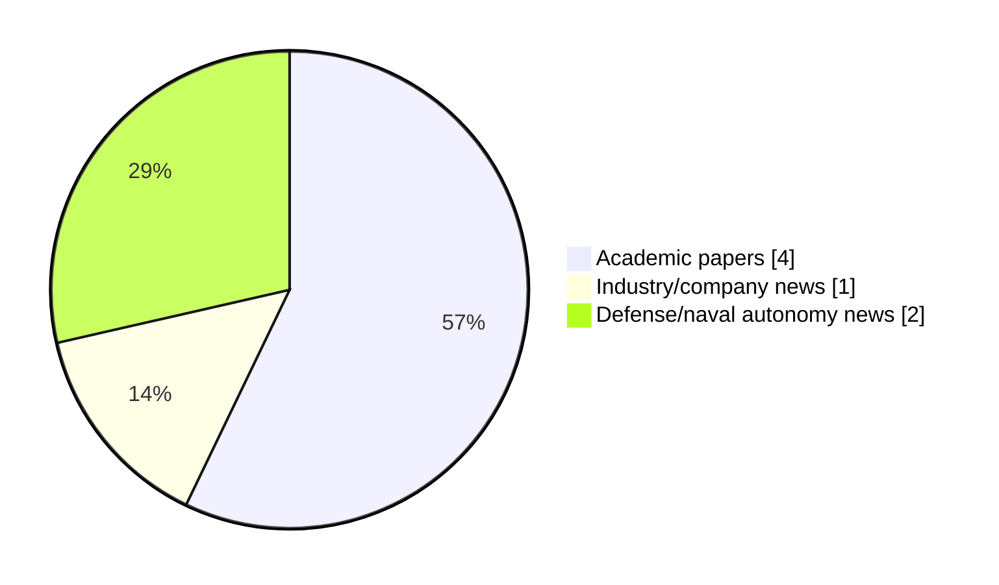

# Maritime Autonomy Watch — 2026-05-30

## Executive Summary

- Total selected items: 7
- Academic papers: 4
- Industry/company news: 1
- Defense/naval autonomy news: 2
- Failed/inaccessible sources: 0

## Contents

- [Analyst Brief](#analyst-brief)
- [Must Read](#must-read)
- [Top Signals Today](#top-signals-today)
- [Topic Signals](#topic-signals)
- [Freshness and Coverage](#freshness-and-coverage)
- [Quality Notes](#quality-notes)
- [Watchlist](#watchlist)
- [Academic Papers](#academic-papers)
- [Industry and Company News](#industry-and-company-news)
- [Defense and Naval Autonomy News](#defense-and-naval-autonomy-news)
- [Source Status Summary](#source-status-summary)

## Analyst Brief

Today's report selected 7 non-duplicate item(s), led by USV operations, AUV navigation, swarm autonomy. The strongest item is [An Attention-Enhanced Network with Joint Dehazing and Retinex-Based Enhancement for Underwater Images](http://arxiv.org/abs/2605.14677v1) from arXiv.
Coverage is weighted toward academic research (4), with 1 industry and 2 defense signal(s).
Quality caveat: missing-summary=1, date-anomaly=1, low-score-unique=1.

## Must Read

- [An Attention-Enhanced Network with Joint Dehazing and Retinex-Based Enhancement for Underwater Images](http://arxiv.org/abs/2605.14677v1) — Research signal: AUV navigation
- [Air-Sea Surface Modeling and Operating Link Range Evaluation for AUV-to-UAV Optical Wireless Communication Links](http://arxiv.org/abs/2605.13661v1) — Research signal: AUV navigation
- [Aerosonde UAS and TSUNAMI USV Demonstrate Autonomous Integration in Navy FLEX](https://oceannews.com/news/defense/aerosonde-uas-and-tsunami-usv-demonstrate-autonomous-integration-in-navy-flex/) — Defense signal: USV operations
- [Seasats Completes First Autonomous Transit of the Taiwan Strait](https://oceannews.com/news/defense/seasats-completes-first-autonomous-transit-of-the-taiwan-strait/) — Industry signal: USV operations
- [Multi-Depth Uniform Coverage Path Planning for Unmanned Surface Vehicle Surveying](http://arxiv.org/abs/2605.13123v1) — Research signal: USV operations

## Top Signals Today

- USV operations: 4 selected item(s).
- AUV navigation: 2 selected item(s).
- swarm autonomy: 2 selected item(s).
- perception: 2 selected item(s).
- defense adoption: 2 selected item(s).

## Topic Signals

- USV operations: 4
- AUV navigation: 2
- swarm autonomy: 2
- perception: 2
- defense adoption: 2
- critical infrastructure: 1
- planning/control: 1
- general autonomy: 1

## Freshness and Coverage

- Newest selected item date: 2026-12-01
- Oldest selected item date: 2026-05-13
- Active/enabled sources: 5
- Sources with access problems: 2
- Quality flags: 3

## Quality Notes

- missing-summary: 1
- date-anomaly: 1
- low-score-unique: 1
- Date anomalies: [Dynamic reliability analysis for unmanned systems with epistemic uncertainty: An application to the variable buoyancy system of a self-powered underwater glider](https://api.elsevier.com/content/abstract/scopus_id/105039679575) reports 2026-12-01

## Watchlist

- [Dynamic reliability analysis for unmanned systems with epistemic uncertainty: An application to the variable buoyancy system of a self-powered underwater glider](https://api.elsevier.com/content/abstract/scopus_id/105039679575) — missing-summary, date-anomaly, low-score-unique

### Category Snapshot

| Category | Selected items |
|---|---:|
| Academic papers | 4 |
| Industry/company news | 1 |
| Defense/naval autonomy news | 2 |

## Academic Papers

_Selected items: 4_

### [An Attention-Enhanced Network with Joint Dehazing and Retinex-Based Enhancement for Underwater Images](http://arxiv.org/abs/2605.14677v1)

- Source: arXiv
- Date: 2026-05-14
- Relevance score: 7.75
- Authors: Sahana Ray, Bibhabasu Debnath, Sanjay Ghosh
- Signal: Research signal: AUV navigation
- Topic tags: AUV navigation, swarm autonomy, perception, critical infrastructure

**Abstract**

Underwater images suffer from severe wavelength-dependent light absorption and scattering, and turbidity due to suspended particles, degrading visual quality for applications in autonomous underwater vehicles (AUVs), marine biology, archaeology, and offshore infrastructure inspection. Classical IFM inadequately capture nonlinear underwater light behavior, while purely data-driven methods lack physical interpretability. This paper proposes a three-stage network named ADR, that extends the underwater image formation model with additional terms to perform underwater dehazing, followed by Retinex-based enhancement and attention-enabled U-Net++ refinement. Experiments on UIEB and UFO-120 benchmark datasets demonstrate competitive performance with state-of-the-art methods.

**Why it matters**

Relevant to underwater autonomy, multi-vehicle coordination, infrastructure monitoring; the work may inform maritime autonomy research, testing priorities, or system design.

---

### [Air-Sea Surface Modeling and Operating Link Range Evaluation for AUV-to-UAV Optical Wireless Communication Links](http://arxiv.org/abs/2605.13661v1)

- Source: arXiv
- Date: 2026-05-13
- Relevance score: 7.75
- Authors: Ikenna Chinazaekpere Ijeh, Mohammad Ali Khalighi, Wasiu O. Popoola
- Signal: Research signal: AUV navigation
- Topic tags: AUV navigation

**Abstract**

Air-sea surface interactions play a critical role in underwater-to-air optical wireless communication (OWC) links, particularly in vertical autonomous underwater vehicle (AUV) to unmanned aerial vehicle (UAV) scenarios, where the stochastic nature of the sea surface introduces optical distortions that impair link reliability. This work investigates the impact of air-sea surface roughness on AUV-to-UAV OWC systems using two experimentally validated models: the classical Cox-Munk and the Elfouhaily-Chapron-Katsaros-Vandemark (ECKV). A tractable analytical representation of the ECKV model is derived and validated against measured sea-state data. Using both analytical and Monte Carlo approaches, the link ergodic capacity is evaluated with particular emphasis on operating range, pointing errors, receiver field-of-view, and solar noise level, providing practical system design insights.

**Why it matters**

Relevant to underwater autonomy; the work may inform maritime autonomy research, testing priorities, or system design.

---

### [Multi-Depth Uniform Coverage Path Planning for Unmanned Surface Vehicle Surveying](http://arxiv.org/abs/2605.13123v1)

- Source: arXiv
- Date: 2026-05-13
- Relevance score: 5
- Authors: Maider Larrazabal, Tong Yang, Izaro Goienetxea, Jaime Valls Miro
- Signal: Research signal: USV operations
- Topic tags: USV operations, swarm autonomy, perception, planning/control

**Abstract**

This paper introduces a novel automatic coverage path planning algorithm for bathymetry surveying with unmanned surface vehicles. The detection range of the mapping sensor employed - a multibeam echo sounder - is heavily influenced by local seafloor depths. Hence, a path designed to uniformly cover the sea surface does not guarantee uniform coverage of the seafloor. Yet this is currently the typical process for bathymetric surveys, with the simplistic boustrophedon scheme along manually selected waypoints at constant depths being the most widespread planner used. The proposed scheme incorporates coarse prior depth information to pre-process the target region and adaptively guide path generation and sensing range configuration.

**Why it matters**

Relevant to surface-vessel operations, multi-vehicle coordination, planning and control; the work may inform maritime autonomy research, testing priorities, or system design.

---

### [Dynamic reliability analysis for unmanned systems with epistemic uncertainty: An application to the variable buoyancy system of a self-powered underwater glider](https://api.elsevier.com/content/abstract/scopus_id/105039679575)

- Source: Elsevier Scopus
- Date: 2026-12-01
- Relevance score: 3.5
- DOI: 10.1016/j.ress.2026.112902
- Signal: Research signal: general autonomy
- Topic tags: general autonomy
- Quality flags: missing-summary, date-anomaly, low-score-unique

**Abstract**

No summary available.

**Why it matters**

Relevant to underwater autonomy; the work may inform maritime autonomy research, testing priorities, or system design.

---

## Industry and Company News

_Selected items: 1_

### [Seasats Completes First Autonomous Transit of the Taiwan Strait](https://oceannews.com/news/defense/seasats-completes-first-autonomous-transit-of-the-taiwan-strait/)

- Source: oceannews.com
- Date: 2026-05-29
- Relevance score: 6
- Signal: Industry signal: USV operations
- Topic tags: USV operations

**Summary**

Seasats has announced that a Lightfish uncrewed surface vessel (USV) has completed the first autonomous transit of the Taiwan Strait, a contested waterway separating Taiwan and mainland China.

**Why it matters**

Signals momentum in surface-vessel operations; useful for tracking product direction, partnerships, and deployment opportunities.

---

## Defense and Naval Autonomy News

_Selected items: 2_

### [Aerosonde UAS and TSUNAMI USV Demonstrate Autonomous Integration in Navy FLEX](https://oceannews.com/news/defense/aerosonde-uas-and-tsunami-usv-demonstrate-autonomous-integration-in-navy-flex/)

- Source: oceannews.com
- Date: 2026-05-29
- Relevance score: 6
- Signal: Defense signal: USV operations
- Topic tags: USV operations, defense adoption

**Summary**

Textron Systems recently participated in the US Navy's Fleet Experimentation (FLEX) demonstration in Key West, Florida, with US Navy Fourth Fleet and SOUTHCOM, bringing together advanced uncrewed air and surface systems. Highlighting the next evolution of integrated, cross-domain autonomy, the exercise focused on demonstrating low-cost, scalable sensor-to-shooter kill chains using coordinated uncrewed systems (UxS), while validating the interoperability required for modern, distributed operations.

**Why it matters**

Signals movement in surface-vessel operations, naval adoption; useful for tracking operational concepts, procurement direction, and fleet integration.

---

### [Saronic Launches First Marauder Medium Unmanned Surface Vessel](https://www.navalnews.com/naval-news/2026/05/saronic-launches-first-marauder-medium-unmanned-surface-vessel/)

- Source: navalnews.com
- Date: 2026-05-29
- Relevance score: 4.25
- Signal: Defense signal: USV operations
- Topic tags: USV operations, defense adoption

**Summary**

Saronic today announced the launch of its first Marauder Medium Unmanned Surface Vessel (MUSV), designed to deliver dual-use autonomous capability far from shore across the full range of defense and commercial applications. Saronic press release The first Marauder hull moved from initial design to on-water trials in under a year, a pace not seen in.

**Why it matters**

Signals movement in surface-vessel operations, naval adoption; useful for tracking operational concepts, procurement direction, and fleet integration.

---

## Inaccessible or Failed Sources

- None

## Source Status Summary

| Source | Status | Notes |
|---|---|---|
| arXiv | enabled | API source, 15 items fetched |
| OpenAlex | enabled | API source, 15 items fetched |
| RSS feeds | enabled | 107 RSS items fetched |
| SMI MASG News | enabled | HTML source, 10 items fetched |
| IEEE Xplore | disabled | Missing IEEE_XPLORE_API_KEY |
| Elsevier Scopus | enabled | API source, 15 items fetched |
| NewsAPI | disabled | Missing NEWS_API_KEY |

## Metadata

- Generated at: 2026-05-30T10:25:01.869313+02:00
- Date: 2026-05-30
- Repository: ferhannb/MarineRobotics
- Relevance threshold: 4.0
- Deduplication method: DOI, canonical URL, source ID, normalized title, similar recent titles, category caps, and novelty score
