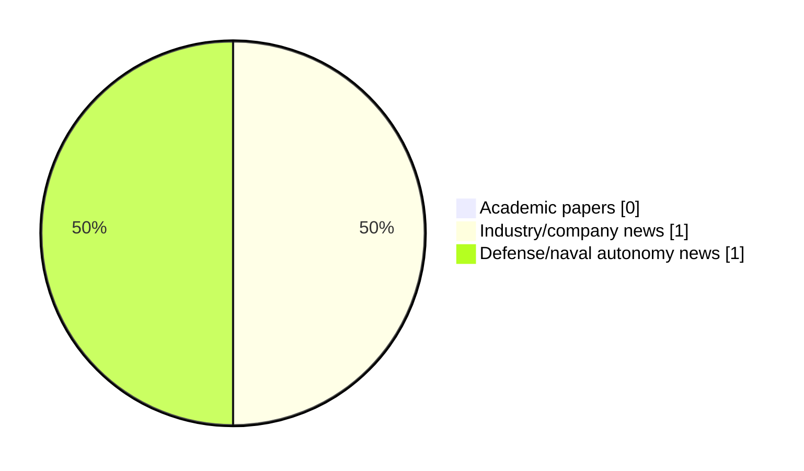

# Maritime Autonomy Watch — 2026-06-01

## Executive Summary

- Total selected items: 2
- Academic papers: 0
- Industry/company news: 1
- Defense/naval autonomy news: 1
- Failed/inaccessible sources: 1

## Contents

- [Analyst Brief](#analyst-brief)
- [Must Read](#must-read)
- [Top Signals Today](#top-signals-today)
- [Topic Signals](#topic-signals)
- [Freshness and Coverage](#freshness-and-coverage)
- [Quality Notes](#quality-notes)
- [Watchlist](#watchlist)
- [Academic Papers](#academic-papers)
- [Industry and Company News](#industry-and-company-news)
- [Defense and Naval Autonomy News](#defense-and-naval-autonomy-news)
- [Source Status Summary](#source-status-summary)

## Analyst Brief

Today's report selected 2 non-duplicate item(s), led by defense adoption, general autonomy. The strongest item is [AUKUS to Develop UUVs, Delivery Set for 2027](https://www.marinelink.com/news/aukus-develop-uuvs-delivery-set-539762) from marinelink.com.
Coverage is weighted toward academic research (0), with 1 industry and 1 defense signal(s).
Quality caveat: low-score-unique=1.

## Must Read

- [AUKUS to Develop UUVs, Delivery Set for 2027](https://www.marinelink.com/news/aukus-develop-uuvs-delivery-set-539762) — Defense signal: defense adoption
- [May’s Most-Read: The Quiet Industrialisation of Maritime Autonomy](https://www.oceansciencetechnology.com/news/mays-most-read-the-quiet-industrialisation-of-maritime-autonomy/) — Industry signal: general autonomy

## Top Signals Today

- defense adoption: 1 selected item(s).
- general autonomy: 1 selected item(s).

## Topic Signals

- defense adoption: 1
- general autonomy: 1

## Freshness and Coverage

- Newest selected item date: 2026-06-01
- Oldest selected item date: 2026-05-31
- Active/enabled sources: 3
- Sources with access problems: 4
- Quality flags: 1

## Quality Notes

- low-score-unique: 1

## Watchlist

- [May’s Most-Read: The Quiet Industrialisation of Maritime Autonomy](https://www.oceansciencetechnology.com/news/mays-most-read-the-quiet-industrialisation-of-maritime-autonomy/) — low-score-unique

### Category Snapshot

| Category | Selected items |
|---|---:|
| Academic papers | 0 |
| Industry/company news | 1 |
| Defense/naval autonomy news | 1 |

## Academic Papers

_Selected items: 0_

No selected items.

## Industry and Company News

_Selected items: 1_

### [May’s Most-Read: The Quiet Industrialisation of Maritime Autonomy](https://www.oceansciencetechnology.com/news/mays-most-read-the-quiet-industrialisation-of-maritime-autonomy/)

- Source: oceansciencetechnology.com
- Date: 2026-06-01
- Relevance score: 3.5
- Signal: Industry signal: general autonomy
- Topic tags: general autonomy
- Quality flags: low-score-unique

**Summary**

The technologies drawing the most readers in May weren’t announcing themselves. No single breakthrough dominated the coverage. Instead, the month’s.

**Why it matters**

This item may signal product, market, or deployment momentum in maritime autonomy.

---

## Defense and Naval Autonomy News

_Selected items: 1_

### [AUKUS to Develop UUVs, Delivery Set for 2027](https://www.marinelink.com/news/aukus-develop-uuvs-delivery-set-539762)

- Source: marinelink.com
- Date: 2026-05-31
- Relevance score: 5
- Signal: Defense signal: defense adoption
- Topic tags: defense adoption

**Summary**

The United States, Britain and Australia are working together to develop unmanned undersea vehicles as part of their trilateral AUKUS defence pact, U.S. Secretary of Defense Pete Hegseth told reporters on Saturday. AUKUS said in a joint statement…

**Why it matters**

Signals movement in naval adoption; useful for tracking operational concepts, procurement direction, and fleet integration.

---

## Inaccessible or Failed Sources

- arXiv: The read operation timed out

## Source Status Summary

| Source | Status | Notes |
|---|---|---|
| arXiv | failed | The read operation timed out |
| OpenAlex | enabled | API source, 15 items fetched |
| RSS feeds | partial | 85 RSS items fetched; failures: https://massworld.news/feed/: Invalid XML from https://massworld.news/feed/: mismatched tag: line 93, column 2; https://oceannews.com/feed/: Invalid XML from https://oceannews.com/feed/: mismatched tag: line 93, column 2 |
| SMI MASG News | enabled | HTML source, 0 items fetched |
| IEEE Xplore | disabled | Missing IEEE_XPLORE_API_KEY |
| Elsevier Scopus | enabled | API source, 15 items fetched |
| NewsAPI | disabled | Missing NEWS_API_KEY |

## Metadata

- Generated at: 2026-06-01T13:26:53.437363+02:00
- Date: 2026-06-01
- Repository: ferhannb/MarineRobotics
- Relevance threshold: 4.0
- Deduplication method: DOI, canonical URL, source ID, normalized title, similar recent titles, category caps, and novelty score
