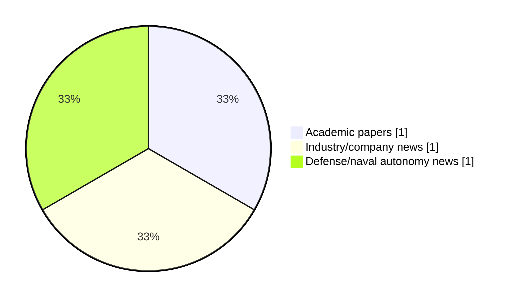

# Maritime Autonomy Watch — 2026-06-02

## Executive Summary

- Total selected items: 3
- Academic papers: 1
- Industry/company news: 1
- Defense/naval autonomy news: 1
- Failed/inaccessible sources: 0

## Contents

- [Analyst Brief](#analyst-brief)
- [Must Read](#must-read)
- [Top Signals Today](#top-signals-today)
- [Topic Signals](#topic-signals)
- [Freshness and Coverage](#freshness-and-coverage)
- [Quality Notes](#quality-notes)
- [Watchlist](#watchlist)
- [Academic Papers](#academic-papers)
- [Industry and Company News](#industry-and-company-news)
- [Defense and Naval Autonomy News](#defense-and-naval-autonomy-news)
- [Source Status Summary](#source-status-summary)

## Analyst Brief

Today's report selected 3 non-duplicate item(s), led by USV operations, critical infrastructure, general autonomy. The strongest item is [Tether-Aware Dynamic Collision Avoidance for USV-HROV Systems](http://arxiv.org/abs/2606.01112v1) from arXiv.
Coverage is weighted toward academic research (1), with 1 industry and 1 defense signal(s).
Quality caveat: low-score-unique=1.

## Must Read

- [Tether-Aware Dynamic Collision Avoidance for USV-HROV Systems](http://arxiv.org/abs/2606.01112v1) — Research signal: USV operations
- [SatLab Launches Compact USV Featuring Multi-Sensor Integration & Survey Automation](https://www.oceansciencetechnology.com/news/satlab-launches-compact-usv-featuring-multi-sensor-integration-survey-automation/) — Industry signal: USV operations
- [AUKUS partners unveil Pillar II project for uncrewed undersea vehicles](https://www.naval-technology.com/news/aukus-pillar2-uncrewed-vehicles/) — Defense signal: general autonomy

## Top Signals Today

- USV operations: 2 selected item(s).
- critical infrastructure: 1 selected item(s).
- general autonomy: 1 selected item(s).

## Topic Signals

- USV operations: 2
- critical infrastructure: 1
- general autonomy: 1

## Freshness and Coverage

- Newest selected item date: 2026-06-02
- Oldest selected item date: 2026-05-31
- Active/enabled sources: 5
- Sources with access problems: 2
- Quality flags: 1

## Quality Notes

- low-score-unique: 1

## Watchlist

- [AUKUS partners unveil Pillar II project for uncrewed undersea vehicles](https://www.naval-technology.com/news/aukus-pillar2-uncrewed-vehicles/) — low-score-unique

### Category Snapshot

| Category | Selected items |
|---|---:|
| Academic papers | 1 |
| Industry/company news | 1 |
| Defense/naval autonomy news | 1 |

## Academic Papers

_Selected items: 1_

### [Tether-Aware Dynamic Collision Avoidance for USV-HROV Systems](http://arxiv.org/abs/2606.01112v1)

- Source: arXiv
- Date: 2026-05-31
- Relevance score: 8.75
- Authors: Yang Gu, Ziyang Hong, Xuanlin Chen, Hao Wei, Cheng Wang, Shujie Yang, Yulin Si
- Signal: Research signal: USV operations
- Topic tags: USV operations, critical infrastructure

**Abstract**

Heterogeneous marine robotic systems composed of an unmanned surface vehicle (USV) and a hybrid remotely operated vehicle (HROV) have shown great potential for subsea cable inspection. In such missions, the USV tracks the HROV at the surface while supplying power and communication through an umbilical tether. However, dynamic collision avoidance for the USV during HROV tracking is challenging because the submerged tether may scrape against passing vessels, while evasive maneuvers can enlarge the USV--HROV separation, thereby increasing the likelihood of tether tautness and compromising HROV operations. To address these challenges, this work proposes a tether-aware dynamic collision avoidance method for a USV tracking an HROV. First, a tether safety-aware planar domain is introduced to represent the three-dimensional collision risk between the tether and obstacle vessels without an explicit tether shape model.

**Why it matters**

Relevant to surface-vessel operations, navigation safety, infrastructure monitoring; the work may inform maritime autonomy research, testing priorities, or system design.

---

## Industry and Company News

_Selected items: 1_

### [SatLab Launches Compact USV Featuring Multi-Sensor Integration & Survey Automation](https://www.oceansciencetechnology.com/news/satlab-launches-compact-usv-featuring-multi-sensor-integration-survey-automation/)

- Source: oceansciencetechnology.com
- Date: 2026-06-02
- Relevance score: 6
- Signal: Industry signal: USV operations
- Topic tags: USV operations

**Summary**

SatLab Geosolutions has unveiled the HydroBoat 1200 GEN2, an upgraded lightweight Unmanned Survey Vessel (USV) designed for marine surveying and.

**Why it matters**

Signals momentum in surface-vessel operations; useful for tracking product direction, partnerships, and deployment opportunities.

---

## Defense and Naval Autonomy News

_Selected items: 1_

### [AUKUS partners unveil Pillar II project for uncrewed undersea vehicles](https://www.naval-technology.com/news/aukus-pillar2-uncrewed-vehicles/)

- Source: naval-technology.com
- Date: 2026-06-01
- Relevance score: 3.5
- Signal: Defense signal: general autonomy
- Topic tags: general autonomy
- Quality flags: low-score-unique

**Summary**

Australia, the US and the UK have announced the launch of the first AUKUS Pillar II Signature Project, aimed at developing advanced payloads and systems for Uncrewed Undersea Vehicles (UUVs).

**Why it matters**

This item may signal operational adoption, procurement priorities, or naval autonomy doctrine shifts.

---

## Inaccessible or Failed Sources

- None

## Source Status Summary

| Source | Status | Notes |
|---|---|---|
| arXiv | enabled | API source, 15 items fetched |
| OpenAlex | enabled | API source, 15 items fetched |
| RSS feeds | enabled | 107 RSS items fetched |
| SMI MASG News | enabled | HTML source, 10 items fetched |
| IEEE Xplore | disabled | Missing IEEE_XPLORE_API_KEY |
| Elsevier Scopus | enabled | API source, 15 items fetched |
| NewsAPI | disabled | Missing NEWS_API_KEY |

## Metadata

- Generated at: 2026-06-02T12:18:25.174055+02:00
- Date: 2026-06-02
- Repository: ferhannb/MarineRobotics
- Relevance threshold: 4.0
- Deduplication method: DOI, canonical URL, source ID, normalized title, similar recent titles, category caps, and novelty score
