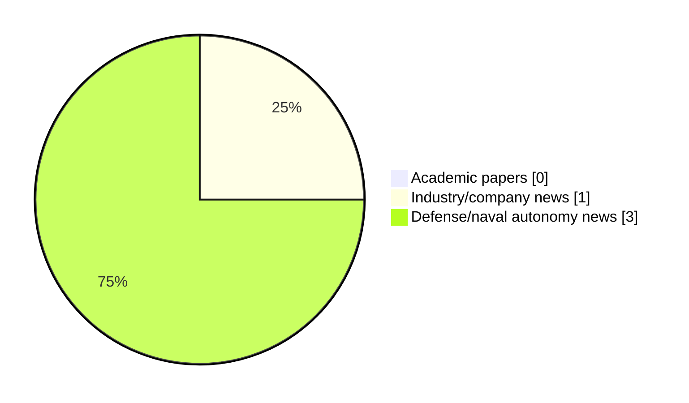

# Maritime Autonomy Watch — 2026-06-03

## Executive Summary

- Total selected items: 4
- Academic papers: 0
- Industry/company news: 1
- Defense/naval autonomy news: 3
- Failed/inaccessible sources: 1

## Contents

- [Analyst Brief](#analyst-brief)
- [Must Read](#must-read)
- [Top Signals Today](#top-signals-today)
- [Topic Signals](#topic-signals)
- [Freshness and Coverage](#freshness-and-coverage)
- [Quality Notes](#quality-notes)
- [Watchlist](#watchlist)
- [Academic Papers](#academic-papers)
- [Industry and Company News](#industry-and-company-news)
- [Defense and Naval Autonomy News](#defense-and-naval-autonomy-news)
- [Source Status Summary](#source-status-summary)

## Analyst Brief

Today's report selected 4 non-duplicate item(s), led by USV operations, defense adoption. The strongest item is [MARTAC and Mystic Powerboats to Expand Production Capacity for ASV Deliveries](https://oceannews.com/news/defense/martac-and-mystic-powerboats-to-expand-production-capacity-for-asv-deliveries/) from oceannews.com.
Coverage is weighted toward academic research (0), with 1 industry and 3 defense signal(s).

## Must Read

- [MARTAC and Mystic Powerboats to Expand Production Capacity for ASV Deliveries](https://oceannews.com/news/defense/martac-and-mystic-powerboats-to-expand-production-capacity-for-asv-deliveries/) — Industry signal: USV operations
- [HII’s ROMULUS USV Advances to U.S. Navy Medium USV At-Sea Testing Phase](https://www.navalnews.com/naval-news/2026/06/hiis-romulus-usv-advances-to-u-s-navy-medium-usv-at-sea-testing-phase/) — Defense signal: USV operations
- [Fleetzero, Thoma-Sea, and Glosten Collaborate on Long-Duration USVs](https://www.marinelink.com/news/fleetzero-thomasea-glosten-collaborate-539882) — Defense signal: USV operations
- [52m Saildrone Spectre USV unveiled](https://massworld.news/52m-saildrone-spectre-usv-unveiled/) — Defense signal: USV operations

## Top Signals Today

- USV operations: 4 selected item(s).
- defense adoption: 3 selected item(s).

## Topic Signals

- USV operations: 4
- defense adoption: 3

## Freshness and Coverage

- Newest selected item date: 2026-06-03
- Oldest selected item date: 2026-05-02
- Active/enabled sources: 4
- Sources with access problems: 3
- Quality flags: 0

## Quality Notes

- No quality flags on selected items.

## Watchlist

- No watchlist items today.

### Category Snapshot

| Category | Selected items |
|---|---:|
| Academic papers | 0 |
| Industry/company news | 1 |
| Defense/naval autonomy news | 3 |

## Academic Papers

_Selected items: 0_

No selected items.

## Industry and Company News

_Selected items: 1_

### [MARTAC and Mystic Powerboats to Expand Production Capacity for ASV Deliveries](https://oceannews.com/news/defense/martac-and-mystic-powerboats-to-expand-production-capacity-for-asv-deliveries/)

- Source: oceannews.com
- Date: 2026-06-02
- Relevance score: 8.75
- Signal: Industry signal: USV operations
- Topic tags: USV operations

**Summary**

Maritime Tactical Systems, Inc. ( MARTAC ), a leading provider of high-performance autonomous unmanned surface vehicles (USVs), and Mystic Power boats ( Mystic ), a leader in high-performance composite vessel construction, today announced a co-production partnership to increase MARTAC’s domestic production capacity to meet growing requirements from US and allied customers.

**Why it matters**

Signals momentum in surface-vessel operations; useful for tracking product direction, partnerships, and deployment opportunities.

---

## Defense and Naval Autonomy News

_Selected items: 3_

### [HII’s ROMULUS USV Advances to U.S. Navy Medium USV At-Sea Testing Phase](https://www.navalnews.com/naval-news/2026/06/hiis-romulus-usv-advances-to-u-s-navy-medium-usv-at-sea-testing-phase/)

- Source: navalnews.com
- Date: 2026-06-02
- Relevance score: 6
- Signal: Defense signal: USV operations
- Topic tags: USV operations, defense adoption
- Also reported by: https://oceannews.com/feed/

**Summary**

On June 1, 2026, Huntington Ingalls Industries (HII) announced that the ROMULUS medium unmanned surface vessel started sea trials. HII press release Statement by Andy Green, executive vice president of HII and president of HII’s Mission Technologies division, on the U.S. Navy’s selection of HII’s ROMULUS Unmanned Surface Vessel to advance to the at-sea testing.

**Why it matters**

Signals movement in surface-vessel operations, naval adoption; useful for tracking operational concepts, procurement direction, and fleet integration.

---

### [Fleetzero, Thoma-Sea, and Glosten Collaborate on Long-Duration USVs](https://www.marinelink.com/news/fleetzero-thomasea-glosten-collaborate-539882)

- Source: marinelink.com
- Date: 2026-06-03
- Relevance score: 5.25
- Signal: Defense signal: USV operations
- Topic tags: USV operations, defense adoption
- Also reported by: https://oceannews.com/feed/

**Summary**

Fleetzero, a U.S.-based developer of marine technology, has announced a collaboration with Thoma-Sea Marine Constructors, a leading U.S. shipbuilder, and Glosten, a Seattle-based global naval architecture and marine engineering firm, to accelerate…

**Why it matters**

Signals movement in surface-vessel operations, naval adoption; useful for tracking operational concepts, procurement direction, and fleet integration.

---

### [52m Saildrone Spectre USV unveiled](https://massworld.news/52m-saildrone-spectre-usv-unveiled/)

- Source: massworld.news
- Date: 2026-05-02
- Relevance score: 4.5
- Signal: Defense signal: USV operations
- Topic tags: USV operations, defense adoption

**Summary**

Saildrone, US-based USV developer for both civil and navy, has recently announced its newest platform, Spectre, a 52 meters long vehicle, weighing 250 tonnes, capable of up to 30 knots.

**Why it matters**

Signals movement in surface-vessel operations, naval adoption; useful for tracking operational concepts, procurement direction, and fleet integration.

---

## Inaccessible or Failed Sources

- arXiv: The read operation timed out

## Source Status Summary

| Source | Status | Notes |
|---|---|---|
| arXiv | failed | The read operation timed out |
| OpenAlex | enabled | API source, 15 items fetched |
| RSS feeds | enabled | 107 RSS items fetched |
| SMI MASG News | enabled | HTML source, 10 items fetched |
| IEEE Xplore | disabled | Missing IEEE_XPLORE_API_KEY |
| Elsevier Scopus | enabled | API source, 15 items fetched |
| NewsAPI | disabled | Missing NEWS_API_KEY |

## Metadata

- Generated at: 2026-06-03T12:53:13.684890+02:00
- Date: 2026-06-03
- Repository: ferhannb/MarineRobotics
- Relevance threshold: 4.0
- Deduplication method: DOI, canonical URL, source ID, normalized title, similar recent titles, category caps, and novelty score
