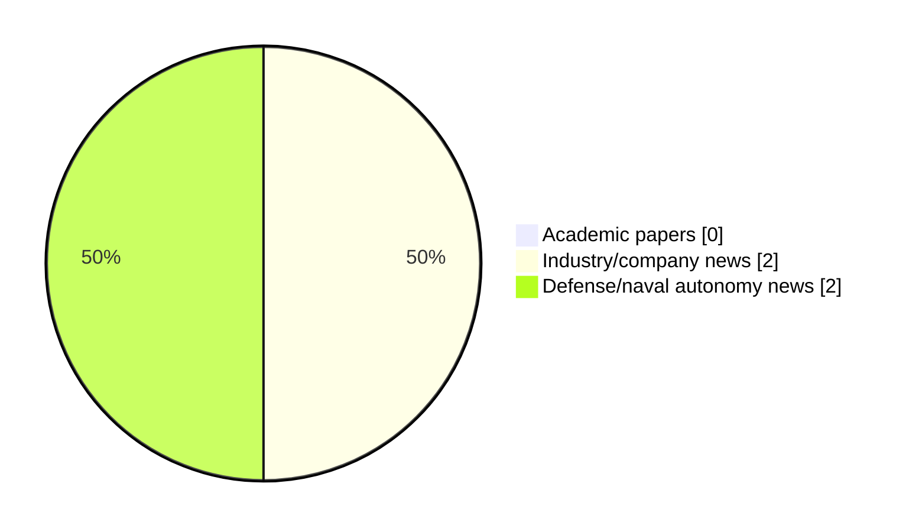

# Maritime Autonomy Watch — 2026-06-04

## Executive Summary

- Total selected items: 4
- Academic papers: 0
- Industry/company news: 2
- Defense/naval autonomy news: 2
- Failed/inaccessible sources: 1

## Contents

- [Analyst Brief](#analyst-brief)
- [Must Read](#must-read)
- [Top Signals Today](#top-signals-today)
- [Topic Signals](#topic-signals)
- [Freshness and Coverage](#freshness-and-coverage)
- [Quality Notes](#quality-notes)
- [Watchlist](#watchlist)
- [Academic Papers](#academic-papers)
- [Industry and Company News](#industry-and-company-news)
- [Defense and Naval Autonomy News](#defense-and-naval-autonomy-news)
- [Source Status Summary](#source-status-summary)

## Analyst Brief

Today's report selected 4 non-duplicate item(s), led by USV operations, AUV navigation, underwater communications. The strongest item is [MARTAC Expands Across Western USA With Opening of San Diego Innovation Center](https://www.marinelink.com/news/martac-expands-across-western-usa-opening-539923) from marinelink.com.
Coverage is weighted toward academic research (0), with 2 industry and 2 defense signal(s).

## Must Read

- [MARTAC Expands Across Western USA With Opening of San Diego Innovation Center](https://www.marinelink.com/news/martac-expands-across-western-usa-opening-539923) — Industry signal: USV operations
- [Cellula Robotics and DRDC/RDDC Advance Long-Endurance AUV Development Through Sustained Collaboration](https://oceannews.com/news/defense/cellula-robotics-and-drdc-rddc-advance-long-endurance-auv-development-through-sustained-collaboration/) — Defense signal: AUV navigation
- [DRDC-Led Maritime Autonomy Trials Advance Canadian Innovation](https://oceannews.com/news/defense/drdc-led-maritime-autonomy-trials-advance-canadian-innovation/) — Industry signal: underwater communications
- [Hyliion Announces USX-1 Defiant USV as the Launch Platform for KARNO Core Sea Trials](https://oceannews.com/news/defense/hyliion-announces-usx-1-defiant-usv-as-the-launch-platform-for-karno-core-sea-trials/) — Defense signal: USV operations

## Top Signals Today

- USV operations: 2 selected item(s).
- AUV navigation: 1 selected item(s).
- underwater communications: 1 selected item(s).
- swarm autonomy: 1 selected item(s).
- defense adoption: 1 selected item(s).

## Topic Signals

- USV operations: 2
- AUV navigation: 1
- underwater communications: 1
- swarm autonomy: 1
- defense adoption: 1

## Freshness and Coverage

- Newest selected item date: 2026-06-03
- Oldest selected item date: 2026-06-03
- Active/enabled sources: 4
- Sources with access problems: 3
- Quality flags: 0

## Quality Notes

- No quality flags on selected items.

## Watchlist

- No watchlist items today.

### Category Snapshot

| Category | Selected items |
|---|---:|
| Academic papers | 0 |
| Industry/company news | 2 |
| Defense/naval autonomy news | 2 |

## Academic Papers

_Selected items: 0_

No selected items.

## Industry and Company News

_Selected items: 2_

### [MARTAC Expands Across Western USA With Opening of San Diego Innovation Center](https://www.marinelink.com/news/martac-expands-across-western-usa-opening-539923)

- Source: marinelink.com
- Date: 2026-06-03
- Relevance score: 8.25
- Signal: Industry signal: USV operations
- Topic tags: USV operations

**Summary**

Maritime Tactical Systems, Inc. (MARTAC), a provider of fully autonomous unmanned surface vessels (USVs), announced the opening of the MARTAC Innovation Center West in San Diego, California. The new facility marks a milestone in the company’s expansion…

**Why it matters**

Signals momentum in surface-vessel operations; useful for tracking product direction, partnerships, and deployment opportunities.

---

### [DRDC-Led Maritime Autonomy Trials Advance Canadian Innovation](https://oceannews.com/news/defense/drdc-led-maritime-autonomy-trials-advance-canadian-innovation/)

- Source: oceannews.com
- Date: 2026-06-03
- Relevance score: 5
- Signal: Industry signal: underwater communications
- Topic tags: underwater communications, swarm autonomy

**Summary**

COVE supported the Canadian Autonomy Trials Series–Maritime (CATS-M) in Holyrood, NL. The inaugural trial brought together remotely piloted and autonomous maritime platforms, acoustic sensors, and information systems to provide a realistic, system-integration-level environment for detecting and tracking underwater targets.

**Why it matters**

Signals momentum in underwater autonomy, multi-vehicle coordination; useful for tracking product direction, partnerships, and deployment opportunities.

---

## Defense and Naval Autonomy News

_Selected items: 2_

### [Cellula Robotics and DRDC/RDDC Advance Long-Endurance AUV Development Through Sustained Collaboration](https://oceannews.com/news/defense/cellula-robotics-and-drdc-rddc-advance-long-endurance-auv-development-through-sustained-collaboration/)

- Source: oceannews.com
- Date: 2026-06-03
- Relevance score: 7.75
- Signal: Defense signal: AUV navigation
- Topic tags: AUV navigation

**Summary**

Cellula Robotics Ltd. and Defence Research and Development Canada / Recherche et Développement pour la Défense Canada (DRDC/RDDC) are marking continued progress in the development of long-endurance autonomous underwater vehicle capability, reflecting several years of collaboration aimed at advancing practical underwater technology for demanding operating environments.

**Why it matters**

Signals movement in underwater autonomy, naval adoption; useful for tracking operational concepts, procurement direction, and fleet integration.

---

### [Hyliion Announces USX-1 Defiant USV as the Launch Platform for KARNO Core Sea Trials](https://oceannews.com/news/defense/hyliion-announces-usx-1-defiant-usv-as-the-launch-platform-for-karno-core-sea-trials/)

- Source: oceannews.com
- Date: 2026-06-03
- Relevance score: 4.5
- Signal: Defense signal: USV operations
- Topic tags: USV operations, defense adoption

**Summary**

Hyliion Holdings Corp. (Hyliion), a developer of modular power plant technology, announced that the US Navy’s Office of Naval Research (ONR), in partnership with the Defense Advanced Research Projects Agency (DARPA), has selected the USX-1 Defiant as a candidate test vessel for Hyliion’s KARNO technology. Initial sea trials are funded under a development program from the Office of Naval Research (ONR) to advance the use of KARNO Cores for onboard power generation in US Navy vessels.

**Why it matters**

Signals movement in surface-vessel operations, naval adoption; useful for tracking operational concepts, procurement direction, and fleet integration.

---

## Inaccessible or Failed Sources

- arXiv: HTTP 429 for https://export.arxiv.org/api/query?search_query=all%3A%22maritime+autonomy%22+OR+all%3A%22marine+robotics%22+OR+all%3A%22autonomous+vessel%22+OR+all%3A%22autonomous+mission%22+OR+all%3A%22autonomous+surface+vessel%22+OR+all%3A%22autonomous+underwater+vehicle%22+OR+all%3A%22unmanned+surface+vehicle%22+OR+all%3A%22unmanned+underwater+vehicle%22&start=0&max_results=15&sortBy=submittedDate&sortOrder=descending

## Source Status Summary

| Source | Status | Notes |
|---|---|---|
| arXiv | failed | HTTP 429 for https://export.arxiv.org/api/query?search_query=all%3A%22maritime+autonomy%22+OR+all%3A%22marine+robotics%22+OR+all%3A%22autonomous+vessel%22+OR+all%3A%22autonomous+mission%22+OR+all%3A%22autonomous+surface+vessel%22+OR+all%3A%22autonomous+underwater+vehicle%22+OR+all%3A%22unmanned+surface+vehicle%22+OR+all%3A%22unmanned+underwater+vehicle%22&start=0&max_results=15&sortBy=submittedDate&sortOrder=descending |
| OpenAlex | enabled | API source, 15 items fetched |
| RSS feeds | enabled | 107 RSS items fetched |
| SMI MASG News | enabled | HTML source, 10 items fetched |
| IEEE Xplore | disabled | Missing IEEE_XPLORE_API_KEY |
| Elsevier Scopus | enabled | API source, 15 items fetched |
| NewsAPI | disabled | Missing NEWS_API_KEY |

## Metadata

- Generated at: 2026-06-04T11:52:12.390821+02:00
- Date: 2026-06-04
- Repository: ferhannb/MarineRobotics
- Relevance threshold: 4.0
- Deduplication method: DOI, canonical URL, source ID, normalized title, similar recent titles, category caps, and novelty score
