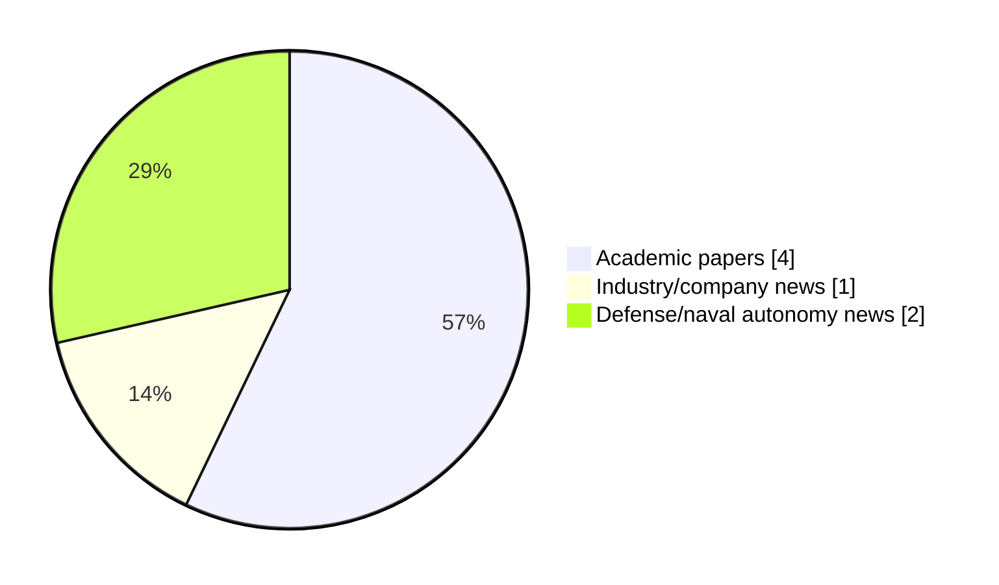

# Maritime Autonomy Watch — 2026-06-05

## Executive Summary

- Total selected items: 7
- Academic papers: 4
- Industry/company news: 1
- Defense/naval autonomy news: 2
- Failed/inaccessible sources: 1

## Contents

- [Analyst Brief](#analyst-brief)
- [Must Read](#must-read)
- [Top Signals Today](#top-signals-today)
- [Topic Signals](#topic-signals)
- [Freshness and Coverage](#freshness-and-coverage)
- [Quality Notes](#quality-notes)
- [Watchlist](#watchlist)
- [Academic Papers](#academic-papers)
- [Industry and Company News](#industry-and-company-news)
- [Defense and Naval Autonomy News](#defense-and-naval-autonomy-news)
- [Source Status Summary](#source-status-summary)

## Analyst Brief

Today's report selected 7 non-duplicate item(s), led by USV operations, planning/control, swarm autonomy. The strongest item is [A Bio-Inspired Sliding Mode Algorithm with Lateral Velocity Tracking Differentiator for Formation Control of Underactuated USVs](https://doi.org/10.2478/pomr-2026-0018) from OpenAlex.
Coverage is weighted toward academic research (4), with 1 industry and 2 defense signal(s).
Quality caveat: low-score-unique=2, missing-summary=1, date-anomaly=1.

## Must Read

- [A Bio-Inspired Sliding Mode Algorithm with Lateral Velocity Tracking Differentiator for Formation Control of Underactuated USVs](https://doi.org/10.2478/pomr-2026-0018) — Research signal: USV operations
- [Research on Trajectory Tracking Control of USV Based on Disturbance Observation Compensation](https://doi.org/10.3390/jmse14080757) — Research signal: USV operations
- [BIND-USBL: Bounding IMU Navigation Drift using USBL in Heterogeneous ASV-AUV Teams](https://openalex.org/W7154656107) — Research signal: AUV navigation
- [Navantia Debuts Design for Autonomous Vessel to Support ‘Hybrid Navy’ of the Future](https://www.maritimeindustries.org/news/navantia-debuts-design-autonomous-vessel-support-hybrid-navy-future) — Defense signal: USV operations
- [Aselsan Showcases Kiliç Kamikaze Underwater Drones at Efes](https://www.navalnews.com/naval-news/2026/06/aselsan-showcases-kilic-kamikaze-underwater-drones-at-efes/) — Defense signal: AUV navigation

## Top Signals Today

- USV operations: 5 selected item(s).
- planning/control: 4 selected item(s).
- swarm autonomy: 3 selected item(s).
- regulation/legal: 2 selected item(s).
- AUV navigation: 2 selected item(s).

## Topic Signals

- USV operations: 5
- planning/control: 4
- swarm autonomy: 3
- regulation/legal: 2
- AUV navigation: 2
- defense adoption: 2
- underwater communications: 1

## Freshness and Coverage

- Newest selected item date: 2026-12-01
- Oldest selected item date: 2026-04-13
- Active/enabled sources: 4
- Sources with access problems: 3
- Quality flags: 4

## Quality Notes

- low-score-unique: 2
- missing-summary: 1
- date-anomaly: 1
- Date anomalies: [Formation tracking control of multiple USVs using ADRC with prescribed performance](https://api.elsevier.com/content/abstract/scopus_id/105035333345) reports 2026-12-01

## Watchlist

- [Aselsan Showcases Kiliç Kamikaze Underwater Drones at Efes](https://www.navalnews.com/naval-news/2026/06/aselsan-showcases-kilic-kamikaze-underwater-drones-at-efes/) — low-score-unique
- [UK Maritime Autonomy Market Could Reach £8 Billion by 2050](https://oceannews.com/news/milestones/uk-maritime-autonomy-market-could-reach-8-billion-by-2050/) — low-score-unique
- [Formation tracking control of multiple USVs using ADRC with prescribed performance](https://api.elsevier.com/content/abstract/scopus_id/105035333345) — missing-summary, date-anomaly

### Category Snapshot

| Category | Selected items |
|---|---:|
| Academic papers | 4 |
| Industry/company news | 1 |
| Defense/naval autonomy news | 2 |

## Academic Papers

_Selected items: 4_

### [A Bio-Inspired Sliding Mode Algorithm with Lateral Velocity Tracking Differentiator for Formation Control of Underactuated USVs](https://doi.org/10.2478/pomr-2026-0018)

- Source: OpenAlex
- Date: 2026-05-06
- Relevance score: 10
- Authors: Jiaying Niu, Lanqing Xu, Guiyin Chen, Jinhua Lv, Yiming Tang
- DOI: 10.2478/pomr-2026-0018
- Signal: Research signal: USV operations
- Topic tags: USV operations, swarm autonomy, planning/control, regulation/legal
- Also reported by: Elsevier Scopus

**Abstract**

Abstract An advanced control framework is presented to solve the challenge of trajectory tracking in underactuated unmanned surface vehicles (USVs) operating in a formation. Three key innovations are featured: (1) Complex derivative calculations are effectively eliminated by a bio-inspired model approximating virtual longitudinal/lateral velocities; (2) Severe initial control chattering is significantly mitigated by a lateral velocity tracking differentiator (LVTD); (3) These techniques are integrated within a disturbance-observer-compensated dynamic surface sliding mode control (SMC) under a virtual framework. In addition, trajectory tracking errors are defined using desired and actual USV states, while virtual control laws are developed based on nonlinear backstepping. Meanwhile, the bio-inspired model is incorporatedto approximate virtual velocities, avoiding complex differentiation.

**Why it matters**

Relevant to surface-vessel operations, multi-vehicle coordination, planning and control; the work may inform maritime autonomy research, testing priorities, or system design.

---

### [Research on Trajectory Tracking Control of USV Based on Disturbance Observation Compensation](https://doi.org/10.3390/jmse14080757)

- Source: OpenAlex
- Date: 2026-04-21
- Relevance score: 10
- Authors: J Zhang, Hongjie Ling, Wandi Song, Anqi Lu, Changgui Shu, Junyi Huang
- DOI: 10.3390/jmse14080757
- Signal: Research signal: USV operations
- Topic tags: USV operations, planning/control

**Abstract**

To address trajectory-tracking degradation of unmanned surface vehicles (USVs) in constrained waters caused by model uncertainty, strong environmental disturbances, and actuator limitations, this paper proposes a robust disturbance-observer-based optimization model predictive control method. First, a nonlinear tracking error model is established for a 3-DOF USV by incorporating environmental loads, parametric perturbations, and unmodeled dynamics into the kinematic and dynamic equations. Based on this model, a prediction model suitable for model predictive control is derived through linearization and discretization. Then, to estimate complex unknown disturbances online, a robust disturbance observer integrating a radial basis function neural network (RBFNN) with an adaptive sliding-mode mechanism is developed, enabling real-time approximation and compensation of lumped disturbances in the surge and yaw channels.

**Why it matters**

Relevant to surface-vessel operations, planning and control; the work may inform maritime autonomy research, testing priorities, or system design.

---

### [BIND-USBL: Bounding IMU Navigation Drift using USBL in Heterogeneous ASV-AUV Teams](https://openalex.org/W7154656107)

- Source: OpenAlex
- Date: 2026-04-13
- Relevance score: 10
- Authors: Pranav Kedia, Rajini Makam, Heiko Hamann, Suresh Sundaram
- Signal: Research signal: AUV navigation
- Topic tags: AUV navigation, USV operations, underwater communications, swarm autonomy, regulation/legal

**Abstract**

Accurate and continuous localization of Autonomous Underwater Vehicles (AUVs) in GPS-denied environments is a persistent challenge in marine robotics. In the absence of external position fixes, AUVs rely on inertial dead-reckoning, which accumulates unbounded drift due to sensor bias and noise. This paper presents BIND-USBL, a cooperative localization framework in which a fleet of Autonomous Surface Vessels (ASVs) equipped with Ultra-Short Baseline (USBL) acoustic positioning systems provides intermittent fixes to bound AUV dead-reckoning error. The key insight is that long-duration navigation failure is driven not by the accuracy of individual USBL measurements, but by the temporal sparsity and geometric availability of those fixes.

**Why it matters**

Relevant to underwater autonomy, surface-vessel operations, multi-vehicle coordination; the work may inform maritime autonomy research, testing priorities, or system design.

---

### [Formation tracking control of multiple USVs using ADRC with prescribed performance](https://api.elsevier.com/content/abstract/scopus_id/105035333345)

- Source: Elsevier Scopus
- Date: 2026-12-01
- Relevance score: 5.25
- DOI: 10.1038/s41598-026-37252-0
- Signal: Research signal: USV operations
- Topic tags: USV operations, swarm autonomy, planning/control
- Quality flags: missing-summary, date-anomaly

**Abstract**

No summary available.

**Why it matters**

Relevant to surface-vessel operations, multi-vehicle coordination; the work may inform maritime autonomy research, testing priorities, or system design.

---

## Industry and Company News

_Selected items: 1_

### [UK Maritime Autonomy Market Could Reach £8 Billion by 2050](https://oceannews.com/news/milestones/uk-maritime-autonomy-market-could-reach-8-billion-by-2050/)

- Source: oceannews.com
- Date: 2026-06-04
- Relevance score: 3.5
- Signal: Industry signal: planning/control
- Topic tags: planning/control
- Quality flags: low-score-unique

**Summary**

Unveiled at an event hosted by Lloyd’s Register (LR), Quantifying the UK Maritime Autonomy Opportunity provides the first evidence-based assessment of the sector’s current size and long-term trajectory, and the findings are significant.

**Why it matters**

Signals momentum in planning and control; useful for tracking product direction, partnerships, and deployment opportunities.

---

## Defense and Naval Autonomy News

_Selected items: 2_

### [Navantia Debuts Design for Autonomous Vessel to Support ‘Hybrid Navy’ of the Future](https://www.maritimeindustries.org/news/navantia-debuts-design-autonomous-vessel-support-hybrid-navy-future)

- Source: maritimeindustries.org
- Date: 2026-05-20
- Relevance score: 6.25
- Signal: Defense signal: USV operations
- Topic tags: USV operations, defense adoption

**Summary**

A model for a large autonomous surface vessel has been unveiled by Navantia UK as an example of the hi-tech capabilities of the company’s four yards, which are undergoing large-scale modernisation.

**Why it matters**

Signals movement in surface-vessel operations, naval adoption; useful for tracking operational concepts, procurement direction, and fleet integration.

---

### [Aselsan Showcases Kiliç Kamikaze Underwater Drones at Efes](https://www.navalnews.com/naval-news/2026/06/aselsan-showcases-kilic-kamikaze-underwater-drones-at-efes/)

- Source: navalnews.com
- Date: 2026-06-05
- Relevance score: 3.5
- Signal: Defense signal: AUV navigation
- Topic tags: AUV navigation, defense adoption
- Quality flags: low-score-unique

**Summary**

Aselsan’s Kiliç series of Kamikaze Autonomous Underwater Vehicles were among the products showcased by the Turkish defense firm on the sidelines of Ankara’s premier defense drills last month. Initially debuted at Saha 2026, a company official explained that there was potential to further develop and expand Kiliç’s capabilities. Naval News understands that recent developments in.

**Why it matters**

Signals movement in underwater autonomy, naval adoption; useful for tracking operational concepts, procurement direction, and fleet integration.

---

## Inaccessible or Failed Sources

- arXiv: The read operation timed out

## Source Status Summary

| Source | Status | Notes |
|---|---|---|
| arXiv | failed | The read operation timed out |
| OpenAlex | enabled | API source, 15 items fetched |
| RSS feeds | enabled | 107 RSS items fetched |
| SMI MASG News | enabled | HTML source, 10 items fetched |
| IEEE Xplore | disabled | Missing IEEE_XPLORE_API_KEY |
| Elsevier Scopus | enabled | API source, 15 items fetched |
| NewsAPI | disabled | Missing NEWS_API_KEY |

## Metadata

- Generated at: 2026-06-05T11:41:05.484875+02:00
- Date: 2026-06-05
- Repository: ferhannb/MarineRobotics
- Relevance threshold: 4.0
- Deduplication method: DOI, canonical URL, source ID, normalized title, similar recent titles, category caps, and novelty score
