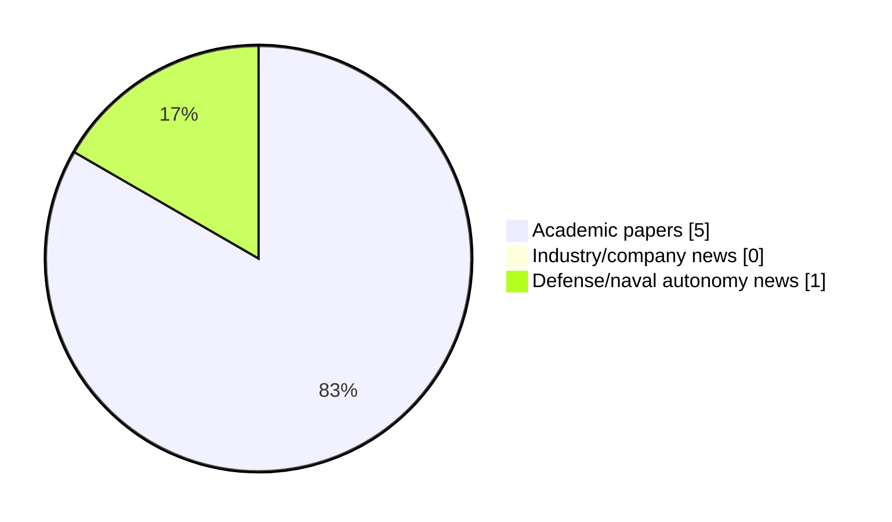

# Maritime Autonomy Watch — 2026-06-06

## Executive Summary

- Total selected items: 6
- Academic papers: 5
- Industry/company news: 0
- Defense/naval autonomy news: 1
- Failed/inaccessible sources: 0

## Contents

- [Analyst Brief](#analyst-brief)
- [Must Read](#must-read)
- [Top Signals Today](#top-signals-today)
- [Topic Signals](#topic-signals)
- [Freshness and Coverage](#freshness-and-coverage)
- [Quality Notes](#quality-notes)
- [Watchlist](#watchlist)
- [Academic Papers](#academic-papers)
- [Industry and Company News](#industry-and-company-news)
- [Defense and Naval Autonomy News](#defense-and-naval-autonomy-news)
- [Source Status Summary](#source-status-summary)

## Analyst Brief

Today's report selected 6 non-duplicate item(s), led by swarm autonomy, planning/control, AUV navigation. The strongest item is [Cooperative Circumnavigation for Multiple Unmanned Surface Vehicles Without External Localization](http://arxiv.org/abs/2606.04518v1) from arXiv.
Coverage is weighted toward academic research (5), with 0 industry and 1 defense signal(s).
Quality caveat: low-score-unique=2.

## Must Read

- [Cooperative Circumnavigation for Multiple Unmanned Surface Vehicles Without External Localization](http://arxiv.org/abs/2606.04518v1) — Research signal: USV operations
- [3D Underwater Path Planning via Generative Flow Field Surrogates](http://arxiv.org/abs/2606.06077v1) — Research signal: AUV navigation
- [Neural Radiated-Noise Fields for Unmanned Underwater Vehicle Noise Spectrum Prediction in Three-Dimensional Scenes](http://arxiv.org/abs/2606.04008v1) — Research signal: underwater communications
- [Task-Semantic Graph-Driven Distributed Agent Networking for Underwater Target Tracking](http://arxiv.org/abs/2605.15528v1) — Research signal: AUV navigation
- [Defense & Commercial Partnership to Build Autonomous Stealth Vessels](https://www.oceansciencetechnology.com/news/defense-commercial-partnership-to-build-autonomous-stealth-vessels/) — Defense signal: defense adoption

## Top Signals Today

- swarm autonomy: 4 selected item(s).
- planning/control: 3 selected item(s).
- AUV navigation: 3 selected item(s).
- underwater communications: 2 selected item(s).
- USV operations: 1 selected item(s).

## Topic Signals

- swarm autonomy: 4
- planning/control: 3
- AUV navigation: 3
- underwater communications: 2
- USV operations: 1
- perception: 1
- critical infrastructure: 1
- defense adoption: 1

## Freshness and Coverage

- Newest selected item date: 2026-06-05
- Oldest selected item date: 2026-05-15
- Active/enabled sources: 5
- Sources with access problems: 2
- Quality flags: 2

## Quality Notes

- low-score-unique: 2

## Watchlist

- [Defense & Commercial Partnership to Build Autonomous Stealth Vessels](https://www.oceansciencetechnology.com/news/defense-commercial-partnership-to-build-autonomous-stealth-vessels/) — low-score-unique
- [AoI-MDP: An AoI Optimized Markov Decision Process (Student Abstract)](http://arxiv.org/abs/2605.16777v1) — low-score-unique

### Category Snapshot

| Category | Selected items |
|---|---:|
| Academic papers | 5 |
| Industry/company news | 0 |
| Defense/naval autonomy news | 1 |

## Academic Papers

_Selected items: 5_

### [Cooperative Circumnavigation for Multiple Unmanned Surface Vehicles Without External Localization](http://arxiv.org/abs/2606.04518v1)

- Source: arXiv
- Date: 2026-06-03
- Relevance score: 9.75
- Authors: Xueming Liu, Lin Li, Xiang Zhou, Tianjiang Hu, Qingrui Zhang
- Signal: Research signal: USV operations
- Topic tags: USV operations, swarm autonomy, perception, planning/control

**Abstract**

This paper proposes a cooperative target circumnavigation framework for multiple unmanned surface vehicles (USVs) operating without external localization. The objective is to maintain a uniform circular formation of a specified radius around a target using only limited onboard sensing. The framework adopts a heterogeneous perception strategy that distinguishes between the asymmetric sensing relationships with the target and among the USVs. Specifically, the USVs obtain relative range and displacement measurements through active perception and inter-vehicle communication, while bearing measurements to a non-cooperative target are acquired via passive sensors. To estimate relative positions--both among USVs and between each USV and the target--we employ a Maximum Correntropy Kalman Filter and a Pseudo-Linear Kalman Filter, respectively.

**Why it matters**

Relevant to surface-vessel operations, multi-vehicle coordination; the work may inform maritime autonomy research, testing priorities, or system design.

---

### [3D Underwater Path Planning via Generative Flow Field Surrogates](http://arxiv.org/abs/2606.06077v1)

- Source: arXiv
- Date: 2026-06-04
- Relevance score: 9.25
- Authors: Zachary Cooper-Baldock, Paulo E. Santos, Russell S. A. Brinkworth, Karl Sammut
- Signal: Research signal: AUV navigation
- Topic tags: AUV navigation, planning/control, critical infrastructure

**Abstract**

Autonomous underwater vehicle (AUV) launch and recovery (LAR) into the hull of an advancing host platform requires traversal of a complex, three-dimensional propeller wake whose hydrodynamic structure cannot be characterised by a uniform current model. High-fidelity Reynolds-Averaged Navier-Stokes (RANS) Computational Fluid Dynamics (CFD) simulations resolve this structure with sufficient accuracy for path planning, but their computational cost renders them impractical for onboard use. We address this gap by integrating two conditional generative adversarial network (cGAN) architectures -- a regularised PatchGAN and a 2D3DGAN with self-attention -- as drop-in replacements for RANS CFD data within a three-dimensional, energy-weighted A* path planning framework.

**Why it matters**

Relevant to underwater autonomy, planning and control; the work may inform maritime autonomy research, testing priorities, or system design.

---

### [Neural Radiated-Noise Fields for Unmanned Underwater Vehicle Noise Spectrum Prediction in Three-Dimensional Scenes](http://arxiv.org/abs/2606.04008v1)

- Source: arXiv
- Date: 2026-05-29
- Relevance score: 8.5
- Authors: Yan Wu, Yang Yang, Jun Fan, Bin Wang
- Signal: Research signal: underwater communications
- Topic tags: underwater communications, swarm autonomy

**Abstract**

Radiated noise in unmanned underwater vehicles (UUVs) is an important indicator for characterizing acoustic signatures and evaluating platform performance. To address the strong dependence of traditional physics-based modeling and numerical simulation methods on target structural information and environmental boundary conditions, and their inability to achieve continuous spatial spectrum-response modeling in three-dimensional scenes, this paper proposes a neural radiated-noise field (NRNF). An NRNF represents the UUV radiated-noise spectrum as a continuous function of the three-dimensional UUV position, the three-dimensional hydrophone position, the UUV yaw angle, and the frequency, enabling query-based prediction at arbitrary spatial locations.

**Why it matters**

Relevant to underwater autonomy, multi-vehicle coordination; the work may inform maritime autonomy research, testing priorities, or system design.

---

### [Task-Semantic Graph-Driven Distributed Agent Networking for Underwater Target Tracking](http://arxiv.org/abs/2605.15528v1)

- Source: arXiv
- Date: 2026-05-15
- Relevance score: 7
- Authors: Shengchao Zhu, Guangjie Han, Chuan Lin, Yu He
- Signal: Research signal: AUV navigation
- Topic tags: AUV navigation, underwater communications, swarm autonomy, planning/control

**Abstract**

Autonomous underwater vehicle (AUV) swarms are emerging as intelligent underwater networks, where each node must sense, communicate, process local data, and make decisions under severe acoustic constraints. Persistent underwater target tracking is a typical task with moving targets, changing communication topology, intermittent acoustic links, and limited observation for each AUV. Multi-agent reinforcement learning (MARL) is a natural candidate for distributed tracking, yet existing studies still lack a unified open-source platform for evaluating different MARL algorithms under six-degree-of-freedom AUV dynamics. In addition, policies trained with raw geometric states and low-level force actions often struggle to represent task phases, observation reliability, link quality, and local cooperation roles.

**Why it matters**

Relevant to underwater autonomy, multi-vehicle coordination; the work may inform maritime autonomy research, testing priorities, or system design.

---

### [AoI-MDP: An AoI Optimized Markov Decision Process (Student Abstract)](http://arxiv.org/abs/2605.16777v1)

- Source: arXiv
- Date: 2026-05-16
- Relevance score: 3.5
- Authors: Yimian Ding, Jingzehua Xu, Yiyuan Yang, Guanwen Xie, Xinqi Wang, Shuai Zhang
- Signal: Research signal: AUV navigation
- Topic tags: AUV navigation, swarm autonomy
- Quality flags: low-score-unique

**Abstract**

Ocean exploration places high demands on autonomous underwater vehicles, especially when there's observation delay. We propose age of information optimized Markov decision process (AoI-MDP) to enhance underwater tasks by modeling observation delay as signal delay and including it in the state space. AoI-MDP also introduces wait time in the action space and integrates AoI with reward functions, optimizing information freshness and decision-making using reinforcement learning. Simulations show AoI-MDP outperforms the standard MDP, demonstrating superior performance, feasibility, and generalization in underwater tasks. To accelerate relevant research, we have made the codes available as open-source at https://github.com/Xiboxtg/AoI-MDP.

**Why it matters**

Relevant to underwater autonomy, multi-vehicle coordination; the work may inform maritime autonomy research, testing priorities, or system design.

---

## Industry and Company News

_Selected items: 0_

No selected items.

## Defense and Naval Autonomy News

_Selected items: 1_

### [Defense & Commercial Partnership to Build Autonomous Stealth Vessels](https://www.oceansciencetechnology.com/news/defense-commercial-partnership-to-build-autonomous-stealth-vessels/)

- Source: oceansciencetechnology.com
- Date: 2026-06-05
- Relevance score: 3.5
- Signal: Defense signal: defense adoption
- Topic tags: defense adoption
- Quality flags: low-score-unique

**Summary**

Fleetzero, Thoma-Sea Marine Constructors, and Glosten have collaborated to accelerate the development and deployment of integrated autonomous vessel solutions for.

**Why it matters**

Signals movement in naval adoption; useful for tracking operational concepts, procurement direction, and fleet integration.

---

## Inaccessible or Failed Sources

- None

## Source Status Summary

| Source | Status | Notes |
|---|---|---|
| arXiv | enabled | API source, 15 items fetched |
| OpenAlex | enabled | API source, 15 items fetched |
| RSS feeds | enabled | 107 RSS items fetched |
| SMI MASG News | enabled | HTML source, 10 items fetched |
| IEEE Xplore | disabled | Missing IEEE_XPLORE_API_KEY |
| Elsevier Scopus | enabled | API source, 15 items fetched |
| NewsAPI | disabled | Missing NEWS_API_KEY |

## Metadata

- Generated at: 2026-06-06T10:30:34.706553+02:00
- Date: 2026-06-06
- Repository: ferhannb/MarineRobotics
- Relevance threshold: 4.0
- Deduplication method: DOI, canonical URL, source ID, normalized title, similar recent titles, category caps, and novelty score
