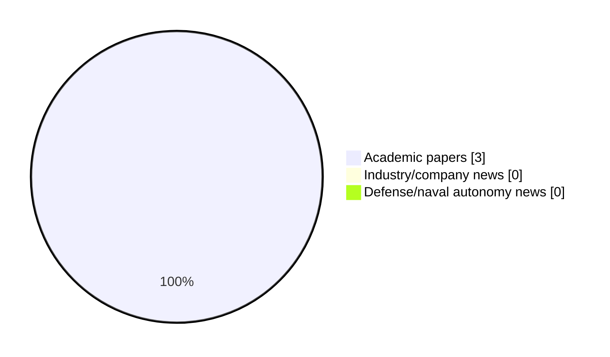

# Maritime Autonomy Watch — 2026-06-07

## Executive Summary

- Total selected items: 3
- Academic papers: 3
- Industry/company news: 0
- Defense/naval autonomy news: 0
- Failed/inaccessible sources: 0

## Contents

- [Analyst Brief](#analyst-brief)
- [Must Read](#must-read)
- [Top Signals Today](#top-signals-today)
- [Topic Signals](#topic-signals)
- [Freshness and Coverage](#freshness-and-coverage)
- [Quality Notes](#quality-notes)
- [Watchlist](#watchlist)
- [Academic Papers](#academic-papers)
- [Industry and Company News](#industry-and-company-news)
- [Defense and Naval Autonomy News](#defense-and-naval-autonomy-news)
- [Source Status Summary](#source-status-summary)

## Analyst Brief

Today's report selected 3 non-duplicate item(s), led by planning/control, USV operations, AUV navigation. The strongest item is [HDAO: A Hierarchical Curiosity-Driven Reinforcement Learning Approach for AUV Dynamic Obstacle Avoidance](https://doi.org/10.3390/jmse14080720) from OpenAlex.
Coverage is weighted toward academic research (3), with 0 industry and 0 defense signal(s).

## Must Read

- [HDAO: A Hierarchical Curiosity-Driven Reinforcement Learning Approach for AUV Dynamic Obstacle Avoidance](https://doi.org/10.3390/jmse14080720) — Research signal: AUV navigation
- [Moniagenttinen vahvistusoppiminen autonomisten miehittämättömien pinta-alusten kohteen etsintä- ja torjuntatehtävissä](https://openalex.org/W7161919734) — Research signal: USV operations
- [A Lightweight Toggleable Adhesion Prototype for Multirotor UAV Landing on Tilting Platforms](https://openalex.org/W7158422861) — Research signal: USV operations

## Top Signals Today

- planning/control: 3 selected item(s).
- USV operations: 2 selected item(s).
- AUV navigation: 1 selected item(s).
- perception: 1 selected item(s).
- swarm autonomy: 1 selected item(s).

## Topic Signals

- planning/control: 3
- USV operations: 2
- AUV navigation: 1
- perception: 1
- swarm autonomy: 1
- defense adoption: 1

## Freshness and Coverage

- Newest selected item date: 2026-04-24
- Oldest selected item date: 2026-04-14
- Active/enabled sources: 5
- Sources with access problems: 2
- Quality flags: 0

## Quality Notes

- No quality flags on selected items.

## Watchlist

- No watchlist items today.

### Category Snapshot

| Category | Selected items |
|---|---:|
| Academic papers | 3 |
| Industry/company news | 0 |
| Defense/naval autonomy news | 0 |

## Academic Papers

_Selected items: 3_

### [HDAO: A Hierarchical Curiosity-Driven Reinforcement Learning Approach for AUV Dynamic Obstacle Avoidance](https://doi.org/10.3390/jmse14080720)

- Source: OpenAlex
- Date: 2026-04-14
- Relevance score: 10
- Authors: 杜华争, Qian Liu, Xu Liu, Na Xia
- DOI: 10.3390/jmse14080720
- Signal: Research signal: AUV navigation
- Topic tags: AUV navigation, perception, planning/control

**Abstract**

Autonomous obstacle avoidance is a critical capability for Autonomous Underwater Vehicles (AUVs) to operate safely in dynamic and uncertain marine environments. Traditional AUV control methods rely on precise physical modeling and preset rules, yet they struggle to adapt to multiple sources of uncertainty, such as random initial states, dynamic obstacles, and varying currents. In recent years, deep reinforcement learning has provided a new avenue for data-driven adaptive policy learning. However, it remains insufficient for handling long-horizon tasks with sparse rewards. While hierarchical reinforcement learning can mitigate reward sparsity through temporal abstraction, it often faces challenges including exploration–exploitation imbalance, slow global convergence, and insufficient safety guarantees.

**Why it matters**

Relevant to underwater autonomy, navigation safety, planning and control; the work may inform maritime autonomy research, testing priorities, or system design.

---

### [Moniagenttinen vahvistusoppiminen autonomisten miehittämättömien pinta-alusten kohteen etsintä- ja torjuntatehtävissä](https://openalex.org/W7161919734)

- Source: OpenAlex
- Date: 2026-04-23
- Relevance score: 9.5
- Authors: Niki Leskinen
- Signal: Research signal: USV operations
- Topic tags: USV operations, swarm autonomy, planning/control, defense adoption

**Abstract**

Unmanned surface vehicles (USVs) have become prominent in naval warfare during the Russo-Ukrainian war. USVs can be operated remotely or with different levels of autonomy, either individually or as part of a swarm. A swarm can be described as a decentralized group that acts in coordination. Advances in machine learning (ML) and more powerful onboard computing for ML inference enable greater autonomy and more advanced swarming behavior for USVs. One approach for enabling autonomous swarming behavior is multi-agent reinforcement learning (MARL). MARL is a sub-area of ML in which multiple agents learn through trial and error to choose actions that maximize rewards provided by the environment. It has been widely applied in robotics and has been explored for the control of USVs.

**Why it matters**

Relevant to surface-vessel operations, multi-vehicle coordination, naval adoption; the work may inform maritime autonomy research, testing priorities, or system design.

---

### [A Lightweight Toggleable Adhesion Prototype for Multirotor UAV Landing on Tilting Platforms](https://openalex.org/W7158422861)

- Source: OpenAlex
- Date: 2026-04-24
- Relevance score: 6.75
- Authors: Teighin Nordholt, Melissa Greeff
- Signal: Research signal: USV operations
- Topic tags: USV operations, planning/control

**Abstract**

Autonomous multirotor landings on uncrewed surface vessels (USVs) are critical for persistent maritime operations but remain challenging due to wave-induced tilt, wind disturbances, and limited landing area. Many existing approaches exhibit small pose tolerance for reliable landing. This paper presents a lightweight toggleable adhesion mechanism to improve landing reliability. The system uses a motor-driven corkscrew that engages hook-and-loop material on the landing surface, enabling active adhesion during landing and controlled release during takeoff. We evaluate a prototype using a modified Crazyflie 2.0 and a custom tilting platform at fixed angles representative of extreme wave conditions. Using only a simple vertical PID controller, the proposed approach increases landing success from an average of 40% (baseline) to 80% across platform tilts up to 43 degrees using appropriately selected actuation settings.

**Why it matters**

Relevant to surface-vessel operations; the work may inform maritime autonomy research, testing priorities, or system design.

---

## Industry and Company News

_Selected items: 0_

No selected items.

## Defense and Naval Autonomy News

_Selected items: 0_

No selected items.

## Inaccessible or Failed Sources

- None

## Source Status Summary

| Source | Status | Notes |
|---|---|---|
| arXiv | enabled | API source, 15 items fetched |
| OpenAlex | enabled | API source, 15 items fetched |
| RSS feeds | enabled | 107 RSS items fetched |
| SMI MASG News | enabled | HTML source, 10 items fetched |
| IEEE Xplore | disabled | Missing IEEE_XPLORE_API_KEY |
| Elsevier Scopus | enabled | API source, 15 items fetched |
| NewsAPI | disabled | Missing NEWS_API_KEY |

## Metadata

- Generated at: 2026-06-07T10:52:35.139280+02:00
- Date: 2026-06-07
- Repository: ferhannb/MarineRobotics
- Relevance threshold: 4.0
- Deduplication method: DOI, canonical URL, source ID, normalized title, similar recent titles, category caps, and novelty score
