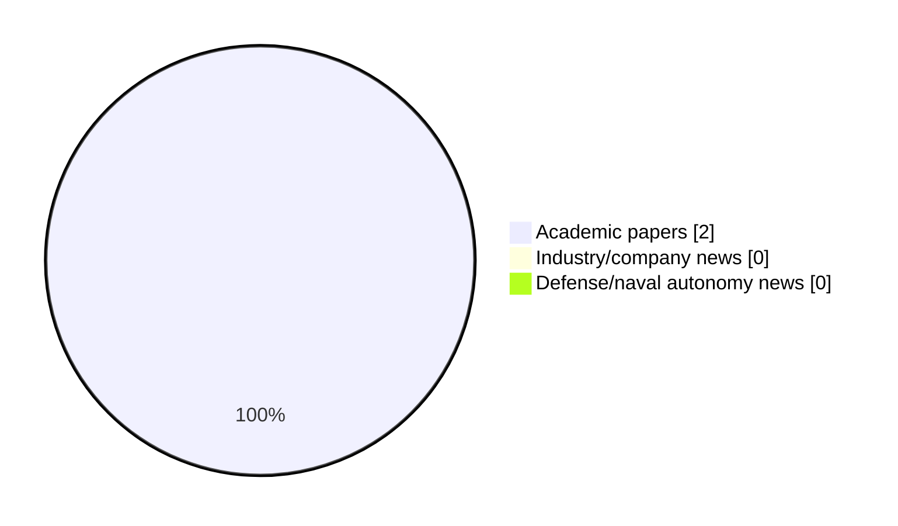

# Maritime Autonomy Watch — 2026-06-08

## Executive Summary

- Total selected items: 2
- Academic papers: 2
- Industry/company news: 0
- Defense/naval autonomy news: 0
- Failed/inaccessible sources: 0

## Contents

- [Analyst Brief](#analyst-brief)
- [Must Read](#must-read)
- [Top Signals Today](#top-signals-today)
- [Topic Signals](#topic-signals)
- [Freshness and Coverage](#freshness-and-coverage)
- [Quality Notes](#quality-notes)
- [Watchlist](#watchlist)
- [Academic Papers](#academic-papers)
- [Industry and Company News](#industry-and-company-news)
- [Defense and Naval Autonomy News](#defense-and-naval-autonomy-news)
- [Source Status Summary](#source-status-summary)

## Analyst Brief

Today's report selected 2 non-duplicate item(s), led by defense adoption, regulation/legal, AUV navigation. The strongest item is [Ubiquitous sensing of marine activities via the cooperation of autonomous underwater vehicles](https://api.elsevier.com/content/abstract/scopus_id/105028115165) from Elsevier Scopus.
Coverage is weighted toward academic research (2), with 0 industry and 0 defense signal(s).
Quality caveat: low-score-unique=1, missing-summary=1, date-anomaly=1.

## Must Read

- [Legal Implications of Autonomous Warships under UNCLOS: Navigating Definitional Gaps in International Maritime Law](https://doi.org/10.58829/lp.12.2.2025.289) — Research signal: defense adoption

## Top Signals Today

- defense adoption: 1 selected item(s).
- regulation/legal: 1 selected item(s).
- AUV navigation: 1 selected item(s).
- perception: 1 selected item(s).

## Topic Signals

- defense adoption: 1
- regulation/legal: 1
- AUV navigation: 1
- perception: 1

## Freshness and Coverage

- Newest selected item date: 2026-12-01
- Oldest selected item date: 2026-04-24
- Active/enabled sources: 5
- Sources with access problems: 2
- Quality flags: 3

## Quality Notes

- low-score-unique: 1
- missing-summary: 1
- date-anomaly: 1
- Date anomalies: [Ubiquitous sensing of marine activities via the cooperation of autonomous underwater vehicles](https://api.elsevier.com/content/abstract/scopus_id/105028115165) reports 2026-12-01

## Watchlist

- [Legal Implications of Autonomous Warships under UNCLOS: Navigating Definitional Gaps in International Maritime Law](https://doi.org/10.58829/lp.12.2.2025.289) — low-score-unique
- [Ubiquitous sensing of marine activities via the cooperation of autonomous underwater vehicles](https://api.elsevier.com/content/abstract/scopus_id/105028115165) — missing-summary, date-anomaly

### Category Snapshot

| Category | Selected items |
|---|---:|
| Academic papers | 2 |
| Industry/company news | 0 |
| Defense/naval autonomy news | 0 |

## Academic Papers

_Selected items: 2_

### [Legal Implications of Autonomous Warships under UNCLOS: Navigating Definitional Gaps in International Maritime Law](https://doi.org/10.58829/lp.12.2.2025.289)

- Source: OpenAlex
- Date: 2026-04-24
- Relevance score: 3.5
- Authors: Afiat Yudhistira, Davina Oktivana
- DOI: 10.58829/lp.12.2.2025.289
- Signal: Research signal: defense adoption
- Topic tags: defense adoption, regulation/legal
- Quality flags: low-score-unique

**Abstract**

Rapid technological advancements have outpaced legal frameworks in regulating autonomous warships, as United Nations Convention on the Law of the Sea (UNCLOS) human-centered definition fails to accommodate crewless or semi-autonomous vessels in modern naval operations. This study examines the legal implications of this definitional gap and explores how international law might evolve to address the governance of autonomous warships. Key issues include sovereignty, accountability, and compliance with existing maritime and wartime legal norms, such as whether a fully autonomous vessel can qualify as a warship under UNCLOS and what responsibilities states bear for their actions in conflict scenarios.

**Why it matters**

Relevant to naval adoption; the work may inform maritime autonomy research, testing priorities, or system design.

---

### [Ubiquitous sensing of marine activities via the cooperation of autonomous underwater vehicles](https://api.elsevier.com/content/abstract/scopus_id/105028115165)

- Source: Elsevier Scopus
- Date: 2026-12-01
- Relevance score: 4.25
- DOI: 10.1038/s41598-025-29532-y
- Signal: Research signal: AUV navigation
- Topic tags: AUV navigation, perception
- Quality flags: missing-summary, date-anomaly

**Abstract**

No summary available.

**Why it matters**

Relevant to underwater autonomy; the work may inform maritime autonomy research, testing priorities, or system design.

---

## Industry and Company News

_Selected items: 0_

No selected items.

## Defense and Naval Autonomy News

_Selected items: 0_

No selected items.

## Inaccessible or Failed Sources

- None

## Source Status Summary

| Source | Status | Notes |
|---|---|---|
| arXiv | enabled | API source, 15 items fetched |
| OpenAlex | enabled | API source, 15 items fetched |
| RSS feeds | enabled | 107 RSS items fetched |
| SMI MASG News | enabled | HTML source, 10 items fetched |
| IEEE Xplore | disabled | Missing IEEE_XPLORE_API_KEY |
| Elsevier Scopus | enabled | API source, 15 items fetched |
| NewsAPI | disabled | Missing NEWS_API_KEY |

## Metadata

- Generated at: 2026-06-08T12:47:20.252487+02:00
- Date: 2026-06-08
- Repository: ferhannb/MarineRobotics
- Relevance threshold: 4.0
- Deduplication method: DOI, canonical URL, source ID, normalized title, similar recent titles, category caps, and novelty score
