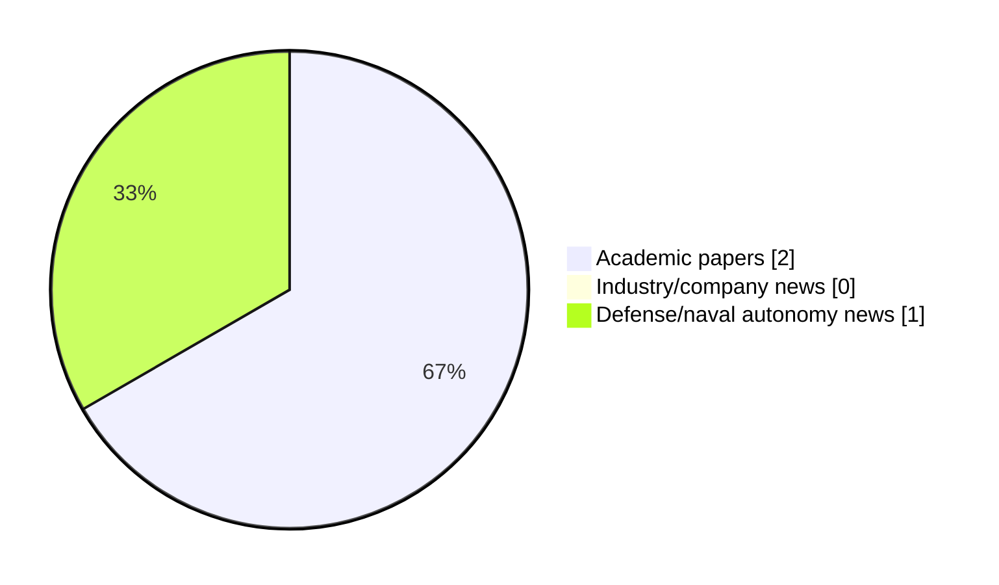

# Maritime Autonomy Watch — 2026-06-09

## Executive Summary

- Total selected items: 3
- Academic papers: 2
- Industry/company news: 0
- Defense/naval autonomy news: 1
- Failed/inaccessible sources: 0

## Contents

- [Analyst Brief](#analyst-brief)
- [Must Read](#must-read)
- [Top Signals Today](#top-signals-today)
- [Topic Signals](#topic-signals)
- [Freshness and Coverage](#freshness-and-coverage)
- [Quality Notes](#quality-notes)
- [Watchlist](#watchlist)
- [Academic Papers](#academic-papers)
- [Industry and Company News](#industry-and-company-news)
- [Defense and Naval Autonomy News](#defense-and-naval-autonomy-news)
- [Source Status Summary](#source-status-summary)

## Analyst Brief

Today's report selected 3 non-duplicate item(s), led by USV operations, AUV navigation, perception. The strongest item is [Towards End to End Motion Planning and Execution for Autonomous Underwater Vehicles Using Reinforcement Learning](http://arxiv.org/abs/2606.08513v1) from arXiv.
Coverage is weighted toward academic research (2), with 0 industry and 1 defense signal(s).
Quality caveat: missing-summary=1, date-anomaly=1.

## Must Read

- [Towards End to End Motion Planning and Execution for Autonomous Underwater Vehicles Using Reinforcement Learning](http://arxiv.org/abs/2606.08513v1) — Research signal: AUV navigation
- [Bulgarian shipbuilder reveals new Medium USV concept](https://www.navalnews.com/naval-news/2026/06/bulgarian-shipbuilder-reveals-new-medium-usv-concept/) — Defense signal: USV operations

## Top Signals Today

- USV operations: 2 selected item(s).
- AUV navigation: 1 selected item(s).
- perception: 1 selected item(s).
- planning/control: 1 selected item(s).
- critical infrastructure: 1 selected item(s).

## Topic Signals

- USV operations: 2
- AUV navigation: 1
- perception: 1
- planning/control: 1
- critical infrastructure: 1

## Freshness and Coverage

- Newest selected item date: 2026-12-01
- Oldest selected item date: 2026-06-07
- Active/enabled sources: 4
- Sources with access problems: 3
- Quality flags: 2

## Quality Notes

- missing-summary: 1
- date-anomaly: 1
- Date anomalies: [Multi-object tracker for combating Maritime low visibility and non-linear motion in USV-Based Surveillance](https://api.elsevier.com/content/abstract/scopus_id/105039317339) reports 2026-12-01

## Watchlist

- [Multi-object tracker for combating Maritime low visibility and non-linear motion in USV-Based Surveillance](https://api.elsevier.com/content/abstract/scopus_id/105039317339) — missing-summary, date-anomaly

### Category Snapshot

| Category | Selected items |
|---|---:|
| Academic papers | 2 |
| Industry/company news | 0 |
| Defense/naval autonomy news | 1 |

## Academic Papers

_Selected items: 2_

### [Towards End to End Motion Planning and Execution for Autonomous Underwater Vehicles Using Reinforcement Learning](http://arxiv.org/abs/2606.08513v1)

- Source: arXiv
- Date: 2026-06-07
- Relevance score: 9.25
- Authors: Elisei Shafer, Oren Gal
- Signal: Research signal: AUV navigation
- Topic tags: AUV navigation, perception, planning/control, critical infrastructure

**Abstract**

Autonomous Underwater Vehicles (AUVs) traditionally rely on complex, heavily engineered pipelines for perception, path planning, and motion control. This paper explores the feasibility of an end-to-end Deep Reinforcement Learning (DRL) approach that maps raw sensor data directly to thruster commands, reducing manual engineering. We propose a hierarchical reinforcement learning (HRL) architecture splitting the problem into two Markov Decision Processes. A High-Level (HL) policy operating at 2Hz processes raw $84 \times 84$ pixel monocular camera frames, stacked $100 \times 100$ pixel forward-looking imaging sonar, and proprioceptive data to generate spatial subgoals. Simultaneously, a Low-Level (LL) policy operating at 10Hz converts these subgoals into thruster commands.

**Why it matters**

Relevant to underwater autonomy, navigation safety, planning and control; the work may inform maritime autonomy research, testing priorities, or system design.

---

### [Multi-object tracker for combating Maritime low visibility and non-linear motion in USV-Based Surveillance](https://api.elsevier.com/content/abstract/scopus_id/105039317339)

- Source: Elsevier Scopus
- Date: 2026-12-01
- Relevance score: 5.25
- DOI: 10.1016/j.displa.2026.103507
- Signal: Research signal: USV operations
- Topic tags: USV operations
- Quality flags: missing-summary, date-anomaly

**Abstract**

No summary available.

**Why it matters**

Relevant to surface-vessel operations; the work may inform maritime autonomy research, testing priorities, or system design.

---

## Industry and Company News

_Selected items: 0_

No selected items.

## Defense and Naval Autonomy News

_Selected items: 1_

### [Bulgarian shipbuilder reveals new Medium USV concept](https://www.navalnews.com/naval-news/2026/06/bulgarian-shipbuilder-reveals-new-medium-usv-concept/)

- Source: navalnews.com
- Date: 2026-06-09
- Relevance score: 6
- Signal: Defense signal: USV operations
- Topic tags: USV operations

**Summary**

During the International Defence Equipment and Services Exhibition HEMUS 2026, held in Plovdiv, Bulgaria, from 3–6 June 2026, Bulgarian shipbuilder MTG-Dolphin unveiled its Proteus 36 MLC concept, a 37-metre Medium Unmanned Surface Vessel (MUSV). MTG-Dolphin press release PLOVDIV, BULGARIA – 3 June 2026 – The european shipbuilder MTG-Dolphin today officially presented its Proteus 36 MLC.

**Why it matters**

Signals movement in surface-vessel operations, naval adoption; useful for tracking operational concepts, procurement direction, and fleet integration.

---

## Inaccessible or Failed Sources

- None

## Source Status Summary

| Source | Status | Notes |
|---|---|---|
| arXiv | enabled | API source, 15 items fetched |
| OpenAlex | enabled | API source, 15 items fetched |
| RSS feeds | partial | 85 RSS items fetched; failures: https://massworld.news/feed/: Invalid XML from https://massworld.news/feed/: mismatched tag: line 93, column 2; https://oceannews.com/feed/: Invalid XML from https://oceannews.com/feed/: mismatched tag: line 93, column 2 |
| SMI MASG News | enabled | HTML source, 0 items fetched |
| IEEE Xplore | disabled | Missing IEEE_XPLORE_API_KEY |
| Elsevier Scopus | enabled | API source, 15 items fetched |
| NewsAPI | disabled | Missing NEWS_API_KEY |

## Metadata

- Generated at: 2026-06-09T11:37:27.962793+02:00
- Date: 2026-06-09
- Repository: ferhannb/MarineRobotics
- Relevance threshold: 4.0
- Deduplication method: DOI, canonical URL, source ID, normalized title, similar recent titles, category caps, and novelty score
