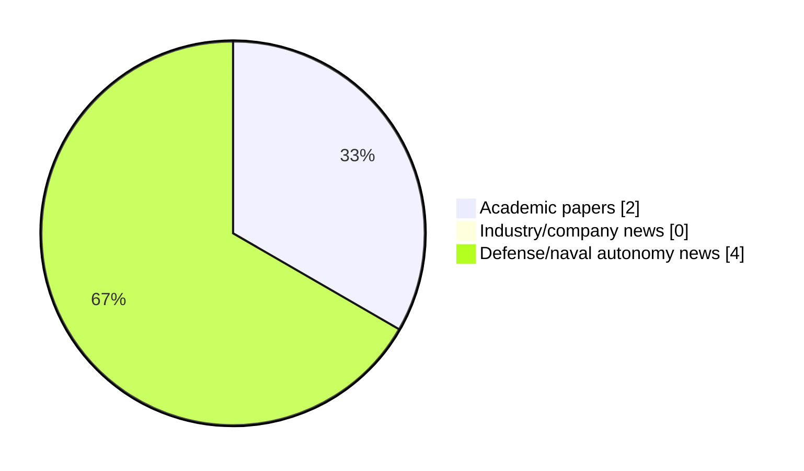

# Maritime Autonomy Watch — 2026-06-10

## Executive Summary

- Total selected items: 6
- Academic papers: 2
- Industry/company news: 0
- Defense/naval autonomy news: 4
- Failed/inaccessible sources: 0

## Contents

- [Analyst Brief](#analyst-brief)
- [Must Read](#must-read)
- [Top Signals Today](#top-signals-today)
- [Topic Signals](#topic-signals)
- [Freshness and Coverage](#freshness-and-coverage)
- [Quality Notes](#quality-notes)
- [Watchlist](#watchlist)
- [Academic Papers](#academic-papers)
- [Industry and Company News](#industry-and-company-news)
- [Defense and Naval Autonomy News](#defense-and-naval-autonomy-news)
- [Source Status Summary](#source-status-summary)

## Analyst Brief

Today's report selected 6 non-duplicate item(s), led by USV operations, AUV navigation, defense adoption. The strongest item is [Bayou Metal Launches Dedicated Line to Scale ROMULUS USV Production](https://oceannews.com/news/defense/bayou-metal-launches-dedicated-line-to-scale-romulus-usv-production/) from oceannews.com.
Coverage is weighted toward academic research (2), with 0 industry and 4 defense signal(s).

## Must Read

- [Bayou Metal Launches Dedicated Line to Scale ROMULUS USV Production](https://oceannews.com/news/defense/bayou-metal-launches-dedicated-line-to-scale-romulus-usv-production/) — Defense signal: USV operations
- [Multimodal AUV Mapping Demonstrated at ESP MINEX-26](https://www.oceansciencetechnology.com/news/iqua-robotics-demonstrates-multimodal-auv-mapping-at-esp-minex-26/) — Defense signal: AUV navigation
- [Sea Trial Validation of the ROS-DESERT Middleware with Autonomous Underwater Vehicles](http://arxiv.org/abs/2605.23553v1) — Research signal: AUV navigation
- [Pentagon Eyes New USV for Indo-Pacific Contested Logistics](https://www.navalnews.com/naval-news/2026/06/pentagon-eyes-new-usv-for-indo-pacific-contested-logistics/) — Defense signal: USV operations
- [Path Following Control System of Line-of-Sight Guidance for Robotic Dolphin with Multi-Link Mechanism in Underwater Simulator](http://arxiv.org/abs/2605.25401v1) — Research signal: AUV navigation

## Top Signals Today

- USV operations: 3 selected item(s).
- AUV navigation: 3 selected item(s).
- defense adoption: 3 selected item(s).
- planning/control: 2 selected item(s).
- underwater communications: 1 selected item(s).

## Topic Signals

- USV operations: 3
- AUV navigation: 3
- defense adoption: 3
- planning/control: 2
- underwater communications: 1

## Freshness and Coverage

- Newest selected item date: 2026-06-10
- Oldest selected item date: 2026-05-22
- Active/enabled sources: 5
- Sources with access problems: 2
- Quality flags: 0

## Quality Notes

- No quality flags on selected items.

## Watchlist

- No watchlist items today.

### Category Snapshot

| Category | Selected items |
|---|---:|
| Academic papers | 2 |
| Industry/company news | 0 |
| Defense/naval autonomy news | 4 |

## Academic Papers

_Selected items: 2_

### [Sea Trial Validation of the ROS-DESERT Middleware with Autonomous Underwater Vehicles](http://arxiv.org/abs/2605.23553v1)

- Source: arXiv
- Date: 2026-05-22
- Relevance score: 9.25
- Authors: Davide Cosimo, Davide Costa, Riccardo Costanzi, Filippo Campagnaro, Andrea Caiti, Michele Zorzi
- Signal: Research signal: AUV navigation
- Topic tags: AUV navigation, underwater communications, planning/control

**Abstract**

This paper presents a modular software architecture that enables environmental-aware coordination of heterogeneous Autonomous Underwater Vehicles (AUVs) to improve underwater acoustic connectivity. The architecture combines a Robot Operating System 2 application layer with the DESERT Underwater communication framework through the rmw_desert middleware, and integrates a Robot Operating System 1 bridge to ensure interoperability with legacy vehicle front-seat controllers. This design enables fine-grained, cross-layer configurability of the communication stack and supports onboard processing of environmental measurements to inform adaptive communication behaviors. As a representative use case, this architecture is used to implement a lightweight depth-optimization strategy that exploits environmental awareness and AUV mobility to improve acoustic link performance.

**Why it matters**

Relevant to underwater autonomy; the work may inform maritime autonomy research, testing priorities, or system design.

---

### [Path Following Control System of Line-of-Sight Guidance for Robotic Dolphin with Multi-Link Mechanism in Underwater Simulator](http://arxiv.org/abs/2605.25401v1)

- Source: arXiv
- Date: 2026-05-25
- Relevance score: 6.25
- Authors: Takumi Asada, Takao Oki, Hideo Furuhashi, Kenta Tabata, Renato Miyagusuku, Koichi Ozaki
- Signal: Research signal: AUV navigation
- Topic tags: AUV navigation, planning/control

**Abstract**

Biomimetic autonomous underwater vehicle (BAUV) with multi-link mechanism is widely used in aquatic life observation and environmental surveys due to its low power consumption and high maneuverability. An environmental survey requires a path following system that automatically follows specific points. However, the path following system of BAUV is limited, and its evaluation with multi-link mechanism robots has not yet been clarified. The path following system in BAUV requires prior simulation because the model differs depending on the type of biomimetics. In this study, we propose a path following system for BAUVs with a multi-link mechanism and evaluation in underwater simulation. In this result, it was possible to design a path following system suitable for BAUV, determine parameters using a simulator, and evaluate control methods.

**Why it matters**

Relevant to underwater autonomy; the work may inform maritime autonomy research, testing priorities, or system design.

---

## Industry and Company News

_Selected items: 0_

No selected items.

## Defense and Naval Autonomy News

_Selected items: 4_

### [Bayou Metal Launches Dedicated Line to Scale ROMULUS USV Production](https://oceannews.com/news/defense/bayou-metal-launches-dedicated-line-to-scale-romulus-usv-production/)

- Source: oceannews.com
- Date: 2026-06-09
- Relevance score: 10
- Signal: Defense signal: USV operations
- Topic tags: USV operations
- Also reported by: https://www.naval-technology.com/feed/

**Summary**

HII, America's largest military shipbuilder and a global leader in autonomous maritime systems, has announced that Bayou Metal Supply & Manufacturing, a strategic partner in the serial production of HII's ROMULUS unmanned surface vessels (USVs), has launched a dedicated manufacturing line to support accelerated construction of the platform.

**Why it matters**

Signals movement in surface-vessel operations; useful for tracking operational concepts, procurement direction, and fleet integration.

---

### [Multimodal AUV Mapping Demonstrated at ESP MINEX-26](https://www.oceansciencetechnology.com/news/iqua-robotics-demonstrates-multimodal-auv-mapping-at-esp-minex-26/)

- Source: oceansciencetechnology.com
- Date: 2026-06-10
- Relevance score: 9.25
- Signal: Defense signal: AUV navigation
- Topic tags: AUV navigation, defense adoption

**Summary**

IQUA Robotics participated in the ESP MINEX-26 naval exercise, deploying advanced Autonomous Underwater Vehicles (AUVs) alongside the University of the.

**Why it matters**

Signals movement in underwater autonomy, naval adoption; useful for tracking operational concepts, procurement direction, and fleet integration.

---

### [Pentagon Eyes New USV for Indo-Pacific Contested Logistics](https://www.navalnews.com/naval-news/2026/06/pentagon-eyes-new-usv-for-indo-pacific-contested-logistics/)

- Source: navalnews.com
- Date: 2026-06-09
- Relevance score: 6.75
- Signal: Defense signal: USV operations
- Topic tags: USV operations, defense adoption

**Summary**

The Pentagon is looking to procure dozens of unmanned surface vessels (USV) to deliver to support U.S. Army logistics operations under contested environments in the Indo-Pacific. According to a release from the Defense Innovation Unit (DIU) last month, the Defense Department wants to bolster the ground branch’s maritime logistics arm and greatly increase the fleet’s.

**Why it matters**

Signals movement in surface-vessel operations, naval adoption; useful for tracking operational concepts, procurement direction, and fleet integration.

---

### [Saronic USV Rescues Two U.S. Army Pilots Downed by Iran](https://www.navalnews.com/naval-news/2026/06/saronic-usv-rescues-two-u-s-army-pilots-downed-by-iran/)

- Source: navalnews.com
- Date: 2026-06-09
- Relevance score: 6
- Signal: Defense signal: USV operations
- Topic tags: USV operations, defense adoption

**Summary**

A U.S. Navy drone task force picked up two downed pilots using a Saronic Corsair unmanned surface vessel (USV) yesterday in Middle Eastern waters during a first of its kind rescue mission. As first reported by the Wall Street Journal, two Army pilots patrolling regional waters near Oman were rescued after their AH-64 attack helicopter.

**Why it matters**

Signals movement in surface-vessel operations, naval adoption; useful for tracking operational concepts, procurement direction, and fleet integration.

---

## Inaccessible or Failed Sources

- None

## Source Status Summary

| Source | Status | Notes |
|---|---|---|
| arXiv | enabled | API source, 15 items fetched |
| OpenAlex | enabled | API source, 15 items fetched |
| RSS feeds | enabled | 107 RSS items fetched |
| SMI MASG News | enabled | HTML source, 10 items fetched |
| IEEE Xplore | disabled | Missing IEEE_XPLORE_API_KEY |
| Elsevier Scopus | enabled | API source, 15 items fetched |
| NewsAPI | disabled | Missing NEWS_API_KEY |

## Metadata

- Generated at: 2026-06-10T11:53:50.071811+02:00
- Date: 2026-06-10
- Repository: ferhannb/MarineRobotics
- Relevance threshold: 4.0
- Deduplication method: DOI, canonical URL, source ID, normalized title, similar recent titles, category caps, and novelty score
