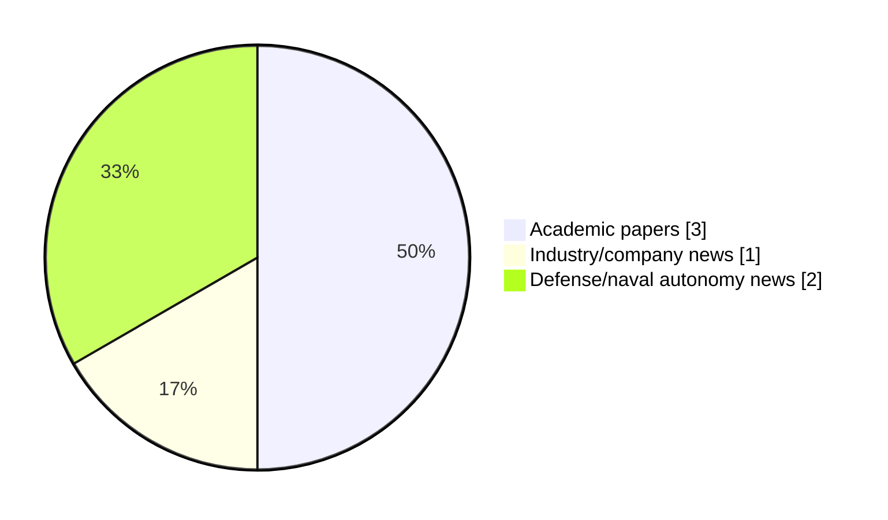

# Maritime Autonomy Watch — 2026-06-11

## Executive Summary

- Total selected items: 6
- Academic papers: 3
- Industry/company news: 1
- Defense/naval autonomy news: 2
- Failed/inaccessible sources: 0

## Contents

- [Analyst Brief](#analyst-brief)
- [Must Read](#must-read)
- [Top Signals Today](#top-signals-today)
- [Topic Signals](#topic-signals)
- [Freshness and Coverage](#freshness-and-coverage)
- [Quality Notes](#quality-notes)
- [Watchlist](#watchlist)
- [Academic Papers](#academic-papers)
- [Industry and Company News](#industry-and-company-news)
- [Defense and Naval Autonomy News](#defense-and-naval-autonomy-news)
- [Source Status Summary](#source-status-summary)

## Analyst Brief

Today's report selected 6 non-duplicate item(s), led by AUV navigation, USV operations, planning/control. The strongest item is [Traceable Virtual Sea Trials in the Marine Robotics Unity Simulator for Manoeuvring Assessment of Unmanned Surface Vehicles](http://arxiv.org/abs/2606.12349v1) from arXiv.
Coverage is weighted toward academic research (3), with 1 industry and 2 defense signal(s).

## Must Read

- [Traceable Virtual Sea Trials in the Marine Robotics Unity Simulator for Manoeuvring Assessment of Unmanned Surface Vehicles](http://arxiv.org/abs/2606.12349v1) — Research signal: USV operations
- [Trust, Geometry, and Rules: A Credibility-Aware Reinforcement Learning Framework for Safe USV Navigation under Uncertainty](http://arxiv.org/abs/2605.26974v3) — Research signal: USV operations
- [Semantically-Aware Diver Activity Recognition Framework for Effective Underwater Multi-Human-Robot Collaboration](http://arxiv.org/abs/2606.12374v1) — Research signal: AUV navigation
- [PXGEO Signs Framework Agreement with Equinor for AUV Testing](https://oceannews.com/news/subsea-and-survey/pxgeo-signs-framework-agreement-with-equinor-for-auv-testing/) — Industry signal: AUV navigation
- [Strategic Partnership Formed for AUV Defense Technology](https://www.oceansciencetechnology.com/news/strategic-partnership-formed-for-auv-defense-technology/) — Defense signal: AUV navigation

## Top Signals Today

- AUV navigation: 3 selected item(s).
- USV operations: 2 selected item(s).
- planning/control: 2 selected item(s).
- critical infrastructure: 2 selected item(s).
- swarm autonomy: 1 selected item(s).

## Topic Signals

- AUV navigation: 3
- USV operations: 2
- planning/control: 2
- critical infrastructure: 2
- swarm autonomy: 1
- perception: 1
- defense adoption: 1
- general autonomy: 1

## Freshness and Coverage

- Newest selected item date: 2026-06-11
- Oldest selected item date: 2026-05-26
- Active/enabled sources: 5
- Sources with access problems: 2
- Quality flags: 0

## Quality Notes

- No quality flags on selected items.

## Watchlist

- No watchlist items today.

### Category Snapshot

| Category | Selected items |
|---|---:|
| Academic papers | 3 |
| Industry/company news | 1 |
| Defense/naval autonomy news | 2 |

## Academic Papers

_Selected items: 3_

### [Traceable Virtual Sea Trials in the Marine Robotics Unity Simulator for Manoeuvring Assessment of Unmanned Surface Vehicles](http://arxiv.org/abs/2606.12349v1)

- Source: arXiv
- Date: 2026-06-10
- Relevance score: 10
- Authors: Paria Rezayan
- Signal: Research signal: USV operations
- Topic tags: USV operations, planning/control, critical infrastructure

**Abstract**

Accurate identification of hydrodynamic derivatives is essential for control and navigation of Unmanned Surface Vehicles (USVs), but high-fidelity manoeuvring data from physical sea trials are constrained by cost and safety. Turning Circle (TC) and Zig-Zag (ZZ) trials remain fundamental to IMO and ITTC assessment procedures. This paper extends the Marine Robotics Unity Simulator (MARUS) by introducing a standardised Virtual Sea Trial framework for automated execution and data generation of TC/ZZ manoeuvres, with traceable command-actuation logging, system-identification (SI)-focused data conditioning, and automated extraction of IMO/ITTC-aligned manoeuvring metrics. A key contribution is a dedicated TC/ZZ data acquisition and post-processing pipeline, improving the repeatability and auditability of simulator-based manoeuvres while producing SI-ready datasets for hydrodynamic-derivative identification and digital-twin workflows.

**Why it matters**

Relevant to surface-vessel operations; the work may inform maritime autonomy research, testing priorities, or system design.

---

### [Trust, Geometry, and Rules: A Credibility-Aware Reinforcement Learning Framework for Safe USV Navigation under Uncertainty](http://arxiv.org/abs/2605.26974v3)

- Source: arXiv
- Date: 2026-05-26
- Relevance score: 10
- Authors: Yuhang Zhang, Shuqi Chai, Yukang Zhang, Liusha Yang, Mingchuan Zhang, Wei Wang, Qingjiang Shi, Quanbo Ge
- Signal: Research signal: USV operations
- Topic tags: USV operations, swarm autonomy, perception

**Abstract**

Autonomous navigation of Unmanned Surface Vehicles (USVs) that is safe and compliant with the International Regulations for Preventing Collisions at Sea (COLREGs) remains a formidable challenge in dynamic maritime environments, particularly when perception systems exhibit miscalibrated uncertainty. Existing Reinforcement Learning (RL)-based methods often falter because state-estimation errors induce unreliable belief states that mislead the value function, while discrete traffic rules introduce discontinuity in the learning objective. To address these challenges, we propose a framework integrating credibility-aware learning, geometric safety shielding, and continuous rule-aware embedding.

**Why it matters**

Relevant to surface-vessel operations, multi-vehicle coordination, navigation safety; the work may inform maritime autonomy research, testing priorities, or system design.

---

### [Semantically-Aware Diver Activity Recognition Framework for Effective Underwater Multi-Human-Robot Collaboration](http://arxiv.org/abs/2606.12374v1)

- Source: arXiv
- Date: 2026-06-10
- Relevance score: 7.75
- Authors: Sadman Sakib Enan, Junaed Sattar
- Signal: Research signal: AUV navigation
- Topic tags: AUV navigation, planning/control

**Abstract**

Effective multi-human-robot collaboration is essential for expanding human-led operations in the challenging and high-risk underwater environment. For autonomous underwater vehicles (AUVs) to become true teammates, they must be able to comprehend their surroundings and recognize a diver's activities to offer assistance and ensure safety. Towards this goal, we introduce DAR-Net, a novel transformer-based framework that analyzes complex underwater scenes to classify diver activities. Our contribution lies in a semantically guided learning formulation that couples transformer-based temporal reasoning with pixel-level scene supervision. This multi-loss training strategy explicitly aligns global activity recognition with local human-robot interaction semantics, which is particularly critical in low-visibility underwater conditions.

**Why it matters**

Relevant to underwater autonomy; the work may inform maritime autonomy research, testing priorities, or system design.

---

## Industry and Company News

_Selected items: 1_

### [PXGEO Signs Framework Agreement with Equinor for AUV Testing](https://oceannews.com/news/subsea-and-survey/pxgeo-signs-framework-agreement-with-equinor-for-auv-testing/)

- Source: oceannews.com
- Date: 2026-06-10
- Relevance score: 5
- Signal: Industry signal: AUV navigation
- Topic tags: AUV navigation, critical infrastructure

**Summary**

PXGEO and Equinor have signed a one-year framework agreement to run autonomous inspection trials with the Saab Sabertooth. The work tests and verifies Saab Sabertooth Underwater Intervention Drone (UID) technology, validating autonomous behaviors for offshore inspection.

**Why it matters**

Signals momentum in underwater autonomy, infrastructure monitoring; useful for tracking product direction, partnerships, and deployment opportunities.

---

## Defense and Naval Autonomy News

_Selected items: 2_

### [Strategic Partnership Formed for AUV Defense Technology](https://www.oceansciencetechnology.com/news/strategic-partnership-formed-for-auv-defense-technology/)

- Source: oceansciencetechnology.com
- Date: 2026-06-11
- Relevance score: 4.25
- Signal: Defense signal: AUV navigation
- Topic tags: AUV navigation, defense adoption

**Summary**

KONGSBERG and DRASS have formed a strategic partnership to develop advanced underwater solutions designed to address evolving defense needs driven.

**Why it matters**

Signals movement in underwater autonomy, naval adoption; useful for tracking operational concepts, procurement direction, and fleet integration.

---

### [Clear Robotics Lands Funding to Build the World’s Largest Fleet of Zero-Emission Autonomous Ships](https://oceannews.com/news/science-technology/clear-robotics-lands-funding-to-build-the-worlds-largest-fleet-of-zero-emission-autonomous-ships/)

- Source: oceannews.com
- Date: 2026-06-10
- Relevance score: 4.25
- Signal: Defense signal: general autonomy
- Topic tags: general autonomy

**Summary**

Clear Robotics, a made-in-India maritime technology company, has announced that it closed a $1.75 million USD Pre-Series A funding round to scale its commercially proven fleet of AI-enabled autonomous vessels globally.

**Why it matters**

This item may signal operational adoption, procurement priorities, or naval autonomy doctrine shifts.

---

## Inaccessible or Failed Sources

- None

## Source Status Summary

| Source | Status | Notes |
|---|---|---|
| arXiv | enabled | API source, 15 items fetched |
| OpenAlex | enabled | API source, 15 items fetched |
| RSS feeds | enabled | 107 RSS items fetched |
| SMI MASG News | enabled | HTML source, 10 items fetched |
| IEEE Xplore | disabled | Missing IEEE_XPLORE_API_KEY |
| Elsevier Scopus | enabled | API source, 15 items fetched |
| NewsAPI | disabled | Missing NEWS_API_KEY |

## Metadata

- Generated at: 2026-06-11T12:20:50.045582+02:00
- Date: 2026-06-11
- Repository: ferhannb/MarineRobotics
- Relevance threshold: 4.0
- Deduplication method: DOI, canonical URL, source ID, normalized title, similar recent titles, category caps, and novelty score
