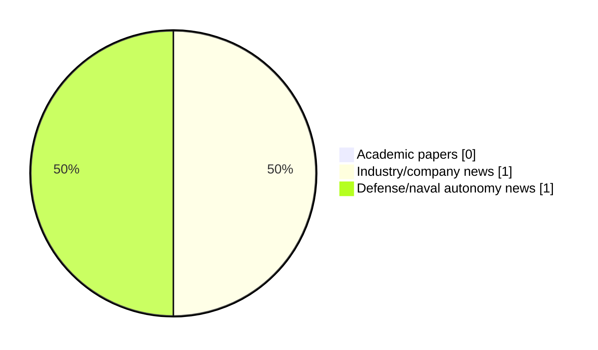

# Maritime Autonomy Watch — 2026-06-12

## Executive Summary

- Total selected items: 2
- Academic papers: 0
- Industry/company news: 1
- Defense/naval autonomy news: 1
- Failed/inaccessible sources: 0

## Contents

- [Analyst Brief](#analyst-brief)
- [Must Read](#must-read)
- [Top Signals Today](#top-signals-today)
- [Topic Signals](#topic-signals)
- [Freshness and Coverage](#freshness-and-coverage)
- [Quality Notes](#quality-notes)
- [Watchlist](#watchlist)
- [Academic Papers](#academic-papers)
- [Industry and Company News](#industry-and-company-news)
- [Defense and Naval Autonomy News](#defense-and-naval-autonomy-news)
- [Source Status Summary](#source-status-summary)

## Analyst Brief

Today's report selected 2 non-duplicate item(s), led by USV operations. The strongest item is [Sweden order USVs to survey waterways before bridging](https://www.naval-technology.com/news/sweden-order-usvs-to-survey-waterways-before-bridging/) from naval-technology.com.
Coverage is weighted toward academic research (0), with 1 industry and 1 defense signal(s).

## Must Read

- [Sweden order USVs to survey waterways before bridging](https://www.naval-technology.com/news/sweden-order-usvs-to-survey-waterways-before-bridging/) — Defense signal: USV operations
- [Saronic, Castelion Collaborate on Maritime Hypersonic Launch Capability](https://www.marinelink.com/news/saronic-castelion-collaborate-maritime-540220) — Industry signal: USV operations

## Top Signals Today

- USV operations: 2 selected item(s).

## Topic Signals

- USV operations: 2

## Freshness and Coverage

- Newest selected item date: 2026-06-11
- Oldest selected item date: 2026-06-11
- Active/enabled sources: 5
- Sources with access problems: 2
- Quality flags: 0

## Quality Notes

- No quality flags on selected items.

## Watchlist

- No watchlist items today.

### Category Snapshot

| Category | Selected items |
|---|---:|
| Academic papers | 0 |
| Industry/company news | 1 |
| Defense/naval autonomy news | 1 |

## Academic Papers

_Selected items: 0_

No selected items.

## Industry and Company News

_Selected items: 1_

### [Saronic, Castelion Collaborate on Maritime Hypersonic Launch Capability](https://www.marinelink.com/news/saronic-castelion-collaborate-maritime-540220)

- Source: marinelink.com
- Date: 2026-06-11
- Relevance score: 5
- Signal: Industry signal: USV operations
- Topic tags: USV operations
- Also reported by: https://www.navalnews.com/feed/, https://oceannews.com/feed/

**Summary**

Saronic and Castelion have announced plans to join forces to launch a hypersonic vehicle from an unmanned surface vessel. By integrating Castelion’s Blackbeard with Saronic’s Medium Unmanned Surface Vessel (MUSV) Marauder, the two companies offer a powerful…

**Why it matters**

Signals momentum in surface-vessel operations; useful for tracking product direction, partnerships, and deployment opportunities.

---

## Defense and Naval Autonomy News

_Selected items: 1_

### [Sweden order USVs to survey waterways before bridging](https://www.naval-technology.com/news/sweden-order-usvs-to-survey-waterways-before-bridging/)

- Source: naval-technology.com
- Date: 2026-06-11
- Relevance score: 5.25
- Signal: Defense signal: USV operations
- Topic tags: USV operations

**Summary**

Sweden’s defence materiel administration (FMV) has placed an order for uncrewed surface vessels (USVs) for 3D mapping of waterways

**Why it matters**

Signals movement in surface-vessel operations, naval adoption; useful for tracking operational concepts, procurement direction, and fleet integration.

---

## Inaccessible or Failed Sources

- None

## Source Status Summary

| Source | Status | Notes |
|---|---|---|
| arXiv | enabled | API source, 15 items fetched |
| OpenAlex | enabled | API source, 15 items fetched |
| RSS feeds | enabled | 107 RSS items fetched |
| SMI MASG News | enabled | HTML source, 10 items fetched |
| IEEE Xplore | disabled | Missing IEEE_XPLORE_API_KEY |
| Elsevier Scopus | enabled | API source, 15 items fetched |
| NewsAPI | disabled | Missing NEWS_API_KEY |

## Metadata

- Generated at: 2026-06-12T12:06:02.693716+02:00
- Date: 2026-06-12
- Repository: ferhannb/MarineRobotics
- Relevance threshold: 4.0
- Deduplication method: DOI, canonical URL, source ID, normalized title, similar recent titles, category caps, and novelty score
