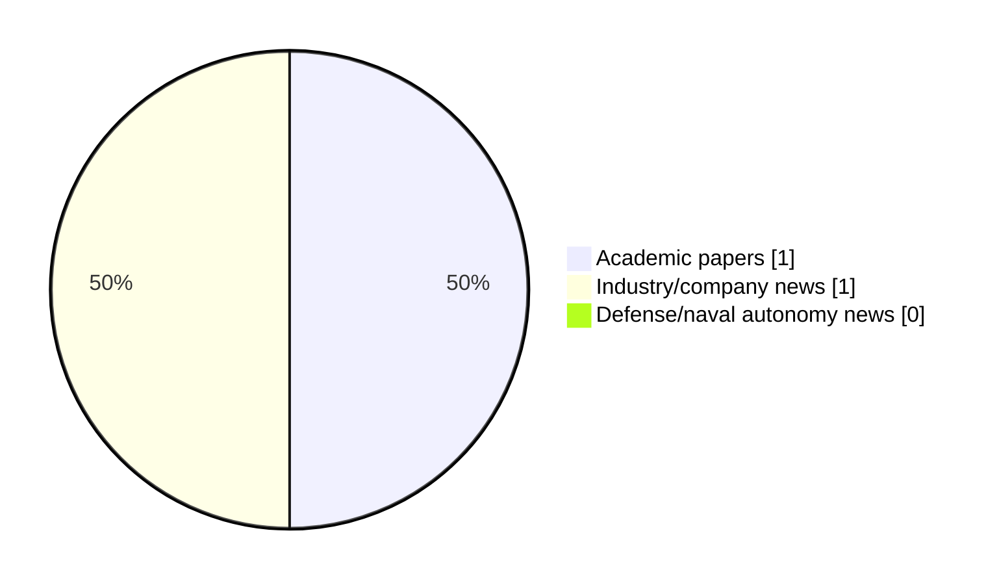

# Maritime Autonomy Watch — 2026-06-15

## Executive Summary

- Total selected items: 2
- Academic papers: 1
- Industry/company news: 1
- Defense/naval autonomy news: 0
- Failed/inaccessible sources: 0

## Contents

- [Analyst Brief](#analyst-brief)
- [Must Read](#must-read)
- [Top Signals Today](#top-signals-today)
- [Topic Signals](#topic-signals)
- [Freshness and Coverage](#freshness-and-coverage)
- [Quality Notes](#quality-notes)
- [Watchlist](#watchlist)
- [Academic Papers](#academic-papers)
- [Industry and Company News](#industry-and-company-news)
- [Defense and Naval Autonomy News](#defense-and-naval-autonomy-news)
- [Source Status Summary](#source-status-summary)

## Analyst Brief

Today's report selected 2 non-duplicate item(s), led by AUV navigation, underwater communications, swarm autonomy. The strongest item is [A Deep Zero-Inflated Model of North Atlantic Right Whale Presence To Support Blue Economy Management in the U.S. East Coast](http://arxiv.org/abs/2606.14403v1) from arXiv.
Coverage is weighted toward academic research (1), with 1 industry and 0 defense signal(s).
Quality caveat: low-score-unique=1.

## Must Read

- [A Deep Zero-Inflated Model of North Atlantic Right Whale Presence To Support Blue Economy Management in the U.S. East Coast](http://arxiv.org/abs/2606.14403v1) — Research signal: AUV navigation
- [Cellula Robotics & Infinity Fuel Cell Launch NautiGEN](https://www.oceansciencetechnology.com/news/cellula-robotics-infinity-fuel-cell-launch-nautigen/) — Industry signal: critical infrastructure

## Top Signals Today

- AUV navigation: 1 selected item(s).
- underwater communications: 1 selected item(s).
- swarm autonomy: 1 selected item(s).
- perception: 1 selected item(s).
- critical infrastructure: 1 selected item(s).

## Topic Signals

- AUV navigation: 1
- underwater communications: 1
- swarm autonomy: 1
- perception: 1
- critical infrastructure: 1

## Freshness and Coverage

- Newest selected item date: 2026-06-15
- Oldest selected item date: 2026-06-12
- Active/enabled sources: 5
- Sources with access problems: 2
- Quality flags: 1

## Quality Notes

- low-score-unique: 1

## Watchlist

- [Cellula Robotics & Infinity Fuel Cell Launch NautiGEN](https://www.oceansciencetechnology.com/news/cellula-robotics-infinity-fuel-cell-launch-nautigen/) — low-score-unique

### Category Snapshot

| Category | Selected items |
|---|---:|
| Academic papers | 1 |
| Industry/company news | 1 |
| Defense/naval autonomy news | 0 |

## Academic Papers

_Selected items: 1_

### [A Deep Zero-Inflated Model of North Atlantic Right Whale Presence To Support Blue Economy Management in the U.S. East Coast](http://arxiv.org/abs/2606.14403v1)

- Source: arXiv
- Date: 2026-06-12
- Relevance score: 5
- Authors: Jiaxiang Ji, Laura Nazzaro, Josh Kohut, Ahmed Aziz Ezzat
- Signal: Research signal: AUV navigation
- Topic tags: AUV navigation, underwater communications, swarm autonomy, perception

**Abstract**

Effective modeling of endangered marine mammal species, such as the North Atlantic Right Whale, is critical for balancing marine conservation with the growing blue economy. Passive acoustic monitoring data collected by autonomous underwater vehicles provide new opportunities for localized marine species detection and oceanographic sensing, but introduce complex statistical challenges such as zero inflation, imperfect detection, and intricate dependence structures. In response, we propose the Deep Zero-Inflated Bernoulli (DeepZIB) model--a deep statistical method which jointly models latent species presence and conditional detection probabilities while learning complex habitat relationships from heterogeneous covariate information. We establish theoretical results on the model's structural properties and conduct simulation experiments to demonstrate its ability to recover underlying parameters and latent presence fields.

**Why it matters**

Relevant to underwater autonomy, multi-vehicle coordination, infrastructure monitoring; the work may inform maritime autonomy research, testing priorities, or system design.

---

## Industry and Company News

_Selected items: 1_

### [Cellula Robotics & Infinity Fuel Cell Launch NautiGEN](https://www.oceansciencetechnology.com/news/cellula-robotics-infinity-fuel-cell-launch-nautigen/)

- Source: oceansciencetechnology.com
- Date: 2026-06-15
- Relevance score: 3
- Signal: Industry signal: critical infrastructure
- Topic tags: critical infrastructure
- Quality flags: low-score-unique

**Summary**

Cellula Robotics and Infinity Fuel Cell and Hydrogen have launched NautiGEN, a new maritime hydrogen power company focused on extending endurance for subsea, surface and autonomous maritime systems. Unveiled on World Oceans Day, the company aims to address growing energy demands in long-duration marine operations with modular hydrogen fuel cell technology that enables greater range, payload capacity and mission persistence.

**Why it matters**

This item may signal product, market, or deployment momentum in maritime autonomy.

---

## Defense and Naval Autonomy News

_Selected items: 0_

No selected items.

## Inaccessible or Failed Sources

- None

## Source Status Summary

| Source | Status | Notes |
|---|---|---|
| arXiv | enabled | API source, 15 items fetched |
| OpenAlex | enabled | API source, 15 items fetched |
| RSS feeds | enabled | 107 RSS items fetched |
| SMI MASG News | enabled | HTML source, 10 items fetched |
| IEEE Xplore | disabled | Missing IEEE_XPLORE_API_KEY |
| Elsevier Scopus | enabled | API source, 15 items fetched |
| NewsAPI | disabled | Missing NEWS_API_KEY |

## Metadata

- Generated at: 2026-06-15T13:58:05.749809+02:00
- Date: 2026-06-15
- Repository: ferhannb/MarineRobotics
- Relevance threshold: 4.0
- Deduplication method: DOI, canonical URL, source ID, normalized title, similar recent titles, category caps, and novelty score
