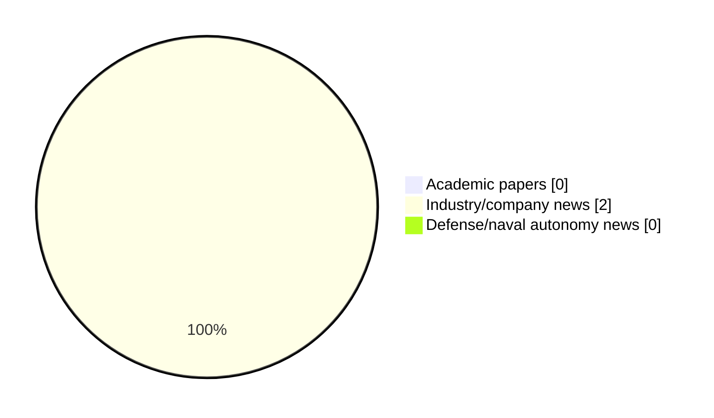

# Maritime Autonomy Watch — 2026-06-16

## Executive Summary

- Total selected items: 2
- Academic papers: 0
- Industry/company news: 2
- Defense/naval autonomy news: 0
- Failed/inaccessible sources: 0

## Contents

- [Analyst Brief](#analyst-brief)
- [Must Read](#must-read)
- [Top Signals Today](#top-signals-today)
- [Topic Signals](#topic-signals)
- [Freshness and Coverage](#freshness-and-coverage)
- [Quality Notes](#quality-notes)
- [Watchlist](#watchlist)
- [Academic Papers](#academic-papers)
- [Industry and Company News](#industry-and-company-news)
- [Defense and Naval Autonomy News](#defense-and-naval-autonomy-news)
- [Source Status Summary](#source-status-summary)

## Analyst Brief

Today's report selected 2 non-duplicate item(s), led by USV operations, regulation/legal. The strongest item is [Lightweight Diesel Engine Launched for USVs at Seawork 2026](https://www.oceansciencetechnology.com/news/lightweight-diesel-engine-launched-for-usvs-at-seawork-2026/) from oceansciencetechnology.com.
Coverage is weighted toward academic research (0), with 2 industry and 0 defense signal(s).
Quality caveat: low-score-unique=1.

## Must Read

- [Lightweight Diesel Engine Launched for USVs at Seawork 2026](https://www.oceansciencetechnology.com/news/lightweight-diesel-engine-launched-for-usvs-at-seawork-2026/) — Industry signal: USV operations
- [ASVs Achieve Landmark Safety & Operational Certification](https://www.oceansciencetechnology.com/news/asvs-achieve-landmark-safety-operational-certification/) — Industry signal: USV operations

## Top Signals Today

- USV operations: 2 selected item(s).
- regulation/legal: 1 selected item(s).

## Topic Signals

- USV operations: 2
- regulation/legal: 1

## Freshness and Coverage

- Newest selected item date: 2026-06-16
- Oldest selected item date: 2026-06-16
- Active/enabled sources: 5
- Sources with access problems: 2
- Quality flags: 1

## Quality Notes

- low-score-unique: 1

## Watchlist

- [ASVs Achieve Landmark Safety & Operational Certification](https://www.oceansciencetechnology.com/news/asvs-achieve-landmark-safety-operational-certification/) — low-score-unique

### Category Snapshot

| Category | Selected items |
|---|---:|
| Academic papers | 0 |
| Industry/company news | 2 |
| Defense/naval autonomy news | 0 |

## Academic Papers

_Selected items: 0_

No selected items.

## Industry and Company News

_Selected items: 2_

### [Lightweight Diesel Engine Launched for USVs at Seawork 2026](https://www.oceansciencetechnology.com/news/lightweight-diesel-engine-launched-for-usvs-at-seawork-2026/)

- Source: oceansciencetechnology.com
- Date: 2026-06-16
- Relevance score: 4.5
- Signal: Industry signal: USV operations
- Topic tags: USV operations

**Summary**

Loki Dynamics, the trusted UK representative for MD Powertrain of Sweden, has showcased a new lightweight, high power-density diesel engine.

**Why it matters**

Signals momentum in surface-vessel operations; useful for tracking product direction, partnerships, and deployment opportunities.

---

### [ASVs Achieve Landmark Safety & Operational Certification](https://www.oceansciencetechnology.com/news/asvs-achieve-landmark-safety-operational-certification/)

- Source: oceansciencetechnology.com
- Date: 2026-06-16
- Relevance score: 3.5
- Signal: Industry signal: USV operations
- Topic tags: USV operations, regulation/legal
- Quality flags: low-score-unique

**Summary**

Autonomous maritime technology has achieved a significant regulatory milestone with ZeroUSV securing the UK Maritime and Coastguard Agency’s Workboat Code.

**Why it matters**

This item may signal product, market, or deployment momentum in maritime autonomy.

---

## Defense and Naval Autonomy News

_Selected items: 0_

No selected items.

## Inaccessible or Failed Sources

- None

## Source Status Summary

| Source | Status | Notes |
|---|---|---|
| arXiv | enabled | API source, 15 items fetched |
| OpenAlex | enabled | API source, 15 items fetched |
| RSS feeds | enabled | 107 RSS items fetched |
| SMI MASG News | enabled | HTML source, 10 items fetched |
| IEEE Xplore | disabled | Missing IEEE_XPLORE_API_KEY |
| Elsevier Scopus | enabled | API source, 15 items fetched |
| NewsAPI | disabled | Missing NEWS_API_KEY |

## Metadata

- Generated at: 2026-06-16T13:05:30.332304+02:00
- Date: 2026-06-16
- Repository: ferhannb/MarineRobotics
- Relevance threshold: 4.0
- Deduplication method: DOI, canonical URL, source ID, normalized title, similar recent titles, category caps, and novelty score
