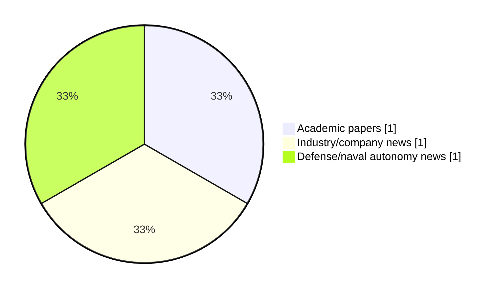

# Maritime Autonomy Watch — 2026-06-17

## Executive Summary

- Total selected items: 3
- Academic papers: 1
- Industry/company news: 1
- Defense/naval autonomy news: 1
- Failed/inaccessible sources: 0

## Contents

- [Analyst Brief](#analyst-brief)
- [Must Read](#must-read)
- [Top Signals Today](#top-signals-today)
- [Topic Signals](#topic-signals)
- [Freshness and Coverage](#freshness-and-coverage)
- [Quality Notes](#quality-notes)
- [Watchlist](#watchlist)
- [Academic Papers](#academic-papers)
- [Industry and Company News](#industry-and-company-news)
- [Defense and Naval Autonomy News](#defense-and-naval-autonomy-news)
- [Source Status Summary](#source-status-summary)

## Analyst Brief

Today's report selected 3 non-duplicate item(s), led by USV operations, AUV navigation, critical infrastructure. The strongest item is [HII Delivers First of the Newest REMUS Variant: 130](https://www.navalnews.com/naval-news/2026/06/hii-delivers-first-of-the-newest-remus-variant-130/) from navalnews.com.
Coverage is weighted toward academic research (1), with 1 industry and 1 defense signal(s).

## Must Read

- [HII Delivers First of the Newest REMUS Variant: 130](https://www.navalnews.com/naval-news/2026/06/hii-delivers-first-of-the-newest-remus-variant-130/) — Defense signal: AUV navigation
- [Tether-Aware Dynamic Collision Avoidance for USV-HROV Systems](http://arxiv.org/abs/2606.01112v1) — Research signal: USV operations
- [USV Swarm Demonstrates Maritime Security Capabilities at Exercise Salaknib](https://oceannews.com/news/defense/usv-swarm-demonstrates-maritime-security-capabilities-at-exercise-salaknib/) — Industry signal: USV operations

## Top Signals Today

- USV operations: 2 selected item(s).
- AUV navigation: 1 selected item(s).
- critical infrastructure: 1 selected item(s).
- swarm autonomy: 1 selected item(s).

## Topic Signals

- USV operations: 2
- AUV navigation: 1
- critical infrastructure: 1
- swarm autonomy: 1

## Freshness and Coverage

- Newest selected item date: 2026-06-16
- Oldest selected item date: 2026-05-31
- Active/enabled sources: 5
- Sources with access problems: 2
- Quality flags: 0

## Quality Notes

- No quality flags on selected items.

## Watchlist

- No watchlist items today.

### Category Snapshot

| Category | Selected items |
|---|---:|
| Academic papers | 1 |
| Industry/company news | 1 |
| Defense/naval autonomy news | 1 |

## Academic Papers

_Selected items: 1_

### [Tether-Aware Dynamic Collision Avoidance for USV-HROV Systems](http://arxiv.org/abs/2606.01112v1)

- Source: arXiv
- Date: 2026-05-31
- Relevance score: 8.75
- Authors: Yang Gu, Ziyang Hong, Xuanlin Chen, Hao Wei, Cheng Wang, Shujie Yang, Yulin Si
- Signal: Research signal: USV operations
- Topic tags: USV operations, critical infrastructure

**Abstract**

Heterogeneous marine robotic systems composed of an unmanned surface vehicle (USV) and a hybrid remotely operated vehicle (HROV) have shown great potential for subsea cable inspection. In such missions, the USV tracks the HROV at the surface while supplying power and communication through an umbilical tether. However, dynamic collision avoidance for the USV during HROV tracking is challenging because the submerged tether may scrape against passing vessels, while evasive maneuvers can enlarge the USV--HROV separation, thereby increasing the likelihood of tether tautness and compromising HROV operations. To address these challenges, this work proposes a tether-aware dynamic collision avoidance method for a USV tracking an HROV. First, a tether safety-aware planar domain is introduced to represent the three-dimensional collision risk between the tether and obstacle vessels without an explicit tether shape model.

**Why it matters**

Relevant to surface-vessel operations, navigation safety, infrastructure monitoring; the work may inform maritime autonomy research, testing priorities, or system design.

---

## Industry and Company News

_Selected items: 1_

### [USV Swarm Demonstrates Maritime Security Capabilities at Exercise Salaknib](https://oceannews.com/news/defense/usv-swarm-demonstrates-maritime-security-capabilities-at-exercise-salaknib/)

- Source: oceannews.com
- Date: 2026-06-16
- Relevance score: 6
- Signal: Industry signal: USV operations
- Topic tags: USV operations, swarm autonomy

**Summary**

Soldiers assigned to the 25th Infantry Division partnered with Philippine Army forces and industry representatives during Salaknib 2026 to demonstrate how autonomous maritime systems can enhance security and protect critical transportation operations in contested environments.

**Why it matters**

Signals momentum in surface-vessel operations, multi-vehicle coordination; useful for tracking product direction, partnerships, and deployment opportunities.

---

## Defense and Naval Autonomy News

_Selected items: 1_

### [HII Delivers First of the Newest REMUS Variant: 130](https://www.navalnews.com/naval-news/2026/06/hii-delivers-first-of-the-newest-remus-variant-130/)

- Source: navalnews.com
- Date: 2026-06-16
- Relevance score: 9.75
- Signal: Defense signal: AUV navigation
- Topic tags: AUV navigation

**Summary**

On June 16, 2026, Huntington Ingalls Industries announced the delivery of the first REMUS 130 unmanned underwater vehicle (UUV) to a U.S. ally, marking a major milestone for the next generation of the world’s most widely deployed autonomous underwater vehicle. HII press release Building on more than 25 years of operational success, REMUS 130 is.

**Why it matters**

Signals movement in underwater autonomy; useful for tracking operational concepts, procurement direction, and fleet integration.

---

## Inaccessible or Failed Sources

- None

## Source Status Summary

| Source | Status | Notes |
|---|---|---|
| arXiv | enabled | API source, 15 items fetched |
| OpenAlex | enabled | API source, 15 items fetched |
| RSS feeds | enabled | 107 RSS items fetched |
| SMI MASG News | enabled | HTML source, 10 items fetched |
| IEEE Xplore | disabled | Missing IEEE_XPLORE_API_KEY |
| Elsevier Scopus | enabled | API source, 15 items fetched |
| NewsAPI | disabled | Missing NEWS_API_KEY |

## Metadata

- Generated at: 2026-06-17T12:50:00.352533+02:00
- Date: 2026-06-17
- Repository: ferhannb/MarineRobotics
- Relevance threshold: 4.0
- Deduplication method: DOI, canonical URL, source ID, normalized title, similar recent titles, category caps, and novelty score
