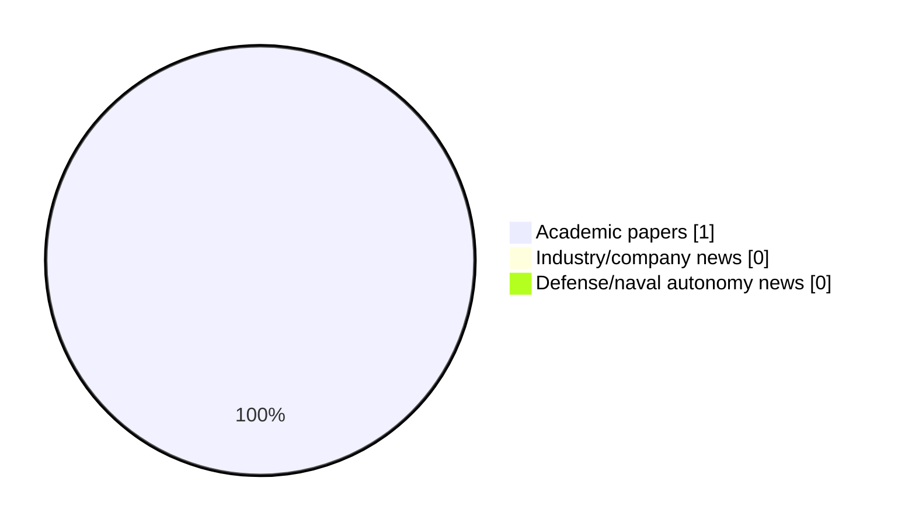

# Maritime Autonomy Watch — 2026-06-18

## Executive Summary

- Total selected items: 1
- Academic papers: 1
- Industry/company news: 0
- Defense/naval autonomy news: 0
- Failed/inaccessible sources: 0

## Contents

- [Analyst Brief](#analyst-brief)
- [Must Read](#must-read)
- [Top Signals Today](#top-signals-today)
- [Topic Signals](#topic-signals)
- [Freshness and Coverage](#freshness-and-coverage)
- [Quality Notes](#quality-notes)
- [Watchlist](#watchlist)
- [Academic Papers](#academic-papers)
- [Industry and Company News](#industry-and-company-news)
- [Defense and Naval Autonomy News](#defense-and-naval-autonomy-news)
- [Source Status Summary](#source-status-summary)

## Analyst Brief

Today's report selected 1 non-duplicate item(s), led by AUV navigation, underwater communications, perception. The strongest item is [Soft Acoustic Lens Corrects Sonar Distortion in AUV Domes](https://oceannews.com/news/science-technology/soft-acoustic-lens-corrects-sonar-distortion-in-auv-domes/) from oceannews.com.
Coverage is weighted toward academic research (1), with 0 industry and 0 defense signal(s).

## Must Read

- [Soft Acoustic Lens Corrects Sonar Distortion in AUV Domes](https://oceannews.com/news/science-technology/soft-acoustic-lens-corrects-sonar-distortion-in-auv-domes/) — Research signal: AUV navigation

## Top Signals Today

- AUV navigation: 1 selected item(s).
- underwater communications: 1 selected item(s).
- perception: 1 selected item(s).

## Topic Signals

- AUV navigation: 1
- underwater communications: 1
- perception: 1

## Freshness and Coverage

- Newest selected item date: 2026-06-17
- Oldest selected item date: 2026-06-17
- Active/enabled sources: 5
- Sources with access problems: 2
- Quality flags: 0

## Quality Notes

- No quality flags on selected items.

## Watchlist

- No watchlist items today.

### Category Snapshot

| Category | Selected items |
|---|---:|
| Academic papers | 1 |
| Industry/company news | 0 |
| Defense/naval autonomy news | 0 |

## Academic Papers

_Selected items: 1_

### [Soft Acoustic Lens Corrects Sonar Distortion in AUV Domes](https://oceannews.com/news/science-technology/soft-acoustic-lens-corrects-sonar-distortion-in-auv-domes/)

- Source: oceannews.com
- Date: 2026-06-17
- Relevance score: 4.25
- Signal: Research signal: AUV navigation
- Topic tags: AUV navigation, underwater communications, perception

**Abstract**

Every time an autonomous drone dives to explore the ocean floor, the very armor designed to protect it simultaneously blinds its sonar. In the International Journal of Extreme Manufacturing, Prof. Yu Zhang at Shanghai Jiao Tong University and his co-workers have solved this long-standing engineering paradox by inventing a soft, custom-molded acoustic "contact lens" that actively corrects outgoing sound waves before they pass through the drone's protective shell.

**Why it matters**

Relevant to underwater autonomy; the work may inform maritime autonomy research, testing priorities, or system design.

---

## Industry and Company News

_Selected items: 0_

No selected items.

## Defense and Naval Autonomy News

_Selected items: 0_

No selected items.

## Inaccessible or Failed Sources

- None

## Source Status Summary

| Source | Status | Notes |
|---|---|---|
| arXiv | enabled | API source, 15 items fetched |
| OpenAlex | enabled | API source, 15 items fetched |
| RSS feeds | enabled | 107 RSS items fetched |
| SMI MASG News | enabled | HTML source, 10 items fetched |
| IEEE Xplore | disabled | Missing IEEE_XPLORE_API_KEY |
| Elsevier Scopus | enabled | API source, 15 items fetched |
| NewsAPI | disabled | Missing NEWS_API_KEY |

## Metadata

- Generated at: 2026-06-18T12:16:30.504725+02:00
- Date: 2026-06-18
- Repository: ferhannb/MarineRobotics
- Relevance threshold: 4.0
- Deduplication method: DOI, canonical URL, source ID, normalized title, similar recent titles, category caps, and novelty score
