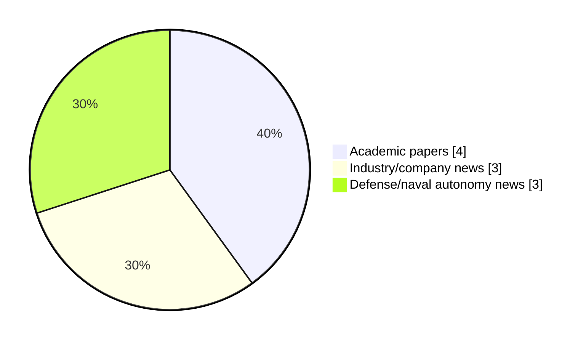

# Maritime Autonomy Watch — 2026-06-20

## Executive Summary

- Total selected items: 10
- Academic papers: 4
- Industry/company news: 3
- Defense/naval autonomy news: 3
- Failed/inaccessible sources: 0

## Contents

- [Analyst Brief](#analyst-brief)
- [Must Read](#must-read)
- [Top Signals Today](#top-signals-today)
- [Topic Signals](#topic-signals)
- [Freshness and Coverage](#freshness-and-coverage)
- [Quality Notes](#quality-notes)
- [Watchlist](#watchlist)
- [Academic Papers](#academic-papers)
- [Industry and Company News](#industry-and-company-news)
- [Defense and Naval Autonomy News](#defense-and-naval-autonomy-news)
- [Source Status Summary](#source-status-summary)

## Analyst Brief

Today's report selected 10 non-duplicate item(s), led by USV operations, defense adoption, swarm autonomy. The strongest item is [A Bio-Inspired Sliding Mode Algorithm with Lateral Velocity Tracking Differentiator for Formation Control of Underactuated USVs](https://doi.org/10.2478/pomr-2026-0018) from OpenAlex.
Coverage is weighted toward academic research (4), with 3 industry and 3 defense signal(s).
Quality caveat: low-score-unique=2, missing-summary=1, date-anomaly=1.

## Must Read

- [A Bio-Inspired Sliding Mode Algorithm with Lateral Velocity Tracking Differentiator for Formation Control of Underactuated USVs](https://doi.org/10.2478/pomr-2026-0018) — Research signal: USV operations
- [Single-Axis Rotational Inertial Navigation Systems for USVs: A Review of Key Technologies](https://doi.org/10.3390/mi17050557) — Research signal: USV operations
- [Norwegian Offshore Directorate Details Successful Deep-Sea Expedition with New AUV](https://oceannews.com/news/subsea-and-survey/norwegian-offshore-directorate-details-successful-deep-sea-expedition-with-new-auv/) — Industry signal: AUV navigation
- [Navantia Debuts Design for Autonomous Vessel to Support ‘Hybrid Navy’ of the Future](https://www.maritimeindustries.org/news/navantia-debuts-design-autonomous-vessel-support-hybrid-navy-future) — Defense signal: USV operations
- [First Bluebottle Hull Christened as Part of Royal Australian Navy’s Program of Record](https://oceannews.com/news/defense/first-bluebottle-hull-christened-as-part-of-royal-australian-navys-program-of-record/) — Defense signal: USV operations

## Top Signals Today

- USV operations: 6 selected item(s).
- defense adoption: 3 selected item(s).
- swarm autonomy: 2 selected item(s).
- planning/control: 2 selected item(s).
- regulation/legal: 2 selected item(s).

## Topic Signals

- USV operations: 6
- defense adoption: 3
- swarm autonomy: 2
- planning/control: 2
- regulation/legal: 2
- critical infrastructure: 2
- AUV navigation: 1
- perception: 1

## Freshness and Coverage

- Newest selected item date: 2026-12-01
- Oldest selected item date: 2026-04-29
- Active/enabled sources: 5
- Sources with access problems: 2
- Quality flags: 4

## Quality Notes

- low-score-unique: 2
- missing-summary: 1
- date-anomaly: 1
- Date anomalies: [Formation tracking control of multiple USVs using ADRC with prescribed performance](https://api.elsevier.com/content/abstract/scopus_id/105035333345) reports 2026-12-01

## Watchlist

- [Multi-Robot Demo Showcases New Plymouth Subsea Test Range](https://oceannews.com/news/science-technology/multi-robot-demo-showcases-new-plymouth-subsea-test-range/) — low-score-unique
- [Formation tracking control of multiple USVs using ADRC with prescribed performance](https://api.elsevier.com/content/abstract/scopus_id/105035333345) — missing-summary, date-anomaly
- [A Stochastic Approach for Evaluating the Reliability of a MASS and Assessing the Compliance with the IMO Regulatory Framework](https://doi.org/10.3390/jmse14090814) — low-score-unique

### Category Snapshot

| Category | Selected items |
|---|---:|
| Academic papers | 4 |
| Industry/company news | 3 |
| Defense/naval autonomy news | 3 |

## Academic Papers

_Selected items: 4_

### [A Bio-Inspired Sliding Mode Algorithm with Lateral Velocity Tracking Differentiator for Formation Control of Underactuated USVs](https://doi.org/10.2478/pomr-2026-0018)

- Source: OpenAlex
- Date: 2026-05-06
- Relevance score: 10
- Authors: Jiaying Niu, Lanqing Xu, Guiyin Chen, Jinhua Lv, Yiming Tang
- DOI: 10.2478/pomr-2026-0018
- Signal: Research signal: USV operations
- Topic tags: USV operations, swarm autonomy, planning/control, regulation/legal
- Also reported by: Elsevier Scopus

**Abstract**

Abstract An advanced control framework is presented to solve the challenge of trajectory tracking in underactuated unmanned surface vehicles (USVs) operating in a formation. Three key innovations are featured: (1) Complex derivative calculations are effectively eliminated by a bio-inspired model approximating virtual longitudinal/lateral velocities; (2) Severe initial control chattering is significantly mitigated by a lateral velocity tracking differentiator (LVTD); (3) These techniques are integrated within a disturbance-observer-compensated dynamic surface sliding mode control (SMC) under a virtual framework. In addition, trajectory tracking errors are defined using desired and actual USV states, while virtual control laws are developed based on nonlinear backstepping. Meanwhile, the bio-inspired model is incorporatedto approximate virtual velocities, avoiding complex differentiation.

**Why it matters**

Relevant to surface-vessel operations, multi-vehicle coordination, planning and control; the work may inform maritime autonomy research, testing priorities, or system design.

---

### [Single-Axis Rotational Inertial Navigation Systems for USVs: A Review of Key Technologies](https://doi.org/10.3390/mi17050557)

- Source: OpenAlex
- Date: 2026-04-30
- Relevance score: 8.75
- Authors: Enqing Su, Yi-Xiang Wang, Weijie Sheng, Yi Mou, Teng Li, Jianguo Liu
- DOI: 10.3390/mi17050557
- Signal: Research signal: USV operations
- Topic tags: USV operations

**Abstract**

In complex marine environments, achieving low-cost, highly reliable, and continuous navigation is crucial for the intelligent and autonomous operation of unmanned surface vehicles (USVs). Currently, the integrated Global Navigation Satellite System and Strapdown Inertial Navigation System (GNSS/SINS) serves as the primary navigation architecture for USVs. While the cost of high-performance GNSS receivers has steadily decreased, high-precision SINS remains prohibitively expensive. Consequently, micro-electromechanical system (MEMS)-based SINS has emerged as a preferred alternative due to its favorable balance of cost, power consumption, and size. However, significant inertial sensor errors make it difficult to maintain high-precision positioning during GNSS outages. To address this limitation, the single-axis rotational inertial navigation system (SRINS) has been introduced.

**Why it matters**

Relevant to surface-vessel operations; the work may inform maritime autonomy research, testing priorities, or system design.

---

### [Formation tracking control of multiple USVs using ADRC with prescribed performance](https://api.elsevier.com/content/abstract/scopus_id/105035333345)

- Source: Elsevier Scopus
- Date: 2026-12-01
- Relevance score: 5.25
- DOI: 10.1038/s41598-026-37252-0
- Signal: Research signal: USV operations
- Topic tags: USV operations, swarm autonomy, planning/control
- Quality flags: missing-summary, date-anomaly

**Abstract**

No summary available.

**Why it matters**

Relevant to surface-vessel operations, multi-vehicle coordination; the work may inform maritime autonomy research, testing priorities, or system design.

---

### [A Stochastic Approach for Evaluating the Reliability of a MASS and Assessing the Compliance with the IMO Regulatory Framework](https://doi.org/10.3390/jmse14090814)

- Source: OpenAlex
- Date: 2026-04-29
- Relevance score: 3
- Authors: Pietro Corsi, Sergej Jakovlev, Massimo Figari, Vasilij Djačkov
- DOI: 10.3390/jmse14090814
- Signal: Research signal: critical infrastructure
- Topic tags: critical infrastructure, regulation/legal
- Quality flags: low-score-unique

**Abstract**

The introduction of Maritime Autonomous Surface Ships (MASSs) requires reliable engineering methods to demonstrate safety levels comparable to those of conventional manned vessels. This paper presents a mission-based stochastic reliability framework for the comparative assessment of manned and unmanned ship configurations, with a focus on engineering design and verification. The methodology is based on Reliability Block Diagrams (RBDs), where ship missions are decomposed into critical functional subsystems and evaluated over mission-limited operational profiles. To address the uncertainty inherent in component failure data for autonomous systems, Mean Time to Failure (MTTF) values are treated as stochastic variables rather than fixed parameters. A Monte Carlo simulation approach is used to propagate uncertainty from component level to overall mission reliability, producing probability distributions of mission success.

**Why it matters**

This paper may influence autonomy, perception, planning, or control work for maritime robotic systems.

---

## Industry and Company News

_Selected items: 3_

### [Norwegian Offshore Directorate Details Successful Deep-Sea Expedition with New AUV](https://oceannews.com/news/subsea-and-survey/norwegian-offshore-directorate-details-successful-deep-sea-expedition-with-new-auv/)

- Source: oceannews.com
- Date: 2026-06-19
- Relevance score: 7
- Signal: Industry signal: AUV navigation
- Topic tags: AUV navigation

**Summary**

Last year, the Norwegian Offshore Directorate procured an autonomous underwater vehicle (AUV). This AUV recently embarked on its first expedition in the northern Norwegian Sea.

**Why it matters**

Signals momentum in underwater autonomy; useful for tracking product direction, partnerships, and deployment opportunities.

---

### [OMS Validates Deepwater Survey P Capability and Long-Range Endurance of USV Elite](https://oceannews.com/news/subsea-and-survey/oms-validates-deepwater-survey-p-capability-and-long-range-endurance-of-usv-elite/)

- Source: oceannews.com
- Date: 2026-06-18
- Relevance score: 5.25
- Signal: Industry signal: USV operations
- Topic tags: USV operations

**Summary**

OMS Group (OMS) has provided an update on the ongoing Sea Acceptance Tests (SAT) for USV Elite, its long-range DriX O-16 uncrewed surface vessel (USV), currently being conducted off the South of France. The SAT program is demonstrating impressive seakeeping characteristics and strong early results on deepwater multibeam echosounder performance, supporting OMS’s strategy to scale long-range uncrewed survey capabilities globally.

**Why it matters**

Signals momentum in surface-vessel operations; useful for tracking product direction, partnerships, and deployment opportunities.

---

### [Multi-Robot Demo Showcases New Plymouth Subsea Test Range](https://oceannews.com/news/science-technology/multi-robot-demo-showcases-new-plymouth-subsea-test-range/)

- Source: oceannews.com
- Date: 2026-06-19
- Relevance score: 3
- Signal: Industry signal: perception
- Topic tags: perception, critical infrastructure
- Quality flags: low-score-unique

**Summary**

A new underwater trials site designed to accelerate UK marine autonomy and ocean sensing has completed its first major test thanks to a live, multi-marine surface and subsea robotic platform demonstration.

**Why it matters**

Signals momentum in underwater autonomy; useful for tracking product direction, partnerships, and deployment opportunities.

---

## Defense and Naval Autonomy News

_Selected items: 3_

### [First Bluebottle Hull Christened as Part of Royal Australian Navy’s Program of Record](https://oceannews.com/news/defense/first-bluebottle-hull-christened-as-part-of-royal-australian-navys-program-of-record/)

- Source: oceannews.com
- Date: 2026-06-19
- Relevance score: 5.25
- Signal: Defense signal: USV operations
- Topic tags: USV operations, defense adoption

**Summary**

Ocius Technology has marked a milestone in the delivery of the Royal Australian Navy's $176 million Bluebottle Program of Record, with the ceremonial christening of the first Bluebottle uncrewed surface vessel (USV) hull to be delivered under the contract announced in March.

**Why it matters**

Signals movement in surface-vessel operations, naval adoption; useful for tracking operational concepts, procurement direction, and fleet integration.

---

### [Navantia Debuts Design for Autonomous Vessel to Support ‘Hybrid Navy’ of the Future](https://www.maritimeindustries.org/news/navantia-debuts-design-autonomous-vessel-support-hybrid-navy-future)

- Source: maritimeindustries.org
- Date: 2026-05-20
- Relevance score: 6.25
- Signal: Defense signal: USV operations
- Topic tags: USV operations, defense adoption

**Summary**

A model for a large autonomous surface vessel has been unveiled by Navantia UK as an example of the hi-tech capabilities of the company’s four yards, which are undergoing large-scale modernisation.

**Why it matters**

Signals movement in surface-vessel operations, naval adoption; useful for tracking operational concepts, procurement direction, and fleet integration.

---

### [HII REMUS 300 UUVs and ODYSSEY Autonomy Support Multinational Mine Countermeasures Exercise NAUTILUS](https://oceannews.com/news/defense/hii-remus-300-uuvs-and-odyssey-autonomy-support-multinational-mine-countermeasures-exercise-nautilus/)

- Source: oceannews.com
- Date: 2026-06-19
- Relevance score: 4.25
- Signal: Defense signal: defense adoption
- Topic tags: defense adoption

**Summary**

HII recently provided embedded field support personnel for the multinational mine countermeasures exercise NAUTILUS, hosted by the Royal New Zealand Navy's (RNZN) dive and hydrographic team, HMNZS MATATAUA.

**Why it matters**

Signals movement in naval adoption; useful for tracking operational concepts, procurement direction, and fleet integration.

---

## Inaccessible or Failed Sources

- None

## Source Status Summary

| Source | Status | Notes |
|---|---|---|
| arXiv | enabled | API source, 15 items fetched |
| OpenAlex | enabled | API source, 15 items fetched |
| RSS feeds | enabled | 107 RSS items fetched |
| SMI MASG News | enabled | HTML source, 10 items fetched |
| IEEE Xplore | disabled | Missing IEEE_XPLORE_API_KEY |
| Elsevier Scopus | enabled | API source, 15 items fetched |
| NewsAPI | disabled | Missing NEWS_API_KEY |

## Metadata

- Generated at: 2026-06-20T10:50:52.398521+02:00
- Date: 2026-06-20
- Repository: ferhannb/MarineRobotics
- Relevance threshold: 4.0
- Deduplication method: DOI, canonical URL, source ID, normalized title, similar recent titles, category caps, and novelty score
