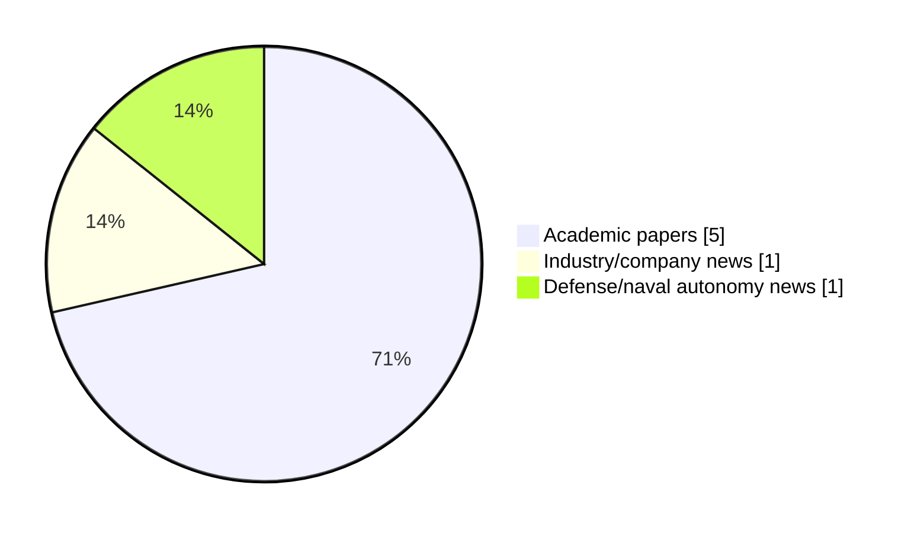

# Maritime Autonomy Watch — 2026-06-23

## Executive Summary

- Total selected items: 7
- Academic papers: 5
- Industry/company news: 1
- Defense/naval autonomy news: 1
- Failed/inaccessible sources: 1

## Contents

- [Analyst Brief](#analyst-brief)
- [Must Read](#must-read)
- [Top Signals Today](#top-signals-today)
- [Topic Signals](#topic-signals)
- [Freshness and Coverage](#freshness-and-coverage)
- [Quality Notes](#quality-notes)
- [Watchlist](#watchlist)
- [Academic Papers](#academic-papers)
- [Industry and Company News](#industry-and-company-news)
- [Defense and Naval Autonomy News](#defense-and-naval-autonomy-news)
- [Source Status Summary](#source-status-summary)

## Analyst Brief

Today's report selected 7 non-duplicate item(s), led by AUV navigation, perception, critical infrastructure. The strongest item is [DVL-DeepONet: A Physics-Guided Operator Learning for Resilient Underwater Navigation](http://arxiv.org/abs/2606.23502v1) from arXiv.
Coverage is weighted toward academic research (5), with 1 industry and 1 defense signal(s).
Quality caveat: missing-summary=1, date-anomaly=1.

## Must Read

- [DVL-DeepONet: A Physics-Guided Operator Learning for Resilient Underwater Navigation](http://arxiv.org/abs/2606.23502v1) — Research signal: AUV navigation
- [Multi-AUV Marine Life Tracking with Single Hydrophone Payloads via a Hidden Markov Model Equipped Particle Filter](http://arxiv.org/abs/2606.22335v1) — Research signal: AUV navigation
- [MARTAC and Intrepid Powerboats Announce Manufacturing Partnership to Scale Autonomous Surface Vessel Production](https://www.navalnews.com/naval-news/2026/06/martac-and-intrepid-powerboats-announce-manufacturing-partnership-to-scale-autonomous-surface-vessel-production/) — Defense signal: USV operations
- [Autonomous Vessels & Acoustic Networks Enable Continuous Subsea Monitoring](https://www.oceansciencetechnology.com/news/autonomous-vessels-acoustic-networks-enable-continuous-subsea-monitoring/) — Industry signal: USV operations
- [Autonomous Subsea Cable Search and Tracking with Graph-Optimised Priors and Visual Tracking](http://arxiv.org/abs/2606.23606v1) — Research signal: AUV navigation

## Top Signals Today

- AUV navigation: 4 selected item(s).
- perception: 4 selected item(s).
- critical infrastructure: 3 selected item(s).
- USV operations: 2 selected item(s).
- underwater communications: 2 selected item(s).

## Topic Signals

- AUV navigation: 4
- perception: 4
- critical infrastructure: 3
- USV operations: 2
- underwater communications: 2
- swarm autonomy: 1
- planning/control: 1

## Freshness and Coverage

- Newest selected item date: 2026-12-01
- Oldest selected item date: 2026-06-19
- Active/enabled sources: 4
- Sources with access problems: 3
- Quality flags: 2

## Quality Notes

- missing-summary: 1
- date-anomaly: 1
- Date anomalies: [Ubiquitous sensing of marine activities via the cooperation of autonomous underwater vehicles](https://api.elsevier.com/content/abstract/scopus_id/105028115165) reports 2026-12-01

## Watchlist

- [Ubiquitous sensing of marine activities via the cooperation of autonomous underwater vehicles](https://api.elsevier.com/content/abstract/scopus_id/105028115165) — missing-summary, date-anomaly

### Category Snapshot

| Category | Selected items |
|---|---:|
| Academic papers | 5 |
| Industry/company news | 1 |
| Defense/naval autonomy news | 1 |

## Academic Papers

_Selected items: 5_

### [DVL-DeepONet: A Physics-Guided Operator Learning for Resilient Underwater Navigation](http://arxiv.org/abs/2606.23502v1)

- Source: arXiv
- Date: 2026-06-22
- Relevance score: 9.25
- Authors: Arup Kumar Sahoo, Itzik Klein
- Signal: Research signal: AUV navigation
- Topic tags: AUV navigation, swarm autonomy, perception

**Abstract**

Autonomous Underwater Vehicles (AUVs) rely heavily on the fusion of inertial sensors and Doppler velocity logs (DVLs) for navigation. In standard autonomous navigation systems, the DVL measures four beam velocities, thereby enabling the estimation of the AUV velocity vector. However, during real-world missions, the DVL may receive noisy or incomplete beam measurements due to marine obstacles, seabed reflections, or environmental disturbances. Furthermore, some low-cost underwater platforms operate without inertial sensors to reduce system complexity and cost. In such cases, reliable estimation of the AUV velocity vector in real-world missing beam scenarios becomes challenging, leading to degraded navigation solutions. To circumvent these challenges and enable resilient underwater navigation, we propose DVL-DeepONet, a physics-guided deep neural operator framework along with three variants.

**Why it matters**

Relevant to underwater autonomy, multi-vehicle coordination; the work may inform maritime autonomy research, testing priorities, or system design.

---

### [Multi-AUV Marine Life Tracking with Single Hydrophone Payloads via a Hidden Markov Model Equipped Particle Filter](http://arxiv.org/abs/2606.22335v1)

- Source: arXiv
- Date: 2026-06-21
- Relevance score: 9.25
- Authors: Christopher Herrera, Kehlani Fay, Christopher Clark, Alberto Soto, Christopher Lowe, Mario Espinoza
- Signal: Research signal: AUV navigation
- Topic tags: AUV navigation, underwater communications

**Abstract**

Researchers tag and track marine animals to study migration patterns, human impacts on behavior, and behavioral shifts due to climate change. Accurate data collection often requires tagging individual animals to collect spatio-temporal state estimates of the animal's geo-position and depth. Acoustic transmitters are prominent due to their continuous communication without requiring retrieval or surfacing to collect data. These transmitters emit underwater acoustic pulses that can be detected by hydrophones. However, the frequent movement of aquatic animals results in high data loss when the animal moves out of the detection range of a stationary hydrophone. Autonomous underwater vehicle (AUV) systems offer a solution for localizing transmitters with higher resolution over longer periods of time. Such systems previously deployed have often required multiple hydrophones mounted on a large frame carried by the AUV.

**Why it matters**

Relevant to underwater autonomy; the work may inform maritime autonomy research, testing priorities, or system design.

---

### [Autonomous Subsea Cable Search and Tracking with Graph-Optimised Priors and Visual Tracking](http://arxiv.org/abs/2606.23606v1)

- Source: arXiv
- Date: 2026-06-22
- Relevance score: 8.5
- Authors: Ibrahim Fadhil Djauhari, Adrian Bodenmann, Samuel Simmons, Cailei Liang, David White, Susan Gourvenec, Tom Bennetts, Darryl Newborough, Blair Thornton
- Signal: Research signal: AUV navigation
- Topic tags: AUV navigation, perception, planning/control, critical infrastructure

**Abstract**

Global communications rely on subsea cable infrastructure that remains vulnerable to damage from natural hazards and human activity. Autonomous underwater vehicles (AUVs) offer an efficient means to inspect long sections of exposed cable, but uncertainty in cable route maps, small cable diameters and partial burial makes continuous tracking a challenge. This paper presents a novel cable search and tracking method that leverages uncertain prior cable route maps. Graph-based optimisation continuously update the cable route to remain consistent with visual observations. Route uncertainty is constrained as a function of distance from observations using physics-based catenary models that account for cable parameters (i.e., lay depth, diameter, and density), bounding the search space to physically feasible regions and improving search efficiency.

**Why it matters**

Relevant to underwater autonomy; the work may inform maritime autonomy research, testing priorities, or system design.

---

### [ISOPoT: Imaging Sonar Odometry by Point Tracking](http://arxiv.org/abs/2606.23006v1)

- Source: arXiv
- Date: 2026-06-22
- Relevance score: 4.25
- Authors: Jaša Samec, Vid Rijavec, Marko Peljhan, Aleksander Grm, Andrej Androjna, Danijel Skočaj, Matej Dobrevski
- Signal: Research signal: perception
- Topic tags: perception, critical infrastructure

**Abstract**

Reliable navigation in underwater environments remains a key challenge in marine robotics. In such scenarios, forward-looking sonars are a natural choice for long-range perception, offering wide coverage even in turbid, low-visibility conditions. However, sonar images are inherently noisy, contain artifacts, and lack rich semantic structure, causing standard computer vision methods for keypoint detection and matching to perform poorly. In this paper, we introduce ISOPoT, an imaging sonar odometry method based on modern point tracking techniques. We propose a sonar odometry pipeline that uses multi-frame point tracks as its primary correspondence representation, augmented with lightweight optimizations to improve robustness. We evaluated the proposed method on the Aracati 2017 dataset, as well as on an internal sonar dataset collected in real-world underwater environments.

**Why it matters**

Relevant to underwater autonomy; the work may inform maritime autonomy research, testing priorities, or system design.

---

### [Ubiquitous sensing of marine activities via the cooperation of autonomous underwater vehicles](https://api.elsevier.com/content/abstract/scopus_id/105028115165)

- Source: Elsevier Scopus
- Date: 2026-12-01
- Relevance score: 4.25
- DOI: 10.1038/s41598-025-29532-y
- Signal: Research signal: AUV navigation
- Topic tags: AUV navigation, perception
- Quality flags: missing-summary, date-anomaly

**Abstract**

No summary available.

**Why it matters**

Relevant to underwater autonomy; the work may inform maritime autonomy research, testing priorities, or system design.

---

## Industry and Company News

_Selected items: 1_

### [Autonomous Vessels & Acoustic Networks Enable Continuous Subsea Monitoring](https://www.oceansciencetechnology.com/news/autonomous-vessels-acoustic-networks-enable-continuous-subsea-monitoring/)

- Source: oceansciencetechnology.com
- Date: 2026-06-19
- Relevance score: 8.75
- Signal: Industry signal: USV operations
- Topic tags: USV operations, underwater communications, critical infrastructure

**Summary**

HydroSurv and Subnero have partnered to demonstrate an autonomous subsea connectivity layer for persistent offshore and ocean monitoring programmes. The integrated solution combines HydroSurv’s uncrewed surface vessels with Subnero’s Acoustic Smart Modems and underwater networking software, enabling seabed sensors to transmit data acoustically to a USV.

**Why it matters**

Signals momentum in underwater autonomy, surface-vessel operations, infrastructure monitoring; useful for tracking product direction, partnerships, and deployment opportunities.

---

## Defense and Naval Autonomy News

_Selected items: 1_

### [MARTAC and Intrepid Powerboats Announce Manufacturing Partnership to Scale Autonomous Surface Vessel Production](https://www.navalnews.com/naval-news/2026/06/martac-and-intrepid-powerboats-announce-manufacturing-partnership-to-scale-autonomous-surface-vessel-production/)

- Source: navalnews.com
- Date: 2026-06-22
- Relevance score: 8.75
- Signal: Defense signal: USV operations
- Topic tags: USV operations

**Summary**

Maritime Tactical Systems, Inc. (MARTAC) announced a manufacturing partnership with Intrepid Powerboats, a Florida-based premium boatbuilder. The collaboration gives MARTAC the ability to scale production of its Devil Ray USV platforms to between 200 and 300 vessels per year, meeting accelerating demand from U.S. government, allied-nation, and commercial customers. MARTAC press release Under the partnership,.

**Why it matters**

Signals movement in surface-vessel operations; useful for tracking operational concepts, procurement direction, and fleet integration.

---

## Inaccessible or Failed Sources

- OpenAlex: HTTP 429 for https://api.openalex.org/works?search=maritime+autonomy+marine+robotics+autonomous+vessel+autonomous+mission+autonomous+surface+vessel&per-page=15&sort=publication_date%3Adesc

## Source Status Summary

| Source | Status | Notes |
|---|---|---|
| arXiv | enabled | API source, 15 items fetched |
| OpenAlex | failed | HTTP 429 for https://api.openalex.org/works?search=maritime+autonomy+marine+robotics+autonomous+vessel+autonomous+mission+autonomous+surface+vessel&per-page=15&sort=publication_date%3Adesc |
| RSS feeds | enabled | 107 RSS items fetched |
| SMI MASG News | enabled | HTML source, 10 items fetched |
| IEEE Xplore | disabled | Missing IEEE_XPLORE_API_KEY |
| Elsevier Scopus | enabled | API source, 15 items fetched |
| NewsAPI | disabled | Missing NEWS_API_KEY |

## Metadata

- Generated at: 2026-06-23T09:17:15.755620+02:00
- Date: 2026-06-23
- Repository: ferhannb/MarineRobotics
- Relevance threshold: 4.0
- Deduplication method: DOI, canonical URL, source ID, normalized title, similar recent titles, category caps, and novelty score
