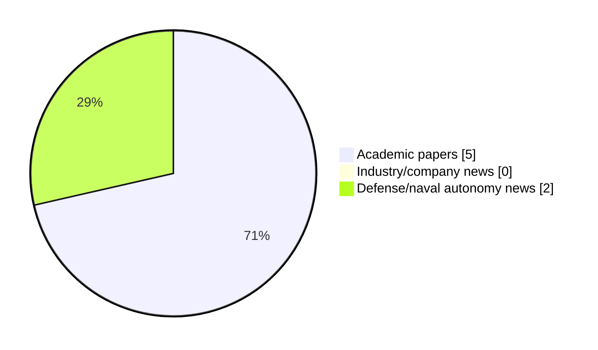

# Maritime Autonomy Watch — 2026-06-24

## Executive Summary

- Total selected items: 7
- Academic papers: 5
- Industry/company news: 0
- Defense/naval autonomy news: 2
- Failed/inaccessible sources: 0

## Contents

- [Analyst Brief](#analyst-brief)
- [Must Read](#must-read)
- [Top Signals Today](#top-signals-today)
- [Topic Signals](#topic-signals)
- [Freshness and Coverage](#freshness-and-coverage)
- [Quality Notes](#quality-notes)
- [Watchlist](#watchlist)
- [Academic Papers](#academic-papers)
- [Industry and Company News](#industry-and-company-news)
- [Defense and Naval Autonomy News](#defense-and-naval-autonomy-news)
- [Source Status Summary](#source-status-summary)

## Analyst Brief

Today's report selected 7 non-duplicate item(s), led by USV operations, planning/control, AUV navigation. The strongest item is [Efficient Time-Domain Simulation of USV Motions in Short-Crested Irregular Waves Using an IRF-Based Framework](http://arxiv.org/abs/2606.24130v1) from arXiv.
Coverage is weighted toward academic research (5), with 0 industry and 2 defense signal(s).
Quality caveat: missing-summary=1, date-anomaly=1, low-score-unique=1.

## Must Read

- [Efficient Time-Domain Simulation of USV Motions in Short-Crested Irregular Waves Using an IRF-Based Framework](http://arxiv.org/abs/2606.24130v1) — Research signal: USV operations
- [A Methodology for Characterizing Underwater Radiated Noise from Submerged Electric Vehicles in a Coastal Environment: An AUV Test Case](http://arxiv.org/abs/2606.24813v1) — Research signal: AUV navigation
- [Towards End to End Motion Planning and Execution for Autonomous Underwater Vehicles Using Reinforcement Learning](http://arxiv.org/abs/2606.08513v1) — Research signal: AUV navigation
- [U.S. Transfers Ocean Aero Tritons to Philippine Navy USV Unit](https://www.navalnews.com/naval-news/2026/06/u-s-transfers-ocean-aero-tritons-to-philippine-navy-usv-unit/) — Defense signal: AUV navigation
- [Havoc to Deploy Autonomous Surface Vessels for Multinational Logistics at RIMPAC 2026](https://oceannews.com/news/defense/havoc-to-deploy-autonomous-surface-vessels-for-multinational-logistics-at-rimpac-2026/) — Defense signal: USV operations

## Top Signals Today

- USV operations: 5 selected item(s).
- planning/control: 3 selected item(s).
- AUV navigation: 3 selected item(s).
- defense adoption: 3 selected item(s).
- underwater communications: 1 selected item(s).

## Topic Signals

- USV operations: 5
- planning/control: 3
- AUV navigation: 3
- defense adoption: 3
- underwater communications: 1
- perception: 1
- critical infrastructure: 1
- regulation/legal: 1

## Freshness and Coverage

- Newest selected item date: 2026-12-01
- Oldest selected item date: 2026-04-24
- Active/enabled sources: 5
- Sources with access problems: 2
- Quality flags: 3

## Quality Notes

- missing-summary: 1
- date-anomaly: 1
- low-score-unique: 1
- Date anomalies: [Multi-object tracker for combating Maritime low visibility and non-linear motion in USV-Based Surveillance](https://api.elsevier.com/content/abstract/scopus_id/105039317339) reports 2026-12-01

## Watchlist

- [Multi-object tracker for combating Maritime low visibility and non-linear motion in USV-Based Surveillance](https://api.elsevier.com/content/abstract/scopus_id/105039317339) — missing-summary, date-anomaly
- [Legal Implications of Autonomous Warships under UNCLOS: Navigating Definitional Gaps in International Maritime Law](https://doi.org/10.58829/lp.12.2.2025.289) — low-score-unique

### Category Snapshot

| Category | Selected items |
|---|---:|
| Academic papers | 5 |
| Industry/company news | 0 |
| Defense/naval autonomy news | 2 |

## Academic Papers

_Selected items: 5_

### [Efficient Time-Domain Simulation of USV Motions in Short-Crested Irregular Waves Using an IRF-Based Framework](http://arxiv.org/abs/2606.24130v1)

- Source: arXiv
- Date: 2026-06-23
- Relevance score: 9.75
- Authors: Fei Duan, Zihao Wang, Yaohua Zhou, Qing Xiao
- Signal: Research signal: USV operations
- Topic tags: USV operations, planning/control

**Abstract**

Traditional time-domain prediction of vessel motions in irregular waves usually relies on superposing responses from many regular-wave components, which is computationally expensive for long-duration simulation and real-time applications. This issue is particularly relevant to unmanned surface vehicles (USVs), for which efficient and realistic motion prediction is needed for seakeeping assessment, simulation-based testing, and control-system development. This study applies an impulse response function (IRF)-based time-domain framework to predict vessel motions in short-crested irregular waves. Froude-Krylov, diffraction, and radiation loads are obtained from frequency-domain analysis and transformed into the time domain. Instantaneous responses are then evaluated directly through convolution-based force reconstruction, reducing the need for repeated regular-wave simulations.

**Why it matters**

Relevant to surface-vessel operations; the work may inform maritime autonomy research, testing priorities, or system design.

---

### [A Methodology for Characterizing Underwater Radiated Noise from Submerged Electric Vehicles in a Coastal Environment: An AUV Test Case](http://arxiv.org/abs/2606.24813v1)

- Source: arXiv
- Date: 2026-06-23
- Relevance score: 9.25
- Authors: Mark Shipton, Amir Boag, Roee Diamant
- Signal: Research signal: AUV navigation
- Topic tags: AUV navigation, USV operations, underwater communications, planning/control

**Abstract**

Submerged electric vehicles (SEVs), including autonomous underwater vehicles (AUVs), remotely operated vehicles, and diver propulsion systems, may radiate distinct tonal, harmonic, and modulated acoustic components associated with electric propulsion drives and motor-control electronics. Characterizing these signatures is relevant to passive detection and engineering diagnostics, but remains challenging in coastal environments because ambient noise, shallow-water propagation, and aspect-dependent radiation can obscure vehicle-related features. Existing underwater radiated noise (URN) standards, developed primarily for surface vessels, do not address the spectral, operational, and geometric complexity of SEV measurements.

**Why it matters**

Relevant to underwater autonomy, surface-vessel operations; the work may inform maritime autonomy research, testing priorities, or system design.

---

### [Towards End to End Motion Planning and Execution for Autonomous Underwater Vehicles Using Reinforcement Learning](http://arxiv.org/abs/2606.08513v1)

- Source: arXiv
- Date: 2026-06-07
- Relevance score: 9.25
- Authors: Elisei Shafer, Oren Gal
- Signal: Research signal: AUV navigation
- Topic tags: AUV navigation, perception, planning/control, critical infrastructure

**Abstract**

Autonomous Underwater Vehicles (AUVs) traditionally rely on complex, heavily engineered pipelines for perception, path planning, and motion control. This paper explores the feasibility of an end-to-end Deep Reinforcement Learning (DRL) approach that maps raw sensor data directly to thruster commands, reducing manual engineering. We propose a hierarchical reinforcement learning (HRL) architecture splitting the problem into two Markov Decision Processes. A High-Level (HL) policy operating at 2Hz processes raw $84 \times 84$ pixel monocular camera frames, stacked $100 \times 100$ pixel forward-looking imaging sonar, and proprioceptive data to generate spatial subgoals. Simultaneously, a Low-Level (LL) policy operating at 10Hz converts these subgoals into thruster commands.

**Why it matters**

Relevant to underwater autonomy, navigation safety, planning and control; the work may inform maritime autonomy research, testing priorities, or system design.

---

### [Multi-object tracker for combating Maritime low visibility and non-linear motion in USV-Based Surveillance](https://api.elsevier.com/content/abstract/scopus_id/105039317339)

- Source: Elsevier Scopus
- Date: 2026-12-01
- Relevance score: 5.25
- DOI: 10.1016/j.displa.2026.103507
- Signal: Research signal: USV operations
- Topic tags: USV operations
- Quality flags: missing-summary, date-anomaly

**Abstract**

No summary available.

**Why it matters**

Relevant to surface-vessel operations; the work may inform maritime autonomy research, testing priorities, or system design.

---

### [Legal Implications of Autonomous Warships under UNCLOS: Navigating Definitional Gaps in International Maritime Law](https://doi.org/10.58829/lp.12.2.2025.289)

- Source: OpenAlex
- Date: 2026-04-24
- Relevance score: 3.5
- Authors: Afiat Yudhistira, Davina Oktivana
- DOI: 10.58829/lp.12.2.2025.289
- Signal: Research signal: defense adoption
- Topic tags: defense adoption, regulation/legal
- Quality flags: low-score-unique

**Abstract**

Rapid technological advancements have outpaced legal frameworks in regulating autonomous warships, as United Nations Convention on the Law of the Sea (UNCLOS) human-centered definition fails to accommodate crewless or semi-autonomous vessels in modern naval operations. This study examines the legal implications of this definitional gap and explores how international law might evolve to address the governance of autonomous warships. Key issues include sovereignty, accountability, and compliance with existing maritime and wartime legal norms, such as whether a fully autonomous vessel can qualify as a warship under UNCLOS and what responsibilities states bear for their actions in conflict scenarios.

**Why it matters**

Relevant to naval adoption; the work may inform maritime autonomy research, testing priorities, or system design.

---

## Industry and Company News

_Selected items: 0_

No selected items.

## Defense and Naval Autonomy News

_Selected items: 2_

### [U.S. Transfers Ocean Aero Tritons to Philippine Navy USV Unit](https://www.navalnews.com/naval-news/2026/06/u-s-transfers-ocean-aero-tritons-to-philippine-navy-usv-unit/)

- Source: navalnews.com
- Date: 2026-06-23
- Relevance score: 7.5
- Signal: Defense signal: AUV navigation
- Topic tags: AUV navigation, USV operations, defense adoption

**Summary**

MANILA, Philippines — The Philippine Navy’s drone unit gained another system with the transfer of Ocean Aero Triton autonomous underwater and surface vehicles through a U.S.-funded initiative. Four Tritons were officially handed over to the Philippine Navy’s Unmanned Surface Vessel Unit One at Naval Operating Base Subic Bay on Monday. Powered by wind and solar.

**Why it matters**

Signals movement in underwater autonomy, surface-vessel operations, naval adoption; useful for tracking operational concepts, procurement direction, and fleet integration.

---

### [Havoc to Deploy Autonomous Surface Vessels for Multinational Logistics at RIMPAC 2026](https://oceannews.com/news/defense/havoc-to-deploy-autonomous-surface-vessels-for-multinational-logistics-at-rimpac-2026/)

- Source: oceannews.com
- Date: 2026-06-23
- Relevance score: 5
- Signal: Defense signal: USV operations
- Topic tags: USV operations, defense adoption

**Summary**

Havoc, the all-domain collaborative autonomy company, has announced its participation in the Naval Postgraduate School (NPS) Consortium for Advanced Manufacturing Research and Education (CAMRE)'s distributed advanced manufacturing experiment at the biennial Rim of the Pacific (RIMPAC) 2026 exercise.

**Why it matters**

Signals movement in surface-vessel operations, naval adoption; useful for tracking operational concepts, procurement direction, and fleet integration.

---

## Inaccessible or Failed Sources

- None

## Source Status Summary

| Source | Status | Notes |
|---|---|---|
| arXiv | enabled | API source, 15 items fetched |
| OpenAlex | enabled | API source, 15 items fetched |
| RSS feeds | enabled | 107 RSS items fetched |
| SMI MASG News | enabled | HTML source, 10 items fetched |
| IEEE Xplore | disabled | Missing IEEE_XPLORE_API_KEY |
| Elsevier Scopus | enabled | API source, 15 items fetched |
| NewsAPI | disabled | Missing NEWS_API_KEY |

## Metadata

- Generated at: 2026-06-24T09:13:55.122390+02:00
- Date: 2026-06-24
- Repository: ferhannb/MarineRobotics
- Relevance threshold: 4.0
- Deduplication method: DOI, canonical URL, source ID, normalized title, similar recent titles, category caps, and novelty score
