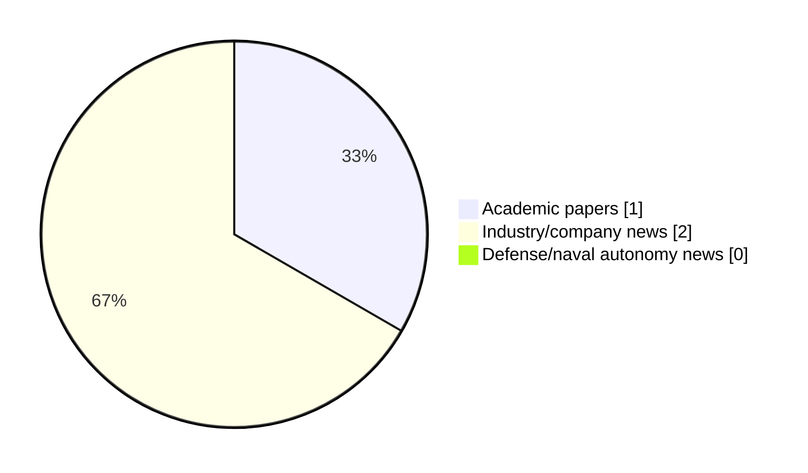

# Maritime Autonomy Watch — 2026-06-25

## Executive Summary

- Total selected items: 3
- Academic papers: 1
- Industry/company news: 2
- Defense/naval autonomy news: 0
- Failed/inaccessible sources: 0

## Contents

- [Analyst Brief](#analyst-brief)
- [Must Read](#must-read)
- [Top Signals Today](#top-signals-today)
- [Topic Signals](#topic-signals)
- [Freshness and Coverage](#freshness-and-coverage)
- [Quality Notes](#quality-notes)
- [Watchlist](#watchlist)
- [Academic Papers](#academic-papers)
- [Industry and Company News](#industry-and-company-news)
- [Defense and Naval Autonomy News](#defense-and-naval-autonomy-news)
- [Source Status Summary](#source-status-summary)

## Analyst Brief

Today's report selected 3 non-duplicate item(s), led by AUV navigation, underwater communications, planning/control. The strongest item is [Sea Trial Validation of the ROS-DESERT Middleware with Autonomous Underwater Vehicles](https://openalex.org/W7162474740) from OpenAlex.
Coverage is weighted toward academic research (1), with 2 industry and 0 defense signal(s).
Quality caveat: low-score-unique=2.

## Must Read

- [Sea Trial Validation of the ROS-DESERT Middleware with Autonomous Underwater Vehicles](https://openalex.org/W7162474740) — Research signal: AUV navigation
- [OPT Deploys PowerBuoy for Rutgers University and Wins WAM-V Order from Stevens Institute](https://oceannews.com/news/science-technology/opt-deploys-powerbuoy-for-rutgers-university-and-wins-wam-v-order-from-stevens-institute/) — Industry signal: USV operations
- [Underwater Testbed Validates Subsea Robotics & Autonomous Marine Systems](https://www.oceansciencetechnology.com/news/underwater-testbed-validates-subsea-robotics-autonomous-marine-systems/) — Industry signal: critical infrastructure

## Top Signals Today

- AUV navigation: 1 selected item(s).
- underwater communications: 1 selected item(s).
- planning/control: 1 selected item(s).
- USV operations: 1 selected item(s).
- critical infrastructure: 1 selected item(s).

## Topic Signals

- AUV navigation: 1
- underwater communications: 1
- planning/control: 1
- USV operations: 1
- critical infrastructure: 1

## Freshness and Coverage

- Newest selected item date: 2026-06-24
- Oldest selected item date: 2026-05-22
- Active/enabled sources: 5
- Sources with access problems: 2
- Quality flags: 2

## Quality Notes

- low-score-unique: 2

## Watchlist

- [OPT Deploys PowerBuoy for Rutgers University and Wins WAM-V Order from Stevens Institute](https://oceannews.com/news/science-technology/opt-deploys-powerbuoy-for-rutgers-university-and-wins-wam-v-order-from-stevens-institute/) — low-score-unique
- [Underwater Testbed Validates Subsea Robotics & Autonomous Marine Systems](https://www.oceansciencetechnology.com/news/underwater-testbed-validates-subsea-robotics-autonomous-marine-systems/) — low-score-unique

### Category Snapshot

| Category | Selected items |
|---|---:|
| Academic papers | 1 |
| Industry/company news | 2 |
| Defense/naval autonomy news | 0 |

## Academic Papers

_Selected items: 1_

### [Sea Trial Validation of the ROS-DESERT Middleware with Autonomous Underwater Vehicles](https://openalex.org/W7162474740)

- Source: OpenAlex
- Date: 2026-05-22
- Relevance score: 9.25
- Authors: Davide Cosimo, Davide Costa, Riccardo Costanzi, Filippo Campagnaro, Andrea Caiti, Michele Zorzi
- Signal: Research signal: AUV navigation
- Topic tags: AUV navigation, underwater communications, planning/control

**Abstract**

This paper presents a modular software architecture that enables environmental-aware coordination of heterogeneous Autonomous Underwater Vehicles (AUVs) to improve underwater acoustic connectivity. The architecture combines a Robot Operating System 2 application layer with the DESERT Underwater communication framework through the rmw_desert middleware, and integrates a Robot Operating System 1 bridge to ensure interoperability with legacy vehicle front-seat controllers. This design enables fine-grained, cross-layer configurability of the communication stack and supports onboard processing of environmental measurements to inform adaptive communication behaviors. As a representative use case, this architecture is used to implement a lightweight depth-optimization strategy that exploits environmental awareness and AUV mobility to improve acoustic link performance.

**Why it matters**

Relevant to underwater autonomy; the work may inform maritime autonomy research, testing priorities, or system design.

---

## Industry and Company News

_Selected items: 2_

### [OPT Deploys PowerBuoy for Rutgers University and Wins WAM-V Order from Stevens Institute](https://oceannews.com/news/science-technology/opt-deploys-powerbuoy-for-rutgers-university-and-wins-wam-v-order-from-stevens-institute/)

- Source: oceannews.com
- Date: 2026-06-24
- Relevance score: 3.5
- Signal: Industry signal: USV operations
- Topic tags: USV operations
- Quality flags: low-score-unique

**Summary**

Ocean Power Technologies, Inc. (OPT), has announced the successful deployment and commissioning of a PowerBuoy® system off the coast of New Jersey in support of Rutgers, The State University of New Jersey. The Company also announced it has received a purchase order from Stevens Institute of Technology for one of its maritime drones, the WAM-V® unmanned surface vehicle.

**Why it matters**

Signals momentum in surface-vessel operations; useful for tracking product direction, partnerships, and deployment opportunities.

---

### [Underwater Testbed Validates Subsea Robotics & Autonomous Marine Systems](https://www.oceansciencetechnology.com/news/underwater-testbed-validates-subsea-robotics-autonomous-marine-systems/)

- Source: oceansciencetechnology.com
- Date: 2026-06-24
- Relevance score: 3
- Signal: Industry signal: critical infrastructure
- Topic tags: critical infrastructure
- Quality flags: low-score-unique

**Summary**

The Smart Sound Connect Subsurface (SSCS) project has completed its first major live demonstration, showcasing collaborative multi-marine surface and subsea.

**Why it matters**

Signals momentum in underwater autonomy; useful for tracking product direction, partnerships, and deployment opportunities.

---

## Defense and Naval Autonomy News

_Selected items: 0_

No selected items.

## Inaccessible or Failed Sources

- None

## Source Status Summary

| Source | Status | Notes |
|---|---|---|
| arXiv | enabled | API source, 15 items fetched |
| OpenAlex | enabled | API source, 15 items fetched |
| RSS feeds | enabled | 107 RSS items fetched |
| SMI MASG News | enabled | HTML source, 10 items fetched |
| IEEE Xplore | disabled | Missing IEEE_XPLORE_API_KEY |
| Elsevier Scopus | enabled | API source, 15 items fetched |
| NewsAPI | disabled | Missing NEWS_API_KEY |

## Metadata

- Generated at: 2026-06-25T09:14:11.007237+02:00
- Date: 2026-06-25
- Repository: ferhannb/MarineRobotics
- Relevance threshold: 4.0
- Deduplication method: DOI, canonical URL, source ID, normalized title, similar recent titles, category caps, and novelty score
