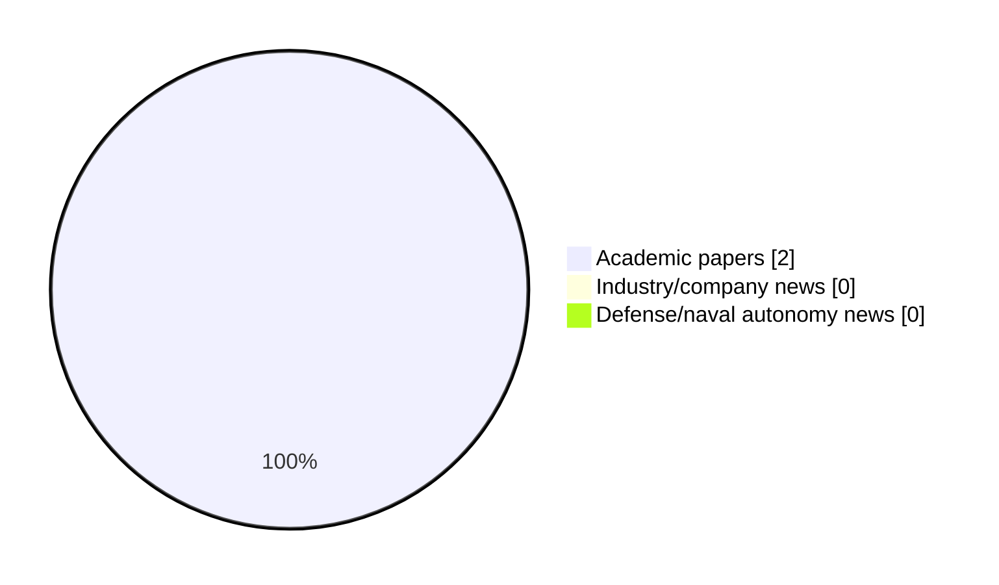

# Maritime Autonomy Watch — 2026-06-26

## Executive Summary

- Total selected items: 2
- Academic papers: 2
- Industry/company news: 0
- Defense/naval autonomy news: 0
- Failed/inaccessible sources: 0

## Contents

- [Analyst Brief](#analyst-brief)
- [Must Read](#must-read)
- [Top Signals Today](#top-signals-today)
- [Topic Signals](#topic-signals)
- [Freshness and Coverage](#freshness-and-coverage)
- [Quality Notes](#quality-notes)
- [Watchlist](#watchlist)
- [Academic Papers](#academic-papers)
- [Industry and Company News](#industry-and-company-news)
- [Defense and Naval Autonomy News](#defense-and-naval-autonomy-news)
- [Source Status Summary](#source-status-summary)

## Analyst Brief

Today's report selected 2 non-duplicate item(s), led by planning/control, USV operations, critical infrastructure. The strongest item is [Traceable Virtual Sea Trials in the Marine Robotics Unity Simulator for Manoeuvring Assessment of Unmanned Surface Vehicles](http://arxiv.org/abs/2606.12349v2) from arXiv.
Coverage is weighted toward academic research (2), with 0 industry and 0 defense signal(s).

## Must Read

- [Traceable Virtual Sea Trials in the Marine Robotics Unity Simulator for Manoeuvring Assessment of Unmanned Surface Vehicles](http://arxiv.org/abs/2606.12349v2) — Research signal: USV operations
- [Semantically-Aware Diver Activity Recognition Framework for Effective Underwater Multi-Human-Robot Collaboration](http://arxiv.org/abs/2606.12374v1) — Research signal: AUV navigation

## Top Signals Today

- planning/control: 2 selected item(s).
- USV operations: 1 selected item(s).
- critical infrastructure: 1 selected item(s).
- AUV navigation: 1 selected item(s).

## Topic Signals

- planning/control: 2
- USV operations: 1
- critical infrastructure: 1
- AUV navigation: 1

## Freshness and Coverage

- Newest selected item date: 2026-06-10
- Oldest selected item date: 2026-06-10
- Active/enabled sources: 5
- Sources with access problems: 2
- Quality flags: 0

## Quality Notes

- No quality flags on selected items.

## Watchlist

- No watchlist items today.

### Category Snapshot

| Category | Selected items |
|---|---:|
| Academic papers | 2 |
| Industry/company news | 0 |
| Defense/naval autonomy news | 0 |

## Academic Papers

_Selected items: 2_

### [Traceable Virtual Sea Trials in the Marine Robotics Unity Simulator for Manoeuvring Assessment of Unmanned Surface Vehicles](http://arxiv.org/abs/2606.12349v2)

- Source: arXiv
- Date: 2026-06-10
- Relevance score: 10
- Authors: Paria Rezayan
- Signal: Research signal: USV operations
- Topic tags: USV operations, planning/control, critical infrastructure

**Abstract**

Accurate identification of hydrodynamic derivatives is essential for precise control and autonomous navigation of Unmanned Surface Vehicles (USVs). However, acquiring high-fidelity manoeuvring data from physical sea trials is often constrained by cost, safety, and environmental disturbances. Standard manoeuvring trials, particularly Turning Circle (TC) and Zig-Zag (ZZ), remain fundamental to IMO and ITTC assessment procedures because they provide comparable performance metrics reflective of underlying hydrodynamic behaviour. This paper extends the open-source Marine Robotics Unity Simulator (MARUS) by introducing a standardised Virtual Sea Trial framework for automated execution and data generation of TC/ZZ manoeuvres. The framework provides traceable command-actuation logging, system-identification (SI)-focused data conditioning, and automated extraction of IMO/ITTC-aligned manoeuvring metrics.

**Why it matters**

Relevant to surface-vessel operations; the work may inform maritime autonomy research, testing priorities, or system design.

---

### [Semantically-Aware Diver Activity Recognition Framework for Effective Underwater Multi-Human-Robot Collaboration](http://arxiv.org/abs/2606.12374v1)

- Source: arXiv
- Date: 2026-06-10
- Relevance score: 7.75
- Authors: Sadman Sakib Enan, Junaed Sattar
- Signal: Research signal: AUV navigation
- Topic tags: AUV navigation, planning/control

**Abstract**

Effective multi-human-robot collaboration is essential for expanding human-led operations in the challenging and high-risk underwater environment. For autonomous underwater vehicles (AUVs) to become true teammates, they must be able to comprehend their surroundings and recognize a diver's activities to offer assistance and ensure safety. Towards this goal, we introduce DAR-Net, a novel transformer-based framework that analyzes complex underwater scenes to classify diver activities. Our contribution lies in a semantically guided learning formulation that couples transformer-based temporal reasoning with pixel-level scene supervision. This multi-loss training strategy explicitly aligns global activity recognition with local human-robot interaction semantics, which is particularly critical in low-visibility underwater conditions.

**Why it matters**

Relevant to underwater autonomy; the work may inform maritime autonomy research, testing priorities, or system design.

---

## Industry and Company News

_Selected items: 0_

No selected items.

## Defense and Naval Autonomy News

_Selected items: 0_

No selected items.

## Inaccessible or Failed Sources

- None

## Source Status Summary

| Source | Status | Notes |
|---|---|---|
| arXiv | enabled | API source, 15 items fetched |
| OpenAlex | enabled | API source, 15 items fetched |
| RSS feeds | enabled | 107 RSS items fetched |
| SMI MASG News | enabled | HTML source, 10 items fetched |
| IEEE Xplore | disabled | Missing IEEE_XPLORE_API_KEY |
| Elsevier Scopus | enabled | API source, 15 items fetched |
| NewsAPI | disabled | Missing NEWS_API_KEY |

## Metadata

- Generated at: 2026-06-26T09:20:21.714172+02:00
- Date: 2026-06-26
- Repository: ferhannb/MarineRobotics
- Relevance threshold: 4.0
- Deduplication method: DOI, canonical URL, source ID, normalized title, similar recent titles, category caps, and novelty score
