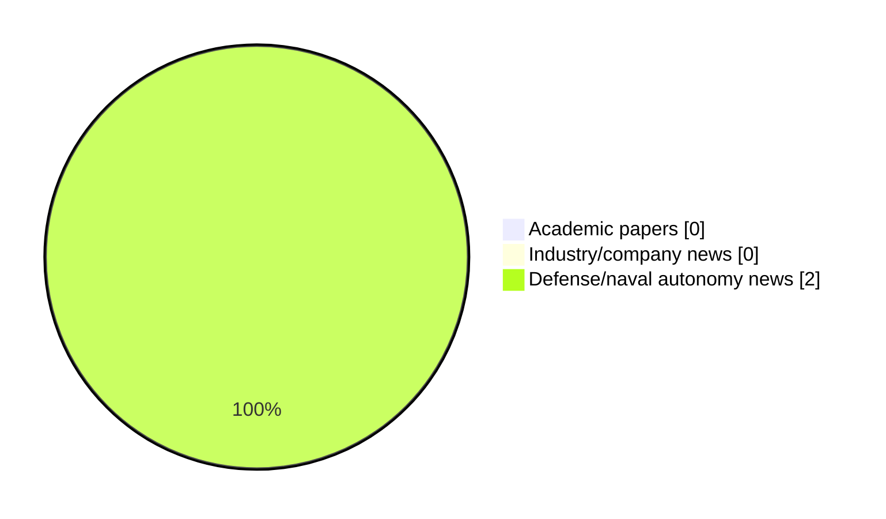

# Maritime Autonomy Watch — 2026-06-27

## Executive Summary

- Total selected items: 2
- Academic papers: 0
- Industry/company news: 0
- Defense/naval autonomy news: 2
- Failed/inaccessible sources: 1

## Contents

- [Analyst Brief](#analyst-brief)
- [Must Read](#must-read)
- [Top Signals Today](#top-signals-today)
- [Topic Signals](#topic-signals)
- [Freshness and Coverage](#freshness-and-coverage)
- [Quality Notes](#quality-notes)
- [Watchlist](#watchlist)
- [Academic Papers](#academic-papers)
- [Industry and Company News](#industry-and-company-news)
- [Defense and Naval Autonomy News](#defense-and-naval-autonomy-news)
- [Source Status Summary](#source-status-summary)

## Analyst Brief

Today's report selected 2 non-duplicate item(s), led by USV operations, defense adoption. The strongest item is [Hanwha Unveils Striker MUSV Family at Eurosatory 2026](https://www.navalnews.com/naval-news/2026/06/hanwha-unveils-striker-musv-family-at-eurosatory-2026/) from navalnews.com.
Coverage is weighted toward academic research (0), with 0 industry and 2 defense signal(s).
Quality caveat: low-score-unique=2.

## Must Read

- [Hanwha Unveils Striker MUSV Family at Eurosatory 2026](https://www.navalnews.com/naval-news/2026/06/hanwha-unveils-striker-musv-family-at-eurosatory-2026/) — Defense signal: USV operations
- [Gulf Coast Tactical Expands New Iberia Operations to Support Next-Generation Maritime Defense](https://oceannews.com/news/defense/gulf-coast-tactical-expands-new-iberia-operations-to-support-next-generation-maritime-defense/) — Defense signal: USV operations

## Top Signals Today

- USV operations: 2 selected item(s).
- defense adoption: 2 selected item(s).

## Topic Signals

- USV operations: 2
- defense adoption: 2

## Freshness and Coverage

- Newest selected item date: 2026-06-26
- Oldest selected item date: 2026-06-26
- Active/enabled sources: 4
- Sources with access problems: 3
- Quality flags: 2

## Quality Notes

- low-score-unique: 2

## Watchlist

- [Hanwha Unveils Striker MUSV Family at Eurosatory 2026](https://www.navalnews.com/naval-news/2026/06/hanwha-unveils-striker-musv-family-at-eurosatory-2026/) — low-score-unique
- [Gulf Coast Tactical Expands New Iberia Operations to Support Next-Generation Maritime Defense](https://oceannews.com/news/defense/gulf-coast-tactical-expands-new-iberia-operations-to-support-next-generation-maritime-defense/) — low-score-unique

### Category Snapshot

| Category | Selected items |
|---|---:|
| Academic papers | 0 |
| Industry/company news | 0 |
| Defense/naval autonomy news | 2 |

## Academic Papers

_Selected items: 0_

No selected items.

## Industry and Company News

_Selected items: 0_

No selected items.

## Defense and Naval Autonomy News

_Selected items: 2_

### [Hanwha Unveils Striker MUSV Family at Eurosatory 2026](https://www.navalnews.com/naval-news/2026/06/hanwha-unveils-striker-musv-family-at-eurosatory-2026/)

- Source: navalnews.com
- Date: 2026-06-26
- Relevance score: 3.5
- Signal: Defense signal: USV operations
- Topic tags: USV operations, defense adoption
- Quality flags: low-score-unique

**Summary**

At Eurosatory 2026, Hanwha Systems’ new Striker Medium Uncrewed Surface Vessel (MUSV) stood out as one of the few concepts aimed at bringing missile firepower to an autonomous naval platform. Tayfun Ozberk story, additional reporting by Xavier Vavasseur Displayed at the company’s booth, the Striker-S represents a departure from the small explosive-laden surface drones. Instead,.

**Why it matters**

Signals movement in surface-vessel operations, naval adoption; useful for tracking operational concepts, procurement direction, and fleet integration.

---

### [Gulf Coast Tactical Expands New Iberia Operations to Support Next-Generation Maritime Defense](https://oceannews.com/news/defense/gulf-coast-tactical-expands-new-iberia-operations-to-support-next-generation-maritime-defense/)

- Source: oceannews.com
- Date: 2026-06-26
- Relevance score: 3.5
- Signal: Defense signal: USV operations
- Topic tags: USV operations, defense adoption
- Quality flags: low-score-unique

**Summary**

Gulf Coast Tactical, LLC announced it will invest $6.1 million in Iberia Parish to expand production of unmanned surface vehicles, patrol craft, and other maritime platforms used in security operations, reinforcing Louisiana’s growing role in America’s defense economy.

**Why it matters**

Signals movement in surface-vessel operations, naval adoption; useful for tracking operational concepts, procurement direction, and fleet integration.

---

## Inaccessible or Failed Sources

- arXiv: The read operation timed out

## Source Status Summary

| Source | Status | Notes |
|---|---|---|
| arXiv | failed | The read operation timed out |
| OpenAlex | enabled | API source, 15 items fetched |
| RSS feeds | enabled | 107 RSS items fetched |
| SMI MASG News | enabled | HTML source, 10 items fetched |
| IEEE Xplore | disabled | Missing IEEE_XPLORE_API_KEY |
| Elsevier Scopus | enabled | API source, 15 items fetched |
| NewsAPI | disabled | Missing NEWS_API_KEY |

## Metadata

- Generated at: 2026-06-27T09:07:08.670977+02:00
- Date: 2026-06-27
- Repository: ferhannb/MarineRobotics
- Relevance threshold: 4.0
- Deduplication method: DOI, canonical URL, source ID, normalized title, similar recent titles, category caps, and novelty score
