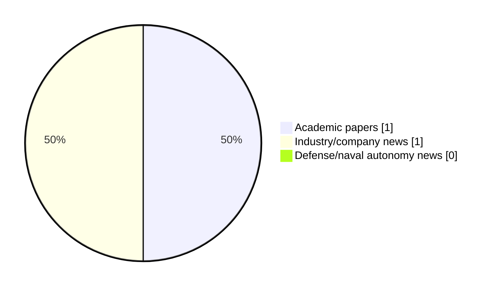

# Maritime Autonomy Watch — 2026-06-29

## Executive Summary

- Total selected items: 2
- Academic papers: 1
- Industry/company news: 1
- Defense/naval autonomy news: 0
- Failed/inaccessible sources: 0

## Contents

- [Analyst Brief](#analyst-brief)
- [Must Read](#must-read)
- [Top Signals Today](#top-signals-today)
- [Topic Signals](#topic-signals)
- [Freshness and Coverage](#freshness-and-coverage)
- [Quality Notes](#quality-notes)
- [Watchlist](#watchlist)
- [Academic Papers](#academic-papers)
- [Industry and Company News](#industry-and-company-news)
- [Defense and Naval Autonomy News](#defense-and-naval-autonomy-news)
- [Source Status Summary](#source-status-summary)

## Analyst Brief

Today's report selected 2 non-duplicate item(s), led by AUV navigation, critical infrastructure, general autonomy. The strongest item is [Dynautics Receives Seawork Innovation Award for Modular AUV Technology](https://www.oceansciencetechnology.com/news/dynautics-receives-seawork-innovation-award-for-modular-auv-technology/) from oceansciencetechnology.com.
Coverage is weighted toward academic research (1), with 1 industry and 0 defense signal(s).
Quality caveat: missing-summary=1, date-anomaly=1, low-score-unique=1.

## Must Read

- [Dynautics Receives Seawork Innovation Award for Modular AUV Technology](https://www.oceansciencetechnology.com/news/dynautics-receives-seawork-innovation-award-for-modular-auv-technology/) — Industry signal: AUV navigation

## Top Signals Today

- AUV navigation: 1 selected item(s).
- critical infrastructure: 1 selected item(s).
- general autonomy: 1 selected item(s).

## Topic Signals

- AUV navigation: 1
- critical infrastructure: 1
- general autonomy: 1

## Freshness and Coverage

- Newest selected item date: 2026-12-01
- Oldest selected item date: 2026-06-29
- Active/enabled sources: 5
- Sources with access problems: 2
- Quality flags: 3

## Quality Notes

- missing-summary: 1
- date-anomaly: 1
- low-score-unique: 1
- Date anomalies: [Dynamic reliability analysis for unmanned systems with epistemic uncertainty: An application to the variable buoyancy system of a self-powered underwater glider](https://api.elsevier.com/content/abstract/scopus_id/105039679575) reports 2026-12-01

## Watchlist

- [Dynamic reliability analysis for unmanned systems with epistemic uncertainty: An application to the variable buoyancy system of a self-powered underwater glider](https://api.elsevier.com/content/abstract/scopus_id/105039679575) — missing-summary, date-anomaly, low-score-unique

### Category Snapshot

| Category | Selected items |
|---|---:|
| Academic papers | 1 |
| Industry/company news | 1 |
| Defense/naval autonomy news | 0 |

## Academic Papers

_Selected items: 1_

### [Dynamic reliability analysis for unmanned systems with epistemic uncertainty: An application to the variable buoyancy system of a self-powered underwater glider](https://api.elsevier.com/content/abstract/scopus_id/105039679575)

- Source: Elsevier Scopus
- Date: 2026-12-01
- Relevance score: 3.5
- DOI: 10.1016/j.ress.2026.112902
- Signal: Research signal: general autonomy
- Topic tags: general autonomy
- Quality flags: missing-summary, date-anomaly, low-score-unique

**Abstract**

No summary available.

**Why it matters**

Relevant to underwater autonomy; the work may inform maritime autonomy research, testing priorities, or system design.

---

## Industry and Company News

_Selected items: 1_

### [Dynautics Receives Seawork Innovation Award for Modular AUV Technology](https://www.oceansciencetechnology.com/news/dynautics-receives-seawork-innovation-award-for-modular-auv-technology/)

- Source: oceansciencetechnology.com
- Date: 2026-06-29
- Relevance score: 5
- Signal: Industry signal: AUV navigation
- Topic tags: AUV navigation, critical infrastructure

**Summary**

Dynautics has won the Subsea and Underwater Intervention category at the 2026 Seawork Innovations Showcase for its Phantom 2 Autonomous.

**Why it matters**

Signals momentum in underwater autonomy; useful for tracking product direction, partnerships, and deployment opportunities.

---

## Defense and Naval Autonomy News

_Selected items: 0_

No selected items.

## Inaccessible or Failed Sources

- None

## Source Status Summary

| Source | Status | Notes |
|---|---|---|
| arXiv | enabled | API source, 15 items fetched |
| OpenAlex | enabled | API source, 15 items fetched |
| RSS feeds | enabled | 107 RSS items fetched |
| SMI MASG News | enabled | HTML source, 10 items fetched |
| IEEE Xplore | disabled | Missing IEEE_XPLORE_API_KEY |
| Elsevier Scopus | enabled | API source, 15 items fetched |
| NewsAPI | disabled | Missing NEWS_API_KEY |

## Metadata

- Generated at: 2026-06-29T09:45:37.894687+02:00
- Date: 2026-06-29
- Repository: ferhannb/MarineRobotics
- Relevance threshold: 4.0
- Deduplication method: DOI, canonical URL, source ID, normalized title, similar recent titles, category caps, and novelty score
