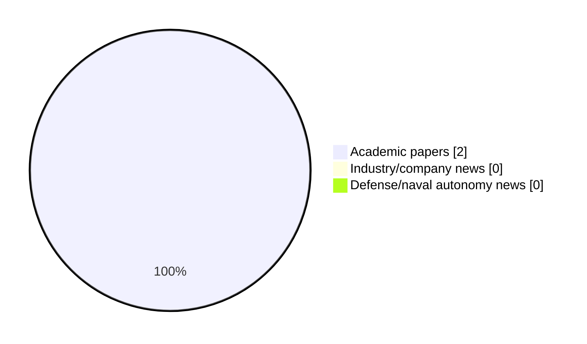

# Maritime Autonomy Watch — 2026-06-30

## Executive Summary

- Total selected items: 2
- Academic papers: 2
- Industry/company news: 0
- Defense/naval autonomy news: 0
- Failed/inaccessible sources: 0

## Contents

- [Analyst Brief](#analyst-brief)
- [Must Read](#must-read)
- [Top Signals Today](#top-signals-today)
- [Topic Signals](#topic-signals)
- [Freshness and Coverage](#freshness-and-coverage)
- [Quality Notes](#quality-notes)
- [Watchlist](#watchlist)
- [Academic Papers](#academic-papers)
- [Industry and Company News](#industry-and-company-news)
- [Defense and Naval Autonomy News](#defense-and-naval-autonomy-news)
- [Source Status Summary](#source-status-summary)

## Analyst Brief

Today's report selected 2 non-duplicate item(s), led by swarm autonomy, perception, USV operations. The strongest item is [AUSLUN: A Fixed-Hover UAV--USV System for GNSS-Denied Maritime Search and Navigation](http://arxiv.org/abs/2606.29875v1) from arXiv.
Coverage is weighted toward academic research (2), with 0 industry and 0 defense signal(s).

## Must Read

- [AUSLUN: A Fixed-Hover UAV--USV System for GNSS-Denied Maritime Search and Navigation](http://arxiv.org/abs/2606.29875v1) — Research signal: USV operations
- [A Deep Zero-Inflated Model of North Atlantic Right Whale Presence To Support Blue Economy Management in the U.S. East Coast](http://arxiv.org/abs/2606.14403v1) — Research signal: AUV navigation

## Top Signals Today

- swarm autonomy: 2 selected item(s).
- perception: 2 selected item(s).
- USV operations: 1 selected item(s).
- AUV navigation: 1 selected item(s).
- underwater communications: 1 selected item(s).

## Topic Signals

- swarm autonomy: 2
- perception: 2
- USV operations: 1
- AUV navigation: 1
- underwater communications: 1

## Freshness and Coverage

- Newest selected item date: 2026-06-29
- Oldest selected item date: 2026-06-12
- Active/enabled sources: 5
- Sources with access problems: 2
- Quality flags: 0

## Quality Notes

- No quality flags on selected items.

## Watchlist

- No watchlist items today.

### Category Snapshot

| Category | Selected items |
|---|---:|
| Academic papers | 2 |
| Industry/company news | 0 |
| Defense/naval autonomy news | 0 |

## Academic Papers

_Selected items: 2_

### [AUSLUN: A Fixed-Hover UAV--USV System for GNSS-Denied Maritime Search and Navigation](http://arxiv.org/abs/2606.29875v1)

- Source: arXiv
- Date: 2026-06-29
- Relevance score: 8
- Authors: Siyuan Yang, Zikai Jia, Hailiang Kuang, Xiaoyu He, Qizhi Guo, Yihao Dong, Shaoming He
- Signal: Research signal: USV operations
- Topic tags: USV operations, swarm autonomy, perception

**Abstract**

Global navigation satellite system (GNSS) denial can prevent an unmanned surface vehicle (USV) from both finding a distant vessel and maintaining a globally referenced approach. This paper presents AUSLUN (Automatic UAV Search, Localization, and USV Navigation), a fixed-hover aerial-surface system that uses a coastal unmanned aerial vehicle (UAV), which estimates its own pose through visual-inertial odometry (VIO), as a long-range sensing and navigation anchor. The central design shifts sensing motion from UAV translation to a zoom pod and closes the loop through three coupled elements: polygon-aware annular pod scanning, modality-aware bearing-range localization, and target-relative USV guidance with visual-loss recovery. The same gated recursive estimator uses laser range for the non-cooperative target and datalink range for the cooperative USV.

**Why it matters**

Relevant to surface-vessel operations; the work may inform maritime autonomy research, testing priorities, or system design.

---

### [A Deep Zero-Inflated Model of North Atlantic Right Whale Presence To Support Blue Economy Management in the U.S. East Coast](http://arxiv.org/abs/2606.14403v1)

- Source: arXiv
- Date: 2026-06-12
- Relevance score: 5
- Authors: Jiaxiang Ji, Laura Nazzaro, Josh Kohut, Ahmed Aziz Ezzat
- Signal: Research signal: AUV navigation
- Topic tags: AUV navigation, underwater communications, swarm autonomy, perception

**Abstract**

Effective modeling of endangered marine mammal species, such as the North Atlantic Right Whale, is critical for balancing marine conservation with the growing blue economy. Passive acoustic monitoring data collected by autonomous underwater vehicles provide new opportunities for localized marine species detection and oceanographic sensing, but introduce complex statistical challenges such as zero inflation, imperfect detection, and intricate dependence structures. In response, we propose the Deep Zero-Inflated Bernoulli (DeepZIB) model--a deep statistical method which jointly models latent species presence and conditional detection probabilities while learning complex habitat relationships from heterogeneous covariate information. We establish theoretical results on the model's structural properties and conduct simulation experiments to demonstrate its ability to recover underlying parameters and latent presence fields.

**Why it matters**

Relevant to underwater autonomy, multi-vehicle coordination, infrastructure monitoring; the work may inform maritime autonomy research, testing priorities, or system design.

---

## Industry and Company News

_Selected items: 0_

No selected items.

## Defense and Naval Autonomy News

_Selected items: 0_

No selected items.

## Inaccessible or Failed Sources

- None

## Source Status Summary

| Source | Status | Notes |
|---|---|---|
| arXiv | enabled | API source, 15 items fetched |
| OpenAlex | enabled | API source, 15 items fetched |
| RSS feeds | enabled | 107 RSS items fetched |
| SMI MASG News | enabled | HTML source, 10 items fetched |
| IEEE Xplore | disabled | Missing IEEE_XPLORE_API_KEY |
| Elsevier Scopus | enabled | API source, 15 items fetched |
| NewsAPI | disabled | Missing NEWS_API_KEY |

## Metadata

- Generated at: 2026-06-30T09:20:32.174828+02:00
- Date: 2026-06-30
- Repository: ferhannb/MarineRobotics
- Relevance threshold: 4.0
- Deduplication method: DOI, canonical URL, source ID, normalized title, similar recent titles, category caps, and novelty score
