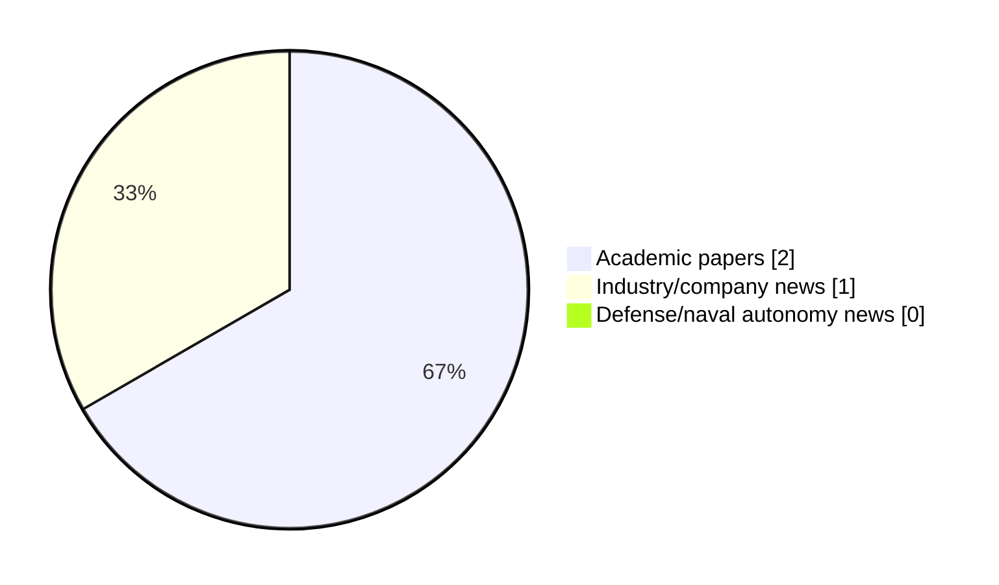

# Maritime Autonomy Watch — 2026-07-01

## Executive Summary

- Total selected items: 3
- Academic papers: 2
- Industry/company news: 1
- Defense/naval autonomy news: 0
- Failed/inaccessible sources: 1

## Contents

- [Analyst Brief](#analyst-brief)
- [Must Read](#must-read)
- [Top Signals Today](#top-signals-today)
- [Topic Signals](#topic-signals)
- [Freshness and Coverage](#freshness-and-coverage)
- [Quality Notes](#quality-notes)
- [Watchlist](#watchlist)
- [Academic Papers](#academic-papers)
- [Industry and Company News](#industry-and-company-news)
- [Defense and Naval Autonomy News](#defense-and-naval-autonomy-news)
- [Source Status Summary](#source-status-summary)

## Analyst Brief

Today's report selected 3 non-duplicate item(s), led by AUV navigation, USV operations, critical infrastructure. The strongest item is [Robust Autonomous UAV Landing on Maritime Platforms via Multimodal Agentic AI and Active Wave Compensation](http://arxiv.org/abs/2606.31613v1) from arXiv.
Coverage is weighted toward academic research (2), with 1 industry and 0 defense signal(s).
Quality caveat: low-score-unique=1.

## Must Read

- [Robust Autonomous UAV Landing on Maritime Platforms via Multimodal Agentic AI and Active Wave Compensation](http://arxiv.org/abs/2606.31613v1) — Research signal: USV operations
- [Information-Aided DVL Calibration](http://arxiv.org/abs/2606.31216v1) — Research signal: AUV navigation
- [Oceaneering’s Ocean Intervention II Deploys AUV and Geophysical Surveys Offshore Trinidad](https://oceannews.com/news/subsea-and-survey/oceaneerings-ocean-intervention-ii-deploys-auv-and-geophysical-surveys-offshore-trinidad/) — Industry signal: AUV navigation

## Top Signals Today

- AUV navigation: 2 selected item(s).
- USV operations: 1 selected item(s).
- critical infrastructure: 1 selected item(s).
- swarm autonomy: 1 selected item(s).

## Topic Signals

- AUV navigation: 2
- USV operations: 1
- critical infrastructure: 1
- swarm autonomy: 1

## Freshness and Coverage

- Newest selected item date: 2026-06-30
- Oldest selected item date: 2026-06-30
- Active/enabled sources: 4
- Sources with access problems: 3
- Quality flags: 1

## Quality Notes

- low-score-unique: 1

## Watchlist

- [Oceaneering’s Ocean Intervention II Deploys AUV and Geophysical Surveys Offshore Trinidad](https://oceannews.com/news/subsea-and-survey/oceaneerings-ocean-intervention-ii-deploys-auv-and-geophysical-surveys-offshore-trinidad/) — low-score-unique

### Category Snapshot

| Category | Selected items |
|---|---:|
| Academic papers | 2 |
| Industry/company news | 1 |
| Defense/naval autonomy news | 0 |

## Academic Papers

_Selected items: 2_

### [Robust Autonomous UAV Landing on Maritime Platforms via Multimodal Agentic AI and Active Wave Compensation](http://arxiv.org/abs/2606.31613v1)

- Source: arXiv
- Date: 2026-06-30
- Relevance score: 9.5
- Authors: Francisco S. Neves, Pedro N. Pereira, Raul D. S. G. Campilho, Andry M. Pinto
- Signal: Research signal: USV operations
- Topic tags: USV operations, critical infrastructure

**Abstract**

Autonomous aerial inspection of marine infrastructure is frequently compromised by stochastic sea states, introducing risks of high-kinetic impacts, post-landing toppling, and sensory occlusion. This paper proposes a decoupled, multi-vehicle landing framework synchronizing an Unmanned Surface Vehicle (USV) equipped with a 3-RPU stabilized platform with a robust Unmanned Aerial Vehicle (UAV). The architecture utilizes two independent Deep Reinforcement Learning (DRL) agents: a Soft Actor-Critic (SAC) agent providing high-frequency wave-motion compensation for the landing deck, and a multimodal RL agent for the UAVs final approach. Evaluated in high-fidelity maritime simulations, the system achieved a 100% landing success rate across 15 trials in wave states varying from calm to rough. Results show a mean stabilization efficacy of 87.

**Why it matters**

Relevant to surface-vessel operations, infrastructure monitoring; the work may inform maritime autonomy research, testing priorities, or system design.

---

### [Information-Aided DVL Calibration](http://arxiv.org/abs/2606.31216v1)

- Source: arXiv
- Date: 2026-06-30
- Relevance score: 7
- Authors: Zeev Yampolsky, Itzik Klein
- Signal: Research signal: AUV navigation
- Topic tags: AUV navigation, swarm autonomy

**Abstract**

The Doppler velocity log (DVL) velocity measurements are critical to the accuracy of autonomous underwater vehicle (AUV) navigation solutions and, consequently, to mission success. To ensure accurate measurements, the DVL is commonly calibrated before mission start while the AUV sails on the water surface, receiving global navigation satellite system (GNSS) signals that provide accurate reference measurements. Conventionally, Kalman filter-based approaches are employed during calibration to estimate the scale factor and misalignment errors. However, in certain environments, GNSS signals may be unavailable, rendering conventional calibration impossible and forcing the use of uncalibrated DVL measurements, which degrades navigation performance.

**Why it matters**

Relevant to underwater autonomy, multi-vehicle coordination; the work may inform maritime autonomy research, testing priorities, or system design.

---

## Industry and Company News

_Selected items: 1_

### [Oceaneering’s Ocean Intervention II Deploys AUV and Geophysical Surveys Offshore Trinidad](https://oceannews.com/news/subsea-and-survey/oceaneerings-ocean-intervention-ii-deploys-auv-and-geophysical-surveys-offshore-trinidad/)

- Source: oceannews.com
- Date: 2026-06-30
- Relevance score: 3.5
- Signal: Industry signal: AUV navigation
- Topic tags: AUV navigation
- Quality flags: low-score-unique

**Summary**

Houston, Texas—Oceaneering International, Inc. (Oceaneering) has announced that it has secured multi-discipline offshore survey contracts for its Ocean Intervention II ( OI2 ) vessel, supporting major offshore development programs for a large international operator.

**Why it matters**

Signals momentum in underwater autonomy; useful for tracking product direction, partnerships, and deployment opportunities.

---

## Defense and Naval Autonomy News

_Selected items: 0_

No selected items.

## Inaccessible or Failed Sources

- OpenAlex: HTTP 503 for https://api.openalex.org/works?search=maritime+autonomy+marine+robotics+autonomous+vessel+autonomous+mission+autonomous+surface+vessel&per-page=15&sort=publication_date%3Adesc

## Source Status Summary

| Source | Status | Notes |
|---|---|---|
| arXiv | enabled | API source, 15 items fetched |
| OpenAlex | failed | HTTP 503 for https://api.openalex.org/works?search=maritime+autonomy+marine+robotics+autonomous+vessel+autonomous+mission+autonomous+surface+vessel&per-page=15&sort=publication_date%3Adesc |
| RSS feeds | enabled | 107 RSS items fetched |
| SMI MASG News | enabled | HTML source, 10 items fetched |
| IEEE Xplore | disabled | Missing IEEE_XPLORE_API_KEY |
| Elsevier Scopus | enabled | API source, 15 items fetched |
| NewsAPI | disabled | Missing NEWS_API_KEY |

## Metadata

- Generated at: 2026-07-01T09:32:26.050256+02:00
- Date: 2026-07-01
- Repository: ferhannb/MarineRobotics
- Relevance threshold: 4.0
- Deduplication method: DOI, canonical URL, source ID, normalized title, similar recent titles, category caps, and novelty score
