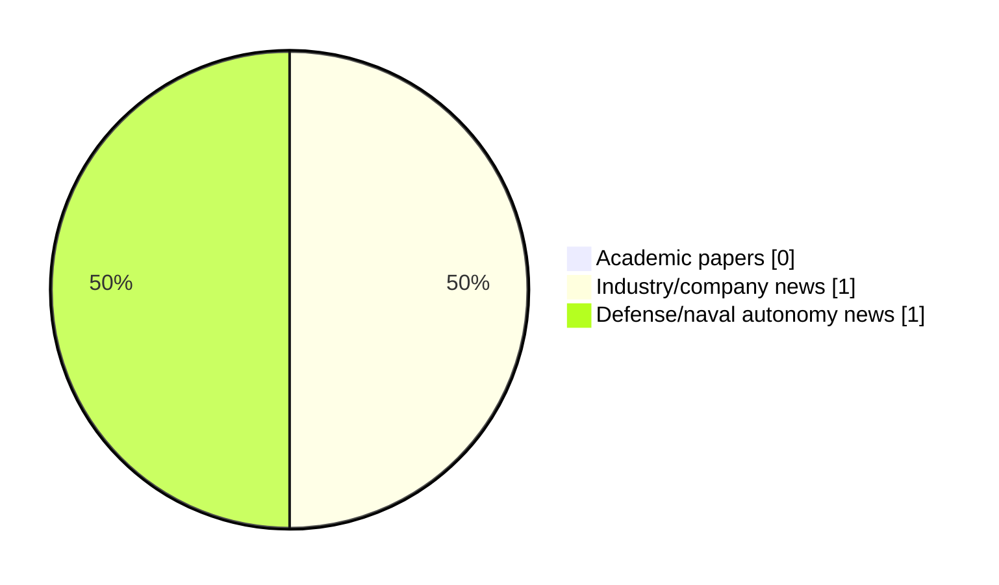

# Maritime Autonomy Watch — 2026-07-02

## Executive Summary

- Total selected items: 2
- Academic papers: 0
- Industry/company news: 1
- Defense/naval autonomy news: 1
- Failed/inaccessible sources: 1

## Contents

- [Analyst Brief](#analyst-brief)
- [Must Read](#must-read)
- [Top Signals Today](#top-signals-today)
- [Topic Signals](#topic-signals)
- [Freshness and Coverage](#freshness-and-coverage)
- [Quality Notes](#quality-notes)
- [Watchlist](#watchlist)
- [Academic Papers](#academic-papers)
- [Industry and Company News](#industry-and-company-news)
- [Defense and Naval Autonomy News](#defense-and-naval-autonomy-news)
- [Source Status Summary](#source-status-summary)

## Analyst Brief

Today's report selected 2 non-duplicate item(s), led by USV operations, planning/control, defense adoption. The strongest item is [Exail DriX O-16 USV Validates Tethered Drone and EO/IR Payload Integration](https://oceannews.com/news/science-technology/exail-drix-o-16-usv-validates-tethered-drone-and-eo-ir-payload-integration/) from oceannews.com.
Coverage is weighted toward academic research (0), with 1 industry and 1 defense signal(s).
Quality caveat: low-score-unique=1.

## Must Read

- [Exail DriX O-16 USV Validates Tethered Drone and EO/IR Payload Integration](https://oceannews.com/news/science-technology/exail-drix-o-16-usv-validates-tethered-drone-and-eo-ir-payload-integration/) — Industry signal: USV operations
- [Greensea IQ wins $18m Navy Contract](https://www.marinelink.com/news/greensea-iq-wins-m-navy-contract-540844) — Defense signal: planning/control

## Top Signals Today

- USV operations: 1 selected item(s).
- planning/control: 1 selected item(s).
- defense adoption: 1 selected item(s).

## Topic Signals

- USV operations: 1
- planning/control: 1
- defense adoption: 1

## Freshness and Coverage

- Newest selected item date: 2026-07-01
- Oldest selected item date: 2026-07-01
- Active/enabled sources: 4
- Sources with access problems: 3
- Quality flags: 1

## Quality Notes

- low-score-unique: 1

## Watchlist

- [Greensea IQ wins $18m Navy Contract](https://www.marinelink.com/news/greensea-iq-wins-m-navy-contract-540844) — low-score-unique

### Category Snapshot

| Category | Selected items |
|---|---:|
| Academic papers | 0 |
| Industry/company news | 1 |
| Defense/naval autonomy news | 1 |

## Academic Papers

_Selected items: 0_

No selected items.

## Industry and Company News

_Selected items: 1_

### [Exail DriX O-16 USV Validates Tethered Drone and EO/IR Payload Integration](https://oceannews.com/news/science-technology/exail-drix-o-16-usv-validates-tethered-drone-and-eo-ir-payload-integration/)

- Source: oceannews.com
- Date: 2026-07-01
- Relevance score: 6
- Signal: Industry signal: USV operations
- Topic tags: USV operations

**Summary**

Exail has successfully completed sea trials validating the integration of new third-party payloads onto its DriX O-16 unmanned surface vessel (USV). Beyond the technical milestone, this demonstration highlights Exail's philosophy of designing open, modular architectures capable of rapidly adopting best-in-class technologies to meet constantly evolving operational needs.

**Why it matters**

Signals momentum in surface-vessel operations; useful for tracking product direction, partnerships, and deployment opportunities.

---

## Defense and Naval Autonomy News

_Selected items: 1_

### [Greensea IQ wins $18m Navy Contract](https://www.marinelink.com/news/greensea-iq-wins-m-navy-contract-540844)

- Source: marinelink.com
- Date: 2026-07-01
- Relevance score: 3
- Signal: Defense signal: planning/control
- Topic tags: planning/control, defense adoption
- Quality flags: low-score-unique

**Summary**

Greensea Systems, Inc., d.b.a, Greensea IQ, won a $18,154,710 Indefinite-Delivery/Indefinite-Quantity (IDIQ) contract to provide hardware, software, and engineering technical services for underwater controllers used to operate autonomous and remotely operated systems in maritime environments.

**Why it matters**

Signals movement in underwater autonomy, naval adoption; useful for tracking operational concepts, procurement direction, and fleet integration.

---

## Inaccessible or Failed Sources

- OpenAlex: HTTP 503 for https://api.openalex.org/works?search=maritime+autonomy+marine+robotics+autonomous+vessel+autonomous+mission+autonomous+surface+vessel&per-page=15&sort=publication_date%3Adesc

## Source Status Summary

| Source | Status | Notes |
|---|---|---|
| arXiv | enabled | API source, 15 items fetched |
| OpenAlex | failed | HTTP 503 for https://api.openalex.org/works?search=maritime+autonomy+marine+robotics+autonomous+vessel+autonomous+mission+autonomous+surface+vessel&per-page=15&sort=publication_date%3Adesc |
| RSS feeds | enabled | 107 RSS items fetched |
| SMI MASG News | enabled | HTML source, 10 items fetched |
| IEEE Xplore | disabled | Missing IEEE_XPLORE_API_KEY |
| Elsevier Scopus | enabled | API source, 15 items fetched |
| NewsAPI | disabled | Missing NEWS_API_KEY |

## Metadata

- Generated at: 2026-07-02T09:09:47.691271+02:00
- Date: 2026-07-02
- Repository: ferhannb/MarineRobotics
- Relevance threshold: 4.0
- Deduplication method: DOI, canonical URL, source ID, normalized title, similar recent titles, category caps, and novelty score
