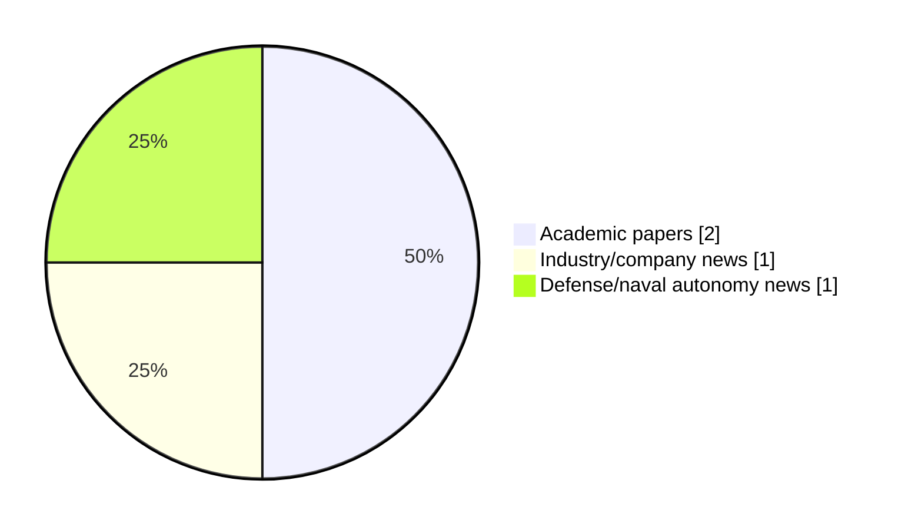

# Maritime Autonomy Watch — 2026-07-03

## Executive Summary

- Total selected items: 4
- Academic papers: 2
- Industry/company news: 1
- Defense/naval autonomy news: 1
- Failed/inaccessible sources: 0

## Contents

- [Analyst Brief](#analyst-brief)
- [Must Read](#must-read)
- [Top Signals Today](#top-signals-today)
- [Topic Signals](#topic-signals)
- [Freshness and Coverage](#freshness-and-coverage)
- [Quality Notes](#quality-notes)
- [Watchlist](#watchlist)
- [Academic Papers](#academic-papers)
- [Industry and Company News](#industry-and-company-news)
- [Defense and Naval Autonomy News](#defense-and-naval-autonomy-news)
- [Source Status Summary](#source-status-summary)

## Analyst Brief

Today's report selected 4 non-duplicate item(s), led by planning/control, USV operations, AUV navigation. The strongest item is [Allocation Integrated Sliding Mode Control for Heading Autonomous Underwater Vehicles with Varying Speeds](https://doi.org/10.65154/ijmst.39) from OpenAlex.
Coverage is weighted toward academic research (2), with 1 industry and 1 defense signal(s).

## Must Read

- [Allocation Integrated Sliding Mode Control for Heading Autonomous Underwater Vehicles with Varying Speeds](https://doi.org/10.65154/ijmst.39) — Research signal: AUV navigation
- [Saronic’s Dual-Use ASV Hits the Water](https://oceannews.com/news/science-technology/saronics-dual-use-asv-hits-the-water/) — Defense signal: USV operations
- [Imenco Invests in Next-Generation Underwater Robotics Firm](https://www.maritimeindustries.org/news/imenco-invests-next-generation-underwater-robotics-firm) — Industry signal: critical infrastructure
- [Choreographing the Way of Water: A Computational Framework for Aquatic Robotic Art](http://arxiv.org/abs/2607.02174v1) — Research signal: USV operations

## Top Signals Today

- planning/control: 2 selected item(s).
- USV operations: 2 selected item(s).
- AUV navigation: 1 selected item(s).
- critical infrastructure: 1 selected item(s).
- swarm autonomy: 1 selected item(s).

## Topic Signals

- planning/control: 2
- USV operations: 2
- AUV navigation: 1
- critical infrastructure: 1
- swarm autonomy: 1
- perception: 1

## Freshness and Coverage

- Newest selected item date: 2026-07-02
- Oldest selected item date: 2026-06-30
- Active/enabled sources: 5
- Sources with access problems: 2
- Quality flags: 0

## Quality Notes

- No quality flags on selected items.

## Watchlist

- No watchlist items today.

### Category Snapshot

| Category | Selected items |
|---|---:|
| Academic papers | 2 |
| Industry/company news | 1 |
| Defense/naval autonomy news | 1 |

## Academic Papers

_Selected items: 2_

### [Allocation Integrated Sliding Mode Control for Heading Autonomous Underwater Vehicles with Varying Speeds](https://doi.org/10.65154/ijmst.39)

- Source: OpenAlex
- Date: 2026-06-30
- Relevance score: 7
- Authors: Do Khac Tiep, Nguyen Van Tien
- DOI: 10.65154/ijmst.39
- Signal: Research signal: AUV navigation
- Topic tags: AUV navigation, planning/control

**Abstract**

This paper addresses the challenge of robust heading control for Autonomous Underwater Vehicles (AUVs) operating under variable speed conditions, subject to system nonlinearities, parametric uncertainties, and actuator constraints. We propose a hierarchical control architecture that integrates Sliding Mode Control (SMC) with an optimization-based Control Allocation (CA) scheme. The outer-loop SMC guarantees robustness by computing the required total yaw moment to reject disturbances and track the reference heading. The inner-loop CA then optimally distributes this virtual control effort to individual actuators, explicitly accounting for saturation limits and speed-dependent actuator effectiveness. The performance of the proposed SMC-CA strategy is validated through comprehensive numerical simulations.

**Why it matters**

Relevant to underwater autonomy; the work may inform maritime autonomy research, testing priorities, or system design.

---

### [Choreographing the Way of Water: A Computational Framework for Aquatic Robotic Art](http://arxiv.org/abs/2607.02174v1)

- Source: arXiv
- Date: 2026-07-02
- Relevance score: 4.25
- Authors: Aswin Ramachandran, Christopher Golling, Sebastian Burmester, Noa Sendlhofer, Jan Kamm, Ruiheng Jiang, Raffaello D'Andrea
- Signal: Research signal: USV operations
- Topic tags: USV operations, swarm autonomy, perception, planning/control

**Abstract**

Robotic choreography in open water is governed by nonlinear fluid dynamics, which impose significant challenges due to environmental disturbances and nonlinear system dynamics. This paper presents the cyber-physical architecture of Way of Water, a vertically integrated framework that orchestrates a fleet of autonomous surface vessels as a distributed choreographic platform. Moving beyond the surface-pixel paradigm, these vessels use laminar nozzles and multi-zone lighting to extend their expressive range from the 2D water plane into the 3D volumetric domain. Our primary contribution is the Way of Water Studio, a browser-based, timeline-compositing authoring paradigm that treats the fleet as a DAW-like instrument for music-responsive choreography.

**Why it matters**

Relevant to surface-vessel operations, multi-vehicle coordination, planning and control; the work may inform maritime autonomy research, testing priorities, or system design.

---

## Industry and Company News

_Selected items: 1_

### [Imenco Invests in Next-Generation Underwater Robotics Firm](https://www.maritimeindustries.org/news/imenco-invests-next-generation-underwater-robotics-firm)

- Source: maritimeindustries.org
- Date: 2026-07-02
- Relevance score: 4.25
- Signal: Industry signal: critical infrastructure
- Topic tags: critical infrastructure
- Also reported by: https://oceannews.com/feed/

**Summary**

Imenco Future Technologies has announced it has taken a strategic investment stake in Frontier Robotics, a specialist developer of advanced subsea robotics technologies supporting its long-term innovation and growth strategy.

**Why it matters**

Signals momentum in underwater autonomy; useful for tracking product direction, partnerships, and deployment opportunities.

---

## Defense and Naval Autonomy News

_Selected items: 1_

### [Saronic’s Dual-Use ASV Hits the Water](https://oceannews.com/news/science-technology/saronics-dual-use-asv-hits-the-water/)

- Source: oceannews.com
- Date: 2026-07-02
- Relevance score: 5.5
- Signal: Defense signal: USV operations
- Topic tags: USV operations

**Summary**

Saronic has announced the launch of its first Mirage, a 52-ft. dual-use autonomous surface vessel (ASV) that joins the 24-ft. Corsair and 180-ft. Marauder as the third flagship platform in Saronic’s growing fleet, and is the latest milestone in a production model delivering autonomous vessels at speed and scale.

**Why it matters**

Signals movement in surface-vessel operations; useful for tracking operational concepts, procurement direction, and fleet integration.

---

## Inaccessible or Failed Sources

- None

## Source Status Summary

| Source | Status | Notes |
|---|---|---|
| arXiv | enabled | API source, 15 items fetched |
| OpenAlex | enabled | API source, 15 items fetched |
| RSS feeds | enabled | 107 RSS items fetched |
| SMI MASG News | enabled | HTML source, 10 items fetched |
| IEEE Xplore | disabled | Missing IEEE_XPLORE_API_KEY |
| Elsevier Scopus | enabled | API source, 15 items fetched |
| NewsAPI | disabled | Missing NEWS_API_KEY |

## Metadata

- Generated at: 2026-07-03T10:57:35.136860+02:00
- Date: 2026-07-03
- Repository: ferhannb/MarineRobotics
- Relevance threshold: 4.0
- Deduplication method: DOI, canonical URL, source ID, normalized title, similar recent titles, category caps, and novelty score
