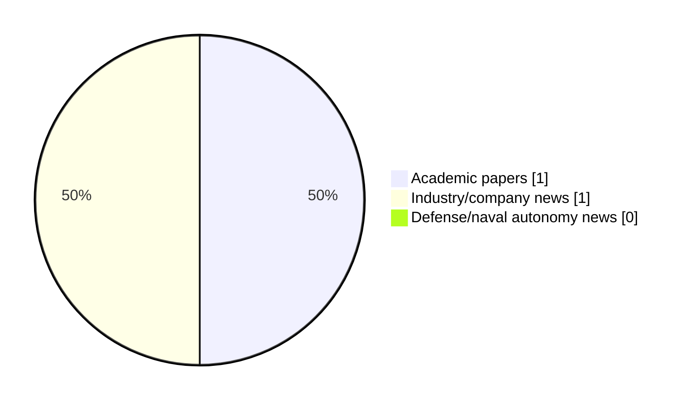

# Maritime Autonomy Watch — 2026-07-04

## Executive Summary

- Total selected items: 2
- Academic papers: 1
- Industry/company news: 1
- Defense/naval autonomy news: 0
- Failed/inaccessible sources: 0

## Contents

- [Analyst Brief](#analyst-brief)
- [Must Read](#must-read)
- [Top Signals Today](#top-signals-today)
- [Topic Signals](#topic-signals)
- [Freshness and Coverage](#freshness-and-coverage)
- [Quality Notes](#quality-notes)
- [Watchlist](#watchlist)
- [Academic Papers](#academic-papers)
- [Industry and Company News](#industry-and-company-news)
- [Defense and Naval Autonomy News](#defense-and-naval-autonomy-news)
- [Source Status Summary](#source-status-summary)

## Analyst Brief

Today's report selected 2 non-duplicate item(s), led by AUV navigation, planning/control. The strongest item is [A Differentiable Composite Approximation Framework for Autonomous Underwater Vehicle Maneuvering Modeling from Sea-Trial Data](http://arxiv.org/abs/2606.19711v1) from arXiv.
Coverage is weighted toward academic research (1), with 1 industry and 0 defense signal(s).

## Must Read

- [A Differentiable Composite Approximation Framework for Autonomous Underwater Vehicle Maneuvering Modeling from Sea-Trial Data](http://arxiv.org/abs/2606.19711v1) — Research signal: AUV navigation
- [Live Demonstration to Showcase AUV Capabilities & Coral Reef Monitoring Tech](https://www.oceansciencetechnology.com/news/live-demonstration-to-showcase-auv-capabilities-coral-reef-monitoring-tech/) — Industry signal: AUV navigation

## Top Signals Today

- AUV navigation: 2 selected item(s).
- planning/control: 1 selected item(s).

## Topic Signals

- AUV navigation: 2
- planning/control: 1

## Freshness and Coverage

- Newest selected item date: 2026-07-03
- Oldest selected item date: 2026-06-18
- Active/enabled sources: 4
- Sources with access problems: 3
- Quality flags: 0

## Quality Notes

- No quality flags on selected items.

## Watchlist

- No watchlist items today.

### Category Snapshot

| Category | Selected items |
|---|---:|
| Academic papers | 1 |
| Industry/company news | 1 |
| Defense/naval autonomy news | 0 |

## Academic Papers

_Selected items: 1_

### [A Differentiable Composite Approximation Framework for Autonomous Underwater Vehicle Maneuvering Modeling from Sea-Trial Data](http://arxiv.org/abs/2606.19711v1)

- Source: arXiv
- Date: 2026-06-18
- Relevance score: 7
- Authors: Aobo Wang, Aifei Xia, Zihao Wang, Lizhu Hao
- Signal: Research signal: AUV navigation
- Topic tags: AUV navigation, planning/control

**Abstract**

Field-based modeling from onboard measurements can produce autonomous underwater vehicle (AUV) maneuvering models that reflect real operating characteristics. From an approximation perspective, conventional maneuvering models use predefined constraint polynomial bases, whereas data-driven models use data-adaptive bases. Motivated by this basis-function view, this paper presents a differentiable composite-approximation formulation, in which the polynomial-basis component and the data-adaptive basis component are treated as differentiable parts of a single predictor and calibrated jointly. A gradient-based co-calibration method is developed for full-scale AUV maneuvering prediction, where a sensitivity-aware mechanism regulates bounded polynomial updates while the neural residual captures remaining nonlinear discrepancies under a shared prediction objective.

**Why it matters**

Relevant to underwater autonomy, planning and control; the work may inform maritime autonomy research, testing priorities, or system design.

---

## Industry and Company News

_Selected items: 1_

### [Live Demonstration to Showcase AUV Capabilities & Coral Reef Monitoring Tech](https://www.oceansciencetechnology.com/news/live-demonstration-to-showcase-auv-capabilities-coral-reef-monitoring-tech/)

- Source: oceansciencetechnology.com
- Date: 2026-07-03
- Relevance score: 4.25
- Signal: Industry signal: AUV navigation
- Topic tags: AUV navigation

**Summary**

Boxfish Robotics will host a live, in-water demonstration of its Boxfish AUV on the final day of the ICRS 2026.

**Why it matters**

Signals momentum in underwater autonomy, infrastructure monitoring; useful for tracking product direction, partnerships, and deployment opportunities.

---

## Defense and Naval Autonomy News

_Selected items: 0_

No selected items.

## Inaccessible or Failed Sources

- None

## Source Status Summary

| Source | Status | Notes |
|---|---|---|
| arXiv | enabled | API source, 15 items fetched |
| OpenAlex | enabled | API source, 15 items fetched |
| RSS feeds | partial | 85 RSS items fetched; failures: https://massworld.news/feed/: Invalid XML from https://massworld.news/feed/: mismatched tag: line 93, column 2; https://oceannews.com/feed/: Invalid XML from https://oceannews.com/feed/: mismatched tag: line 93, column 2 |
| SMI MASG News | enabled | HTML source, 0 items fetched |
| IEEE Xplore | disabled | Missing IEEE_XPLORE_API_KEY |
| Elsevier Scopus | enabled | API source, 15 items fetched |
| NewsAPI | disabled | Missing NEWS_API_KEY |

## Metadata

- Generated at: 2026-07-04T10:32:20.612301+02:00
- Date: 2026-07-04
- Repository: ferhannb/MarineRobotics
- Relevance threshold: 4.0
- Deduplication method: DOI, canonical URL, source ID, normalized title, similar recent titles, category caps, and novelty score
