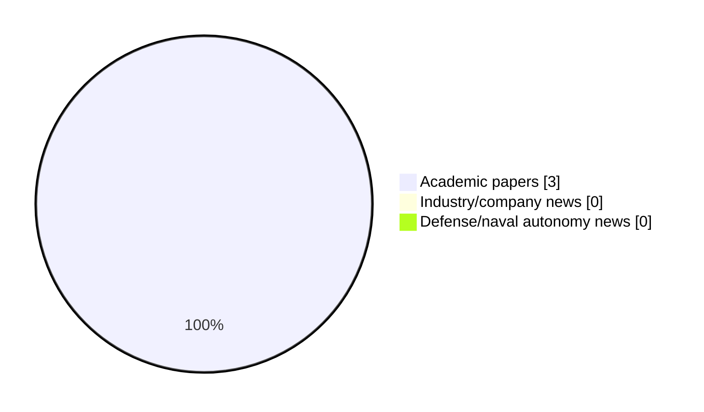

# Maritime Autonomy Watch — 2026-07-05

## Executive Summary

- Total selected items: 3
- Academic papers: 3
- Industry/company news: 0
- Defense/naval autonomy news: 0
- Failed/inaccessible sources: 0

## Contents

- [Analyst Brief](#analyst-brief)
- [Must Read](#must-read)
- [Top Signals Today](#top-signals-today)
- [Topic Signals](#topic-signals)
- [Freshness and Coverage](#freshness-and-coverage)
- [Quality Notes](#quality-notes)
- [Watchlist](#watchlist)
- [Academic Papers](#academic-papers)
- [Industry and Company News](#industry-and-company-news)
- [Defense and Naval Autonomy News](#defense-and-naval-autonomy-news)
- [Source Status Summary](#source-status-summary)

## Analyst Brief

Today's report selected 3 non-duplicate item(s), led by USV operations, swarm autonomy, planning/control. The strongest item is [A Bio-Inspired Sliding Mode Algorithm with Lateral Velocity Tracking Differentiator for Formation Control of Underactuated USVs](https://doi.org/10.2478/pomr-2026-0018) from OpenAlex.
Coverage is weighted toward academic research (3), with 0 industry and 0 defense signal(s).
Quality caveat: missing-summary=1, date-anomaly=1.

## Must Read

- [A Bio-Inspired Sliding Mode Algorithm with Lateral Velocity Tracking Differentiator for Formation Control of Underactuated USVs](https://doi.org/10.2478/pomr-2026-0018) — Research signal: USV operations
- [Single-Axis Rotational Inertial Navigation Systems for USVs: A Review of Key Technologies](https://doi.org/10.3390/mi17050557) — Research signal: USV operations

## Top Signals Today

- USV operations: 3 selected item(s).
- swarm autonomy: 2 selected item(s).
- planning/control: 2 selected item(s).
- regulation/legal: 1 selected item(s).

## Topic Signals

- USV operations: 3
- swarm autonomy: 2
- planning/control: 2
- regulation/legal: 1

## Freshness and Coverage

- Newest selected item date: 2026-12-01
- Oldest selected item date: 2026-04-30
- Active/enabled sources: 5
- Sources with access problems: 2
- Quality flags: 2

## Quality Notes

- missing-summary: 1
- date-anomaly: 1
- Date anomalies: [Formation tracking control of multiple USVs using ADRC with prescribed performance](https://api.elsevier.com/content/abstract/scopus_id/105035333345) reports 2026-12-01

## Watchlist

- [Formation tracking control of multiple USVs using ADRC with prescribed performance](https://api.elsevier.com/content/abstract/scopus_id/105035333345) — missing-summary, date-anomaly

### Category Snapshot

| Category | Selected items |
|---|---:|
| Academic papers | 3 |
| Industry/company news | 0 |
| Defense/naval autonomy news | 0 |

## Academic Papers

_Selected items: 3_

### [A Bio-Inspired Sliding Mode Algorithm with Lateral Velocity Tracking Differentiator for Formation Control of Underactuated USVs](https://doi.org/10.2478/pomr-2026-0018)

- Source: OpenAlex
- Date: 2026-05-06
- Relevance score: 10
- Authors: Jiaying Niu, Lanqing Xu, Guiyin Chen, Jinhua Lv, Yiming Tang
- DOI: 10.2478/pomr-2026-0018
- Signal: Research signal: USV operations
- Topic tags: USV operations, swarm autonomy, planning/control, regulation/legal
- Also reported by: Elsevier Scopus

**Abstract**

Abstract An advanced control framework is presented to solve the challenge of trajectory tracking in underactuated unmanned surface vehicles (USVs) operating in a formation. Three key innovations are featured: (1) Complex derivative calculations are effectively eliminated by a bio-inspired model approximating virtual longitudinal/lateral velocities; (2) Severe initial control chattering is significantly mitigated by a lateral velocity tracking differentiator (LVTD); (3) These techniques are integrated within a disturbance-observer-compensated dynamic surface sliding mode control (SMC) under a virtual framework. In addition, trajectory tracking errors are defined using desired and actual USV states, while virtual control laws are developed based on nonlinear backstepping. Meanwhile, the bio-inspired model is incorporatedto approximate virtual velocities, avoiding complex differentiation.

**Why it matters**

Relevant to surface-vessel operations, multi-vehicle coordination, planning and control; the work may inform maritime autonomy research, testing priorities, or system design.

---

### [Single-Axis Rotational Inertial Navigation Systems for USVs: A Review of Key Technologies](https://doi.org/10.3390/mi17050557)

- Source: OpenAlex
- Date: 2026-04-30
- Relevance score: 8.75
- Authors: Enqing Su, Yi-Xiang Wang, Weijie Sheng, Yi Mou, Teng Li, Jianguo Liu
- DOI: 10.3390/mi17050557
- Signal: Research signal: USV operations
- Topic tags: USV operations

**Abstract**

In complex marine environments, achieving low-cost, highly reliable, and continuous navigation is crucial for the intelligent and autonomous operation of unmanned surface vehicles (USVs). Currently, the integrated Global Navigation Satellite System and Strapdown Inertial Navigation System (GNSS/SINS) serves as the primary navigation architecture for USVs. While the cost of high-performance GNSS receivers has steadily decreased, high-precision SINS remains prohibitively expensive. Consequently, micro-electromechanical system (MEMS)-based SINS has emerged as a preferred alternative due to its favorable balance of cost, power consumption, and size. However, significant inertial sensor errors make it difficult to maintain high-precision positioning during GNSS outages. To address this limitation, the single-axis rotational inertial navigation system (SRINS) has been introduced.

**Why it matters**

Relevant to surface-vessel operations; the work may inform maritime autonomy research, testing priorities, or system design.

---

### [Formation tracking control of multiple USVs using ADRC with prescribed performance](https://api.elsevier.com/content/abstract/scopus_id/105035333345)

- Source: Elsevier Scopus
- Date: 2026-12-01
- Relevance score: 5.25
- DOI: 10.1038/s41598-026-37252-0
- Signal: Research signal: USV operations
- Topic tags: USV operations, swarm autonomy, planning/control
- Quality flags: missing-summary, date-anomaly

**Abstract**

No summary available.

**Why it matters**

Relevant to surface-vessel operations, multi-vehicle coordination; the work may inform maritime autonomy research, testing priorities, or system design.

---

## Industry and Company News

_Selected items: 0_

No selected items.

## Defense and Naval Autonomy News

_Selected items: 0_

No selected items.

## Inaccessible or Failed Sources

- None

## Source Status Summary

| Source | Status | Notes |
|---|---|---|
| arXiv | enabled | API source, 15 items fetched |
| OpenAlex | enabled | API source, 15 items fetched |
| RSS feeds | enabled | 107 RSS items fetched |
| SMI MASG News | enabled | HTML source, 10 items fetched |
| IEEE Xplore | disabled | Missing IEEE_XPLORE_API_KEY |
| Elsevier Scopus | enabled | API source, 15 items fetched |
| NewsAPI | disabled | Missing NEWS_API_KEY |

## Metadata

- Generated at: 2026-07-05T10:48:16.040305+02:00
- Date: 2026-07-05
- Repository: ferhannb/MarineRobotics
- Relevance threshold: 4.0
- Deduplication method: DOI, canonical URL, source ID, normalized title, similar recent titles, category caps, and novelty score
