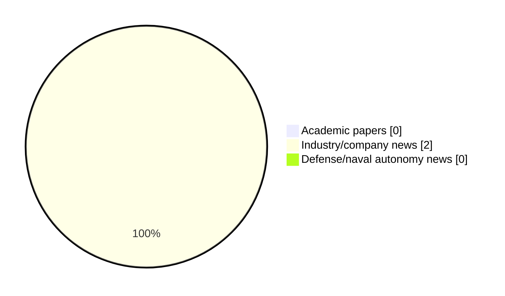

# Maritime Autonomy Watch — 2026-07-06

## Executive Summary

- Total selected items: 2
- Academic papers: 0
- Industry/company news: 2
- Defense/naval autonomy news: 0
- Failed/inaccessible sources: 1

## Contents

- [Analyst Brief](#analyst-brief)
- [Must Read](#must-read)
- [Top Signals Today](#top-signals-today)
- [Topic Signals](#topic-signals)
- [Freshness and Coverage](#freshness-and-coverage)
- [Quality Notes](#quality-notes)
- [Watchlist](#watchlist)
- [Academic Papers](#academic-papers)
- [Industry and Company News](#industry-and-company-news)
- [Defense and Naval Autonomy News](#defense-and-naval-autonomy-news)
- [Source Status Summary](#source-status-summary)

## Analyst Brief

Today's report selected 2 non-duplicate item(s), led by AUV navigation, USV operations. The strongest item is [AUV Tech & Custom Cabling Advance Non-Invasive Sub-Ice Climate Research](https://www.oceansciencetechnology.com/news/auv-tech-custom-cabling-advance-non-invasive-sub-ice-climate-research/) from oceansciencetechnology.com.
Coverage is weighted toward academic research (0), with 2 industry and 0 defense signal(s).

## Must Read

- [AUV Tech & Custom Cabling Advance Non-Invasive Sub-Ice Climate Research](https://www.oceansciencetechnology.com/news/auv-tech-custom-cabling-advance-non-invasive-sub-ice-climate-research/) — Industry signal: AUV navigation
- [USV Contract Secured to Map Waterways & Advance Tactical Fieldwork](https://www.oceansciencetechnology.com/news/usv-contract-secured-to-map-waterways-advance-tactical-fieldwork/) — Industry signal: USV operations

## Top Signals Today

- AUV navigation: 1 selected item(s).
- USV operations: 1 selected item(s).

## Topic Signals

- AUV navigation: 1
- USV operations: 1

## Freshness and Coverage

- Newest selected item date: 2026-07-06
- Oldest selected item date: 2026-07-06
- Active/enabled sources: 4
- Sources with access problems: 3
- Quality flags: 0

## Quality Notes

- No quality flags on selected items.

## Watchlist

- No watchlist items today.

### Category Snapshot

| Category | Selected items |
|---|---:|
| Academic papers | 0 |
| Industry/company news | 2 |
| Defense/naval autonomy news | 0 |

## Academic Papers

_Selected items: 0_

No selected items.

## Industry and Company News

_Selected items: 2_

### [AUV Tech & Custom Cabling Advance Non-Invasive Sub-Ice Climate Research](https://www.oceansciencetechnology.com/news/auv-tech-custom-cabling-advance-non-invasive-sub-ice-climate-research/)

- Source: oceansciencetechnology.com
- Date: 2026-07-06
- Relevance score: 7
- Signal: Industry signal: AUV navigation
- Topic tags: AUV navigation

**Summary**

ETH Zurich is heading the innovative POLARIS project to develop an advanced Autonomous Underwater Vehicle (AUV) designed for climate monitoring.

**Why it matters**

Signals momentum in underwater autonomy, infrastructure monitoring; useful for tracking product direction, partnerships, and deployment opportunities.

---

### [USV Contract Secured to Map Waterways & Advance Tactical Fieldwork](https://www.oceansciencetechnology.com/news/usv-contract-secured-to-map-waterways-advance-tactical-fieldwork/)

- Source: oceansciencetechnology.com
- Date: 2026-07-06
- Relevance score: 4.5
- Signal: Industry signal: USV operations
- Topic tags: USV operations

**Summary**

FMV has signed a contract valued at SEK 43 million including options with BUVI Scandinavia AB to deliver Evologic’s Sonobot.

**Why it matters**

Signals momentum in surface-vessel operations; useful for tracking product direction, partnerships, and deployment opportunities.

---

## Defense and Naval Autonomy News

_Selected items: 0_

No selected items.

## Inaccessible or Failed Sources

- OpenAlex: HTTP 429 for https://api.openalex.org/works?search=maritime+autonomy+marine+robotics+autonomous+vessel+autonomous+mission+autonomous+surface+vessel&per-page=15&sort=publication_date%3Adesc

## Source Status Summary

| Source | Status | Notes |
|---|---|---|
| arXiv | enabled | API source, 15 items fetched |
| OpenAlex | failed | HTTP 429 for https://api.openalex.org/works?search=maritime+autonomy+marine+robotics+autonomous+vessel+autonomous+mission+autonomous+surface+vessel&per-page=15&sort=publication_date%3Adesc |
| RSS feeds | enabled | 107 RSS items fetched |
| SMI MASG News | enabled | HTML source, 10 items fetched |
| IEEE Xplore | disabled | Missing IEEE_XPLORE_API_KEY |
| Elsevier Scopus | enabled | API source, 15 items fetched |
| NewsAPI | disabled | Missing NEWS_API_KEY |

## Metadata

- Generated at: 2026-07-06T12:12:35.803435+02:00
- Date: 2026-07-06
- Repository: ferhannb/MarineRobotics
- Relevance threshold: 4.0
- Deduplication method: DOI, canonical URL, source ID, normalized title, similar recent titles, category caps, and novelty score
