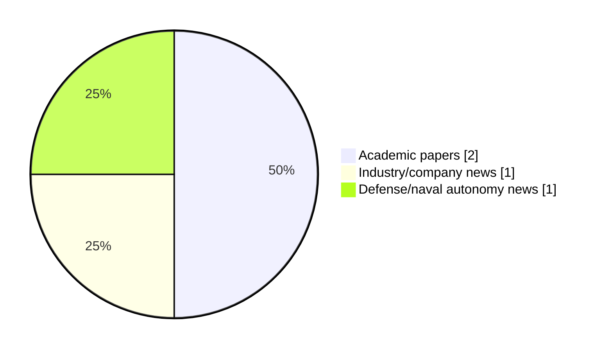

# Maritime Autonomy Watch — 2026-07-08

## Executive Summary

- Total selected items: 4
- Academic papers: 2
- Industry/company news: 1
- Defense/naval autonomy news: 1
- Failed/inaccessible sources: 0

## Contents

- [Analyst Brief](#analyst-brief)
- [Must Read](#must-read)
- [Top Signals Today](#top-signals-today)
- [Topic Signals](#topic-signals)
- [Freshness and Coverage](#freshness-and-coverage)
- [Quality Notes](#quality-notes)
- [Watchlist](#watchlist)
- [Academic Papers](#academic-papers)
- [Industry and Company News](#industry-and-company-news)
- [Defense and Naval Autonomy News](#defense-and-naval-autonomy-news)
- [Source Status Summary](#source-status-summary)

## Analyst Brief

Today's report selected 4 non-duplicate item(s), led by AUV navigation, perception, planning/control. The strongest item is [Autonomous Subsea Cable Search and Tracking with Graph-Optimised Priors and Visual Tracking](http://arxiv.org/abs/2606.23606v1) from arXiv.
Coverage is weighted toward academic research (2), with 1 industry and 1 defense signal(s).
Quality caveat: missing-summary=1, date-anomaly=1.

## Must Read

- [Autonomous Subsea Cable Search and Tracking with Graph-Optimised Priors and Visual Tracking](http://arxiv.org/abs/2606.23606v1) — Research signal: AUV navigation
- [ACUA Ocean USV Collects 100 Hours of Continuous Multi-Domain Data](https://www.marinelink.com/news/acua-ocean-usv-collects-hours-continuous-541009) — Industry signal: USV operations
- [U.S. Navy Boosts Lionfish UUV Production with New HII Contract Option](https://www.navalnews.com/naval-news/2026/07/u-s-navy-boosts-lionfish-uuv-production-with-new-hii-contract-option/) — Defense signal: defense adoption

## Top Signals Today

- AUV navigation: 2 selected item(s).
- perception: 2 selected item(s).
- planning/control: 1 selected item(s).
- critical infrastructure: 1 selected item(s).
- USV operations: 1 selected item(s).

## Topic Signals

- AUV navigation: 2
- perception: 2
- planning/control: 1
- critical infrastructure: 1
- USV operations: 1
- defense adoption: 1

## Freshness and Coverage

- Newest selected item date: 2026-12-01
- Oldest selected item date: 2026-06-22
- Active/enabled sources: 5
- Sources with access problems: 2
- Quality flags: 2

## Quality Notes

- missing-summary: 1
- date-anomaly: 1
- Date anomalies: [Ubiquitous sensing of marine activities via the cooperation of autonomous underwater vehicles](https://api.elsevier.com/content/abstract/scopus_id/105028115165) reports 2026-12-01

## Watchlist

- [Ubiquitous sensing of marine activities via the cooperation of autonomous underwater vehicles](https://api.elsevier.com/content/abstract/scopus_id/105028115165) — missing-summary, date-anomaly

### Category Snapshot

| Category | Selected items |
|---|---:|
| Academic papers | 2 |
| Industry/company news | 1 |
| Defense/naval autonomy news | 1 |

## Academic Papers

_Selected items: 2_

### [Autonomous Subsea Cable Search and Tracking with Graph-Optimised Priors and Visual Tracking](http://arxiv.org/abs/2606.23606v1)

- Source: arXiv
- Date: 2026-06-22
- Relevance score: 8.5
- Authors: Ibrahim Fadhil Djauhari, Adrian Bodenmann, Samuel Simmons, Cailei Liang, David White, Susan Gourvenec, Tom Bennetts, Darryl Newborough, Blair Thornton
- Signal: Research signal: AUV navigation
- Topic tags: AUV navigation, perception, planning/control, critical infrastructure

**Abstract**

Global communications rely on subsea cable infrastructure that remains vulnerable to damage from natural hazards and human activity. Autonomous underwater vehicles (AUVs) offer an efficient means to inspect long sections of exposed cable, but uncertainty in cable route maps, small cable diameters and partial burial makes continuous tracking a challenge. This paper presents a novel cable search and tracking method that leverages uncertain prior cable route maps. Graph-based optimisation continuously update the cable route to remain consistent with visual observations. Route uncertainty is constrained as a function of distance from observations using physics-based catenary models that account for cable parameters (i.e., lay depth, diameter, and density), bounding the search space to physically feasible regions and improving search efficiency.

**Why it matters**

Relevant to underwater autonomy; the work may inform maritime autonomy research, testing priorities, or system design.

---

### [Ubiquitous sensing of marine activities via the cooperation of autonomous underwater vehicles](https://api.elsevier.com/content/abstract/scopus_id/105028115165)

- Source: Elsevier Scopus
- Date: 2026-12-01
- Relevance score: 4.25
- DOI: 10.1038/s41598-025-29532-y
- Signal: Research signal: AUV navigation
- Topic tags: AUV navigation, perception
- Quality flags: missing-summary, date-anomaly

**Abstract**

No summary available.

**Why it matters**

Relevant to underwater autonomy; the work may inform maritime autonomy research, testing priorities, or system design.

---

## Industry and Company News

_Selected items: 1_

### [ACUA Ocean USV Collects 100 Hours of Continuous Multi-Domain Data](https://www.marinelink.com/news/acua-ocean-usv-collects-hours-continuous-541009)

- Source: marinelink.com
- Date: 2026-07-07
- Relevance score: 6.75
- Signal: Industry signal: USV operations
- Topic tags: USV operations

**Summary**

ACUA Ocean's Mk1 USV PIONEER has successfully completed a five-day remotely operated offshore demonstration, validating persistent, multi-domain maritime operations using an uncrewed surface vessel. On Monday 22 June 2026, PIONEER departed Turnchapel Wharf…

**Why it matters**

Signals momentum in surface-vessel operations; useful for tracking product direction, partnerships, and deployment opportunities.

---

## Defense and Naval Autonomy News

_Selected items: 1_

### [U.S. Navy Boosts Lionfish UUV Production with New HII Contract Option](https://www.navalnews.com/naval-news/2026/07/u-s-navy-boosts-lionfish-uuv-production-with-new-hii-contract-option/)

- Source: navalnews.com
- Date: 2026-07-07
- Relevance score: 4.25
- Signal: Defense signal: defense adoption
- Topic tags: defense adoption

**Summary**

HII has been awarded an option year production contract for the U.S. Navy’s next-generation program of record, the Lionfish small unmanned undersea vehicle (SUUV). Lionfish is based on HII’s commercial REMUS 300 platform, originally developed as part of a rapid prototyping initiative in collaboration with the U.S. Navy and the Defense Innovation Unit (DIU). Huntington.

**Why it matters**

Signals movement in naval adoption; useful for tracking operational concepts, procurement direction, and fleet integration.

---

## Inaccessible or Failed Sources

- None

## Source Status Summary

| Source | Status | Notes |
|---|---|---|
| arXiv | enabled | API source, 15 items fetched |
| OpenAlex | enabled | API source, 15 items fetched |
| RSS feeds | enabled | 107 RSS items fetched |
| SMI MASG News | enabled | HTML source, 10 items fetched |
| IEEE Xplore | disabled | Missing IEEE_XPLORE_API_KEY |
| Elsevier Scopus | enabled | API source, 15 items fetched |
| NewsAPI | disabled | Missing NEWS_API_KEY |

## Metadata

- Generated at: 2026-07-08T10:22:34.078219+02:00
- Date: 2026-07-08
- Repository: ferhannb/MarineRobotics
- Relevance threshold: 4.0
- Deduplication method: DOI, canonical URL, source ID, normalized title, similar recent titles, category caps, and novelty score
