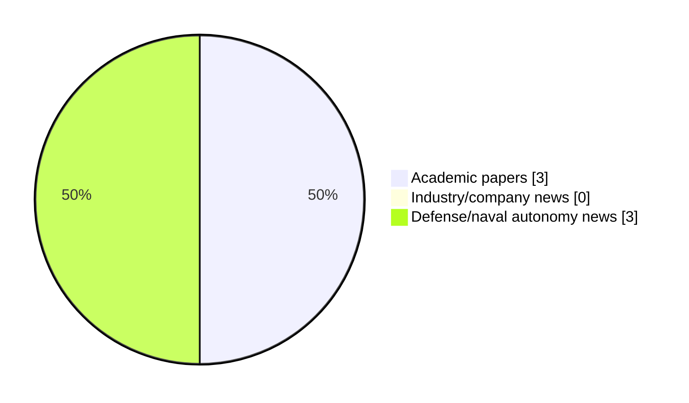

# Maritime Autonomy Watch — 2026-07-09

## Executive Summary

- Total selected items: 6
- Academic papers: 3
- Industry/company news: 0
- Defense/naval autonomy news: 3
- Failed/inaccessible sources: 0

## Contents

- [Analyst Brief](#analyst-brief)
- [Must Read](#must-read)
- [Top Signals Today](#top-signals-today)
- [Topic Signals](#topic-signals)
- [Freshness and Coverage](#freshness-and-coverage)
- [Quality Notes](#quality-notes)
- [Watchlist](#watchlist)
- [Academic Papers](#academic-papers)
- [Industry and Company News](#industry-and-company-news)
- [Defense and Naval Autonomy News](#defense-and-naval-autonomy-news)
- [Source Status Summary](#source-status-summary)

## Analyst Brief

Today's report selected 6 non-duplicate item(s), led by USV operations, planning/control, defense adoption. The strongest item is [Efficient Time-Domain Simulation of USV Motions in Short-Crested Irregular Waves Using an IRF-Based Framework](http://arxiv.org/abs/2606.24130v1) from arXiv.
Coverage is weighted toward academic research (3), with 0 industry and 3 defense signal(s).
Quality caveat: low-score-unique=1, missing-summary=1, date-anomaly=1.

## Must Read

- [Efficient Time-Domain Simulation of USV Motions in Short-Crested Irregular Waves Using an IRF-Based Framework](http://arxiv.org/abs/2606.24130v1) — Research signal: USV operations
- [A Methodology for Characterizing Underwater Radiated Noise from Submerged Electric Vehicles in a Coastal Environment: An AUV Test Case](http://arxiv.org/abs/2606.24813v1) — Research signal: AUV navigation
- [World’s first USV airdrop accomplished by Kraken and Capewell](https://www.navalnews.com/naval-news/2026/07/worlds-first-usv-airdrop-accomplished-by-kraken-and-capewell/) — Defense signal: USV operations
- [RIMPAC 2026 Puts COMSUBPAC UUVs and Submarine-Launched Missiles to the Test](https://oceannews.com/news/defense/rimpac-2026-puts-comsubpac-uuvs-and-submarine-launched-missiles-to-the-test/) — Defense signal: general autonomy
- [RAD Secures Funding to Scale Autonomous Vessel Technology and Electric Propulsion](https://oceannews.com/news/science-technology/rad-secures-funding-to-scale-autonomous-vessel-technology-and-electric-propulsion/) — Defense signal: defense adoption

## Top Signals Today

- USV operations: 4 selected item(s).
- planning/control: 2 selected item(s).
- defense adoption: 2 selected item(s).
- AUV navigation: 1 selected item(s).
- underwater communications: 1 selected item(s).

## Topic Signals

- USV operations: 4
- planning/control: 2
- defense adoption: 2
- AUV navigation: 1
- underwater communications: 1
- general autonomy: 1

## Freshness and Coverage

- Newest selected item date: 2026-12-01
- Oldest selected item date: 2026-06-23
- Active/enabled sources: 5
- Sources with access problems: 2
- Quality flags: 3

## Quality Notes

- low-score-unique: 1
- missing-summary: 1
- date-anomaly: 1
- Date anomalies: [Multi-object tracker for combating Maritime low visibility and non-linear motion in USV-Based Surveillance](https://api.elsevier.com/content/abstract/scopus_id/105039317339) reports 2026-12-01

## Watchlist

- [RAD Secures Funding to Scale Autonomous Vessel Technology and Electric Propulsion](https://oceannews.com/news/science-technology/rad-secures-funding-to-scale-autonomous-vessel-technology-and-electric-propulsion/) — low-score-unique
- [Multi-object tracker for combating Maritime low visibility and non-linear motion in USV-Based Surveillance](https://api.elsevier.com/content/abstract/scopus_id/105039317339) — missing-summary, date-anomaly

### Category Snapshot

| Category | Selected items |
|---|---:|
| Academic papers | 3 |
| Industry/company news | 0 |
| Defense/naval autonomy news | 3 |

## Academic Papers

_Selected items: 3_

### [Efficient Time-Domain Simulation of USV Motions in Short-Crested Irregular Waves Using an IRF-Based Framework](http://arxiv.org/abs/2606.24130v1)

- Source: arXiv
- Date: 2026-06-23
- Relevance score: 9.75
- Authors: Fei Duan, Zihao Wang, Yaohua Zhou, Qing Xiao
- Signal: Research signal: USV operations
- Topic tags: USV operations, planning/control

**Abstract**

Traditional time-domain prediction of vessel motions in irregular waves usually relies on superposing responses from many regular-wave components, which is computationally expensive for long-duration simulation and real-time applications. This issue is particularly relevant to unmanned surface vehicles (USVs), for which efficient and realistic motion prediction is needed for seakeeping assessment, simulation-based testing, and control-system development. This study applies an impulse response function (IRF)-based time-domain framework to predict vessel motions in short-crested irregular waves. Froude-Krylov, diffraction, and radiation loads are obtained from frequency-domain analysis and transformed into the time domain. Instantaneous responses are then evaluated directly through convolution-based force reconstruction, reducing the need for repeated regular-wave simulations.

**Why it matters**

Relevant to surface-vessel operations; the work may inform maritime autonomy research, testing priorities, or system design.

---

### [A Methodology for Characterizing Underwater Radiated Noise from Submerged Electric Vehicles in a Coastal Environment: An AUV Test Case](http://arxiv.org/abs/2606.24813v1)

- Source: arXiv
- Date: 2026-06-23
- Relevance score: 9.25
- Authors: Mark Shipton, Amir Boag, Roee Diamant
- Signal: Research signal: AUV navigation
- Topic tags: AUV navigation, USV operations, underwater communications, planning/control

**Abstract**

Submerged electric vehicles (SEVs), including autonomous underwater vehicles (AUVs), remotely operated vehicles, and diver propulsion systems, may radiate distinct tonal, harmonic, and modulated acoustic components associated with electric propulsion drives and motor-control electronics. Characterizing these signatures is relevant to passive detection and engineering diagnostics, but remains challenging in coastal environments because ambient noise, shallow-water propagation, and aspect-dependent radiation can obscure vehicle-related features. Existing underwater radiated noise (URN) standards, developed primarily for surface vessels, do not address the spectral, operational, and geometric complexity of SEV measurements.

**Why it matters**

Relevant to underwater autonomy, surface-vessel operations; the work may inform maritime autonomy research, testing priorities, or system design.

---

### [Multi-object tracker for combating Maritime low visibility and non-linear motion in USV-Based Surveillance](https://api.elsevier.com/content/abstract/scopus_id/105039317339)

- Source: Elsevier Scopus
- Date: 2026-12-01
- Relevance score: 5.25
- DOI: 10.1016/j.displa.2026.103507
- Signal: Research signal: USV operations
- Topic tags: USV operations
- Quality flags: missing-summary, date-anomaly

**Abstract**

No summary available.

**Why it matters**

Relevant to surface-vessel operations; the work may inform maritime autonomy research, testing priorities, or system design.

---

## Industry and Company News

_Selected items: 0_

No selected items.

## Defense and Naval Autonomy News

_Selected items: 3_

### [World’s first USV airdrop accomplished by Kraken and Capewell](https://www.navalnews.com/naval-news/2026/07/worlds-first-usv-airdrop-accomplished-by-kraken-and-capewell/)

- Source: navalnews.com
- Date: 2026-07-08
- Relevance score: 6
- Signal: Defense signal: USV operations
- Topic tags: USV operations, defense adoption
- Also reported by: https://oceannews.com/feed/

**Summary**

Kraken Technology Group and Capewell, supported by the Royal Navy under Project Beehive, have successfully completed the world’s first extracted-load airdrop of an uncrewed surface vessel (USV) from an A400M military transport aircraft. Kraken press release During a series of pioneering trials, a Project Beehive specification K3 SCOUT USV was deployed on Capewell’s Universal Maritime.

**Why it matters**

Signals movement in surface-vessel operations, naval adoption; useful for tracking operational concepts, procurement direction, and fleet integration.

---

### [RIMPAC 2026 Puts COMSUBPAC UUVs and Submarine-Launched Missiles to the Test](https://oceannews.com/news/defense/rimpac-2026-puts-comsubpac-uuvs-and-submarine-launched-missiles-to-the-test/)

- Source: oceannews.com
- Date: 2026-07-08
- Relevance score: 5.75
- Signal: Defense signal: general autonomy
- Topic tags: general autonomy

**Summary**

During Exercise Rim of the Pacific (RIMPAC) 2026, Commander, Submarine Force, US Pacific Fleet (COMSUBPAC) units will use realistic at-sea training scenarios to demonstrate unique capabilities in order to maximize advantage in the undersea domain. This year's exercise will highlight two critical investments that are reshaping how COMSUBPAC units train to fight and win in contested maritime environments: advanced unmanned undersea vehicles (UUVs) and long-range fires.

**Why it matters**

This item may signal operational adoption, procurement priorities, or naval autonomy doctrine shifts.

---

### [RAD Secures Funding to Scale Autonomous Vessel Technology and Electric Propulsion](https://oceannews.com/news/science-technology/rad-secures-funding-to-scale-autonomous-vessel-technology-and-electric-propulsion/)

- Source: oceannews.com
- Date: 2026-07-08
- Relevance score: 3.5
- Signal: Defense signal: defense adoption
- Topic tags: defense adoption
- Quality flags: low-score-unique

**Summary**

RAD, the marine technology company developing advanced electric propulsion systems and autonomous vessel technologies for defense and commercial applications, has announced the close of a £4.4 million funding round. The raise follows a period of strong commercial and product momentum and will fund the company's next phase of growth.

**Why it matters**

Signals movement in naval adoption; useful for tracking operational concepts, procurement direction, and fleet integration.

---

## Inaccessible or Failed Sources

- None

## Source Status Summary

| Source | Status | Notes |
|---|---|---|
| arXiv | enabled | API source, 15 items fetched |
| OpenAlex | enabled | API source, 15 items fetched |
| RSS feeds | enabled | 107 RSS items fetched |
| SMI MASG News | enabled | HTML source, 10 items fetched |
| IEEE Xplore | disabled | Missing IEEE_XPLORE_API_KEY |
| Elsevier Scopus | enabled | API source, 15 items fetched |
| NewsAPI | disabled | Missing NEWS_API_KEY |

## Metadata

- Generated at: 2026-07-09T11:40:33.682515+02:00
- Date: 2026-07-09
- Repository: ferhannb/MarineRobotics
- Relevance threshold: 4.0
- Deduplication method: DOI, canonical URL, source ID, normalized title, similar recent titles, category caps, and novelty score
