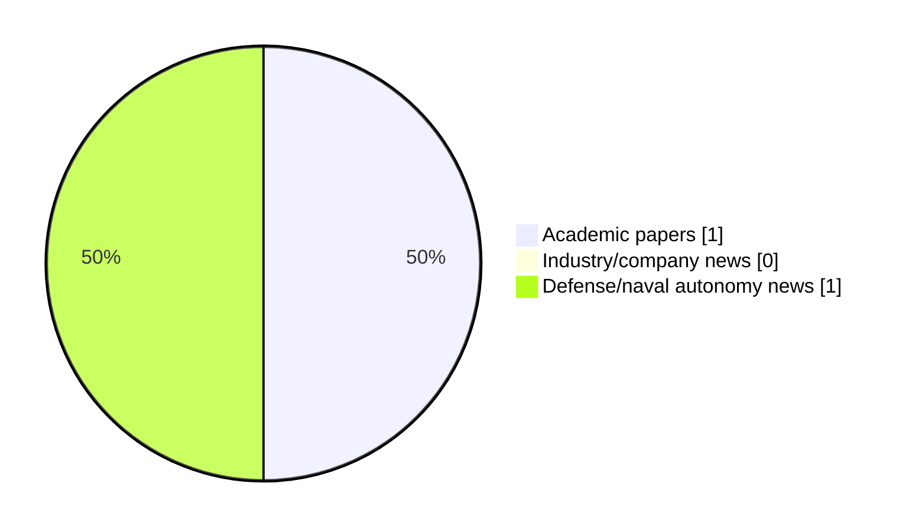

# Maritime Autonomy Watch — 2026-07-10

## Executive Summary

- Total selected items: 2
- Academic papers: 1
- Industry/company news: 0
- Defense/naval autonomy news: 1
- Failed/inaccessible sources: 0

## Contents

- [Analyst Brief](#analyst-brief)
- [Must Read](#must-read)
- [Top Signals Today](#top-signals-today)
- [Topic Signals](#topic-signals)
- [Freshness and Coverage](#freshness-and-coverage)
- [Quality Notes](#quality-notes)
- [Watchlist](#watchlist)
- [Academic Papers](#academic-papers)
- [Industry and Company News](#industry-and-company-news)
- [Defense and Naval Autonomy News](#defense-and-naval-autonomy-news)
- [Source Status Summary](#source-status-summary)

## Analyst Brief

Today's report selected 2 non-duplicate item(s), led by USV operations, AUV navigation, underwater communications. The strongest item is [J.A. Solutions Introduces Automatic Deployment System for USVs and Surface Vessels](https://www.navalnews.com/naval-news/2026/07/j-a-solutions-introduces-automatic-deployment-system-for-usvs-and-surface-vessels/) from navalnews.com.
Coverage is weighted toward academic research (1), with 0 industry and 1 defense signal(s).

## Must Read

- [J.A. Solutions Introduces Automatic Deployment System for USVs and Surface Vessels](https://www.navalnews.com/naval-news/2026/07/j-a-solutions-introduces-automatic-deployment-system-for-usvs-and-surface-vessels/) — Defense signal: USV operations
- [Sea Trial Validation of the ROS-DESERT Middleware with Autonomous Underwater Vehicles](https://openalex.org/W7162474740) — Research signal: AUV navigation

## Top Signals Today

- USV operations: 1 selected item(s).
- AUV navigation: 1 selected item(s).
- underwater communications: 1 selected item(s).
- planning/control: 1 selected item(s).

## Topic Signals

- USV operations: 1
- AUV navigation: 1
- underwater communications: 1
- planning/control: 1

## Freshness and Coverage

- Newest selected item date: 2026-07-09
- Oldest selected item date: 2026-05-22
- Active/enabled sources: 5
- Sources with access problems: 2
- Quality flags: 0

## Quality Notes

- No quality flags on selected items.

## Watchlist

- No watchlist items today.

### Category Snapshot

| Category | Selected items |
|---|---:|
| Academic papers | 1 |
| Industry/company news | 0 |
| Defense/naval autonomy news | 1 |

## Academic Papers

_Selected items: 1_

### [Sea Trial Validation of the ROS-DESERT Middleware with Autonomous Underwater Vehicles](https://openalex.org/W7162474740)

- Source: OpenAlex
- Date: 2026-05-22
- Relevance score: 9.25
- Authors: Davide Cosimo, Davide Costa, Riccardo Costanzi, Filippo Campagnaro, Andrea Caiti, Michele Zorzi
- Signal: Research signal: AUV navigation
- Topic tags: AUV navigation, underwater communications, planning/control

**Abstract**

This paper presents a modular software architecture that enables environmental-aware coordination of heterogeneous Autonomous Underwater Vehicles (AUVs) to improve underwater acoustic connectivity. The architecture combines a Robot Operating System 2 application layer with the DESERT Underwater communication framework through the rmw_desert middleware, and integrates a Robot Operating System 1 bridge to ensure interoperability with legacy vehicle front-seat controllers. This design enables fine-grained, cross-layer configurability of the communication stack and supports onboard processing of environmental measurements to inform adaptive communication behaviors. As a representative use case, this architecture is used to implement a lightweight depth-optimization strategy that exploits environmental awareness and AUV mobility to improve acoustic link performance.

**Why it matters**

Relevant to underwater autonomy; the work may inform maritime autonomy research, testing priorities, or system design.

---

## Industry and Company News

_Selected items: 0_

No selected items.

## Defense and Naval Autonomy News

_Selected items: 1_

### [J.A. Solutions Introduces Automatic Deployment System for USVs and Surface Vessels](https://www.navalnews.com/naval-news/2026/07/j-a-solutions-introduces-automatic-deployment-system-for-usvs-and-surface-vessels/)

- Source: navalnews.com
- Date: 2026-07-09
- Relevance score: 9.25
- Signal: Defense signal: USV operations
- Topic tags: USV operations

**Summary**

Danish company J.A. Solutions A/S has presented an automatic deployment system intended for unmanned surface vessels and other maritime platforms, covering both military and search-and-rescue applications. The company has shown the system in two different configurations. One is designed for the deployment of life rafts from a USV during SAR operations. The other is a.

**Why it matters**

Signals movement in surface-vessel operations; useful for tracking operational concepts, procurement direction, and fleet integration.

---

## Inaccessible or Failed Sources

- None

## Source Status Summary

| Source | Status | Notes |
|---|---|---|
| arXiv | enabled | API source, 15 items fetched |
| OpenAlex | enabled | API source, 15 items fetched |
| RSS feeds | enabled | 107 RSS items fetched |
| SMI MASG News | enabled | HTML source, 10 items fetched |
| IEEE Xplore | disabled | Missing IEEE_XPLORE_API_KEY |
| Elsevier Scopus | enabled | API source, 15 items fetched |
| NewsAPI | disabled | Missing NEWS_API_KEY |

## Metadata

- Generated at: 2026-07-10T09:12:30.432146+02:00
- Date: 2026-07-10
- Repository: ferhannb/MarineRobotics
- Relevance threshold: 4.0
- Deduplication method: DOI, canonical URL, source ID, normalized title, similar recent titles, category caps, and novelty score
