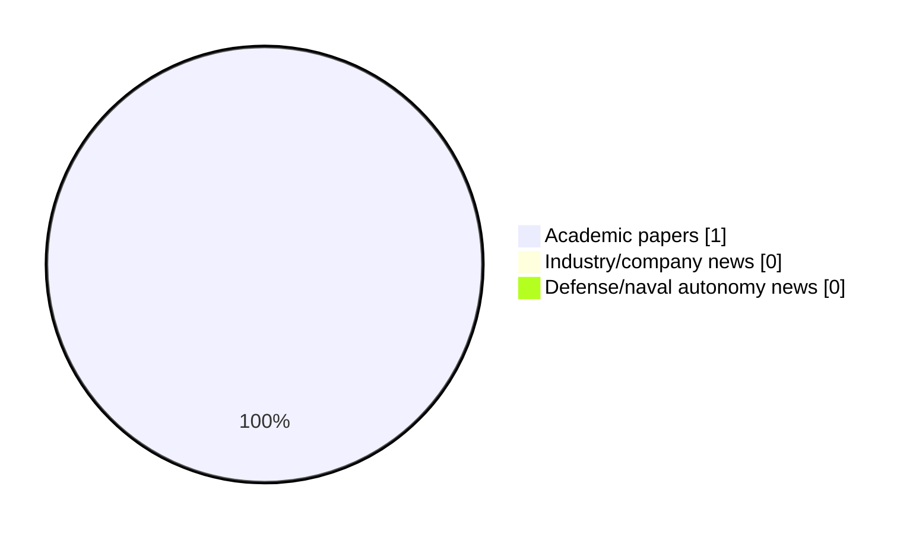

# Maritime Autonomy Watch — 2026-07-13

## Executive Summary

- Total selected items: 1
- Academic papers: 1
- Industry/company news: 0
- Defense/naval autonomy news: 0
- Failed/inaccessible sources: 0

## Contents

- [Analyst Brief](#analyst-brief)
- [Must Read](#must-read)
- [Top Signals Today](#top-signals-today)
- [Topic Signals](#topic-signals)
- [Freshness and Coverage](#freshness-and-coverage)
- [Quality Notes](#quality-notes)
- [Watchlist](#watchlist)
- [Academic Papers](#academic-papers)
- [Industry and Company News](#industry-and-company-news)
- [Defense and Naval Autonomy News](#defense-and-naval-autonomy-news)
- [Source Status Summary](#source-status-summary)

## Analyst Brief

Today's report selected 1 non-duplicate item(s), led by AUV navigation, planning/control, critical infrastructure. The strongest item is [CORAL-AUV: CFD Oriented Reinforcement Learning for Autonomous Underwater Vehicles](http://arxiv.org/abs/2607.09557v1) from arXiv.
Coverage is weighted toward academic research (1), with 0 industry and 0 defense signal(s).

## Must Read

- [CORAL-AUV: CFD Oriented Reinforcement Learning for Autonomous Underwater Vehicles](http://arxiv.org/abs/2607.09557v1) — Research signal: AUV navigation

## Top Signals Today

- AUV navigation: 1 selected item(s).
- planning/control: 1 selected item(s).
- critical infrastructure: 1 selected item(s).

## Topic Signals

- AUV navigation: 1
- planning/control: 1
- critical infrastructure: 1

## Freshness and Coverage

- Newest selected item date: 2026-07-10
- Oldest selected item date: 2026-07-10
- Active/enabled sources: 5
- Sources with access problems: 2
- Quality flags: 0

## Quality Notes

- No quality flags on selected items.

## Watchlist

- No watchlist items today.

### Category Snapshot

| Category | Selected items |
|---|---:|
| Academic papers | 1 |
| Industry/company news | 0 |
| Defense/naval autonomy news | 0 |

## Academic Papers

_Selected items: 1_

### [CORAL-AUV: CFD Oriented Reinforcement Learning for Autonomous Underwater Vehicles](http://arxiv.org/abs/2607.09557v1)

- Source: arXiv
- Date: 2026-07-10
- Relevance score: 8.5
- Authors: Steven Roche, Milo Van Mooy, Nathan McGuire, Levi Cai, Jonathan P. How, Yogesh Girdhar
- Signal: Research signal: AUV navigation
- Topic tags: AUV navigation, planning/control, critical infrastructure

**Abstract**

Fine grain control and positioning of autonomous underwater vehicles (AUVs) is critical for sampling, maintenance, and survey applications. Traditional control methods for AUVs are labor intensive and are not robust to changes in the vehicle configuration or environmental conditions. Reinforcement learning (RL) promises rapid controller development while handling a range of deployment parameters via domain randomization (DR). However, DR is still limited by the capacity of the underlying simulation to model real physics. In particular, drag physics are difficult to model and are a large contributor to sim-to-real gaps. Meanwhile, computational fluid dynamics (CFD) provides high fidelity drag models but is challenging to leverage within reinforcement learning frameworks due to its computational overhead.

**Why it matters**

Relevant to underwater autonomy; the work may inform maritime autonomy research, testing priorities, or system design.

---

## Industry and Company News

_Selected items: 0_

No selected items.

## Defense and Naval Autonomy News

_Selected items: 0_

No selected items.

## Inaccessible or Failed Sources

- None

## Source Status Summary

| Source | Status | Notes |
|---|---|---|
| arXiv | enabled | API source, 15 items fetched |
| OpenAlex | enabled | API source, 15 items fetched |
| RSS feeds | enabled | 107 RSS items fetched |
| SMI MASG News | enabled | HTML source, 10 items fetched |
| IEEE Xplore | disabled | Missing IEEE_XPLORE_API_KEY |
| Elsevier Scopus | enabled | API source, 15 items fetched |
| NewsAPI | disabled | Missing NEWS_API_KEY |

## Metadata

- Generated at: 2026-07-13T09:08:58.639701+02:00
- Date: 2026-07-13
- Repository: ferhannb/MarineRobotics
- Relevance threshold: 4.0
- Deduplication method: DOI, canonical URL, source ID, normalized title, similar recent titles, category caps, and novelty score
