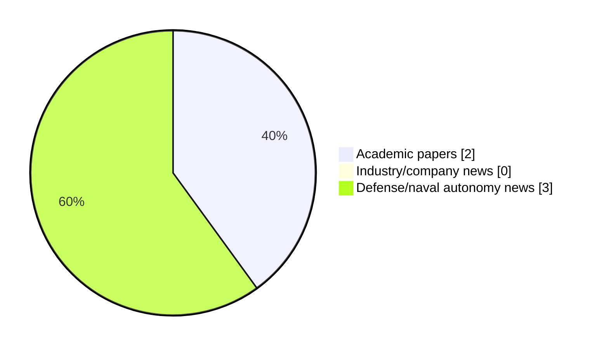

# Maritime Autonomy Watch — 2026-07-14

## Executive Summary

- Total selected items: 5
- Academic papers: 2
- Industry/company news: 0
- Defense/naval autonomy news: 3
- Failed/inaccessible sources: 0

## Contents

- [Analyst Brief](#analyst-brief)
- [Must Read](#must-read)
- [Top Signals Today](#top-signals-today)
- [Topic Signals](#topic-signals)
- [Freshness and Coverage](#freshness-and-coverage)
- [Quality Notes](#quality-notes)
- [Watchlist](#watchlist)
- [Academic Papers](#academic-papers)
- [Industry and Company News](#industry-and-company-news)
- [Defense and Naval Autonomy News](#defense-and-naval-autonomy-news)
- [Source Status Summary](#source-status-summary)

## Analyst Brief

Today's report selected 5 non-duplicate item(s), led by defense adoption, USV operations, AUV navigation. The strongest item is [CENTCOM Deploys Saronic Corsair USV Against Iranian Submarine At Bandar Abbas](https://www.navalnews.com/naval-news/2026/07/centcom-saronic-corsair-usv-strike-iran-submarine-bandar-abbas/) from navalnews.com.
Coverage is weighted toward academic research (2), with 0 industry and 3 defense signal(s).
Quality caveat: low-score-unique=3, missing-summary=1, date-anomaly=1.

## Must Read

- [CENTCOM Deploys Saronic Corsair USV Against Iranian Submarine At Bandar Abbas](https://www.navalnews.com/naval-news/2026/07/centcom-saronic-corsair-usv-strike-iran-submarine-bandar-abbas/) — Defense signal: USV operations
- [IBPA: Real-time Free-form Manifold Mesh Reconstruction via Incremental Ball Pivoting with Integrated Hole Detection](http://arxiv.org/abs/2607.11627v1) — Research signal: AUV navigation
- [Womble Bond Dickinson Advises M Subs Limited on Strategic Plymouth Acquisition](https://oceannews.com/news/milestones/womble-bond-dickinson-advises-m-subs-limited-on-strategic-plymouth-acquisition/) — Defense signal: defense adoption
- [Teledyne Marine and Spry Technocon Partner to Deliver Unmanned MCM Systems for Indian Navy](https://oceannews.com/news/defense/teledyne-marine-and-spry-technocon-partner-to-deliver-unmanned-mcm-systems-for-indian-navy/) — Defense signal: defense adoption

## Top Signals Today

- defense adoption: 3 selected item(s).
- USV operations: 1 selected item(s).
- AUV navigation: 1 selected item(s).
- perception: 1 selected item(s).
- general autonomy: 1 selected item(s).

## Topic Signals

- defense adoption: 3
- USV operations: 1
- AUV navigation: 1
- perception: 1
- general autonomy: 1

## Freshness and Coverage

- Newest selected item date: 2026-12-01
- Oldest selected item date: 2026-07-13
- Active/enabled sources: 5
- Sources with access problems: 2
- Quality flags: 5

## Quality Notes

- low-score-unique: 3
- missing-summary: 1
- date-anomaly: 1
- Date anomalies: [Dynamic reliability analysis for unmanned systems with epistemic uncertainty: An application to the variable buoyancy system of a self-powered underwater glider](https://api.elsevier.com/content/abstract/scopus_id/105039679575) reports 2026-12-01

## Watchlist

- [Womble Bond Dickinson Advises M Subs Limited on Strategic Plymouth Acquisition](https://oceannews.com/news/milestones/womble-bond-dickinson-advises-m-subs-limited-on-strategic-plymouth-acquisition/) — low-score-unique
- [Teledyne Marine and Spry Technocon Partner to Deliver Unmanned MCM Systems for Indian Navy](https://oceannews.com/news/defense/teledyne-marine-and-spry-technocon-partner-to-deliver-unmanned-mcm-systems-for-indian-navy/) — low-score-unique
- [Dynamic reliability analysis for unmanned systems with epistemic uncertainty: An application to the variable buoyancy system of a self-powered underwater glider](https://api.elsevier.com/content/abstract/scopus_id/105039679575) — missing-summary, date-anomaly, low-score-unique

### Category Snapshot

| Category | Selected items |
|---|---:|
| Academic papers | 2 |
| Industry/company news | 0 |
| Defense/naval autonomy news | 3 |

## Academic Papers

_Selected items: 2_

### [IBPA: Real-time Free-form Manifold Mesh Reconstruction via Incremental Ball Pivoting with Integrated Hole Detection](http://arxiv.org/abs/2607.11627v1)

- Source: arXiv
- Date: 2026-07-13
- Relevance score: 7
- Authors: Mauhing Yip, Mohit Singh, Kostas Alexis, Christian Schellewald, Annette Stahl
- Signal: Research signal: AUV navigation
- Topic tags: AUV navigation, perception

**Abstract**

Both Remotely Operated underwater Vehicles (ROVs) and Autonomous Underwater Vehicles (AUVs) are frequently deployed to acquire geometric bathymetric data. However, it is often discovered post-survey that the acquired data coverage is incomplete. Given the high operational cost associated with underwater deployments, it is essential to incrementally visualize surface coverage in real-time to support informed decision-making by both the operators of ROVs and the AUVs during data collection. In addition, traditional incremental surface reconstruction methods, such as Digital Terrain Models (DTMs), are inherently limited in expressiveness: they represent surfaces as height fields, allows only one elevation value per $(x, y)$ coordinate and thus cannot capture overhangs or vertical structures.

**Why it matters**

Relevant to underwater autonomy; the work may inform maritime autonomy research, testing priorities, or system design.

---

### [Dynamic reliability analysis for unmanned systems with epistemic uncertainty: An application to the variable buoyancy system of a self-powered underwater glider](https://api.elsevier.com/content/abstract/scopus_id/105039679575)

- Source: Elsevier Scopus
- Date: 2026-12-01
- Relevance score: 3.5
- DOI: 10.1016/j.ress.2026.112902
- Signal: Research signal: general autonomy
- Topic tags: general autonomy
- Quality flags: missing-summary, date-anomaly, low-score-unique

**Abstract**

No summary available.

**Why it matters**

Relevant to underwater autonomy; the work may inform maritime autonomy research, testing priorities, or system design.

---

## Industry and Company News

_Selected items: 0_

No selected items.

## Defense and Naval Autonomy News

_Selected items: 3_

### [CENTCOM Deploys Saronic Corsair USV Against Iranian Submarine At Bandar Abbas](https://www.navalnews.com/naval-news/2026/07/centcom-saronic-corsair-usv-strike-iran-submarine-bandar-abbas/)

- Source: navalnews.com
- Date: 2026-07-13
- Relevance score: 10
- Signal: Defense signal: USV operations
- Topic tags: USV operations, defense adoption

**Summary**

Three Saronic Corsair unmanned surface vessels (USV) attacked a laid up Iranian midget submarine in a first of its kind operation by American forces using maritime one-way attack drones. According to U.S. Central Command (CENTCOM), the trio of USVs attacked the Bandar Abbas Naval Base over the weekend. Three Corsair unmanned surface vessels hit the.

**Why it matters**

Signals movement in surface-vessel operations, naval adoption; useful for tracking operational concepts, procurement direction, and fleet integration.

---

### [Womble Bond Dickinson Advises M Subs Limited on Strategic Plymouth Acquisition](https://oceannews.com/news/milestones/womble-bond-dickinson-advises-m-subs-limited-on-strategic-plymouth-acquisition/)

- Source: oceannews.com
- Date: 2026-07-13
- Relevance score: 3.5
- Signal: Defense signal: defense adoption
- Topic tags: defense adoption
- Quality flags: low-score-unique

**Summary**

Womble Bond Dickinson (WBD) has advised M Subs Limited on its acquisition of 3 Bush Park, Plymouth, supporting the defense manufacturer’s expansion in one of the UK’s fastest-growing centers for maritime autonomy and advanced engineering.

**Why it matters**

Signals movement in naval adoption; useful for tracking operational concepts, procurement direction, and fleet integration.

---

### [Teledyne Marine and Spry Technocon Partner to Deliver Unmanned MCM Systems for Indian Navy](https://oceannews.com/news/defense/teledyne-marine-and-spry-technocon-partner-to-deliver-unmanned-mcm-systems-for-indian-navy/)

- Source: oceannews.com
- Date: 2026-07-13
- Relevance score: 3
- Signal: Defense signal: defense adoption
- Topic tags: defense adoption
- Quality flags: low-score-unique

**Summary**

Spry Technocon Private Limited, an Indian deep-tech startup focused on maritime and underwater technologies, has announced a strategic partnership with Teledyne Marine, Klein Marine Systems, and VideoRay, an AV company, to jointly address emerging opportunities in advanced Unmanned Mine Countermeasure (MCM) Systems for the Indian Navy.

**Why it matters**

Signals movement in underwater autonomy, naval adoption; useful for tracking operational concepts, procurement direction, and fleet integration.

---

## Inaccessible or Failed Sources

- None

## Source Status Summary

| Source | Status | Notes |
|---|---|---|
| arXiv | enabled | API source, 15 items fetched |
| OpenAlex | enabled | API source, 15 items fetched |
| RSS feeds | enabled | 107 RSS items fetched |
| SMI MASG News | enabled | HTML source, 10 items fetched |
| IEEE Xplore | disabled | Missing IEEE_XPLORE_API_KEY |
| Elsevier Scopus | enabled | API source, 15 items fetched |
| NewsAPI | disabled | Missing NEWS_API_KEY |

## Metadata

- Generated at: 2026-07-14T08:45:53.367743+02:00
- Date: 2026-07-14
- Repository: ferhannb/MarineRobotics
- Relevance threshold: 4.0
- Deduplication method: DOI, canonical URL, source ID, normalized title, similar recent titles, category caps, and novelty score
