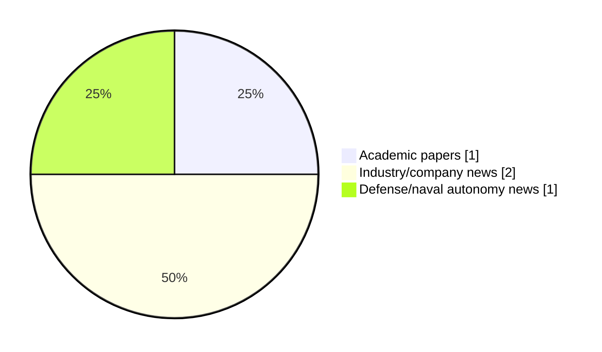

# Maritime Autonomy Watch — 2026-07-15

## Executive Summary

- Total selected items: 4
- Academic papers: 1
- Industry/company news: 2
- Defense/naval autonomy news: 1
- Failed/inaccessible sources: 0

## Contents

- [Analyst Brief](#analyst-brief)
- [Must Read](#must-read)
- [Top Signals Today](#top-signals-today)
- [Topic Signals](#topic-signals)
- [Freshness and Coverage](#freshness-and-coverage)
- [Quality Notes](#quality-notes)
- [Watchlist](#watchlist)
- [Academic Papers](#academic-papers)
- [Industry and Company News](#industry-and-company-news)
- [Defense and Naval Autonomy News](#defense-and-naval-autonomy-news)
- [Source Status Summary](#source-status-summary)

## Analyst Brief

Today's report selected 4 non-duplicate item(s), led by USV operations, AUV navigation, swarm autonomy. The strongest item is [AUSLUN: A Fixed-Hover UAV--USV System for GNSS-Denied Maritime Search and Navigation](http://arxiv.org/abs/2606.29875v1) from arXiv.
Coverage is weighted toward academic research (1), with 2 industry and 1 defense signal(s).

## Must Read

- [AUSLUN: A Fixed-Hover UAV--USV System for GNSS-Denied Maritime Search and Navigation](http://arxiv.org/abs/2606.29875v1) — Research signal: USV operations
- [AUV Mission Supports Discovery of Atlantic Hydrothermal Vent Fields](https://www.oceansciencetechnology.com/news/auv-mission-supports-discovery-of-atlantic-hydrothermal-vent-fields/) — Industry signal: AUV navigation
- [GABLER, FLANQ Complete Successful Sea Acceptance Test for USV](https://www.marinelink.com/news/gabler-flanq-complete-successful-sea-541208) — Defense signal: USV operations
- [HydroSurv Appoints Non-Executive Director to Drive USV Growth](https://oceannews.com/news/milestones/hydrosurv-appoints-non-executive-director-to-drive-usv-growth/) — Industry signal: USV operations

## Top Signals Today

- USV operations: 3 selected item(s).
- AUV navigation: 1 selected item(s).
- swarm autonomy: 1 selected item(s).
- perception: 1 selected item(s).
- defense adoption: 1 selected item(s).

## Topic Signals

- USV operations: 3
- AUV navigation: 1
- swarm autonomy: 1
- perception: 1
- defense adoption: 1

## Freshness and Coverage

- Newest selected item date: 2026-07-15
- Oldest selected item date: 2026-06-29
- Active/enabled sources: 5
- Sources with access problems: 2
- Quality flags: 0

## Quality Notes

- No quality flags on selected items.

## Watchlist

- No watchlist items today.

### Category Snapshot

| Category | Selected items |
|---|---:|
| Academic papers | 1 |
| Industry/company news | 2 |
| Defense/naval autonomy news | 1 |

## Academic Papers

_Selected items: 1_

### [AUSLUN: A Fixed-Hover UAV--USV System for GNSS-Denied Maritime Search and Navigation](http://arxiv.org/abs/2606.29875v1)

- Source: arXiv
- Date: 2026-06-29
- Relevance score: 8
- Authors: Siyuan Yang, Zikai Jia, Hailiang Kuang, Xiaoyu He, Qizhi Guo, Yihao Dong, Shaoming He
- Signal: Research signal: USV operations
- Topic tags: USV operations, swarm autonomy, perception

**Abstract**

Global navigation satellite system (GNSS) denial can prevent an unmanned surface vehicle (USV) from both finding a distant vessel and maintaining a globally referenced approach. This paper presents AUSLUN (Automatic UAV Search, Localization, and USV Navigation), a fixed-hover aerial-surface system that uses a coastal unmanned aerial vehicle (UAV), which estimates its own pose through visual-inertial odometry (VIO), as a long-range sensing and navigation anchor. The central design shifts sensing motion from UAV translation to a zoom pod and closes the loop through three coupled elements: polygon-aware annular pod scanning, modality-aware bearing-range localization, and target-relative USV guidance with visual-loss recovery. The same gated recursive estimator uses laser range for the non-cooperative target and datalink range for the cooperative USV.

**Why it matters**

Relevant to surface-vessel operations; the work may inform maritime autonomy research, testing priorities, or system design.

---

## Industry and Company News

_Selected items: 2_

### [AUV Mission Supports Discovery of Atlantic Hydrothermal Vent Fields](https://www.oceansciencetechnology.com/news/auv-mission-supports-discovery-of-atlantic-hydrothermal-vent-fields/)

- Source: oceansciencetechnology.com
- Date: 2026-07-15
- Relevance score: 7
- Signal: Industry signal: AUV navigation
- Topic tags: AUV navigation

**Summary**

Schmidt Ocean Institute’s new Autonomous Underwater Vehicle (AUV) has completed its first scientific mission, supporting the rapid discovery of two.

**Why it matters**

Signals momentum in underwater autonomy; useful for tracking product direction, partnerships, and deployment opportunities.

---

### [HydroSurv Appoints Non-Executive Director to Drive USV Growth](https://oceannews.com/news/milestones/hydrosurv-appoints-non-executive-director-to-drive-usv-growth/)

- Source: oceannews.com
- Date: 2026-07-14
- Relevance score: 5.25
- Signal: Industry signal: USV operations
- Topic tags: USV operations

**Summary**

HydroSurv has announced the appointment of experienced maritime industry leader Mark Burnett as Non-Executive Director, strengthening the company's Board as it enters its next phase of development.

**Why it matters**

Signals momentum in surface-vessel operations; useful for tracking product direction, partnerships, and deployment opportunities.

---

## Defense and Naval Autonomy News

_Selected items: 1_

### [GABLER, FLANQ Complete Successful Sea Acceptance Test for USV](https://www.marinelink.com/news/gabler-flanq-complete-successful-sea-541208)

- Source: marinelink.com
- Date: 2026-07-14
- Relevance score: 6
- Signal: Defense signal: USV operations
- Topic tags: USV operations, defense adoption

**Summary**

GABLER, a provider of submarine systems, and German defense technology company FLANQ have successfully completed the Sea Acceptance Test (SAT) demonstrating seaworthiness of their jointly developed Torpedo-Tube-Launched Uncrewed Surface Vessel…

**Why it matters**

Signals movement in surface-vessel operations, naval adoption; useful for tracking operational concepts, procurement direction, and fleet integration.

---

## Inaccessible or Failed Sources

- None

## Source Status Summary

| Source | Status | Notes |
|---|---|---|
| arXiv | enabled | API source, 15 items fetched |
| OpenAlex | enabled | API source, 15 items fetched |
| RSS feeds | enabled | 107 RSS items fetched |
| SMI MASG News | enabled | HTML source, 10 items fetched |
| IEEE Xplore | disabled | Missing IEEE_XPLORE_API_KEY |
| Elsevier Scopus | enabled | API source, 15 items fetched |
| NewsAPI | disabled | Missing NEWS_API_KEY |

## Metadata

- Generated at: 2026-07-15T08:47:00.078396+02:00
- Date: 2026-07-15
- Repository: ferhannb/MarineRobotics
- Relevance threshold: 4.0
- Deduplication method: DOI, canonical URL, source ID, normalized title, similar recent titles, category caps, and novelty score
